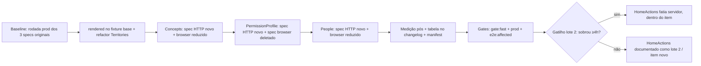

# Impl: OPS87 — Pirâmide de verificação: migrar asserções de servidor dos e2e pesados para o paradigma HTTP sem browser (escalar o OPS35) + medir

Status: em execução
Atualizado em: 2026-08-24
Issue: #833
Intenção: docs/plans/ops87-piramide-e2e-http-sem-browser.md
Appetite restante: ~2 dias herdado da intenção; lote 1 cortado para 3 famílias (ver Decisão 1) — o que sobrar é gatilho, não promessa.

## Leitura da intenção

- **Outcome:** cada família migrada tem o ganho registrado — tempo browser vs tempo HTTP, por spec migrado, **medido de verdade** (nunca estimativa); a cobertura não diminui (nada removido sem equivalente, asserções migram 1:1); a suíte fica mais estável nas famílias migradas; a migração anda em lotes e o deploy não fica bloqueado no meio de um lote.
- **O que NÃO negociar:** medição por família é **condição de aceite**, não cortesia; auth é real (mesma sessão/cookie `campaign-token`) sem duplicar lógica de login; fixtures e ownership existentes são reutilizados (`campaignFixture`, `campaignRequest`, `claimMunicipality`, `createCampaignUser`, `createStaffLeadership`, `mintCampaignSession`); RBAC continua assegurado no conteúdo renderizado; o guard de falha client (`console.error`/`pageerror`) permanece exclusivo de browser.
- **O que reavaliar:** a intenção recomenda começar por (concepts, permission-profile, people, home-actions). A exploração mostra que HomeActions tem a fatia servidor mais fina e o maior custo de separação (5 testes mistos com interação client entrelaçada) — o lote 1 deste impl plan corta HomeActions para a Fase 5 (gatilho) e documenta o mapeamento dela para o lote 2. Não é reescrever a intenção: é a regra dela própria ("um lote por vez", "o appetite manda").

## Abordagem recomendada

**Opções consideradas:** A | B (detalhadas na Decisão 1)
**Recomendação:** B — lote 1 = **Concepts + PermissionProfile + People + medição**; HomeActions fica para lote 2 com gatilho. Porque: são as 3 famílias com fatia servidor dominante e migração 1:1 barata (12 dos 15 testes migrados sem nenhuma separação client/server), o que valida a medição com risco mínimo — exatamente o critério da intenção ("colhe o ganho cedo e valida a medição antes do lote grande"). Com números: Concepts ~0,5–1 h, PermissionProfile ~1–1,5 h, People ~3–4 h, medição (script + baselines + tabela) ~2–3 h, gates/PR ~1 h → total ~7,5–10,5 h ≈ 1–1,5 dias, dentro do appetite com margem. HomeActions ~4–6 h (separar 5 testes mistos com focus/blur, geometry, toasts, hydration) somada às outras **estoura** o appetite (~11,5–16,5 h ≈ 1,5–2,5 dias) — e é a família com o pior retorno do lote (fatia servidor de ~9 dos 18 testes, e só 4 deles 100% server).
**Rejeitadas:** A (4 famílias no lote 1) porque estoura o appetite e viola "deploy não bloqueado no meio de lote" — o lote 2 teria que ser abandonado pela metade se o tempo faltasse; B é o corte honesto com a regra "lote que não couber vira item novo" da própria intenção.

### Componentes / mudanças

- **`rendered(html)`** (`tests/e2e/fixtures/campaignHttpTest.ts`): export novo no fixture base — strip de `<!-- -->` (separadores de texto-node do streaming React são transporte, não conteúdo; padrão do Territories). Rejeitada: manter o helper local em cada spec (3+ call sites já no lote 1; o owner natural é o base).
- **`campaignTerritoriesHttp.e2e.spec.ts`**: refatorado para importar `rendered` do base (remover a cópia local). Sem mudança de asserção — o spec não é tocado além disso.
- **`campaignConceptsHttp.e2e.spec.ts`** (novo): 2 testes — "staff reads the concepts page and reaches it from the goal-account card" (fatia servidor, nome herdado) e "leader cannot open the concepts page" (1:1).
- **`campaignConcepts.e2e.spec.ts`** (reduzido): 1 teste fica — "staff reaches the concepts page via the tooltip and the card popover" (a interação client do teste misto original; ver Decisão 5).
- **`campaignPermissionProfileHttp.e2e.spec.ts`** (novo): 6 testes com nomes originais (1:1).
- **`campaignPermissionProfile.e2e.spec.ts`** (deletado): 6/6 testes são server; o equivalente HTTP cobre 1:1.
- **`campaignPeopleHttp.e2e.spec.ts`** (novo): 8 testes — 6 server com nomes originais + 2 mistos (lista merged e C117) com fatia servidor herdando o nome original.
- **`campaignPeople.e2e.spec.ts`** (reduzido): 6 testes ficam — 2 reduzidos à interação client + 4 client puros (C125, C131, C128 ×2).
- **`scripts/lib/e2e-affected-manifest.mjs`**: entradas `campaignConcepts`/`campaignPeople` ganham os specs `Http`; o domínio de advisor/access ganha entrada própria com `campaignPermissionProfileHttp` (hoje o spec não está mapeado — lacuna que este item corrige para o classificador acordar os novos arquivos). O unit test que pina os nomes dos specs passa a exigir os arquivos novos — criar antes de atualizar o pin.
- **`scripts/measure-e2e-family.mjs`** (novo): medição reproduzível (Decisão 3).
- **Migration:** sem migration (nenhuma mudança de schema — os specs só leem via HTTP autenticado real).
- **Access / Consent:** N/A — nenhum write novo; auth real via `POST /api/campaignUser/login` + cookie `campaign-token` (mesmo contrato do OPS35).
- **UI:** N/A (Impeccable A).

### Dados → forma (se aplicável)

O "dado" do item é a **medição por família** (condição de aceite). Forma escolhida: tabela markdown no changelog do item (`docs/changelog/2026-08-24-ops87.md` via `pnpm changelog:build`), gerada por script comitado reproduzível — combina o registro permanente que o OPS35 deixou (docs/CHANGELOG-AGENTS.md:227) com reprodutibilidade. Rejeitadas: (1) só rodada manual anotada — não reproduzível e não audita o drift; (2) dashboard/CI job de comparação — variação de máquina no hosted runner torna o comparativo injusto e gate de tempo em CI é flake de medição (Decisão 3).

## Decisões de engenharia

### Decisão 1 — Escopo do lote 1

**Opções:** A) 4 famílias completas (concepts, permission-profile, people, home-actions), migrando só as fatias servidor. B) Concepts + PermissionProfile + People; HomeActions fica para lote 2 (gatilho na Fase 5).
**Recomendação:** B — ver números em "Abordagem recomendada". A fatia servidor de HomeActions é ~9 dos 18 testes (4 100% server + 5 mistos) com o custo de separação mais alto do lote (focus/blur retract, geometry de 3 colunas, toasts pós-save, clique pré-hydration — nenhum reutilizável em HTTP, exigindo equivalentes em texto). Migrar 3 famílias + medir cabe em ~1–1,5 dias com margem para gates; a 4ª estoura. E a regra da intenção é explícita: "um lote por vez, deploy não fica bloqueado no meio" — um lote 1 que estoura o appetite quebra essa regra no meio do caminho.
**Rejeitadas:** A porque estoura o appetite e deixa o lote sujeito a corte no meio; "por tamanho decrescente" e "pelas mais flaky" (da intenção) porque o primeiro lote precisa validar a **medição** com risco baixo, e as famílias 100% server são o menor risco.

### Decisão 2 — Modelo de arquivo

**Opções:** A) spec novo `campaign<Family>Http.e2e.spec.ts` + spec browser original REDUZIDO mantendo só as fatias client. B) spec novo HTTP + deletar os testes migrados do spec browser. C) renomear o spec existente para `.browser.` e criar o `.http.` (mexe no testMatch).
**Recomendação:** A com convenções explícitas que absorvem o melhor de B:

1. **Spec HTTP herda o NOME ORIGINAL do teste migrado.** Para testes 100% server, o nome idêntico nos dois pontos do diff é a auditoria 1:1 — `git log`/`-g` provam a migração sem tabela externa. Testes 100% server **somem** do spec browser (não há "fatia reduzida" — era só servidor).
2. **Testes mistos:** o browser mantém uma versão **reduzida à fatia client com nome descritivo da interação** (ex. "staff reaches the concepts page via the tooltip and the card popover"), e o HTTP herda o nome original completo. O nome reduzido deixa explícito que aquele teste já não cobre a fatia servidor — grep por nome original aponta só para o HTTP.
3. **Nenhuma mudança de testMatch/config**: `campaign*Http.e2e.spec.ts` já casa `/campaign.*\.e2e\.spec\.ts/` no projeto `campaign` (playwright.config.ts:172) e o `E2E_SPEC_RE`/`--no-deps` (prod mode zera deps) funcionam como estão.
4. Cabeçalho espelho nos dois arquivos ("HTTP twin: …" / "Browser twin: …") listando o par — o ponto de partida da revisão contra drift.
   **Rejeitadas:** B puro porque, sem o nome herdado, a auditoria "nada removido sem equivalente" fica implícita (exigiria tabela de mapeamento manual que já se sabe que envelhece); C porque renomear arquivos mexe no pin por nome do manifest (`e2e-affected-manifest.mjs` casa `tests/e2e/<name>.e2e.spec.ts`), no `ci-scope` e no testMatch — custo de infra sem ganho, já que o padrão atual casa os dois padrões de nome.

### Decisão 3 — Medição (forma dos dados)

**Opções:** A) rodada manual documentada (como o OPS35 fez: wall time do reporter list, anotado no changelog). B) script comitado `scripts/measure-e2e-family.mjs` que roda os specs selecionados com `--reporter=json` e imprime tabela por família (`specs[].tests[].results[].duration`). C) integração em CI com job que compara tempos.
**Recomendação:** B com o **registro** de A: o script é comitado e reproduzível; a execução dele alimenta a tabela do changelog do item. Protocolo: (1) **baseline pré-migração** — antes de editar qualquer spec, rodada prod-build (`E2E_PROD=1 CI=1`) dos 3 specs originais, tempos registrados; (2) **pós** — mesma rodada com os specs novos + reduzidos; (3) tabela por família: browser pré / browser pós / HTTP / Δ, no changelog. Medir sempre em **prod build** (dev-mode cold compile polui o comparativo; OPS35 já mediu os dois e o gate roda prod). Uma rodada por lado; se a variação visível entre testes do mesmo spec for alta, uma segunda rodada e média — nunca a melhor rodada.
**Rejeitadas:** A sozinho porque não é reproduzível e a intenção exige "medido de verdade" com a forma adiada a este plano — script comitado é a forma; C porque comparar tempos em CI é anti-pattern (variação de máquina no hosted runner, flake de medição) e viraria gate de deploy — viola "deploy não bloqueado"; o e2e full job já colhe o ganho agregado real no relatório.

### Decisão 4 — Extração do `rendered()`

**Opções:** A) mover o strip `<!-- -->` do Territories para o fixture base `campaignHttpTest.ts` e exportar `rendered(html)`. B) manter local em cada spec.
**Recomendação:** A — a primeira família do lote (Concepts) já precisa do strip; o base é o owner natural do utilitário de parsing do modo HTTP; Territories passa a importar do base (refactor de 1 linha, sem mudança de asserção). Gatilho do explorador ("mover na 2ª família") cumprido com folga: extrai-se antes da 2ª família.
**Rejeitadas:** B porque duplica conhecimento em N specs que compartilham o mesmo problema de transporte (DRY ≥3 call sites no lote 1).

### Decisão 5 — O que fica no browser (mapeamento 1:1)

Convenção de leitura: `→ HTTP` = teste migrado para o spec HTTP com o nome original (sai do browser); `→ fica (reduzido)` = teste misto reduzido à fatia client no browser com novo nome; `→ fica` = teste client puro, intocado.

**Concepts (2 testes):**
| Teste original | Classificação | Destino |
|---|---|---|
| staff reads the concepts page and reaches it from the goal-account card | MISTO | HTTP (fatia server: sidebar `href="/campanha/conceitos"` no HTML, headings "Cobertura da meta"/"Teto do campo (projetado)" no HTML de `/campanha/conceitos`, deep-link `campaignConceptHref('captura')` → `article:target` com `id="captura"`) + fica (reduzido) "staff reaches the concepts page via the tooltip and the card popover" (hover tooltip → href "Saiba mais"; popover "Como cada número é calculado" → navegação) |
| leader cannot open the concepts page | SERVIDOR | → HTTP (redirect para `/campanha/meus-contatos` no padrão [200,307,308] pinando destino; ausência de `href="/campanha/conceitos"` no HTML do líder) |

**PermissionProfile (6 testes — todos SERVIDOR):**
| Teste original | Destino |
|---|---|
| municipality list has no write controls and the FAB is absent | → HTTP (ausência de `[data-slot="campaign-quick-actions-fab"]` e de links `/Nova|Criar|Editar/i` no HTML de `/campanha/municipios`) |
| demands list has no "Nova demanda" button | → HTTP (ausência do link "Nova demanda" no HTML de `/campanha/demandas`) |
| activities list has no create buttons | → HTTP (ausência de botões `/Planejar|Nova atividade/i` no HTML de `/campanha/atividades`) |
| supporters list has no "Novo" or "Importar CSV" buttons | → HTTP (ausência do link "Novo" no HTML de `/campanha/apoiadores`) |
| rows outside the portfolio are read-only | → HTTP (presença do FAB no HTML de `/campanha/municipios` para `carteira`) |
| write controls are present | → HTTP (presença do FAB no HTML para `tudo`) |

Nota: o `waitForFunction` do gate `S:` (C106) não migra — é estabilização de DOM de browser, não asserção. Se, na implementação, o FAB só montar pós-hidratação (stream), a asserção fica no browser (fail-closed: não migra sem equivalente) — risco registrado abaixo. Spec browser deletado (0 testes restantes).

**People (12 testes):**
| Teste original | Classificação | Destino |
|---|---|---|
| staff opens the people list and sees the merged leadership person | MISTO | HTTP (fatia server: GET `/campanha/pessoas` → row do `contactName` e `/^\d+ pessoas?$/` no HTML; GET `/campanha/pessoas?q=<prefixo>` → row filtrada — o filtro é URL contract server-side) + fica (reduzido) "the omnibox narrows the people recorte" (fill + Enter do combobox) |
| the desktop table reads C130: Dobra em, city under the name, party filter | SERVIDOR | → HTTP (columnheader "Dobra em" presente/"Base" ausente no HTML; `nameCell` contém `municipality.name`; GET `?party=PT` → row "Seed Deputada Estadual" presente, row do contactName ausente; chip "Partido: PT" — se flight-only, mantém o URL contract que é o que importa) |
| the name link in the list opens the person detail (C118 entry point) | SERVIDOR | → HTTP (link com `href="/campanha/pessoas/<contactId>"` no HTML da lista; GET do detalhe → chrome "Pessoa" + heading "Liderança" no HTML) |
| leader cannot open the people page | SERVIDOR | → HTTP (redirect `/campanha/meus-contatos` [200,307,308]; HTML do líder sem o link Pessoas) |
| leader cannot open the person detail route | SERVIDOR | → HTTP (GET `/campanha/pessoas/99999` → redirect para `/campanha/meus-contatos`; heading "Meus contatos" no HTML) |
| coordinator opens the person detail and sees the sections of her capacities | SERVIDOR | → HTTP (headings Ficha + Liderança presentes, Dobradinha/Assessorado ausentes; link "Abrir detalhe de liderança" com `href="/campanha/liderancas/<id>"`; texto "Engajado" na região Liderança; WhatsApp/Convidar/Apagar no HTML — botões client-only ficam no browser, fail-closed) |
| coordinator sees dobradinha and apoiador sections only for a person who has them | SERVIDOR | → HTTP (headings Ficha + Dobradinha + Apoiador presentes, Liderança ausente; "PCdoB"/"Certo" nas regiões) |
| staff sorts by a column header and filters absence via the omnibox (C117) | MISTO | HTTP (fatia server: URL contract — GET `?q=C117&sort=lidera` → "Duas" antes de "Uma" no HTML das rows; `&dir=asc` → ordem invertida; `&ausencia=sem_contato[&sem_base][&sem_assessor]` → rows filtradas + chips "Ausência: …" no HTML) + fica (reduzido) "staff sorts by a column header and picks absence facets in the omnibox (C117)" (cliques no header + `aria-sort` + seleção de options) |
| mobile discovers ordering in the omnibox and applies a sort (C125) | CLIENT | → fica (viewport 390; não migra) |
| the Lidera cell offers Salvador as one aggregate and saves all 19 zones (C131) | CLIENT | → fica (combobox + `expectPostResponse` + poll no payload) |
| coordinator gives a person the first leadership municipality and ends it through the dialog (C128) | CLIENT | → fica (combobox + dialog + POST + polls) |
| the Assessora cell creates the staff account on the first municipality (C128) | CLIENT | → fica (combobox + POST + poll) |

**HomeActions (18 testes — lote 2, classificação registrada para o item seguinte):** SERVIDOR (4): "staff sees campaign search on home", "leader does not see campaign search on home" (B47), "legacy cenario param redirects to canonical URL", "stale entry param is ignored — never a skip link (B168)". MISTO (5): "staff search shows municipality hits and opens detail (B48)" (hits client; abertura por URL fica como contrato), "staff focused search without curated suggestions shows the honest empty state (OPS29)" (initialSuggest é SSR → migra quase 100%), "staff sees six home actions and can open municipalities without coverage" (B45: hrefs/URLs server; geometry de 3 colunas fica no browser), "leader sees two home actions and can open contacts" (B45), "renders the unified fields without legacy signal-type navigation" (C87: campos no HTML; save/toast fica). CLIENT (9): B66 ×2, B60, B61/B77 ×3, B70, C87 standalone, B97. Helpers client não reutilizáveis: `expectPostResponse`, `actionGridGeometry` (`collectActionBoundingBoxes`/`assertThreeColumnActionGrid`), `campaignPageChrome` (locator) — o HTTP exige equivalentes em texto quando a família migrar.

## Fases verificáveis

1. **Fase 0 — Baseline + ferramenta de medição** (~15% do appetite): escrever `scripts/measure-e2e-family.mjs`; rodada **baseline pré-migração** prod-build dos 3 specs originais (concepts, permission-profile, people); tempos anotados. _Verificação: script roda e imprime a tabela com os 3 specs; baseline registrado._
2. **Fase 1 — Fixture base + Concepts** (~15%): exportar `rendered()` no `campaignHttpTest.ts`; refatorar `campaignTerritoriesHttp` para importá-lo; criar `campaignConceptsHttp.e2e.spec.ts` (2 testes); reduzir `campaignConcepts.e2e.spec.ts` (1 teste client); manifest: entry conceitos ganha `campaignConceptsHttp`. _Verificação: `pnpm test:e2e --no-deps -- tests/e2e/campaignConceptsHttp.e2e.spec.ts` e o spec browser reduzido verdes em dev; Territories segue verde._
3. **Fase 2 — PermissionProfile** (~20%): criar `campaignPermissionProfileHttp.e2e.spec.ts` (6 testes, nomes originais); deletar `campaignPermissionProfile.e2e.spec.ts`; manifest: entrada própria para o domínio advisor/access com `campaignPermissionProfileHttp`; unit test do pin atualizado. _Verificação: spec novo verde em dev e prod; `--list` do projeto campaign sem o spec deletado._
4. **Fase 3 — People** (~30%): criar `campaignPeopleHttp.e2e.spec.ts` (8 testes: 6 server + 2 mistos); reduzir `campaignPeople.e2e.spec.ts` (6 testes: 2 reduzidos + 4 client); manifest: entry pessoas ganha `campaignPeopleHttp`. _Verificação: os dois specs verdes em dev e prod; os 4 testes client intocados (nomes idênticos no diff)._
5. **Fase 4 — Medição pós + registro + gates** (~20%): rodada pós com `measure-e2e-family.mjs`; tabela browser pré/pós vs HTTP no changelog (`docs/changelog/2026-08-24-ops87.md` + `pnpm changelog:build`); `pnpm gate:fast`; `pnpm test:e2e:affected` com o diff do PR (classificador seleciona os specs novos via manifest); PR. _Verificação: tabela completa no changelog; gate:fast verde; PR com o par espelho por família._
6. **Fase 5 — Gatilho lote 2 (só se sobrar ≥4 h do appetite)**: iniciar a fatia servidor de HomeActions dentro do item, começando pelos 4 testes 100% server; se o tempo faltar no meio, para-se no ponto (nunca bloqueia o deploy do lote 1) e o resto vira item novo com a classificação desta Decisão 5.

## Rabbit holes / Não escopo (engenharia)

- **Reescrever toda a suíte** — corte: 3 famílias no lote 1; o resto é lote documentado, nunca promessa dentro do item.
- **Separar as fatias de HomeActions no lote 1** — é o custo mais alto com o menor retorno; está na Fase 5 apenas como gatilho.
- **Gate de tempo em CI** — comparar tempos como check bloqueia deploy (Decisão 3, rejeitada C).
- **Assertar RSC flight payload como conteúdo** — o padrão é ausência/presença de controle (lição do Territories: "Cobertura fica oculta" = ausência do sortable, não ausência do label que vive no flight).
- **Viewport/CSS/geometry no HTTP** — rung de coluna, `overflowX`, bounding boxes, `aria-sort` e `data-retracted` são browser; o HTTP assere presença/ausência e URL contract, nunca layout.
- **Fixture nova de login/ownership** — reusar `campaignRequest`/`campaignFixture`/`createCampaignOwnership`; qualquer teste que precise de sessão compartilhada usa `mintCampaignSession`/`seedCampaignSession` (padrão do HomeActions), não duplica.
- **Mexer em testMatch/projetos do config** — os specs novos já casam; mudança de config é OPS88 (CI/deploy), fora de escopo.
- **Consertar flakes de famílias não migradas** — fora de escopo da intenção.

## Riscos e mitigação

- **Drift entre spec browser e HTTP ao longo do tempo** — nomes herdados (o HTTP carrega o nome original, auditável por `git log`/`-g`), cabeçalhos espelho "twin" nos dois arquivos, e a revisão do PR confere o par família a família. Risco residual aceito: o drift exige disciplina de revisão; a medição por família (rodada pós) reaparece no changelog a cada lote e denuncia asserção órfã que passou a falhar em só um dos lados.
- **Elemento só monta pós-hidratação (RSC flight/stream)** — label existe só no flight, ou o FAB vem de chunk streamado: asserção HTTP impossível sem reduzir garantia. Mitigação: padrão do Territories (ausência/presença de controle renderizado) e **fail-closed** — se não houver equivalente server-side, a asserção fica no browser e o mapeamento registra a exceção. Nenhum teste é removido por causa disso.
- **Redirect em streaming (200 + `http-equiv="refresh"` vs 3xx)** — o `noLeader` gate lança redirect após o layout começar a streamar: aceitar `[200,307,308]`, pinar o destino (`location` ou meta refresh), nunca o transporte. Padrão do Territories, copiado 1:1 nos redirects de leader de Concepts/People.
- **Flake sob 4 workers nos specs novos** — os specs HTTP usam o mesmo ownership compartilhado (`claimMunicipality` com runID, `createCampaignUser` com nome/email únicos, cleanup transacional) — nenhuma corrida nova; e a migração **remove** interação client (menos classes de flake). Validação em prod build com `PLAYWRIGHT_WORKERS=4` antes do PR.
- **HTML cru com encoding/acentos** — `Irec%C3%AA` já é lição do Territories; hrefs com acento precisam do encode explícito nos assert de substring.
- **Unit test do manifest pina os nomes dos specs** — os arquivos novos existem antes do pin ser atualizado (ordem da Fase 2); um pin que falha trava o `gate:fast`, não o deploy.
- **Medição enviesada (dev vs prod, máquina)** — protocolo fixo: prod build (`CI=1 E2E_PROD=1`), mesma máquina, pares medidos na mesma rodada; baseline colhido **antes** de editar (senão o "antes" vira reconstrução).
- **Appetite estoura** — corte explícito na Decisão 1; Fase 5 é gatilho, não meta; o que não couber vira item novo com a classificação registrada.

## Aceite de engenharia

- [ ] Aceite de produto da intenção coberto: ganho **medido** (nunca estimativa) por família migrada e registrado no changelog (tabela browser pré/pós vs HTTP); cobertura não diminui (mapa 1:1 da Decisão 5 sem exceção não registrada); deploy não fica bloqueado no meio do lote (Fases 1–4 são um lote fechado; Fase 5 é gatilho).
- [ ] Invariantes AGENTS/engineering-standards: spec HTTP estende o **raw** `@playwright/test` (nunca `e2eTest.ts` — guard `e2eFailureGuard` fica exclusivo de browser); reusa `campaignFixture`, `campaignRequest`, `claimMunicipality`, `createCampaignUser`, `createStaffLeadership` — nenhuma fixture nova duplicada (depth check).
- [ ] Auth real: `POST /api/campaignUser/login` (email OU username) + cookie `campaign-token` via `campaignTokenStorageState` — nenhuma lógica de login duplicada; redirects pinam destino, nunca transporte.
- [ ] `rendered()` extraído para o fixture base e `campaignTerritoriesHttp` refatorado (sem mudança de asserção).
- [ ] Manifest `e2e-affected-manifest.mjs` atualizado (concepts/people ganham os `Http`; permission-profile ganha entrada própria); unit test do pin verde; novos specs selecionáveis por `E2E_SPEC_RE` e pelo classificador (OPS86).
- [ ] Specs novos verdes em dev **e** prod build; `pnpm gate:fast` verde; `pnpm test:e2e:affected` seleciona os specs novos no PR.
- [ ] Nenhum teste removido sem equivalente: o diff mostra nomes herdados (auditoria 1:1) e os testes mistos reduzidos têm nome descritivo da fatia client que permanece.
- [ ] Medição: rodada baseline pré-migração colhida antes da Fase 1; rodada pós com `measure-e2e-family.mjs`; tabela por família no changelog do item.

**Self-score decision-quality: 5/5** — (1) as 5 decisões caras têm opções + rejeitadas registradas; (2) abordagem cabe no appetite com corte explícito (HomeActions fora do lote 1) e fases com quota; (3) rabbit holes nomeados e não escopo do item; (4) depth check: reusa fixture/ownership/auth existentes do OPS35, nada de fixture paralela; (5) aceite da intenção preservado — medição por família é fase dedicada e condição de aceite, não cortesia.

## Débitos deferidos (simplify, pós-entrega)

Lote único **"pins frágeis dos specs HTTP"** — achados do simplify score ≤3, nenhum bloqueante: (a) `indexOf` de ordem sobre HTML bruto no C117 HTTP (risco teórico de reordenação de streaming); (b) regex `Nova|Criar|Editar` do PermissionProfile com falsos positivos data-dependentes (municípios "Nova X"); (c) header do `e2e-affected-manifest.mjs` ("specs never import app code") contradiz o import de `campaignConceptHref`; (d) pin `/<th...>Base</th>/` do C130 perde header aninhado; (e) substrings casam flight payload (semântica levemente larga, coberta pelo fail-closed); (f) literal `aria-label` do Concepts pina formatação exata.

**Gatilho:** primeiro falso positivo/flake data-dependent nos specs HTTP **ou** início do lote 2 (HomeActions), quando os pins forem reusados — appetite estimado ~0,5–1h. Descartados: `families.size`/maxBuffer do measure script (ferramenta não-CI), sufixo "(browser)" nos describes, tamanho dos testes longos (aceitável), flake de login dev OPS30 (pré-existente, fora de escopo), lote 2 de HomeActions (já coberto pela Decisão 5).
