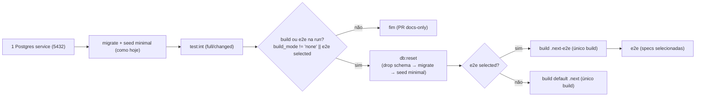

# Impl: Verify do CI (PR e deploy): um Postgres com reset determinístico, um build, migrate/seed sem repetição

Status: aprovado (gate humano 2026-08-24)
Atualizado em: 2026-08-24
Issue: #834
Intenção: docs/plans/ops88-ci-verify-setup-unico.md
Appetite restante: herdado (~0,5–1 dia eng; um outcome verificável)

## Leitura da intenção

- **Outcome:** numa run de PR com build+e2e, o app compila uma única vez e integração, build e e2e rodam no mesmo Postgres, com reset determinístico entre as fases; o verify do deploy usa o mesmo setup único e continua gateando a publicação; migrates/seeds/builds repetidos caem (4 ciclos de reconstrução de estado → ~2), sem perda de garantia e sem re-run com ganho revertido.
- **O que NÃO negociar:** não virar "rodar menos testes" (PR continua `selected`, deploy continua `full`); não paralelizar o job único (fail-fast estrutural); o reset entre fases É a proteção do e2e contra resíduo do int — não removível; e2e sempre contra build de produção (`.next-e2e`), nunca dev; migrate-before-build embutido no `pnpm build` (contrato OPS66/deploy-homeserver) intacto; deploy homeserver intocado; guards de banco local/`_test`.
- **O que reavaliar:** a "Direção no codebase" (workflows, `tests/helpers`, `playwright.config.ts`) foi confirmada na exploração, com uma ressalva: o build default hoje não é servido por nada no CI (o e2e serve `.next-e2e` e o prod compila no homeserver) — isso valida a intenção B (colapsar só quando build+e2e rodam juntos) e o corte do build default no verify do deploy, onde e2e sempre roda. O "resíduo do int é finito e conhecido" também se confirmou: fixtures (`campaignFixtures.ts`), pins de contagem (435 municípios, `municipalityCatalog.length + 1`) e claims — nada que um drop-schema+migrate+seed não limpe.

## Abordagem recomendada

**Opções consideradas:** A | B | C
**Recomendação:** A — um Postgres por run + script de reset dedicado entre as fases. O reset (drop schema → migrate → seed minimal) é exatamente o que o e2e precisa para não herdar resíduo do int; o segundo container era o workaround sem reset. O script é testável localmente, reusável no mirror `gate-ci` e protege o único ponto novo da arquitetura.
**Rejeitadas:**

- **B — manter dois Postgres** (status quo): não atende o aceite "um Postgres por run" e o ganho de tempo; o resíduo que o 2º container escondia continua sem solução determinística.
- **C — reset inline no YAML (psql + pnpm)**: o runner hosted não tem `psql` (o Postgres é service container, não ferramenta do runner); lógica de banco no YAML não é testável nem reusável no mirror local; duplicaria guards.

### Decisões de engenharia (caras de reverter)

#### D1 — Onde vive o reset determinístico

- **Opções:**
  - **A) Script novo `scripts/db-reset.mjs`** + `pnpm db:reset`: `DROP SCHEMA public CASCADE; CREATE SCHEMA public;` via pool `pg` (já é devDependency — sem dependência de `psql` no runner), depois `execFileSync` de `pnpm migrate` e `pnpm db:seed:minimal` (mesmo padrão do `gate-ci.mjs`). Guard: `assertLocalDatabase` (host local) **e** o contrato de nome `^teqo(_[a-z0-9]+)?_test$` (o mesmo de `tests/helpers/assertTestDatabase.ts:13`) — um script que DROP SCHEMA não pode aceitar `teqo` (dev local tem dados de trabalho) nem nada remoto.
  - **B) Passo YAML inline** com `docker run postgres:17-alpine psql` + `pnpm migrate` + `pnpm db:seed:minimal`.
  - **C) Reusar `scripts/db-pull.mjs`** (ele já faz o drop em `db-pull.mjs:119`).
- **Recomendação:** A — determinístico, testável localmente, reusável no `gate-ci.mjs` (paridade CI↔local), espelha o shape do `seed-minimal.mjs` (guard + `loadCliEnv`). **Nome:** script `pnpm db:reset` novo na família `db:*` do `package.json` — **não** uma flag em `db:seed:minimal` (o seed é idempotente e compartilhado por worktree/gate; não acoplar DROP a ele). **Guard obrigatório por construção:** host local (herdado de `assertLocalDatabase`) + sufixo `_test` — fail-closed antes do DDL.
- **Rejeitadas:** B (sem `psql` no runner hosted; lógica no YAML = intocável fora do CI; guard duplicado e divergente); C (`db-pull` faz pg_dump de prod com filtro de PII, restaura via container local — outro contrato; acoplar reset a ele o tornaria inexecutável no CI).
- **Detalhe do contrato compartilhado:** exportar o regex de `_test` de `tests/helpers/assertTestDatabase.ts:13` para `scripts/lib/cli.mjs` (fonte única — `assertTestDatabase.ts` já importa `defaultGatewayHost` de lá), consumido por ambos. Alternativa aceitável (menor churn): duplicar o regex no script com comentário apontando o contrato — decidir no impl, favor à fonte única.

#### D2 — Ordem do job único e condições YAML (`ci-pr.yml` `checks`)

- **Ordem nova:** prep URL única (5432) → migrate + seed minimal (passos atuais) → `test:int` full/changed → **`pnpm db:reset`** (novo step) → build default OU build `.next-e2e` → e2e.
- **Condições novas:**
  - Reset: `if: steps.scope.outputs.build_mode != 'none' || steps.scope.outputs.e2e_mode == 'selected'` — só quando há fase de build.
  - Build default: `if: build_mode != 'none' && e2e_mode != 'selected'` (hoje só `build_mode`) — só existe quando é o único build da run. No modo `full` (diff high-risk), `e2e_mode == 'full'` → o build default continua rodando e o e2e segue pulado por design (OPS72); o classifier confirma: `selectE2eSpecs` devolve `{mode:'full', specs:[]}`.
  - Build `.next-e2e` e e2e: inalterados (`e2e_mode == 'selected'`).
- **Remover:** service `postgres-build`, prep/URL 5433 + migrate + seed. **Manter o nome do service `postgres-int`** (o allowlist de hosts segue válido; no runner hosted o alcance é via `localhost:5432` publicado — nome de bloco YAML não tem efeito funcional). Atualizar o comentário de cabeçalho que descreve os "two isolated services".
- **Matriz de casos (verificar no diff/review):** docs-only (tudo `none`) → migrate+seed rodam como hoje, reset/build/e2e skipam; PR com build sem e2e (mode `full`) → reset + build default; PR com e2e `selected` (com ou sem build surface) → reset + build `.next-e2e` (único) + e2e.

#### D3 — Migrate embutido no build

- **Opções:** A) aceitar o no-op — `pnpm build` re-roda `payload migrate` já aplicado; B) remover/condicionar o migrate do build para o CI.
- **Recomendação:** A — o migrate embutido é idempotente por design (Payload rastreia `payload_migrations`) e o `package.json` `build` é o mesmo binário que o `deploy-homeserver.sh` usa para o build de PROD (OPS66: migrate-before-build obrigatório); mexer aí fere o contrato da publicação. **Não tocar.**
- **Rejeitada:** B (variante com env/flag criaria dois caminhos de build; o contrato OPS66 é inegociável e o custo do no-op é de segundos).
- **Contabilização honesta do aceite "4× → ~2×":** ciclos completos de reconstrução de estado por run: 4 → 2 (baseline int + baseline build/e2e no MESMO Postgres). Postgres: 2 → 1. Builds: 2 → 1. Migrates executados (explícitos + embutidos): 4 → 3 — o residual é exatamente o no-op embutido deste ponto. Seeds: 2 → 2 (ver D5).

#### D4 — Verify do deploy

- **Opções:** A) mesmo setup único no job `verify` (`deploy.yml`), mantendo o fluxo full; B) reduzir o verify ao setup novo.
- **Recomendação:** A — rede de segurança da publicação inegociável. `verify` ganha: 1 service (remover `postgres-build`), prep URL única, migrate+seed, int full, **`pnpm db:reset`**, e **apenas** o build `.next-e2e` + e2e full — o build default sai porque no verify o e2e **sempre** roda, então o único build necessário é o que o Playwright serve. Job `deploy` (self-hosted homeserver) **intocado**.
- **Rejeitada:** B (verify reduzido = publicar com garantia menor; contradiz o aceite).

#### D5 — Seeds

- **Opções:** A) seed dentro do reset (drop → migrate → seed minimal); B) reset só drop+migrate (confiar que o seed baseline sobrevive ao int).
- **Recomendação:** A — o seed minimal é idempotente e o e2e depende do baseline seedado (paridade worktree/CI, OPS28 + guard `seedParity`; os pins de `priority`/`expectedVotes`/`campaignGoals` e os users sintéticos). Re-rodar o seed pós-int é a prova barata de baseline idêntico (a intenção exige: "quem executa deve provar o reset antes de confiar no banco único"). Custo ~10–30s; não otimizar fora disso.
- **Rejeitada:** B (depende de provar que nenhuma spec int toca rows do seed — consent rename, pins, goals — sem ganho que compense; a garantia "e2e e int compartilham o MESMO baseline" só vale com o seed no reset).

### Componentes / mudanças

- **`scripts/db-reset.mjs`** (novo): DDL `DROP SCHEMA public CASCADE; CREATE SCHEMA public;` via pool `pg` (devDependency já presente) → `execFileSync('pnpm', ['migrate'])` → `execFileSync('pnpm', ['db:seed:minimal'])`; guard duplo fail-closed (host local via `assertLocalDatabase` + regex `_test`); log de fases; exit não-zero fail-fast. Reusa `loadCliEnv` de `scripts/lib/cli.mjs`.
- **`scripts/lib/cli.mjs`**: exporta o contrato `TEST_DATABASE_NAME_RE` (fonte única com `assertTestDatabase.ts`).
- **`package.json`**: `"db:reset": "node scripts/db-reset.mjs"` (família `db:*`). `package.json` já está em `HIGH_RISK_EXACT` → o PR desta entrega classifica `full` e roda int cheia + build.
- **`.github/workflows/ci-pr.yml`**: remove `postgres-build` + steps 5433; adiciona step "Reset database (single service)" com o `if:` de D2; ajusta `if:` do build default; atualiza comentário de serviços.
- **`.github/workflows/deploy.yml`** (job `verify`): espelho do acima, sem skips — remove `postgres-build`, remove build default, adiciona reset entre int e build `.next-e2e`.
- **`scripts/gate-ci.mjs`**: `pnpm db:reset` antes do build quando há fase de build — paridade local com o CI novo (o mirror deixa de construir sobre resíduo do int).
- **`scripts/lib/test-affected-core.mjs`**: `HIGH_RISK_EXACT` += `'scripts/db-reset.mjs'` **e** `'scripts/lib/cli.mjs'` (mudança no reset ou no contrato `_test` é harness, deve rodar suíte cheia); `BUILD_SURFACE_EXACT` += `'scripts/db-reset.mjs'` — sem isso um PR só no reset classificaria `build_mode='none'` e o próprio step Reset pularia no CI (achado do simplify).
- **Docs:** entrada em `docs/changelog/<data>-ops88.md` + `pnpm changelog:build`; menção curta no AGENTS.md (bloco de CI) se o runbook do job mudar — o runbook de deploy (`docs/ops/teqo-1313-deploy.md`) **não** muda.
- **Migration:** sem migration (nenhum schema/dado novo).
- **Access / Consent:** nenhum (nenhuma chave de Consent tocada; fail-closed intacto).
- **UI:** N/A — sem UI (Impeccable A).

## Fases verificáveis

1. **Tracer — script de reset** (quota principal): `scripts/db-reset.mjs` + `pnpm db:reset` + contrato compartilhado. Verificar localmente num banco de teste: (a) banco com resíduo (rodar `pnpm test:int` full antes) → reset → schema zerado, migrate+seed reaplicados, 435 municípios e pins presentes; (b) idempotência (re-execução OK); (c) guards: recusa `teqo` (sem `_test`) e host remoto; (d) `pnpm test:int` full verde pós-reset.
2. **Workflows e mirror**: editar `ci-pr.yml`, `deploy.yml`, `gate-ci.mjs`; verificar a matriz de casos de D2 no diff; `pnpm gate:ci` local (inclui o reset novo) verde. O caminho e2e novo do PR só é exercitado por um PR `selected` — o PR desta entrega classifica `full` (package.json), então a prova do caminho e2e é: local `pnpm db:reset && NEXT_DIST_DIR=.next-e2e pnpm build` + `pnpm test:e2e:affected` (skill, OPS72) e, pós-merge, um `deploy` manual (verify full) como prova canônica.
3. **Gates**: `pnpm gate:fast` na iteração; `pnpm check:cycles`/`format:check`/`knip`; changelog entry; push via `pnpm push`.

## Rabbit holes / Não escopo (engenharia)

- Não tocar em `playwright.config.ts`, `next.config.mjs`, workers/retries, suítes/specs, classifier de e2e (OPS86) nem níveis de teste (OPS87).
- Não alterar o script `build` do `package.json` nem `deploy-homeserver.sh` (contrato OPS66) — D3.
- Não renomear o service para `postgres` (churn no allowlist de hosts sem ganho funcional).
- Não dar `if:` aos passos migrate+seed iniciais para pular docs-only PRs (comportamento atual preservado; fora do outcome).
- Não adicionar artefato/shared de `.next` entre fases (job único não precisa; fora de escopo).
- Não mexer no lease de banco (`testDatabaseLease.ts` é serialização intra-run via advisory lock — não é reset).
- Não rodar `pnpm db:reset` contra `teqo` (dev local sem `_test`) — o guard é obrigatório, não um aviso.
- Não engenhar fallback se o reset falhar no meio (drop feito, migrate falhou): a run falha e a re-run parte da VM nova com service fresco — estado limpo por construção.

## Riscos e mitigação

- **Resíduo não coberto pelo drop schema** (sequences/views/grants): `DROP SCHEMA public CASCADE; CREATE SCHEMA public;` cobre tabelas, views e sequences do schema; extensions permanecem (as mesmas de sempre); migrates reaplicam o schema completo. Verificação no tracer (1a) roda int full antes do reset — o caso real.
- **PR desta entrega não exercita o caminho e2e do CI** (classifica `full`): mitigado por prova local (`db:reset` + build `.next-e2e` + `test:e2e:affected`) e pelo deploy verify manual pós-merge.
- **Custo do reset (~10–30s por run)**: mais que compensado pela remoção de um Postgres boot + um ciclo migrate+seed completo (~30–60s+); líquido negativo. Medir o job na 1ª run pós-merge.
- **Condição YAML errada (matriz de casos)**: as condições são poucas e exclusivas (reset/build-default/e2e-build); revisar a matriz de D2 no PR body; `ciSkipInvariants.unit.spec.ts` cobre o classifier, não o YAML — o checklist manual fecha o gap.
- **Reset com conexões ativas**: o reset roda entre fases, quando vitest/playwright já saíram; o pool `pg` fecha após o DDL; sem concorrência possível na ordem serial do job.
- **`psql` ausente no runner hosted**: resolvido por construção (DDL via `pg` em node).

## Aceite de engenharia

- [ ] Aceite de produto da intenção ainda coberto: 1 Postgres por run com reset determinístico entre fases; 1 build quando build+e2e rodam juntos (default só quando é o único); verify do deploy full com setup compartilhado; deploy homeserver intacto; mensurável — ciclos 4× → ~2×, builds 2 → 1
- [ ] Invariantes AGENTS/engineering-standards: guard de banco local/`_test` fail-closed no novo script; nenhum schema/access/Consent tocado; contratos públicos, OPS66 e guards existentes preservados
- [ ] Testes de domínio previstos: unit do contrato do guard (se a const compartilhada nascer em `cli.mjs`), int full local pós-reset (pins 435/`catalog+1`), e2e local pós-reset (affected), `gate-ci` local com o reset

---

**Self-score decision-quality: 5/5**

1. Decisões caras têm rejeitadas? Sim — as 5 decisões (D1–D5) têm Opções/Recomendação/Rejeitadas explícitas.
2. Cabe no appetite? Sim — um script novo + edits em 2 workflows/mirror/manifest, com prova local, dentro de ~0,5–1 dia.
3. Rabbit holes nomeados? Sim — 9 cortes explícitos de engenharia, cada um com o dono do contrato.
4. Depth check: reusa helpers existentes? Sim — `assertLocalDatabase`, `loadCliEnv`, `pg`, família `db:*`, padrão `execFileSync` do `gate-ci.mjs`, `HIGH_RISK_EXACT` e o regex de `assertTestDatabase` compartilhado.
5. Aceite de produto preservado? Sim — nenhuma redução de suíte, e2e sempre em build de produção, OPS66 e deploy homeserver intactos, com contabilização honesta do "4× → ~2×".
