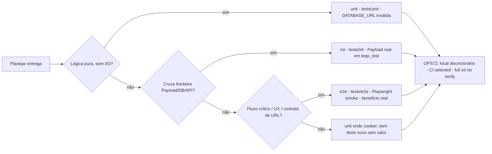

# Impl: Skills e docs: codificar a pirâmide de testes (unit primeiro, int depois, E2E só com benefício real por fluxo)

Status: rascunho
Atualizado em: 2026-08-24
Issue: #838
Intenção: docs/plans/ops90-skills-piramide-testes.md
Appetite restante: herdado (~0,5–1 dia eng; um outcome verificável — sem corte)

## Leitura da intenção

- **Outcome:** Ao planejar qualquer entrega, a decisão de nível de teste é orientada pela ordem unit→int→e2e-com-benefício, e a política OPS72 continua a valer intacta.
- **O que NÃO negociar:** política OPS72 intacta (gate local discricionário, CI/PR blast radius `selected`, full só no `verify` do deploy); nenhuma regra de % de cobertura; nenhuma proibição de e2e; sem mudança de gate nem de CI; sem migration/schema/UI; anti-goal de rewrite massivo de skills e de "cartilha de boas práticas" genérica.
- **O que reavaliar:** a hipótese de que todos os candidatos da intenção precisam de mudança — `ci-cd-and-automation` (é skill genérica de repo, exemplo), `engineering-audit` (varre `tests/`, avalia por classes) e `agent-work-issue` (só delega ao pipeline) podem ficar de fora; `AGENTS.md`/`AGENTS-infra.md` só recebem a pirâmide se houver linha curta natural (achado: são densas e só de gate — provável ação nenhuma).

## Abordagem recomendada



**Opções consideradas:** A — editar todos os candidatos da intenção ("harmonizar") | B — edição cirúrgica só onde há lacuna real (~6 arquivos + 2 docs), com `test-driven-development` como dono canônico | C — criar documento canônico novo (ex. `docs/TESTING-PYRAMID.md`) e apontar tudo para ele

**Recomendação:** B — porque atende os anti-goals (mudança mínima, sem documento novo, edit-the-owner), casa com a questão em aberto resolvida na intenção (opção A: TDD skill como dono da definição, `docs/TESTING.md` como referência operacional) e evita o DRY de docs com OPS72 já detalhada em `AGENTS-infra.md` L21 e `execution-pipeline.md` §E2E.
**Rejeitadas:** A porque é o rabbit hole "harmonizar skills consistentes" — `agent-work-issue`, `ci-cd-and-automation` e `engineering-audit` não têm lacuna real, e mexer em skill genérica viola "edit the owner, don't twin"; C porque a intenção cortou explicitamente "sem novo documento canônico" e duplicaria a definição ao lado do dono natural.

Decisões não triviais secundárias (formato `Opções | Recomendação | Rejeitadas`):

- **Onde a preferência de nível mora no fluxo de execução** — Opções: A `work-issue/SKILL.md` Passo 4 | B `execution-pipeline.md` §Executar | C ambos. Recomendação: B+C-leve — a pipeline é compartilhada por `work-issue` **e** `agent-work-issue` (que delega), então a frase lá cobre as duas skills de uma vez (DRY); o Passo 4 recebe só uma cláusula curta apontando para a pipeline. Rejeitadas: A puro porque deixa o `agent-work-issue` de fora do enunciado sem justificativa.
- **`AGENTS.md`/`AGENTS-infra.md` recebem a pirâmide?** — Opções: A editar linha de testes | B não editar. Recomendação: B — as linhas existentes são só gate/política OPS72 (L14/L21) e estão densas; a preferência já fica a um passo (pipeline + `docs/TESTING.md`); intenção autoriza ação nenhuma. Rejeitada: A porque empurra contexto de skill para o topo de AGENTS, o oposto da direção deste item.
- **`browser-testing-with-devtools`** — Opções: A apenas rótulo de uma linha | B reescrever seções para "vender" a pirâmide. Recomendação: A — uma linha no intro/anti-pattern table reconhecendo browser check como caso legítimo de "e2e com benefício real"; a tabela L287 já racionaliza "Unit tests don't test CSS, layout, or real browser rendering". Rejeitada: B porque a skill é uma ferramenta de debug, não de estratégia de teste.

### Componentes / mudanças

Edições propostas por arquivo (textos curtos; copy pt-BR nos arquivos do repo, inglês nas skills genéricas):

1. **`.agents/skills/test-driven-development/SKILL.md`** — dono canônico da pirâmide. Inserir **um bloco novo no FIM da seção The Test Pyramid (após L186, antes de `## Writing Good Tests`)** — posição que preserva os ranges de linha citados na intenção (§144–186):

   ```markdown
   ### This repo: the three layers (unit → int → e2e)

   In this repo the pyramid maps to `tests/` (see `docs/TESTING.md` and the `codebase-map` rule):

   | Level        | Where                          | Runs against                                                          |
   | ------------ | ------------------------------ | --------------------------------------------------------------------- |
   | Unit (~most) | `tests/unit/**/*.unit.spec.ts` | deliberately invalid `DATABASE_URL` — pure logic, no DB               |
   | Integration  | `tests/int/**/*.int.spec.ts`   | real Payload + Postgres `teqo_test`                                   |
   | E2E (few)    | `tests/e2e` (Playwright smoke) | only when the flow has real benefit (critical path, UX, URL contract) |

   E2E policy (OPS72): local is discretionary, PR CI runs only the affected surface (`selected`), full only in the deploy `verify` job — the PR never runs full e2e.
   ```

   Justificativa: âncora exigida pelo aceite ("sem recriar a definição do zero") — a definição genérica (§144–186) fica intocada; o bloco só mapeia para as camadas `tests/` e aponta OPS72 sem copiar o corpo da política.

2. **`.agents/rules/codebase-map.mdc` (L26)** — reescrever a linha `tests/` para explicitar a ordem:
   ```markdown
   - `tests/` — `unit` primeiro (lógica pura, DATABASE_URL inválida), `int` para fronteiras Payload/DB (Payload real em `teqo_test`, fixtures em `tests/helpers/campaignFixtures.ts`), `e2e` só com benefício real por fluxo (Playwright smoke).
   ```
   Justificativa: aceite pede que a linha das 3 camadas do mapa explicite a ordem; é a linha que todo agente lê ao navegar o codebase.
3. **`docs/TESTING.md` (após L9, antes do parágrafo CI)** — um parágrafo de preferência, sem tocar no corpo OPS72:
   ```markdown
   **Preferência de nível (pirâmide):** unit primeiro (lógica pura) → int para fronteiras Payload/DB → e2e somente quando o fluxo tem benefício real que as camadas inferiores não cobrem (fluxo crítico de usuário, UX/navegação, contrato de URL). E2E fica smoke; a maioria do comportamento de campanha é pinado em int.
   ```
   Justificativa: `docs/TESTING.md` é a referência operacional (decisão da intenção); a ordem hoje é implícita, o parágrafo a torna explícita sem editar a política.
4. **`.agents/skills/work-issue/execution-pipeline.md` (§Executar, L7–19)** — linha de preferência antes do item 1 da ordem (a seção §E2E local afetado L24–49 **não é tocada**):
   ```markdown
   **Nível de teste:** unit primeiro (lógica pura, `tests/unit`) → int para fronteiras Payload/DB (`tests/int`) → e2e só com benefício real por fluxo (`tests/e2e`); dono da definição: `test-driven-development`.
   ```
   Justificativa: a pipeline é compartilhada por `work-issue` e `agent-work-issue` — uma frase cobre as duas skills de execução (decisão B+C-leve).
5. **`.agents/skills/work-issue/SKILL.md` (Passo 4, L141)** — estender o bullet existente com uma cláusula curta:
   ```markdown
   - **Nível de teste:** unit → int → e2e-com-benefício (ver pipeline); **E2E local afetado (OPS72):** discricionário — rode os e2e criados + mesma superfície.
   ```
   Justificativa: enuncia a preferência ao lado da política OPS72 já documentada (aceite), sem duplicar a definição.
6. **`.agents/skills/code-review-and-quality/SKILL.md`** — duas adições mínimas:
   - Step 2 "Review the Tests First" (L152–161), um bullet novo: `- Is the test level right for the change? (unit → int → e2e-com-benefício — e2e only when the flow has real benefit the lower layers don't cover)`
   - Checklist final (L314): estender `- [ ] Tests cover the change adequately` → `- [ ] Tests cover the change adequately at the right level (unit → int → e2e-com-benefício)`
     Justificativa: aceite pede que a revisão valide o nível escolhido; é o encaixe natural do fluxo desejado da intenção.
7. **`.agents/skills/improve-code-quality/SKILL.md` (L269, exit checklist)** — estender o bullet existente (que já exige testes sem DB — ou seja, unit-first implícito):
   ```markdown
   - [ ] Business rules have tests that run with no database or framework (unit — first level of the pyramid); Payload/DB boundaries go to `tests/int`, e2e only with real benefit (TESTING.md Safety Net Map complete for changed modules).
   ```
   Justificativa: transforma o viés unit-first já presente em preferência explícita de níveis.
8. **`.agents/skills/browser-testing-with-devtools/SKILL.md` (intro L20 ou tabela L287)** — uma linha de rótulo:
   ```markdown
   Browser verification is a legitimate "e2e with real benefit" case: unit and integration tests don't cover CSS, layout, or real rendering (test pyramid: unit → int → e2e — see `test-driven-development`).
   ```
   Justificativa: resolve a questão em aberto da intenção (rótulo explícito) sem mudar o corpo da skill.
9. **Sem mudança (confirmar apenas, sem diff):** `agent-work-issue/SKILL.md` (só delegação — a edição da pipeline o cobre), `ci-cd-and-automation/SKILL.md` (diagrama genérico é exemplo, não regra do repo — mexer violaria "edit the owner, don't twin"), `engineering-audit/SKILL.md` (avaliação por classes; sem gap de nível), `AGENTS.md`/`AGENTS-infra.md` (linhas de gate/OPS72 apenas — decisão B acima).

- **Migration:** sem migration (docs/skills não tocam schema)
- **Access / Consent:** N/A — nenhum path de escrita em collections
- **UI:** N/A — Impeccable A; sem UI

### Dados → forma (se aplicável)

N/A — meta-chore de guias; sem dados de produto.

## Fases verificáveis

1. **TDD skill + docs de teste** (~30% do appetite) — bloco Teqo no fim de The Test Pyramid; reescrever L26 do `codebase-map.mdc`; parágrafo de preferência em `docs/TESTING.md`. Verificar: `git diff` mostra **apenas inserções** (seções §144–186 intactas, bloco novo só após L186); corpo OPS72 de `docs/TESTING.md` inalterado.
2. **Pipeline e work-issue** (~25%) — linha de preferência no §Executar do `execution-pipeline.md`; cláusula no Passo 4 do `work-issue/SKILL.md`. Verificar: seção §E2E local afetado byte-idêntica no diff; `agent-work-issue` continua delegando sem contradição.
3. **Checklists de revisão + browser** (~25%) — bullets em `code-review-and-quality` (Step 2 + checklist), `improve-code-quality` (exit checklist) e linha de rótulo em `browser-testing-with-devtools`. Verificar: frases leem bem no contexto; nenhum comando novo introduzido.
4. **Gates e push** (~20%) — `tsc --noEmit`, `pnpm lint` (0 warnings), `pnpm format:check`, `pnpm test` (guards `opencodeCommands.unit.spec.ts` / `agentPoolPrompt.unit.spec.ts` varrem `.agents/skills` por nome — devem seguir verdes), `pnpm build`. Commit incluindo o `ops90-skills-piramide-testes-impl.md`; entrega com `pnpm push`.

## Rabbit holes / Não escopo (engenharia)

- **Rewrite da TDD skill genérica (398 linhas)** para "trazer Teqo para dentro" de cada seção — fora; a edição é um bloco novo de ~10 linhas no fim da seção da pirâmide.
- **"Harmonizar" skills consistentes** (`agent-work-issue`, `ci-cd-and-automation`, `engineering-audit`, `AGENTS*.md`) — fora; sem lacuna real, ação mínima ou nenhuma.
- **Novo documento canônico de testes** (ex. `docs/TESTING-PYRAMID.md`) — fora; corte explícito da intenção.
- **Regras de % de cobertura ou proibição de e2e** — fora; guardrail da intenção.
- **Guards que vigiem conteúdo de skill** — fora; decisão da intenção (e acoplaria por conteúdo, quebrando o modelo nome→comando).
- **OPS87/OPS88** (engineering e2e/CI) — itens separados, não sobrepostos.
- **Reformatar/renomear seções existentes das skills** (churn de diff sem valor) — fora; só inserções.

## Riscos e mitigação

- **DRY de docs (OPS72 já detalhada em `AGENTS-infra.md` L21 e `execution-pipeline.md` L24–49):** novos textos **apontam** para a política, nunca copiam o corpo; `docs/TESTING.md` é a referência operacional única. Mitigação: diff-check nas fases 1–2 exigindo seções OPS72 intactas.
- **Números de linha voláteis (intenção cita §144–186):** inserção no fim da seção preserva os ranges existentes. Mitigação: posição do bloco fixada após L186; verificar com diff na fase 1.
- **Guards de prompt (`opencodeCommands`/`agentPoolPrompt`) varrem `.agents/skills` por nome:** edição de texto não quebra; comando/skill novo quebra. Mitigação: nenhum comando novo; `pnpm test` na fase 4.
- **Concorrência com OPS87/OPS88** (skills de teste/CI podem ser editadas por eles): worktrees por item; se conflitar no rebase, re-aplicar só os trechos-alvo deste plano.
- **Deriva para "cartilha":** revisores podem sugerir expandir. Mitigação: escopo fixado na lista de arquivos acima; o aceite da intenção exige mudança mínima — qualquer expansão é corte.
- **Quebra acidental de OPS72 ao editar `work-issue`:** Mitigação: edição por cláusula aditiva (nunca reescrita de bullet) + diff-check da fase 2 + checklist de aceite.

## Aceite de engenharia

- [ ] Aceite de produto da intenção coberto: TDD skill ancorada ao Teqo (camadas `tests/` + OPS72); `work-issue` e `code-review-and-quality` enunciam a preferência de nível; `docs/TESTING.md` e `codebase-map.mdc` explicitam a ordem unit→int→e2e-com-benefício; nenhuma regra de % de cobertura; nenhuma proibição de e2e.
- [ ] Política OPS72 intacta — gate local discricionário, CI `selected`, full só no `verify` do deploy — verificada por diff nas fases 1–2 (seções OPS72 de `execution-pipeline.md`, `docs/TESTING.md`, `AGENTS-infra.md` inalteradas).
- [ ] Invariantes AGENTS/engineering-standards: edição cirúrgica dos donos; copy pt-BR nos arquivos do repo e inglês nas skills genéricas; sem migration/schema/UI; `*-impl.md` commitado na entrega.
- [ ] Guards verdes: `pnpm test` passa (`opencodeCommands`/`agentPoolPrompt` sem novos nomes de comando/skill).
- [ ] Gates: `tsc --noEmit`, `pnpm lint` (0 warnings), `pnpm format:check`, `pnpm build` verdes.
- [ ] Nenhum documento canônico novo, nenhum guard novo, nenhuma mudança de gate/CI.

Self-score decision-quality: 4/5 — decisões caras com rejeitadas (escopo da edição, local da preferência, AGENTS sem mudança); abordagem cabe no appetite (~0,5–1 dia em 4 fases); rabbit holes nomeados; depth check reusa donos existentes (TDD skill como âncora, pipeline compartilhada cobre `agent-work-issue`, sem duplicar OPS72); aceite de produto intacto.
