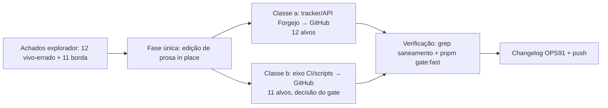

# Impl: Sweep pós-cutover OPS76: textos vivos ainda apontam o tracker ao Forgejo

Status: rascunho
Atualizado em: 2026-08-24
Issue: #841
Intenção: docs/plans/ops91-sweep-pos-cutover-forgejo-textos-vivos.md
Appetite restante: herdado (~0,5 dia — só edição de prosa; sem estouro possível)

## Leitura da intenção

- **Outcome:** todo texto vivo do repo que instrui leitura/escrita de Issues no tracker do Forgejo (`git.solla.dev/fsolla/teqo/issues`, API, `FORGEJO_API_TOKEN`) passa a apontar o GitHub (`github.com/fsolla/teqo/issues`, API do GitHub, `GITHUB_TOKEN`) como tracker único; menções históricas corretas permanecem intactas.
- **O que NÃO negociar:** zero mudança de comportamento em scripts (só prosa/comentários); não reescrever história (runbook de rollback, marcações "legado/removido/congelado", `docs/plans/**`, `docs/changelog/**`, `CHANGELOG-AGENTS.md`); não renomear `scripts/lib/agent-forgejo.mjs`.
- **O que reavaliar:** o aceite "grep de saneamento: nenhuma ref viva a tracker/API do Forgejo fora das classes FORA" exige decidir o destino dos 11 itens **BORDA** (eixo diferente do tracker — CI, comentários de lib, prefixos de log) — sem essa decisão o grep de saída fica contaminado. Decidido abaixo (mesma classe de resíduo pós-cutover; incluir no mesmo diff, marcado como decisão do gate).

## Abordagem recomendada

**Opções consideradas:**

- **A) In place, fase única, BORDA dentro** — cada arquivo dono da própria frase; os 11 itens BORDA entram no mesmo diff.
- **B) In place, BORDA fora** — só os 12 vivo-errado; BORDA vira Issue nova.
- **C) Documento novo (lista de exceções)** — não editar, documentar o resíduo.

**Recomendação: A** — porque é a mesma classe de resíduo pós-cutover (leitor novo tropeça igual em "tracker no Forgejo" e em "Forgejo Actions" na linha do CI); a edição é prosa/comentário sem comportamento, o diff inteiro é atomicamente revertível, e o grep de saneamento só fecha sem exceções. O appetite (~0,5 dia) comporta os 23 alvos com folga. O BORDA fica **marcado no PR como decisão do gate** (o humano pode vetar os 11 e reduzir o diff para a classe a sem custo — arquivos independentes).
**Rejeitadas:** B porque espalha a correção em duas entregas com zero isolamento de risco (nenhum alvo é código) e deixa o grep de saída do PR A com exceções; C porque deixa instrução viva errada no repo (o aceite da intenção exige corrigir, não documentar).

**Decisões de engenharia:**

- **Fraseado canônico:** espelhar `AGENTS.md:15` como fonte de verdade de fraseado ("CI/PR/deploy AND the ISSUE TRACKER live on GitHub (OPS71 + OPS76, 2026-08-21) (`github.com/fsolla/teqo/issues` … GitHub is the single host)") — evita que as camadas AGENTS (`.mdc`, `AGENTS-infra.md`) divirjam entre si. Alternativa (tradução livre por arquivo) rejeitada: cada reescrita divergente seria o próximo drift.
- **`docs/roadmap.md` (stub congelado):** editar só a linha-ponteiro da fonte canônica — precedente exato do OPS68 ("só o ponteiro da fonte canônica — o stub continua congelado"); o congelamento cobre conteúdo, não ponteiro vivo para o tracker morto. Alternativa "não tocar" rejeitada: o stub diz explicitamente "Status rápido: `pnpm agent:status`" e o ponteiro é o texto vivo que o leitor usa.

### Componentes / mudanças

- **Migration:** sem migration.
- **Access / Consent:** N/A — nenhuma mudança de schema ou escrita em dados.
- **UI:** N/A — Impeccable A, zero superfície.
- **Testes:** nenhum novo; verificação por grep + `pnpm gate:fast` (nenhum string editado é pinado em spec — verificado: `grep` em `tests/` por `forgejo-issue-transition|Forgejo issue list failed|forgejo-api|Forgejo Actions` = 0 matches).

### Lista arquivo:linha → texto alvo

**Classe (a) — VIVO-ERRADO (core da Issue):**

| #   | Arquivo:linha                                           | Atual                                                                                                                                                                                                                                                                       | Alvo                                                                                                                                                                                                                                                                            |
| --- | ------------------------------------------------------- | --------------------------------------------------------------------------------------------------------------------------------------------------------------------------------------------------------------------------------------------------------------------------- | ------------------------------------------------------------------------------------------------------------------------------------------------------------------------------------------------------------------------------------------------------------------------------- |
| a1  | `.agents/rules/agent-pr-workflow.mdc:8`                 | "…native auto-merge (OPS71). The ISSUE TRACKER stays on the Forgejo — GitHub is only the Actions host."                                                                                                                                                                     | "…native auto-merge (OPS71). The ISSUE TRACKER lives on the GitHub too (OPS76, 2026-08-21) — GitHub is the single host for code, CI, PRs and Issues."                                                                                                                           |
| a2  | `.agents/skills/work-issue/execution-pipeline.md:69`    | "(OPS71; o tracker de Issues continua no Forgejo por API)."                                                                                                                                                                                                                 | "(OPS71; o tracker de Issues também vive no GitHub, OPS76)."                                                                                                                                                                                                                    |
| a3  | `.agents/skills/work-issue/execution-pipeline.md:74–76` | "flipa `done`/`in-prod` **no Forgejo** (lê o body do PR via API do GitHub, escreve no tracker por `FORGEJO_API_TOKEN`)"                                                                                                                                                     | "flipa `done`/`in-prod` **no GitHub** (lê o body do PR via API do GitHub, escreve no tracker por `GITHUB_TOKEN`)"                                                                                                                                                               |
| a4  | `.agents/skills/project-status/SKILL.md:25`             | "leia a Issue via API do Forgejo (MCP/`pnpm issue`)"                                                                                                                                                                                                                        | "leia a Issue via API do GitHub (MCP/`pnpm issue`)"                                                                                                                                                                                                                             |
| a5  | `.agents/skills/engineering-audit/SKILL.md:69`          | "(leitura da Issue via API do Forgejo/MCP — disponível no Cloud)"                                                                                                                                                                                                           | "(leitura da Issue via API do GitHub/MCP — disponível no Cloud)"                                                                                                                                                                                                                |
| a6  | `.agents/skills/plan-issue/SKILL.md:23`                 | "1. **Nada no Forgejo antes do gate.**"                                                                                                                                                                                                                                     | "1. **Nada no tracker antes do gate.**"                                                                                                                                                                                                                                         |
| a7  | `docs/roadmap.md:5`                                     | "[Issues do Forgejo](https://git.solla.dev/fsolla/teqo/issues)"                                                                                                                                                                                                             | "[Issues do GitHub](https://github.com/fsolla/teqo/issues)" (só o ponteiro; stub segue congelado)                                                                                                                                                                               |
| a8  | `AGENTS-infra.md:5`                                     | "**CI/PR/deploy live on GitHub Actions (OPS71, 2026-08-19); the ISSUE TRACKER stays on the Forgejo** (`git.solla.dev/fsolla/teqo` — labels, claims, `pnpm issue`/`agent:*` and the post-merge flips all keep talking to the Forgejo API; GitHub is only the Actions host)." | "**CI/PR/deploy AND the ISSUE TRACKER live on GitHub (OPS71 + OPS76, 2026-08-21)** (`github.com/fsolla/teqo/issues` — labels, claims, `pnpm issue`/`agent:*` and the post-merge flips talk to the GitHub API; GitHub is the single host)." (espelho verbatim de `AGENTS.md:15`) |
| a9  | `README.md:9`                                           | "O **tracker de Issues vive no Forgejo** (`git.solla.dev/fsolla/teqo`); o código/PR/CI vive no **GitHub**."                                                                                                                                                                 | "O **tracker de Issues, o código, os PRs e o CI vivem no GitHub** (`github.com/fsolla/teqo`)."                                                                                                                                                                                  |
| a10 | `README.md:13`                                          | "Secrets humanos (uma vez): `FORGEJO_API_TOKEN` no GitHub (flips pós-merge no Forgejo); envs de prod em `~/stack/teqo-1313.env` no homeserver."                                                                                                                             | "Secrets humanos (uma vez): `GITHUB_TOKEN` (PAT com escopo `repo` + `issues: write`) para os scripts de agente/PR e flips pós-merge; envs de prod em `~/stack/teqo-1313.env` no homeserver."                                                                                    |
| a11 | `README.md:133`                                         | "tracked [Forgejo Issues](https://git.solla.dev/fsolla/teqo/issues)"                                                                                                                                                                                                        | "tracked [GitHub Issues](https://github.com/fsolla/teqo/issues)"                                                                                                                                                                                                                |
| a12 | `scripts/github-pr.mjs:4`                               | "delivery flow (OPS71: PRs live on GitHub; the tracker stays on Forgejo)."                                                                                                                                                                                                  | "delivery flow (OPS71: PRs live on GitHub; the tracker lives on GitHub too — OPS76)."                                                                                                                                                                                           |

**Classe (b) — BORDA (decisão do gate: incluir no mesmo diff):**

| #   | Arquivo:linha                                             | Atual                                                                          | Alvo                                                                                                              |
| --- | --------------------------------------------------------- | ------------------------------------------------------------------------------ | ----------------------------------------------------------------------------------------------------------------- |
| b1  | `README.md:116`                                           | "Quality gates (also enforced by CI on the Forgejo Actions)"                   | "Quality gates (also enforced by CI on GitHub Actions — `ci-pr.yml`)"                                             |
| b2  | `scripts/lib/agent-forgejo.mjs:3`                         | "through the Forgejo REST API (scripts/lib/forgejo-api.mjs)"                   | "through the GitHub REST API (scripts/lib/github-api.mjs)"                                                        |
| b3  | `scripts/lib/agent-forgejo.mjs:7`                         | "Issue contract (spec + status + deps in Forgejo Issues, per the parallel"     | "Issue contract (spec + status + deps in GitHub Issues, per the parallel"                                         |
| b4  | `scripts/issue-transition-on-merge.mjs:40`                | "Usage: node scripts/forgejo-issue-transition.mjs --pr <N>"                    | "Usage: node scripts/issue-transition-on-merge.mjs --pr <N>" (nome morto da era pré-rename — bug de doc no usage) |
| b5  | `scripts/issue-transition-on-merge.mjs:51,55,64,80,84,90` | prefixo de log `[forgejo-issue-transition]` (6 ocorrências)                    | prefixo `[issue-transition]` (6 ocorrências)                                                                      |
| b6  | `scripts/agent-status.mjs:26`                             | `die("Forgejo issue list failed: ${error.message}")`                           | `die("GitHub issue list failed: ${error.message}")`                                                               |
| b7  | `scripts/lib/cli.mjs:34`                                  | "names of the self-hosted Forgejo runner (OPS62 X1:"                           | "names of the self-hosted GitHub Actions runner (OPS62 X1:"                                                       |
| b8  | `scripts/lib/cli.mjs:50`                                  | "self-hosted Forgejo runner publishes each job's `services:` Postgres"         | "self-hosted GitHub Actions runner publishes each job's `services:` Postgres"                                     |
| b9  | `scripts/lib/github-api.mjs:9`                            | "Retry (same policy as forgejo-api OPS67)"                                     | "Retry (OPS67 policy)" (ref a lib removida; sem comportamento)                                                    |
| b10 | `scripts/lib/github-api.mjs:183`                          | "normalized to the agent-script contract (same as forgejo-api)."               | "normalized to the agent-script contract."                                                                        |
| b11 | `scripts/lib/github-api.mjs:211`                          | "filter them out (the Forgejo `type: issues` query had no GitHub equivalent)." | "filter them out (the GitHub issues endpoint mixes PRs; there is no `type` filter)."                              |

## Fases verificáveis

**Fase única — edição de prosa (23 alvos):** aplicar a lista acima in place (edição linha-a-linha; nenhum arquivo reescrito inteiro). Não há ordem de dependência entre alvos; commits agrupam por arquivo na branch `OPS91-<slug>`.

**Verificação (mesma fase):**

1. Grep de saneamento (com as exclusões FORA): zero matches vivos em superfícies não-congeladas de `git.solla.dev/fsolla/teqo`, `tracker stays on the Forgejo`, `no Forgejo`, `FORGEJO_API_TOKEN` (como instrução ativa — `AGENT-OPS.md:95` e runbook seguem como refs históricas/legado), `Forgejo Actions`, `forgejo-api` (comentários de lib), `[forgejo-issue-transition]`, `Forgejo issue list failed`.
2. `pnpm gate:fast` (lint/format cobrem os `.md`/`.mdc`/`.mjs` editados; nenhum string é pinado em spec — verificado).
3. `pnpm changelog:check` após registrar a entrada `docs/changelog/2026-08-24-ops91.md` + `pnpm changelog:build` (insert-only — o diff será só a entrada nova + o agregado).

## Rabbit holes / Não escopo (engenharia)

- Rename de pureza de `scripts/lib/agent-forgejo.mjs` (e `agent-pool-forgejo.mjs`) — fora de escopo declarado na intenção (score 1, churn alto).
- Reabrir histórico: `docs/plans/*`, `docs/changelog/*`, `docs/CHANGELOG-AGENTS.md`, `docs/ops/teqo-1313-deploy.md` (runbook de rollback cita o Forgejo de propósito), marcações "legado/removido/congelado" já corretas (`AGENT-OPS.md:95`, `agent-pr-workflow.mdc:60,85`), skill `agent-pool` dormente.
- Reescrever os scripts que já falam GitHub (`issue-transition-on-merge.mjs` além dos 7 alvos de prosa) — zero mudança de comportamento.

## Riscos e mitigação

- **Lint/format em `.mdc`/`.md`:** gates cobrem; se Prettier divergir no alvo (linha longa no `README.md:9` reescrita), `pnpm format` antes do push.
- **docs-guards de changelog:** entrada OPS91 obrigatória antes do push (guard append-only); sem ela o push falha — passo explícito na verificação.
- **Veto do gate no BORDA:** se o humano vetar, descartar os 11 alvos b\* — os arquivos são independentes, o diff da classe a fecha sozinho; registrar no comentário da PR.
- **Deriva de fraseado entre camadas:** mitigada espelhando `AGENTS.md:15` nos alvos em inglês de camada AGENTS (a8, a1) e mantendo link/URL iguais nos alvos em pt (a7, a11).

## Aceite de engenharia

- [ ] Aceite de produto da intenção coberto: 23 alvos corrigidos; grep de saneamento sem ref viva a tracker/API do Forgejo fora das classes FORA
- [ ] Invariantes AGENTS/engineering-standards: edição in place, dono por arquivo, zero comportamento alterado, zero twin
- [ ] Testes de domínio previstos (unit/int): N/A — prosa; verificação por grep + `pnpm gate:fast` verde
- [ ] Changelog `docs/changelog/2026-08-24-ops91.md` + `pnpm changelog:build` + `changelog:check`

**Self-score decision-quality: 5/5** — (1) decisões caras (BORDA no diff, roadmap stub, fraseado canônico) têm opções e rejeitadas registradas; (2) cabe no appetite (prosa, 23 edições pontuais, fase única); (3) rabbit holes nomeados (rename de pureza, histórico, scripts já corretos); (4) depth check: zero arquivo/helper novo, edita o dono existente; (5) aceite da intenção permanece satisfeito — reescrita nunca reescreveu o outcome, só o corrigiu.
