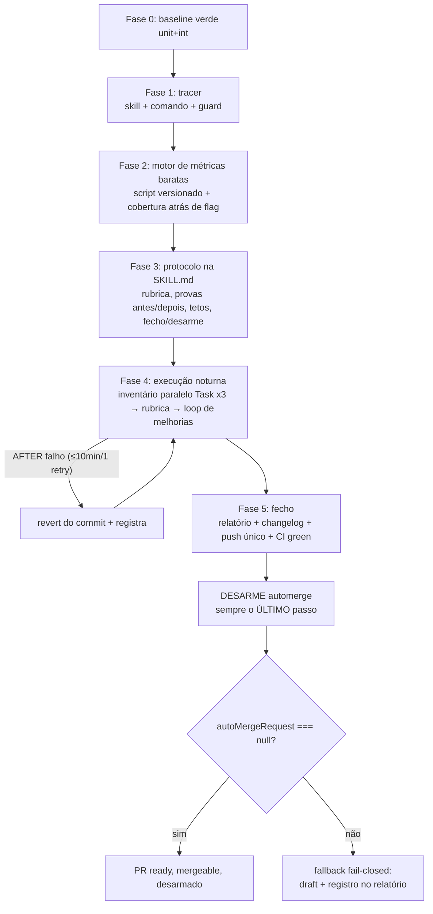

# Impl: Skill `/testing-audit` — auditoria autônoma da suíte de testes com implementação das melhorias

Status: rascunho
Atualizado em: 2026-08-25
Issue: #898
Intenção: docs/plans/ops96-skill-testing-audit.md
Appetite restante: herdado (~1–2 dias eng) — ~½ dia de construção (Fases 0–3) + uma noite de execução governada com tetos duros ~6h (Fases 4–5)

## Leitura da intenção

- **Outcome:** disparo `/testing-audit` à noite; pela manhã existe UM relatório que explica toda a noite: retrato honesto da suíte (contagens/tempos por camada — unit ~221 / int ~96 / e2e ~44 inventariado estaticamente), duplicatas prováveis, candidatos mover/reforçar/remover cada um com disposição + justificativa, melhorias seguras JÁ aplicadas como código (cada passo provou suíte verde ANTES e DEPOIS), passos revertidos registrados e propostas não executadas documentadas. Entrega = UM PR **ready** (não draft), **sem auto-merge armado**, CI green e mergeable; descrição do PR = relatório final; o relatório também vive como artefato commitado referenciado pelo PR; fixes em commits separados quando possível (preferência, não requisito duro); diff revisável em pedaços lógicos.
- **O que NÃO negociar:** intocáveis absolutos — testes de consentimento/LGPD fail-closed, access control/RBAC, lockdown de liderança (nunca remover nem enfraquecer autonomamente); OPS72/`ci-scope.mjs` + `scripts/lib/e2e-affected-manifest.mjs` intocáveis (nenhum gate, workflow ou política de seleção e2e muda); remoção autônoma só com PROVA FORTE (na dúvida vira proposta no relatório); teto temporal fixo (auditoria termina, implementação começa); ferramentas só first-party; relatório é artefato de aceite; changelog append-only no mesmo PR; nenhuma % de cobertura vira regra dura; sem rewrite da suíte e sem segundo cadastro de métricas.
- **O que reavaliar:** teto de 6 melhorias aplicadas é hipótese (a primeira noite calibra); formato do relatório após a primeira execução; se durações e2e reais serão um dia necessárias (hoje deliberadamente "não medido"); se o piloto do protocolo na Fase 3 já consome parte da cota noturna.

## Abordagem recomendada

### Decisões de engenharia

**D1 — Forma da skill.**

- **A)** SKILL.md única com fases sequenciais executadas pelo próprio agente (estilo `engineering-audit`, 182 linhas).
- **B)** Decomposição pesada em sub-agentes Task para tudo (estilo `agent-work-issue`, padrão explorador→escritor→revisores→capturador).
- **C)** Híbrido: fases sequenciais definidas na SKILL.md; inventário por camada delegado a leitores paralelos **read-only** via Task (unit/int/e2e estático); loop de implementação estritamente sequencial no agente principal.

**Recomendação: C.** A máquina roda à noite sem humano: os leitores paralelos cortam o tempo de parede da fase mais mecânica e são seguros porque não escrevem nada (cada achado vem com caminho+linha e é validado contra o fonte antes de virar disposição); o loop de melhorias precisa de continuidade de estado (provas verde encadeadas, commits incrementais) e não paraleliza sem corromper a prova. SKILL.md alvo: ~150–180 linhas, frontmatter mínimo `{name, description}`.

**Rejeitadas:** B (custo de orquestração acima do appetite; implementadores paralelos invalidariam as provas encadeadas); A puro (noite mais longa no inventário, desperdiça a única paralelização segura).

**D2 — Coleta de métricas.**

- **A)** Reporters JSON nativos parseados ad-hoc a cada execução (`node -e` efêmero ou leitura manual).
- **B)** Script versionado `scripts/testing-audit-metrics.mjs`: roda os runners com `--reporter=json --outputFile` para arquivo temporário e normaliza contagens por camada + specs mais lentas numa tabela compacta markdown/json.
- **C)** Tudo manual pelo agente lendo saídas dos runners.

**Recomendação: B**, com teste unitário próprio para a função pura de normalização (`tests/unit/testingAuditMetrics.unit.spec.ts`). Repetível entre noites, barato (~100 linhas), knip-safe — verificado que `knip.json` tem `scripts/*.mjs` como entry, então o script novo não é órfão. Unit roda com DATABASE_URL inválido proposital (`test:unit`), int exige `teqo_test` (`assertTestDatabase`) — o script apenas orquestra os scripts existentes. E2E entra como inventário estático (parse dos spec files: contagem de `test(`/`describe(`, tags, fixtures), nunca execução (ver D4/riscos).

**Rejeitadas:** A (não repetível; joga fora o trabalho toda noite); C (queima tokens, propenso a erro de leitura, não é auditável por teste).

**D3 — Cobertura (@vitest/coverage-v8).**

- **A)** Instalar como devDependency NESTE PR, pinada na mesma versão major/minor do vitest instalado, acionável APENAS por flag documentada na skill (`pnpm vitest run --config ./vitest.unit.config.mts --coverage`); acrescentar `@vitest/coverage-v8` ao `ignoreDependencies` do `knip.json` preventivamente (o plugin só carrega sob `--coverage`; knip flaggaria como dependência não usada e deixaria o gate vermelho durante a noite).
- **B)** Instalar sob demanda na primeira execução (skill instrui `pnpm add -D @vitest/coverage-v8`).
- **C)** Não instalar.

**Recomendação: A.** Determinística: o PR entregue já sai com o comando funcionando e os gates previsíveis à noite. O ajuste no `knip.json` é whitelist declarativa de dependência invocada por flag — mesmo padrão das entradas existentes (`tailwindcss-animate`, `tw-animate-css`, `shadcn`, `eslint-config-next`) — e NÃO enfraquece check algum; nenhum gate/script passa a exigir ou reportar cobertura; nenhuma % vira regra (corte da intenção preservado).

**Rejeitadas:** B (worktree sujo no meio da noite, risco de esquecer o commit, comando documentado mas inoperante no PR entregue, surpresa de knip às cegas); C (rejeitada pela própria intenção — decidiu SIM atrás de flag; motivo registrado: diagnóstico barato e first-party do ecossistema vitest, opcional por construção).

**D4 — Protocolo verde antes/depois + tetos.**

- **Prova padrão de cada passo:** `pnpm test:unit` + `pnpm test:int` verdes ANTES e DEPOIS da edição (int roda contra `teqo_wt<slot>_test`, já provisionada neste worktree — validar conexão na Fase 0; unit roda com DATABASE_URL inválido por design). Passos confinados a arquivos unit podem provar unit-only, mas o bloco de fechamento roda o par completo uma vez.
- **Categorias seguras de melhoria:** **mover** (spec na camada errada realocado dentro da mesma suíte — ex.: teste puro vivendo em arquivo int); **reforçar** (assertion faltante dentro de escopo já testado); **remover** SOMENTE com prova forte: duplicata demonstrada (diff das assertions mostra comportamento idêntico ao teste gêmeo citado) ou teste morto de feature removida do codebase (referência morta verificada). Na dúvida → proposta no relatório.
- **Intocáveis (nunca remover/enfraquecer):** consentimento/LGPD fail-closed, access control/RBAC (`src/utilities/access/*`), lockdown de liderança. Duplicata aparente envolvendo intocável vira proposta sempre.
- **Evidência:** linhas-resumo literais dos runners ("Test Files X passed", "Tests Y passed") + hash curto do commit + timestamp, gravadas por passo na tabela de evidências do relatório. JSON bruto é efêmero (fora do git).
- **Tetos duros:** budget global da noite **6h**; máx **6 melhorias aplicadas**; **30min por passo** incluindo provas; AFTER falho → debug ≤10min/1 retry, senão `git reset --hard HEAD~1` e registrar como "revertido" com motivo; auditoria termina antes de implementar; estourou teto → candidato vira proposta.

**Recomendação:** exatamente o acima.
**Rejeitadas:** provar só com unit (regressões de int ficariam invisíveis — melhorias movem specs entre camadas); provar rodando build/e2e a cada passo (custo proibitivo); sem teto (viola o corte explícito da intenção "auditoria termina, implementação começa").

**D5 — Desarme do auto-merge (verificado no fonte).**
Todo PR ready OPEN base main nasce ARMADO: `.github/workflows/agent-pr-ready-automerge.yml` dispara em opened/reopened/synchronize/ready_for_review/converted_to_draft e `decideAutomergeAction` (`scripts/lib/github-pr-flow.mjs`) arma automerge em qualquer ready OPEN base main (único veto estrutural = draft fora de `cursor/*`). Cada novo push REARMA via synchronize. Sequência obrigatória de fecho:

1. Push único com tudo (relatório, changelog, melhorias) — minimiza rearms; o hook `.husky/pre-push` roda `gate:push` (gate-ci sem e2e + docs-guards) como validação gratuita pré-push.
2. Aguardar o run do workflow de automerge **deste SHA final** terminar (terá armado o automerge no synchronize).
3. `gh pr merge <N> --disable-auto`.
4. Verificar: `gh pr view <N> --json isDraft,autoMergeRequest,mergeable,mergeStateStatus` → esperado `{false, null, MERGEABLE, CLEAN}`.
5. **Fallback fail-closed:** se `--disable-auto` falhar ou `autoMergeRequest` persistir não-nulo → converter para draft (`gh pr ready <N> --undo`; draft fora de `cursor/*` é veto estrutural, exit 0) e registrar no relatório que o humano vira ready pela manhã. Draft protegido é preferível a main mergeado sem querer.

**Recomendação:** sequência acima, executada SEMPRE como último passo da noite.
**Rejeitadas:** entregar draft e virar ready de manhã (viola o aceite explícito — ready não draft — e o desarme resolve a causa real); confiar no humano para desarmar (viola aceite); não fazer nada (PR se auto-mergeia sozinho assim que o CI ficar verde, durante a noite). **Regra derivada:** qualquer push posterior ao desarme rearma — portanto NUNCA rebasar/repushar após o desarme (ver Riscos).

**D6 — Relatório: localização e forma.**

- **A)** `docs/plans/ops96-skill-testing-audit-report.md`.
- **B)** `docs/testing-audits/<YYYY-MM-DD>.md` (diretório dedicado, chaveado por data).
- **C)** Artefato fora do repo (gist/comentário de issue).

**Recomendação: B**, convenção definida dentro da SKILL.md para reuso por execuções futuras; esta entrega grava `docs/testing-audits/<data>.md`. Regra "descrição do PR = relatório": o corpo do PR contém o relatório integral (ou versão condensada com ponteiro para o artefato, se ultrapassar limites razoáveis de UI). Template embutido na SKILL.md com seções fixas: sumário executivo; metodologia e tetos respeitados; retrato por camada (unit/int com contagens+durações medidas; e2e inventário estático com durações "não medido — execução noturna proibida"); tabela de disposições (id, camada, arquivo, tipo mover/reforçar/remover/manter, prioridade alta/média/baixa, prova, decisão aplicada/proposta/revertida); evidências verde antes/depois por passo; passos revertidos com motivo; propostas não executadas; estado final do PR. Pedaços lógicos do diff: commits separados por scaffolding (tracer / métricas / protocolo+deps) e 1 commit por melhoria aplicada; relatório+changelog no(s) commit(s) finais.

**Rejeitadas:** A (acopla saída recorrente ao diretório de planos por ops; polui `docs/plans/` nas próximas noites); C (quebra o aceite "relatório vive como artefato no repo").

**D7 — Guard de comandos e espelho.**
Atualizar o array pinado `['work-issue', 'plan-issue']` em `tests/unit/opencodeCommands.unit.spec.ts` para incluir `'testing-audit'` e criar `.opencode/commands/testing-audit.md` no formato stub existente: frontmatter com `description:` (TUI) e `model: deepseek/deepseek-v4-flash`; corpo curto que carrega a skill `testing-audit` pelo nome exato, aponta a fonte canônica `.agents/skills/testing-audit/SKILL.md` (sem transcrever) e passa `$ARGUMENTS`. O guard exige: arquivo existe, skill existe, `` `testing-audit` `` literal, `$ARGUMENTS`, `.agents/skills/testing-audit/SKILL.md` literal, frontmatter válido — é o tracer da Fase 1.

### Componentes / mudanças

1. **`.agents/skills/testing-audit/SKILL.md`** (~150–180 linhas, frontmatter `{name, description}`): objetivo; fases 0–5; rubrica de disposições + prioridades; protocolo verde antes/depois com evidências; categorias seguras + prova forte para remoção; lista de intocáveis; tetos duros; instruções dos leitores paralelos Task (read-only, citação obrigatória caminho:linha); fecho noturno completo incluindo a sequência de desarme D5 verbatim; template do relatório; apontamentos explícitos: pirâmide das 3 camadas CITADA de `test-driven-development` §144–198 + `docs/TESTING.md` (não duplicada); declaração explícita de que NÃO herda o contrato auto-merge de `engineering-audit`; ci-scope/e2e-affected intocáveis.
2. **`.opencode/commands/testing-audit.md`**: espelho stub no formato D7.
3. **`tests/unit/opencodeCommands.unit.spec.ts`**: array ganha `'testing-audit'`.
4. **`scripts/testing-audit-metrics.mjs`**: orquestra reporters JSON nativos, normaliza contagens/durações, emite tabela markdown + json opcional.
5. **`tests/unit/testingAuditMetrics.unit.spec.ts`**: testa a normalização (fixtures de payload vitest JSON).
6. **`package.json` + lockfile**: devDependency `@vitest/coverage-v8` (versão casa com vitest instalado).
7. **`knip.json`**: `ignoreDependencies` += `@vitest/coverage-v8`.
8. **`docs/testing-audits/<data>.md`**: relatório da primeira execução noturna (artefato de aceite).
9. **`docs/changelog/<data>-ops96-testing-audit.md`**: entrada append-only (exigência docs-guards).
10. **Melhorias aplicadas**: até 6 commits, um por passo, cada um com provas registradas.

## Fases verificáveis

**Fase 0 — Preparação e baseline (antes de qualquer edição).**

- Validar worktree: deps instaladas, `DATABASE_URL` do `.env.test.local` aponta para `teqo_wt<slot>_test` (nunca produção — guards locais intactos).
- Rodar `pnpm test:unit` e `pnpm test:int` → verdes; registrar contagens baseline (esperado ~221/~96) no futuro relatório.
- **Verificação:** baseline verde registrado; nenhum arquivo modificado ainda.

**Fase 1 — Tracer: skill + comando + guard.**

- Criar SKILL.md esqueleto (fases nomeadas), espelho `.opencode/commands/testing-audit.md`, adicionar `'testing-audit'` ao array do guard.
- **Verificação:** `pnpm test:unit opencodeCommands` verde com os 3 comandos pinados; commit próprio.

**Fase 2 — Motor de métricas baratas.**

- `scripts/testing-audit-metrics.mjs` + spec de normalização; devDependency `@vitest/coverage-v8` + entrada em `knip.json.ignoreDependencies`; comando de cobertura documentado na SKILL.md (flag only).
- **Verificação:** script roda na suíte atual e emite tabela ~221 unit / ~96 int com specs mais lentas; spec novo verde; `pnpm exec knip` sem novos alertas; commit próprio.

**Fase 3 — Protocolo de execução segura dentro da SKILL.md.**

- Escrever rubrica, provas antes/depois com evidências, categorias seguras, prova forte de remoção, intocáveis, tetos, regra "e2e read-only", fecho/desarme D5, template do relatório.
- Piloto opcional (se tempo): aplicar 1 melhoria trivial seguindo o protocolo à risca, para validar o mecanismo antes da noite.
- **Verificação:** checklist de autossuficiência — um agente lendo SOMENTE a SKILL.md consegue executar a noite inteira sem contexto extra; `pnpm lint` + `pnpm typecheck` verdes.

**Fase 4 — Execução noturna governada (a skill rodando sobre a suíte real).**

- Inventário paralelo via Task ×3 leitores read-only (unit/int/e2e estático), ≤45min, achados com caminho:linha.
- Consolidação + rubrica ≤30min: cada candidato recebe disposição (mover/reforçar/remover/manter/proposta) + justificativa + prioridade.
- Loop sequencial de melhorias: ≤6 passos, 30min cada, provas verde antes/depois por passo, 1 commit por passo; AFTER falho → ≤10min/1 retry → revert + registro.
- **Verificação:** cada melhoria = commit com evidências no relatório; `git diff origin/main` NÃO toca ci-scope/e2e-affected/workflows/husky nem paths intocáveis; zero edições em arquivos e2e; tetos respeitados.

**Fase 5 — Fecho noturno.**

- Finalizar `docs/testing-audits/<data>.md`; changelog append-only; `pnpm lint && pnpm format:check && pnpm typecheck && pnpm exec knip && pnpm check:cycles && pnpm test:unit && pnpm test:int` no SHA final.
- Push único (hook roda `gate:push`); abrir PR ready base main; colar relatório como descrição; aguardar CI green no SHA final (monitorar; flake aparente → rerun 1×; quebra real → fix-forward ≤2 ciclos).
- **Desarme (ÚLTIMO passo):** sequência D5 completa; verificar `{isDraft: false, autoMergeRequest: null, mergeable: MERGEABLE}`.
- **Verificação:** `gh pr view --json isDraft,autoMergeRequest,mergeable,mergeStateStatus` confirma ready + desarmado + mergeable; fallback draft só se desarme falhar, com registro explícito no relatório.

## Rabbit holes / Não escopo (engenharia)

- **Rodar Playwright/e2e à noite — nem full, nem smoke.** Custo alto + política OPS72 + flake noturno. E2E é inventariado estaticamente (contagens, estrutura, tags) com durações marcadas "não medido"; qualquer mudança em spec e2e é proposta, nunca edição autônoma.
- **Não criar segundo cadastro/dashboard de métricas históricas.** O script gera tabela pontual para o relatório; sem persistência além do artefato markdown.
- **Não tocar** `ci-scope.mjs`, `e2e-affected-manifest.mjs`, workflows, husky, gates, seleção e2e — nem "só para arrumar" algo visto no caminho (vira proposta no relatório).
- **Não registrar Issues no tracker** (propostas vivem apenas no relatório; captura de débitos é decisão humana posterior).
- **Não perseguir % de cobertura** como meta ou regra; flag diagnóstica apenas.
- **Não reescrever/mover testes em massa**; remoção autônoma só com prova forte; intocáveis nunca, nem com prova.
- **Não rebasar após o desarme** (rearma automerge); conflito com main é registrado para ação humana.
- **Ferramentas só first-party:** reporters nativos vitest/playwright + `@vitest/coverage-v8`. Nada de libs third-party de análise de suíte.
- **Não implementar agendamento/cron** para a skill disparar sozinha; o disparo é humano (`/testing-audit`).

## Riscos e mitigação

| Risco                                                             | Mitigação                                                                                                                                                                                                                                               |
| ----------------------------------------------------------------- | ------------------------------------------------------------------------------------------------------------------------------------------------------------------------------------------------------------------------------------------------------- |
| Rearme automático do automerge a cada `synchronize`               | Push único ao fecho; desarme SEMPRE último passo; verificação explícita de `autoMergeRequest === null`; fallback fail-closed draft; regra "não repushar após desarme".                                                                                  |
| CI flaky overnight bloqueia "green" da manhã                      | Máxima prova local pré-push (`gate:push` roda cascata sem e2e no hook); pós-push: 1 rerun se flake aparente, ≤2 ciclos de fix-forward; esgotado → registrado no relatório como pendência conhecida (não corrompe main porque automerge está desarmado). |
| knip flagga `@vitest/coverage-v8` e deixa o gate vermelho à noite | Whitelist preventiva em `knip.json.ignoreDependencies` (D3-A); validado na Fase 2 com `pnpm exec knip`.                                                                                                                                                 |
| `test:int` sem DB do worktree disponível                          | Fase 0 valida `teqo_wt<slot>_test` antes de tudo (worktree já provisionado). Se falhar: melhorias restritas a provas unit-only e int vira verificação adiada REGISTRADA no relatório (fail-closed honesto).                                             |
| Conflito com main ao amanhecer (main avançou durante a noite)     | NÃO rebasar após o desarme (rearmaria); registrar no topo do relatório "main avançou; rebasar é passo humano".                                                                                                                                          |
| Melhoria "segura" quebra comportamento não coberto pelos testes   | Provas antes/depois por passo; categorias restritas (mover/reforçar/remover-com-prova); revert barato (commit isolado); teto de tentativas.                                                                                                             |
| Tempo estoura / noite não cabe tudo                               | Tetos duros por fase; auditoria termina antes de implementar; excedentes viram propostas; hard stop: se faltar tempo, pular direto ao fecho com o que há.                                                                                               |
| Leitor Task alucina achados                                       | Leitores read-only obrigados a citar caminho:linha; consolidador valida cada achado contra o fonte antes de virar disposição; implementação nunca delegada.                                                                                             |
| PR auto-mergeia durante janela entre CI green e desarme           | Janela minimizada: desarme imediatamente após o run do workflow do SHA final terminar; monitoramento ativo nessa janela; fallback draft.                                                                                                                |

## Aceite de engenharia (checklist)

- [ ] `.agents/skills/testing-audit/SKILL.md` existe, autossuficiente, cita OPS90 §144–198 + `docs/TESTING.md` sem duplicá-los, declara explicitamente que NÃO herda o contrato auto-merge de `engineering-audit`, e contém a sequência de desarme D5 verbatim.
- [ ] `.opencode/commands/testing-audit.md` stub no formato do guard: frontmatter `description:` + `model: deepseek/deepseek-v4-flash`, `$ARGUMENTS`, aponta `.agents/skills/testing-audit/SKILL.md`.
- [ ] Guard `tests/unit/opencodeCommands.unit.spec.ts` inclui `'testing-audit'` e passa.
- [ ] Script de métricas versionado + spec de normalização verde; `pnpm exec knip` limpo.
- [ ] `@vitest/coverage-v8` instalado (versão casa com vitest), acionável só pela flag documentada; `knip.json.ignoreDependencies` ajustado; nenhum gate/script usa ou exige cobertura.
- [ ] Relatório `docs/testing-audits/<data>.md` commitado: retrato por camada (unit/int medidos; e2e inventário estático), disposições com justificativa, evidências verde antes/depois por melhoria, reverts registrados, propostas restantes; mesma versão (ou condensado + ponteiro) como descrição do PR.
- [ ] Cada melhoria aplicada em commit próprio quando possível; diff revisável em pedaços lógicos.
- [ ] `git diff origin/main` NÃO toca `ci-scope.mjs`, `e2e-affected-manifest.mjs`, `.github/workflows/`, `.husky/` nem política de seleção e2e.
- [ ] Intocáveis intactos: consentimento/LGPD fail-closed, access control/RBAC, lockdown de liderança.
- [ ] Zero edições em arquivos e2e nesta execução.
- [ ] Changelog append-only `docs/changelog/<data>-<id>.md` presente no mesmo PR (docs-guards verdes).
- [ ] PR ready (não draft), CI green no SHA final, mergeable; `autoMergeRequest === null` verificado via `gh pr view` — ou fallback draft registrado com motivo no relatório.
- [ ] Tetos respeitados: ≤6 melhorias aplicadas, ≤30min/passo, ≤2 ciclos de correção pós-push, budget ~6h.
- [ ] `pnpm lint`, format check, typecheck, `pnpm exec knip`, `pnpm check:cycles`, `pnpm test:unit`, `pnpm test:int` verdes no SHA final.

## Self-score decision-quality

| Pergunta                                           | Nota | Justificativa                                                                                                                                                                              |
| -------------------------------------------------- | ---- | ------------------------------------------------------------------------------------------------------------------------------------------------------------------------------------------ |
| Decisões caras têm Opções/Recomendação/Rejeitadas? | 5    | D1–D7 todas deliberadas; as caras de reverter (forma da skill, protocolo de provas, desarme, cobertura) com alternativas e motivos de rejeição explícitos.                                 |
| Cabe no appetite (~1–2 dias eng)?                  | 4    | Construção enxuta reusando padrões existentes + execução noturna amarrada por tetos duros; −1 pela variância inerente à primeira execução real.                                            |
| Rabbit holes nomeados?                             | 5    | Lista própria + todos os cortes da intenção preservados (teto temporal, prova forte para remover, e2e read-only, ferramentas first-party, relatório como aceite).                          |
| Depth check (reuse > invenção)?                    | 4    | Reusa guard/comando existentes, reporters nativos, padrões engineering-audit/agent-work-issue, scripts de gate; −1 pelo pequeno script de métricas novo (justificado pela repetibilidade). |
| Intenção satisfeita?                               | 5    | Outcome integral coberto: relatório único explicando a noite, melhorias com provas antes/depois, reverts e propostas documentados, PR ready sem automerge armado, anti-goals respeitados.  |

**Média: 4.6 ≥ 4 — gate de qualidade satisfeito.**
