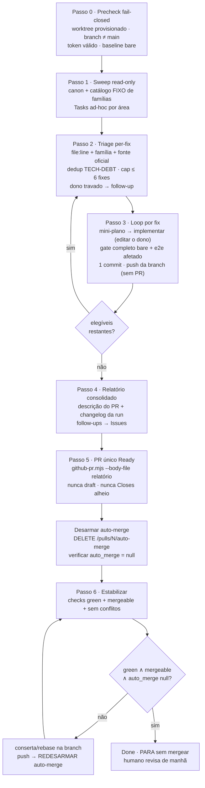

# Impl: Skill /react-audit com ciclo fechado plan→implement de anti-patterns React/Next.js

Status: em execução
Atualizado em: 2026-08-25
Issue: #901
Intenção: docs/plans/ops97-react-audit-skill.md
Appetite restante: herdado (~1,5–2 d eng)

## Leitura da intenção

- **Outcome:** skill funcional `.agents/skills/react-audit/SKILL.md` que roda sozinha (à noite, sem supervisão), varre o repo por anti-patterns **React/Next.js** (catálogo de famílias FIXO, cada achado com `file:line` + família + fonte oficial react.dev/nextjs.org), planeja e implementa cada fix com o gate completo do repo, e entrega **um único PR** para `main` — **ready, sem auto-merge, CI green, mergeable, sem conflitos** — com **um commit por fix** e **a descrição do PR como relatório consolidado**. A skill para aí: o humano explora e mescla de manhã.
- **O que NÃO negociar:** nada mergeia sem humano (nem armar auto-merge, nem flipar draft com checks verdes — ver decisão ii); catálogo fechado — achado sem `file:line` + família + fonte oficial **não vira fix**; fallback sem Context7 (MCP é aceleração, não requisito); precheck read-only antes de qualquer escrita; achado em dono travado (URLs públicas, Consent/LGPD, migrations shipped, collections) vira follow-up no relatório, não muda o PR; **sem migration e sem schema Payload** (tooling de desenvolvimento); fixes seguem "editar o dono, não twinar"; gate commands bare, nunca piped; `knip --fix` cego proibido; DB local only (`teqo_test`); nunca tocar Issues in-progress alheias nem claimar na sessão — a skill roda dentro do worktree já provisionado da run.
- **O que reavaliar:** a hipótese da intenção de que subagentes vivem em `.opencode/agent/*.md` — confirmado que lá só há agentes específicos (design-vision, penpot, postgres…); os subagentes da skill são **Tasks ad-hoc com prompt inline**, no padrão `work-issue` (input mínimo, "Não escrever código nem planos", output ≤25 linhas). A citação `codebase-map.mdc:26` na intenção aponta a lição client-boundary errada por um deslocamento — a lição B14 vive em `codebase-map.mdc:12` e `:33` (e `engineering-standards.mdc:22-28`). O shape exato do bloco `mcp remote` do Context7 é validado na execução com `opencode debug config` (OPS89/OPS92).

## Abordagem recomendada

Clonar o esqueleto operacional do `engineering-audit` (precheck fail-closed → canon → sweep por famílias fixas → triage com números) e trocar a cauda: onde o engineering-audit termina em ledger + PR Ready **com** auto-merge, o react-audit termina em **implementação + PR único ready SEM auto-merge**. O ciclo é: sweep read-only → triage per-fix (plano curto por fix) → loop de implementação com gate completo e um commit por fix → relatório consolidado → PR único com a descrição-relatório → desarme ativo do auto-merge → estabilização (CI green + mergeable + sem conflitos + `auto_merge = null`) → parar sem mergear.



### Decisões de engenharia

**(i) Onde mora o catálogo de anti-patterns**

```text
Opções: A) inline na SKILL.md | B) arquivo irmão na pasta da skill (.agents/skills/react-audit/anti-patterns.md) | C) só referência a engineering-standards.mdc / codebase-map.mdc
Recomendação: B — o catálogo é conhecimento volátil (amarra versões next 15.4.11 / react ^19.2.4 e URLs de docs oficiais) e grande (9 famílias × sintoma de busca + norma + fonte + receita + precedente); merece arquivo próprio carregado no Passo 1, mantendo a SKILL.md enxuta como máquina do ciclo. O catálogo CROSS-LINKA as normas canônicas (engineering-standards.mdc:22-28 client boundary, :29-32 loading feedback, :34-43 caching ladder; codebase-map.mdc:12 e :33 lição B14) em vez de as duplicar — a norma continua dona; o catálogo adiciona o que a norma não tem: heurística de busca, fonte oficial e receita de fix por família. Enumeração FECHADA: expandir o catálogo é PR próprio da skill, nunca edição in-run.
Alternativas rejeitadas: A porque infla o arquivo sempre-carregado da skill com conteúdo que só o Passo 1 usa e acopla fluxo estável a conteúdo que muda com versão; C porque os .mdc são alwaysApply (taxam TODA sessão) e não têm campos de auditoria (fonte oficial, sintoma, receita) — adicioná-los lá espalha conhecimento de audit num arquivo de convenções gerais.
```

**(ii) Mecanismo anti-auto-merge**

Contexto: `.github/workflows/agent-pr-ready-automerge.yml` dispara em TODA PR same-repo → `main` nos eventos `opened, reopened, synchronize, ready_for_review, converted_to_draft` e arma o auto-merge nativo (rebase, via `AUTOMERGE_PAT`) em PR não-draft não-`cursor/*`; draft não-`cursor/*` = veto. A branch protection exige o check-run literal `checks` verde com `enforce_admins: true`.

```text
Opções: A) abrir o PR Ready UMA vez, no fim, já estabilizado localmente, e desarmar o auto-merge após a abertura e após CADA push subsequente | B) manter o PR draft durante todo o trabalho (o safety net veta draft não-cursor), flipar para ready só no fim e desarmar em seguida
Recomendação: A — estruturalmente mais seguro. Os commits por fix são empurrados ANTES de qualquer PR existir (push de branch isolada não dispara workflow algum — resiliência sem risco); o PR nasce uma única vez, pronto, com CI frio ⇒ mesmo que o safety net arme em segundos, o merge espera o required check (janela de minutos, não de instantes) e o desarme idempotente (DELETE /repos/fsolla/teqo/pulls/N/auto-merge, 404 tolerado, verificar GET auto_merge = null) chega com folga. Regra dura da skill: TODO push pós-abertura (fix de CI vermelho, rebase) é imediatamente seguido do desarme + verificação — item de checklist obrigatório, nunca opcional; a condição final de Done inclui auto_merge = null.
Alternativas rejeitadas: B porque no momento do flip o required check JÁ está verde no SHA (estabilizamos no draft) ⇒ o evento ready_for_review arma o auto-merge e o servidor pode MERGEAR INSTANTANEAMENTE antes de qualquer DELETE — corrida de segundos com consequência inviolável (merge sem humano). Também rejeitada a variante ingênua de A (abrir a PR cedo e confiar num desarme único): cada synchronize re-arma silenciosamente, e defesa processualmente repetida numa madrugada sem supervisão é exatamente o tipo de guarda dodgeable que este repo aprendeu a rejeitar.
```

**(iii) Rastreamento per-fix ("plano impl + Issue trackeável")**

```text
Opções: A) criar uma Issue GitHub por fix aceito | B) rastrear só no relatório (descrição do PR) | C) híbrido — ledger per-fix no relatório como registro canônico + Issues reais APENAS para follow-ups que sobrevivem ao PR (dono travado, fix adiado, família recorrente pedindo guarda)
Recomendação: C. Cada fix ganha no relatório um bloco rastreável: ID curto, família, file:line, fonte oficial, decisão (planejado/implementado/rejeitado/adiado + porquê), gate resultado e SHA do commit — isso SATISFAZ "Issue trackeável" no sentido da intenção (todo fix tem identidade e trilha auditável), sem poluir a fila. Follow-ups que precisam sobreviver ao PR viram Issues de verdade no Passo 4, pelo caminho canônico (pnpm agent:register ou a API em scripts/lib/github-api.mjs), título prefixado "[react-audit]", prio coerente, body com file:line + fonte + link do PR — nascendo DE PROPÓSITO na fila, não de acidente.
Alternativas rejeitadas: A porque Issue criada às 3h nasce claimable na fila compartilhada e convida um agente paralelo a implementar o mesmo fix FORA do PR — geminação garantida e violação do ciclo fechado (além da higiene "nunca tocar Issues in-progress alheias": as Issues da run seriam consumidas por outros); B porque follow-ups morreriam dentro do body de um PR que pode ser fechado sem merge.
```

**(iv) Branch dos fixes**

```text
Opções: A) usar a branch do worktree provisionado da run | B) criar branch dedicada agent/<id>-react-audit dentro do worktree
Recomendação: A com guarda — o ambiente provisionado (portas 3100+slot, DBs teqo_wt<slot>/teqo_wt<slot>_test, .env.local/.env.test.local) pertence ao WORKTREE, não a um nome de branch; a skill herda a branch corrente do provisionamento (pnpm worktree next) e só cria agent/<N>-react-audit a partir de origin/main se estiver em main ou detached (guarda obrigatória do Passo 0: nunca commitar fix em main).
Alternativas rejeitadas: B porque cria segunda identidade para o mesmo trabalho (risco de divergência entre "a branch em que estou" e "a branch do PR") sem nenhum benefício — descoberta pelo humano é papel da notificação do PR e do título; rejeitado também rodar direto em main (coberto pela guarda).
```

### Componentes / mudanças

- **`.agents/skills/react-audit/SKILL.md`** (novo): frontmatter `name: react-audit` + `description` (ciclo fechado sweep→plan→implement→PR único ready sem auto-merge; pt-BR no corpo, formato igual aos pares). Seções no padrão do repo: **"Proibido"** (DB de prod/`ALLOW_REMOTE_DB`; mergear ou armar auto-merge; `Closes #N` de Issue alheia no PR da run; `knip --fix` cego; gate piped; expandir catálogo in-run; tocar Issue in-progress alheia; claimar na sessão; draft→flip), **Checklist** em code block `- [ ] 0..6`, passos `## Passo N`, **"Done when"** + resumo final. Conteúdo por passo:
  - **Passo 0 — Precheck fail-closed (read-only):** rodar dentro do worktree provisionado da run; `git status --porcelain` limpo; branch corrente ≠ `main` (senão criar `agent/<N>-react-audit` de `origin/main`); `GITHUB_TOKEN` presente e validado com chamada barata ANTES do trabalho (não às 3h); baseline bare de `pnpm exec tsc --noEmit`, `pnpm lint`, `pnpm exec knip`, `pnpm check:cycles` com vermelhos pré-existentes anotados como baseline (política "dono do PR, dono do CI" — `docs/AGENT-OPS.md`); nota: pool morto desde OPS65, nada a pausar.
  - **Passo 1 — Sweep read-only:** canon primeiro (`.agents/rules/engineering-standards.mdc`, `.agents/rules/codebase-map.mdc`, `AGENTS.md`, `docs/TECH-DEBT.md` para dedup); carregar `anti-patterns.md`; âncora de delta = data da última entrada react-audit em `docs/changelog/` (primeira run = repo inteiro); Tasks ad-hoc por família/área com prompt inline no padrão `work-issue` (input mínimo; "Não escrever código nem planos"; output ≤ 25 linhas: linhas `file:line + família + sintoma`); zero writes em `src/`, `tests/`, `scripts/`.
  - **Passo 2 — Triage per-fix:** cada candidato precisa dos TRÊS selos — `file:line`, família do catálogo, fonte oficial (URL react.dev/nextjs.org); faltou um → linha "observado sem fix" no relatório; dedup contra `docs/TECH-DEBT.md` (classe B14/P4-F aberta) e guardas vivas (ESLint restrictions, `tests/unit/codebaseConventions.unit.spec.ts`); dono travado → follow-up; priorizar churn × severidade; **cap duro ≤ 6 fixes por run** (protege appetite e a revisão matinal; resto vira follow-up/adiado).
  - **Passo 3 — Loop de implementação (por fix):** subagente escritor (Task) produz mini-plano per-fix (receita, blast radius, pins/testes a tocar, critério de feito) que vira seção do relatório; implementação com "editar o dono, não twinar" (contratos client-safe / `import type` ao cruzar fronteira); **gate completo BARE por fix**: `pnpm exec tsc --noEmit`, `pnpm lint`, `pnpm format:check`, `pnpm exec knip`, `pnpm check:cycles`, `pnpm test`, `pnpm build` + `pnpm test:e2e:affected` (discricionário, OPS72 — `gate:push` não roda e2e); exports órfãos resolvidos NO MESMO fix (`git grep -w <symbol>` antes de remover); **um commit por fix** (mensagem citando família + `file:line`); push da branch após cada commit (sem PR ainda ⇒ nenhum workflow dispara).
  - **Passo 4 — Relatório + follow-ups + changelog:** montar o relatório consolidado (i escopo/data/números do sweep, ii tabela de achados file:line+família+fonte, iii estado e porquê por fix, iv estado final do PR, v follow-ups com destino); gravar como body-file; criar Issues de follow-up (decisão iii); escrever a entrada da run em `docs/changelog/<data>-react-audit-run.md` (docs-guards: additions-only — nunca HISTORY nem agregado).
  - **Passo 5 — PR único + desarme:** `GITHUB_TOKEN=<PAT> node scripts/github-pr.mjs --head <branch> --title "react-audit <data>: N fixes" --base main --body-file <relatorio.md>` — nunca draft, **jamais `Closes/Fixes` de Issue alheia** (usar `Refs`); imediatamente desarmar: `disablePullRequestAutoMerge(n)` (novo helper) + verificar `GET auto_merge = null`.
  - **Passo 6 — Estabilizar até o fim:** poll do check-run literal `checks` do head SHA (API de check-runs; `gh pr checks` onde houver gh) com backoff; `mergeable` via `getPullRequest()` (`scripts/lib/github-api.mjs:177` — `null` = computando, re-poll; `false` = rebase sobre `origin/main` → push → **redesarmar**); CI vermelho dentro do blast radius dos fixes → consertar na branch; infra morta → relatório honesto e parada com estado declarado; **caps de tentativa/tempo** (ex.: 3 ciclos de fix pós-abertura ou 90 min) para não rodar infinito; **Done = checks green ∧ `mergeable === true` ∧ `auto_merge = null` ∧ PR open+ready → PARAR sem mergear**. Feedback humano posterior: pedidos de mudança caem na MESMA branch (commits novos, relatório atualizado via PATCH do body, re-estabilização).
- **`.agents/skills/react-audit/anti-patterns.md`** (novo): catálogo FIXO, uma seção por família com `Sintoma/heurística de busca`, `Norma no repo` (âncora nos .mdc), `Fonte oficial` (URL react.dev/learn, react.dev/reference, nextjs.org/docs, nextjs.org/learn — conferidas contra next 15.4.11 / react ^19.2.4), `Receita de fix`, `Precedente` (B14 ~21 kB sidebar, B34 closures/fallbacks obsoletos, B32+ live-region, C139/C140 reset de form React 19 em `docs/plans/react-19-form-reset-campanha.md`, P4-F). Famílias fechadas (9): (1) client boundary/server-first (`'use client'` desnecessário, import de server module por VALOR, estado elevado além dos consumidores, view models não selecionados); (2) RSC payload bloat (doc Payload inteiro no fio); (3) effects fazendo derived-state / stale closures (B34); (4) forms & server actions (reset `action={submitAction}`, transição ausente, optimistic sem `revalidatePath`); (5) caching ladder (live data sem invalidação, auth dentro do core cacheado); (6) URL serializers chegando ao browser (B14); (7) live-region mistakes (B32+); (8) loading/streaming feedback (dim o resultado, não o controle; `<Suspense>`/`loading.tsx`); (9) next/image + fonts + a11y de componentes.
- **`.agents/skills/react-audit/context7-setup.md`** (novo): passo MANUAL do dono — declarar o MCP globalmente FORA do git em `~/.config/opencode/opencode.jsonc` (bloco `mcp` remote `https://mcp.context7.com/mcp`), validar com `opencode debug config`; deixado claro que a skill funciona sem (fallback = links oficiais embutidos no catálogo); o executor valida o shape vigente do bloco ao escrever o doc.
- **`scripts/lib/github-api.mjs`** (editar o dono — é o dono do acesso REST GitHub): adicionar `disablePullRequestAutoMerge(number)` (DELETE `/repos/{owner}/{repo}/pulls/{number}/auto-merge`, tolerando 404) e expor `auto_merge` no retorno de `getPullRequest`; reuso integral do que já existe (`createIssue`/`listIssues` para follow-ups, `mergeable` para estabilização). Único código novo da entrega; sem twin em curl/scripts avulsos.
  - **Errata de execução (2026-08-25):** o mecanismo acima foi superseded pelo dogfood #905 — o endpoint REST DELETE responde **404 mesmo com auto-merge armado via GraphQL**, e o armar do safety net é assíncrono (um desarme único perdeu a corrida). Entregue no lugar: `disableAutoMerge(nodeId)` por mutation GraphQL `disablePullRequestAutoMerge` (simétrica ao `enableAutoMerge`) + `ensureAutoMergeDisabled(number)` com laço desarme→re-poll até `auto_merge = null`, fail-closed em PR inexistente.
- **Migration:** sem migration. **Access/Consent:** N/A (nenhuma collection/global tocada; fixes de produto continuam sujeitos às regras normais quando tocarem essas áreas — aí viram follow-up, não fix noturno). **UI:** Impeccable A — N/A sem UI.

### Dados → forma (se aplicável)

N/A — tooling de desenvolvimento, sem dado de negócio (herdado da intenção).

## Fases verificáveis

1. **Tracer — catálogo + sweep (≈0,5 d):** `anti-patterns.md` v1 (9 famílias com fontes conferidas nas versões reais do `package.json`) + `SKILL.md` Passos 0–2. **Verificação:** executar Passos 0–2 neste repo produz tabela de triage com ≥ 1 candidato real (`file:line` + família + fonte) e **zero writes** fora de `docs/`/`.agents/`.
2. **Ciclo fechado (≈0,75 d):** Passos 3–5 + helper `disablePullRequestAutoMerge` em `scripts/lib/github-api.mjs`. **Verificação:** dogfood com cap = 1 — um fix real pequeno elegível pelo próprio sweep, ciclado inteiro numa branch scratch (`agent/ops97-dogfood-react-audit`), resultando em PR Ready **sem auto-merge** (`auto_merge = null` verificado via GET) com o check `checks` disparado; o PR fica para o humano — a skill não mergeia nada. Se o sweep não achar nada elegível (legítimo), dogfood com um commit docs-only pelo mesmo caminho mecânico.
3. **Estabilização + endurecimento (≈0,25 d):** Passo 6 (loop CI/mergeable/redesarme + caps), `context7-setup.md`, changelog da entrega.
4. **Gates e PR da entrega OPS97:** `pnpm gate:fast`; push via `pnpm push`; PR da **entrega** segue o fluxo NORMAL do repo (Ready + auto-merge permitido — a restrição "sem auto-merge" vale para as RUNs da skill, não para o PR que a constrói); changelog `docs/changelog/2026-08-25-ops97.md`.

## Rabbit holes / Não escopo (engenharia)

- **Expandir o catálogo in-run** ("achei uma 10ª família à noite"): achado fora das 9 famílias vira linha de relatório/follow-up; expansão de catálogo é PR próprio e deliberado da skill.
- **Virar segundo engineering-audit:** smells gerais de Fowler, consolidation hunt e guardrails de miss permanecem lá; react-audit só as 9 famílias React/Next.
- **Guarda determinística por fix** (doutrina do Passo 4b do engineering-audit): fora do appetite desta entrega; família recorrente entre runs → follow-up de guarda via capture-review-debts.
- **Issues claimables por fix:** decisão (iii)-A rejeitada — polui a fila e convida geminação fora do PR.
- **Automatizar/depender do Context7:** config global é manual do dono (`context7-setup.md`); skill nunca bloqueia sem MCP.
- **Draft→flip no fim:** decisão (ii)-B rejeitada — corrida de instant-merge com checks já verdes.
- **`knip --fix` cego e gates piped:** herdados como proibições absolutas.
- **e2e full local / migrations / schema Payload:** `gate:push` não roda e2e (afetado apenas, discricionário); esta entrega não toca schema — fix de produto que exija migration vira follow-up planejado, nunca commit noturno.
- **Relatório como arquivo substituindo a descrição:** a descrição do PR É o relatório; arquivo em `docs/` é no máximo adicional, nunca substituto.
- **Rodar fora do worktree provisionado / claimar na sessão / tocar Issue in-progress alheia:** proibidos; a skill assume provisionamento prévio.
- **Cap de fixes estourar:** ≤ 6 por run, inegociável — PR maior derrota a revisão matinal commit a commit.

## Riscos e mitigação

- **Safety net re-armer o auto-merge a cada `synchronize`** (crítico — é o comportamento projetado do `agent-pr-ready-automerge.yml`): desarme idempotente é passo obrigatório PÓS-CADA-PUSH (não só pós-abertura); Done só com `auto_merge = null` verificado; PR aberto uma única vez, já estabilizado localmente, minimizando pushes pós-abertura.
- **Corrida de instant-merge:** estruturalmente evitada — nunca draft→flip (decisão ii); PR Ready nasce com CI frio (janela de minutos para o desarme, não segundos).
- **CI vermelho por causa alheia aos fixes:** política "dono do PR, dono do CI" com limite declarado — conserta se dentro do blast radius dos fixes; infra/estrutural → caps de tentativa/tempo, relatório honesto, parada com estado declarado (nunca fingir Done).
- **`mergeable = null` transitório** (GitHub computando): backoff e re-poll antes de decidir conflito.
- **Conflito com agente paralelo de madrugada:** risco baixo (pool morto desde OPS65); precheck lê Issues in-progress abertas e evita território ocupado; fixes concentram-se no delta desde a última run.
- **PAT ausente/sem escopo descoberto às 3h:** Passo 0 valida `GITHUB_TOKEN` com chamada barata ANTES de qualquer trabalho.
- **Fix órfã exports → knip ERROR:** resolução no mesmo fix com `git grep -w <symbol>`; nunca `--fix` cego.
- **docs-guards (additions-only no pre-push E no CI):** cada run adiciona SEU arquivo de changelog; jamais tocar `CHANGELOG-AGENTS-HISTORY.md` ou o agregado.
- **Context7 indisponível:** fallback a links oficiais do catálogo; degradação silenciosa, nunca falha.
- **Sweep achar pouco/nada:** outcome legítimo — relatório registra; dogfood cai para o caminho docs-only; a skill não inventa achado para justificar o run.

## Aceite de engenharia

- [ ] Aceite de produto da intenção ainda coberto — mapa: sweep focado com file:line+família+fonte → Passos 1–2; fix com gate completo e commit próprio → Passo 3; PR único ready sem auto-merge/mergeable/sem conflitos → Passos 5–6; commits separados por fix → Passo 3; descrição do PR = relatório (i–v) → Passo 4; funcional sem Context7 + setup manual documentado → catálogo + `context7-setup.md`; só termina com PR estável → condição de Done do Passo 6.
- [ ] Invariantes AGENTS/engineering-standards — gates bare nunca piped; `knip` sem `--fix`; DB local only (`teqo_test`); "editar o dono, não twinar" (único código novo é o helper no dono REST); sem migration/schema; identificadores em inglês e copy pt-BR; changelog por entrega (additions-only); LGPD/Consent e URLs públicas intocados (achado nelas = follow-up).
- [ ] Testes de domínio previstos — N/A para access/write paths (nada muda); smoke do helper `disablePullRequestAutoMerge` exercitado no dogfood da Fase 2 contra PR real; validação fim-a-fim da skill é a própria execução dogfood (PR real, `auto_merge = null` verificado, checks disparados, nada mergeado).

---

### Self-score decision-quality (gate ≥ 4)

1. Decisões caras têm rejeitadas? — **5** (quatro decisões nomeadas com alternativas rejeitadas; o mecanismo anti-auto-merge foi escolhido por análise de corrida, não por gosto).
2. Abordagem cabe no appetite da intenção? — **4** (fases somam ≈1,5–2 d; cap duro ≤ 6 fixes/run e dogfood cap = 1 impedem o sweep de inflar o ciclo).
3. Rabbit holes nomeados? — **5** (11 itens, cada um com corte explícito).
4. Depth check: reusa shells/helpers existentes? — **5** (esqueleto do engineering-audit, `scripts/github-pr.mjs`, `scripts/lib/github-api.mjs`, `gate:fast`/`gate:push`, padrão de Tasks do work-issue, dedup em TECH-DEBT; código novo = 1 helper no dono).
5. Intenção (aceite de produto) permanece satisfeita? — **5** (nenhum aceite reescrito; todas as decisões são mecanismo — onde mora o catálogo, como impedir merge de bot, como rastrear fix, qual branch — nunca outcome).

**Média 4,8 ≥ 4** — apto a marcar `aprovado` e executar.
