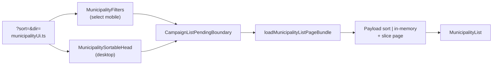

# B15 — Ordenar lista de municípios pelo header da coluna

Status: entregue
Atualizado em: 2026-07-24
Item do roadmap: [docs/roadmap.md](../roadmap.md) (Demais itens abertos, B15; superfície de coordenação)
Impeccable: B — encaixe em `MunicipalityList` / `MunicipalityFilters` em `/campanha/municipios`; sem rota nova
Appetite: ~0,5–1 dia eng; URL `sort`/`dir` + headers clicáveis + apply no loader; sem migration, sem collection, sem Consent
Responsável: —

## Design (Impeccable)

Âncoras: `PRODUCT.md` (princípios 2 — clareza sob pressão — e 8 — Feel the action) / `DESIGN.md` (register `product`; Field Desk) · tema `data-theme='campaign'` · shells `CampaignPageShell`, `CampaignListPendingBoundary`, shadcn `Table`.

Na implementação (`implement-roadmap-item`): craft compacto → critique → polish.

Brief compacto:

- **Persona / contexto:** Alex (CG / Assessor / Candidato) na lista de até 435 municípios, montando um recorte e precisando **ver quem fica no topo** por uma coluna (votos estimados, frescor, cobertura) sem sair da tabela.
- **Job principal:** um clique no header reordena a lista (e a paginação) por aquela coluna; segundo clique inverte a direção.
- **Estratégia de cor:** Restrained — indicador de sort sóbrio (`aria-sort` + ícone Chevron), sem heatmap na header.
- **Edit where you see:** não — só leitura/navegação da ordem; células editáveis (B9) permanecem; sort não vira modo planilha.
- **Anti-goals:** data-grid / spreadsheet mode; lib de tabela nova; sort só na página corrente (mentiroso); select "Ordenar por" como affordance principal no desktop (header é o padrão).

## Dados → decisão → apresentação

- **Vou apresentar dados?** Sim, superfície neste item — a tabela já existente; este item só controla a **ordem** (não inventa métrica).
- **Decisões desbloqueadas:**
  - Staff: "quais municípios do meu recorte têm menos votos estimados / estão sem atualização / sem assessor — atacar primeiro?"
  - Staff: "ordenar por nome/TI para achar rápido no recorte filtrado?"
- **Forma escolhida:** **tabela / lista ranqueada** (já é a forma) + affordance de sort no header — **por quê:** comparar muitas entidades por uma coluna é exatamente o degrau tabela. **Rejeitado:** chart de ranking; segundo painel "top N"; sort client-only da página atual (ordem global falsa).
- **Profile:** categórico + numérico + temporal na mesma tabela; granularidade = município operacional; tamanho típico = página de 25 sobre filtro ≤435; absoluto vs relativo inalterado (A11/`votos` entra depois).
- **Anti-goals de dado:** sem % estadual; sem reordenar o mapa por este `sort` (mapa tem outro job; filtro de lista já o restringe via B7).

Self-check dados: 5/5.

## Contexto

Em `/campanha/municipios`, `MunicipalityList` (`src/components/campaign/MunicipalityList.tsx`) renderiza headers estáticos (`Praça`, `Território de identidade`, `Tipo`, e no staff `Assessores`, `Tendência`, `Votos estimados`, `Última atualização`, `Cobertura`). O loader (`loadMunicipalityListPageBundle` em `municipalityPageData.ts`) pagina com `sort: 'name'` fixo. Filtros já vivem na URL via `MunicipalityListState` / `campaignListUrl.ts` (`q`, `region`, `kind`, `coverage`, `priority`, `trend`, `page`) — **não há** `sort`/`dir`.

**A11** ([ranking-votos-municipio.md](ranking-votos-municipio.md)) propõe `?sort=votos` via select nos filtros (lente de concentração da própria votação). Sem um contrato de ordenação por coluna, A11 e depois **E9** reinventam o mesmo estado. Este item entrega o contrato + a UX de header; A11 só acrescenta a chave `votos` (e a coluna/leitura de rank).

Pedido de produto (2026-07-24): reordenar a tabela ao clicar no header da coluna.

## Objetivos

- Headers clicáveis na tabela desktop de `/campanha/municipios` para as colunas sortáveis; `aria-sort` + indicação visual da coluna/direção ativas.
- Estado canônico na URL: `?sort=<key>&dir=asc|desc` (omitir defaults), integrado a `parseMunicipalityListParams` / `buildMunicipalityListHref` / `resolveMunicipalityListUrl` (params desconhecidos continuam a redirecionar).
- Ordenação **global no conjunto filtrado** (não só a página 25) + paginação coerente; reset de `page` para 1 ao mudar `sort`/`dir`.
- Pending honesto via `CampaignListPendingBoundary` / transição já usada pelos filtros (Feel the action).
- Mobile (cards): mesma ordem via URL; affordance compacta "Ordenar" no disclosure de `MunicipalityFilters` (sem fingir headers em cards).
- Guardrails: **sem migration**, sem collection, sem Consent, sem server action; leader segue sem a página (redirect); access inalterado (`overrideAccess: false`).

## Decisões travadas

- **Contrato URL `sort` + `dir` (não só `sort=-campo`).** Keys estáveis em inglês; `dir` explícito `asc|desc`. Defaults omitidos na URL: `sort=name` + `dir=asc` (comportamento atual). **Rejeitado:** Payload-style `-name` só na query (opaco p/ toggle e p/ A11/`votos`); sort só em state client sem URL (quebra share/back); cookie/localStorage de preferência (surpresa entre atores/dispositivos).
- **Affordance principal = clique no header (desktop); select compacto no mobile.** Mesmo builder de href. **Rejeitado:** só select "Ordenar por" no desktop (A11 rascunhou isso — insuficiente p/ multi-coluna e piora a descoberta); client-side DataTable sem RSC (mente a paginação e compete com B9).
- **Chaves v1 (coluna → key):** `name` (Praça), `region` (TI), `kind` (Tipo), `trend` (Tendência), `expectedVotes` (Votos estimados — cenário **central**), `lastUpdateAt` (Última atualização), `coverage` (Cobertura = tem assessor). **Assessores não é sortável na v1** (célula é editor B9; ordenar por nome/contagem é ambíguo). **Rejeitado:** sort por cada assessor individual; sort por `priority` sem coluna dedicada (já há filtro `?priority=alta`).
- **Apply: Payload `sort` quando o campo é nativo; in-memory sobre o conjunto filtrado quando derivado.** `name` / `region` / `kind` / `lastUpdateAt` / `politicalTrend.status` via `payload.find({ sort })`. `expectedVotes` (group → central) e `coverage` (existência/contagem de advisors): carregar o filtrado (`pagination: false` ou reusar docs do `loadMunicipalityScope` no path staff), ordenar, fatiar a página — ≤435 linhas, aceitável. **Rejeitado:** sort só dos 25 da página; PostGIS/SQL custom neste item; materializar colunas derivadas.
- **Toggle:** 1º clique numa coluna aplica direção default (texto/`name`/`region`/`kind`/`trend`/`coverage` → `asc`; `expectedVotes`/`lastUpdateAt` → `desc`); 2º clique na mesma inverte `dir`. **Rejeitado:** ciclo de 3 estados voltando ao default (mais difícil de explicar); sempre `asc` no 1º clique em números (esconde o pior/mais recente).
- **i18n e naming:** `MunicipalityListSortKey`, `municipalityListSortDefaults`, `MunicipalitySortableHead`, `buildMunicipalitySortHref`, `applyMunicipalityListSort`; labels pt-BR inalterados; `aria-label` do botão do header em pt-BR (ex. "Ordenar por votos estimados").

## Questões em aberto

- **Nulls / sem valor (sem tendência, sem `lastUpdateAt`, sem `expectedVotes`)?** **Opções:** A) sempre no fim | B) sempre no início | C) tratar como 0 / data mínima. **Recomendação:** **A** (nulls last em qualquer `dir`) — evita "Sem atualização" conquistar o topo em `desc`. _(assumido — validar no craft)_
- **Renomear header "Praça" → "Município" neste item?** **Opções:** A) sim de passagem | B) deixar para R6. **Recomendação:** **B** — copy da remodelagem é lote visual R6; não misturar com sort.
- **Espelhar sort por header em outras listas (apoiadores, lideranças)?** **Opções:** A) neste item | B) fill-ins sob demanda | C) never. **Recomendação:** **B** — 1 call site; extrair `SortableTableHead` só se o 2º consumidor aparecer (depth check).

## Abordagem proposta

Componentes:

- **`municipalityUi.ts`**: estender `MunicipalityListState` com `sort?: MunicipalityListSortKey` e `dir?: 'asc' | 'desc'`; allowlist em `municipalityListParamNames`; parse/build/canonical omitindo defaults; helper `buildMunicipalitySortHref(state, nextKey)` (toggle dir / default dir / `page: 1`).
- **`MunicipalitySortableHead`** (em `src/components/campaign/`, client leve ou Link+transition): botão/`Link` no `TableHead` com `aria-sort`, ícone, `useTransition` + pending da lista (reusar padrão dos filtros — **não** inventar segundo pending).
- **`MunicipalityList.tsx`**: receber `state` (ou `sort`/`dir` + builder); trocar headers estáticos pelos sortáveis; cards mobile inalterados na estrutura.
- **`MunicipalityFilters.tsx`**: control compacto "Ordenar" visível em `md:hidden` (ou sempre no disclosure mobile) espelhando as mesmas keys; desktop pode omitir o select.
- **`municipalityPageData.ts`**: map key→Payload sort string; branch in-memory para `expectedVotes`/`coverage`; unit tests do comparator puro (extrair `compareMunicipalityListRows` em `src/lib/` ou util puro se ficar testável sem Payload).
- **Sem migration, sem collection, sem server action.**

## Dependências

- Nenhuma dura de outro item aberto. Reusa `campaignListUrl.ts`, bundle A9+ (`loadMunicipalityScope` / lista), B9 (células editáveis coexistindo), pending do hardening.
**Suaves (consumidores):** **A11 ✓** já adicionou keys `name`|`votos` + coluna/leitura sobre este contrato (2026-07-24); **B15** amplia as keys restantes (`region`, `kind`, `trend`, `expectedVotes`, `lastUpdateAt`, `coverage`) e unifica headers. **E9** depois adiciona `deficit` / risco-frescor na fila.

## Não escopo

- Lente rank/% da própria votação e key `votos` → [A11](ranking-votos-municipio.md).
- Fila de alocação / ordenação por déficit → [E9](fila-de-alocacao.md).
- Critique/polish amplo e rename Praça→Município na UI → R6.
- Sort em apoiadores / lideranças / organizações (fill-in futuro).
- Reordenar features do mapa por `?sort=` (mapa não é esta tabela).

## Rabbit holes

- **Spreadsheet / data-grid mode.** Header sort ≠ editar grade; não puxar TanStack Table / reorder de colunas / resize. **Mitigação:** só `TableHead` botão + URL; B9 continua Popover por célula.
- **Abstrair `useSortableList` / factory multi-lista cedo.** Um call site. **Mitigação:** helper de href + comparator locais; extrair no 3º consumidor.
- **Sort client-only da página atual “porque é mais rápido”.** Mente o ranking global. **Mitigação:** decisão travada de apply no loader.
- **Optimistic reorder sem refresh.** Lista é fonte da verdade RSC. **Mitigação:** transition + dim de resultados; anti-goal "optimistic list without refresh" (`campanha-action-feedback`).

## Adiado com gatilho

- **Coluna Assessores sortável (por contagem ou nome do 1º).** Revisitar quando: pedido explícito da mesa ou A11/E9 exigirem desempate por rede.
- **Select "Ordenar por" no desktop** além do header. Revisitar quando: discovery mostrar que o header não é descoberto (improvável) ou A11 quiser atalho sem coluna ainda visível.
- **Shared `SortableTableHead` em `components/ui`.** Revisitar quando: 2ª lista de `/campanha` pedir o mesmo padrão.

## Referências

- `docs/roadmap.md` (B15) · [ranking-votos-municipio.md](ranking-votos-municipio.md) (A11 — consome contrato) · [fila-de-alocacao.md](fila-de-alocacao.md) (E9) · [filtros-auto-pracas.md](filtros-auto-pracas.md) (URL + pending) · [edicao-rapida-lista-pracas.md](edicao-rapida-lista-pracas.md) (B9 — coexistência)
- `src/components/campaign/MunicipalityList.tsx`, `MunicipalityFilters.tsx`, `CampaignListPending.tsx`
- `src/utilities/municipalityUi.ts`, `municipalityPageData.ts`, `campaignListUrl.ts`, `municipalityViewModels.ts`
- AGENTS.md — naming; Campaign auth / staff vs leader; engineering-standards (pending, zero warnings)
- `PRODUCT.md` / `DESIGN.md` — Field Desk; Feel the action; anti SaaS-grid

## Notas de implementação (2026-07-24)

- **Fase 1 (contrato URL):** `MunicipalityListState` ganhou `sort`/`dir`; `municipalityListParamNames` inclui as novas chaves; `parseMunicipalityListParams` e `buildMunicipalityListSearchParams` validam e omitem defaults (`sort=name`, `dir=asc`); `buildMunicipalitySortHref` toggles a direção e reseta `page` para 1. Incluída `votos` na allowlist para desbloquear A11.
- **Fase 2 (loader):** `loadMunicipalityListPageBundle` aplica Payload `sort` para `name`, `region`, `kind`, `lastUpdateAt` e `politicalTrend.status`; para `expectedVotes`, `coverage` e `votos` carrega o filtrado completo, ordena em memória com nulls-last e tie-break por `name`, depois fatia a página. **A11 (2026-07-24):** `votos` passa a ordenar pelo rank/share real (`municipalityVoteRank` + `compareMunicipalityVotesForSort`), não mais stub por `name`.
- **Fase 3 (desktop):** `MunicipalitySortableHead` em `MunicipalityList.tsx` substitui os headers estáticos; usa `CampaignTransitionAnchor` para participar do pending compartilhado, expõe `aria-sort` e ícone de direção. A coluna `Assessores` permanece não sortável (editor B9). A prop `state` foi acrescentada a `MunicipalityListProps` e passada pela página.
- **Fase 4 (mobile):** select compacto "Ordenar" em `MunicipalityFilters.tsx`, visível apenas abaixo de `md`, espelhando as mesmas keys/direções; cards seguem a mesma ordem da URL.
- **Fase 5 (verificação):** `tsc --noEmit`, `pnpm lint`, `pnpm test`, `pnpm build` e Aikido passaram; knip não introduziu dead code novo. Ajuste em `tests/unit/campaignComponents.unit.spec.ts` para fornecer `state` e envolver `MunicipalityList` em `AppRouterContext` mock (necessário porque o sort header usa `useRouter`).
- **Decisões em aberto resolvidas:** nulls são sempre colocados no fim (com tie-break por nome) para `expectedVotes` e `coverage`; header "Praça" não renomeado (R6); `SortableTableHead` compartilhado não extraído (apenas 1 call site).

## Notas de `/simplify` (2026-07-24)

Após a entrega, os subagentes [Simplify code quality review](ef351fb2-d3b3-45ff-ae9a-ef9e66479e7f), [Simplify performance review](3892a1e5-0e97-4d23-85d7-0b7d17237b27) e [Simplify reuse review](cf39ade5-d339-4f1a-9e6b-ef4b6ffd85a5) revisaram o escopo. Os ajustes aplicados no mesmo dia foram:

- `src/utilities/municipalityPageData.ts`: os três comparadores (`sortByExpectedVotesCentral`, `sortByAdvisorCoverage`, `sortByNameFallback`) foram unificados em `sortByNullableValue` com tie-break por nome via `localeCompare('pt-BR')`; os dois ramos `payload.find` nativo/derivado foram unificados num único objeto de opções com `sort`/`limit`/`page` condicionais; `votos` passou a usar `payloadSortFieldByKey.votos = 'name'` para evitar full-scan desnecessário.
- `src/utilities/municipalityUi.ts`: adicionados `formatMunicipalitySortOptionLabel`, `municipalityListSortOptions`, `serializeMunicipalitySortValue` e `parseMunicipalitySortValue`, centralizando as labels e a serialização `key|dir` do select mobile.
- `src/components/campaign/MunicipalityFilters.tsx`: removeu `formatSortOptionLabel`/`sortOptions` locais e a type assertion `as [MunicipalityListSortKey, 'asc' | 'desc']`; passou a usar os helpers de `municipalityUi.ts` com parse validado.
- `src/components/campaign/MunicipalityList.tsx`: `advisorEntries`/`advisorNames` saíram do corpo do componente para funções de nível superior (recebendo `advisorNamesById`); o ícone de chevron foi simplificado para uma única renderização de `ChevronDownIcon` com `-rotate-180` para ascendente; `MunicipalityList` voltou a implicit JSX return.
- `tests/unit/campaignComponents.unit.spec.ts`: `mockAppRouter` passou a usar `stub<T>` em vez de `as unknown`.

Itens avaliados mas não aplicados (fora de escopo do `/simplify`):

- **Full-scan em sorts derivados:** `expectedVotes` e `coverage` ainda carregam todo o filtrado porque os campos não são diretamente sortáveis no Payload. Até 435 linhas é aceitável; se a tabela crescer ou o filtro se tornar muito permissivo, reabrir com índice/materialização.
- **Passar `sort`/`dir` em vez de `state` para `MunicipalitySortableHead`:** manter `state` evita prop-drilling extra; se o componente for promovido/reutilizado, reavaliar.
- **Generalizar `buildMunicipalitySortHref` para `campaignListUrl.ts`:** só existe um call site; extrair no segundo consumidor.
