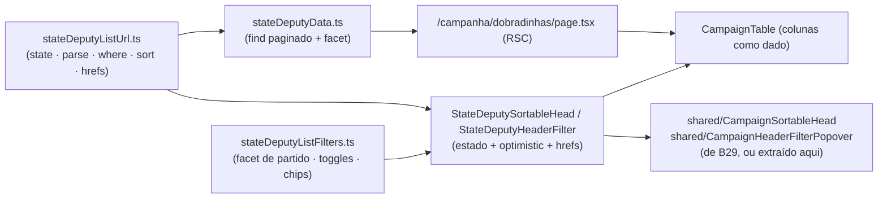

# B33 — Ordenação e filtro no header da lista de dobradinhas

Status: entregue em código
Atualizado em: 2026-07-26
Item do roadmap: [docs/roadmap.md](../roadmap.md) (Trilha B — superfícies de coordenação, item B33)
Impeccable: B — encaixe em tela existente (`/campanha/dobradinhas`), sem rota nova; consome o header rico compartilhado entregue pelo **B21 ✓**
Appetite: ~0,5–0,75 dia eng; `shared/CampaignSortableHead`/`CampaignHeaderFilterPopover` já existem
Responsável: —

**Atualização B21 (2026-07-25):** a corrida de ordem de chegada foi encerrada. B33 não extrai nem duplica chrome; implementa somente `StateDeputySortableHead`/`StateDeputyHeaderFilter` e seus módulos de URL/filtros.

## Revisão na entrega (2026-07-26)

Auditoria do plano contra o repositório antes de codar achou cinco divergências, todas corrigidas na implementação (não no plano, que fica congelado como registro da decisão original):

1. **`leadershipListUrl.ts` não existe** (B29 não entregou) — espelhado `municipalityListUrl.ts` (paginação, clamp via `resolveListUrl`) e `territoryListUrl.ts` (chaves/labels de sort) em vez de um módulo inexistente.
2. **Ordem dos nulos em `party` não é "nulls por último em ambas as direções"** — pinado por int test o comportamento real do adapter Postgres/Payload: ASC ordena nulls por último, DESC ordena nulls primeiro. O caminho direto para achar as fichas sem partido continua sendo o filtro "Sem partido" (`party: { exists: false }`), não a posição na ordenação.
3. **Paridade mobile entrou** (decisão desta sessão, +~0,25d sobre o appetite) — `StateDeputyFilters.tsx` espelha `TerritoryFilters.tsx`: busca com debounce, resumo de filtros + "Limpar", bloco `md:hidden` com `CampaignMobileMultiFilterField` (Partido) e `NativeSelect` "Ordenar".
4. **`parseStateDeputyListParams` saiu do `describe.each` compartilhado** de `tests/unit/campaignEntityListParsers.unit.spec.ts` (cresceu um contrato de sort/filtro próprio) e ganhou spec dedicada em `tests/unit/stateDeputyListUrl.unit.spec.ts`.
5. **Redirect canônico em duas fases** (`resolveStateDeputyListUrl(params)` → carrega `totalPages` → `resolveStateDeputyListUrl(params, totalPages)`) implementado no molde de `municipios/page.tsx`, evitando `?page=9` fora do range.

**Correção pós-entrega (2026-07-26, achada por design review independente):** dois defeitos reais — `StateDeputyFilters` (mobile) montava as opções de "Partido" só a partir da faceta, sem a sentinela "Sem partido" que o popover desktop já injetava (`hasNoParty`), então um usuário só-mobile não conseguia filtrar/desmarcar esse valor mesmo vendo-o no resumo de filtros ativos; e `CampaignTable` não recebia `caption` nesta lista, ao contrário dos dois precedentes citados no plano (`MunicipalityList`/`TerritoryList` sempre populam esse prop) — um usuário navegando por landmark de tabela (leitor de tela) não tinha nome/descrição acessível. Ambos corrigidos no mesmo padrão dos precedentes (`hasNoParty` propagado a `StateDeputyFilters`, `caption={sortSummary + descrição}` na tabela); copy do empty state também corrigida de singular ("a dobradinha") para plural ("as dobradinhas"). Gate verde de novo (tsc, lint, format, check:cycles, 396 testes, build); Aikido 0 achados nos 2 arquivos tocados.

**`/simplify` (2026-07-26):** três agentes de revisão paralelos (qualidade, performance, reuso) apontaram a mesma duplicação de fundo — a linha sentinela "Sem partido" era montada separadamente em `StateDeputyFilters` e `StateDeputyHeaderFilter` (a correção pós-entrega acima copiou a lógica em vez de compartilhá-la). Extraído `buildStateDeputyPartyOptions` em `stateDeputyListFilters.ts`, consumido pelos dois; `noPartyFilterLabel` deixou de ser exportado (só usado internamente agora). Outras três limpezas pontuais: `StateDeputySortableHead` derrubou o discriminante `filterParam: 'party'` — só há uma coluna filtrável, então a presença de `filterOptions` já basta (ao contrário de Territory, que tem duas); `parsePartiesParam` parou de reimplementar dedupe que `allParamValues` já faz; `buildStateDeputyListWhere` perdeu um `if (partyFilters.length)` sempre-verdadeiro (todo `parties` não vazio produz ao menos um filtro nomeado ou a sentinela). Performance: `loadStateDeputyListPageData` ganhou `select: { name, slug, party }` na query principal (a lista já projetava a faceta assim; a query da página não). Gate reverificado verde (tsc, lint, format, check:cycles, 396 testes, build); Aikido 0 achados nos 7 arquivos tocados. Recomendações descartadas por serem debate estilístico ou fora de escopo: inlinear `defaultStateDeputyListSortDir`/`firstPartyNamesLabel` (mantidos por paridade com `territoryListUrl`/`territoryListFilters`); `Set` em vez de `.includes()` no loop de contagens (pré-existente, não tocado por este item); agregado SQL para o facet de partido (só compensa em escala, travado como Adiado com gatilho).

**`/simplify` pós-rebase (2026-07-26, 2ª rodada):** rodada nova pedida após `/rebase-on-main`, sobre o commit já squashado. Três achados de qualidade corrigidos: `StateDeputyPartyRow` (`Pick<StateDeputy, 'party'>`) era um tipo + cast morto em `stateDeputyData.ts` — `result.docs` já vem tipado `StateDeputy[]`, `select` só afeta o runtime, não a checagem estática; removido. `stateDeputyColumns` (`page.tsx`) redeclarava `Array<{ value: string; label: string }>` em vez de importar `StateDeputyFilterOption`, já exportado por `stateDeputyListFilters.ts`. `parsePartiesParam` era um helper de uma linha usado uma única vez — inlineado no call site. Um achado de reuso maior: `firstPartyNamesLabel` (aqui) era a **terceira** cópia byte-idêntica da mesma função de truncar nomes (`firstTerritoryNamesLabel` em `territoryListFilters.ts`, `firstNamesLabel` em `municipalityListFilters.ts`) — cruzou o limiar de "3+ call sites" do `engineering-standards.mdc`. Extraído `truncatedNamesLabel` em `campaignListUrl.ts` (o módulo-base que os três arquivos de filtro já importam) e os três call sites migrados; nenhuma das duas listas irmãs precisou de mudança de comportamento. Performance: zero achados (dataset de dezenas de linhas, tudo já em `Promise.all`/`select` estreito da rodada anterior). Recomendação descartada por exigir refatoração muito maior que este item: o reuse reviewer também achou que `StateDeputyFilters`/`TerritoryFilters`/`MunicipalityFilters` reimplementam o mesmo scaffold de busca debounced + navegação (~50 linhas cada) — candidato a um hook compartilhado (`useCampaignListFilterNavigation`), mas tocaria os três domínios fora do escopo deste item; registrado aqui para um fill-in futuro, não perseguido agora. Gate reverificado verde (tsc, lint, format, check:cycles, 396 testes, build); Aikido 0 achados nos 7 arquivos tocados nesta rodada.

**Entregue:** `src/utilities/stateDeputyListUrl.ts` + `stateDeputyListFilters.ts` (contrato de URL/filtro, sentinela `NO_PARTY_FILTER_VALUE` para "Sem partido"); `stateDeputyData.ts` com `where`/`sort` resolvidos e facet de partido (`loadStateDeputyPartyFacet`, mesmo contrato de `loadMunicipalityListFilterFacets` — respeita a busca, ignora o próprio filtro do popover); `StateDeputySortableHead`/`StateDeputyHeaderFilter`/`StateDeputyFilters` (client, wrappers finos sobre `shared/CampaignSortableHead`/`CampaignHeaderFilterPopover`); `dobradinhas/page.tsx` com redirect canônico, `CampaignTable` sempre montada (`empty={…}`) e resumo de ordenação `aria-live`. Sort v1 = Nome (default) e Partido; filtro v1 = Partido (multi + "Sem partido"); contagens derivadas (`municipalityCount`/`leadershipCount`) seguem sem sort/filtro, conforme travado no plano. Gate verde (tsc, lint, format, check:cycles, 396 testes, build); `knip` com o erro pré-existente ao carregar `payload.config.ts` (ledgerado P3, não introduzido por esta entrega); Aikido 0 achados nos 10 arquivos novos/editados.

## Design (Impeccable)

Âncoras: `PRODUCT.md` (princípios 2, 3 e 4; anti-goals §5) / `DESIGN.md` (register `product`, Field Desk) · tema `data-theme='campaign'` · sistema de listas do Pass 2 W1 (`CampaignTable`, `CampaignSearchForm`, `CampaignListFooter`, `CampaignListEmptyState`, `CampaignListPendingBoundary`) · header rico entregue em B15 ✓/B16 ✓ (`MunicipalitySortableHead`, `MunicipalityHeaderFilter`) e o par compartilhado que **B29** promove para `shared/`.

Na implementação (`implement-roadmap-item`): craft compacto → critique → polish. `harden`/`optimize` só sob gatilho do Passo 8 — leitura paginada com filtro no banco, sem escrita nova.

Brief compacto:

- **Persona / contexto:** Coordenador Geral (ou assessor) abrindo `/campanha/dobradinhas` para achar rapidamente "quais dobradinhas do PT ainda não têm nenhuma liderança vinculada?" ou "ordenar por quem cobre mais municípios". Hoje a lista só busca por nome e ordena fixo por nome (`sort: 'name'` no loader).
- **Job principal:** recortar e ordenar as ~dezenas de fichas de dobradinha pela coluna que importa no momento, sem abrir cada ficha.
- **Estratégia de cor:** Restrained. Filtro ativo é o funil preenchido do padrão B16 ✓, sem cor nova.
- **Edit where you see:** não neste item — a lista continua leitura + navegação para a ficha; vincular município/liderança já é ação da ficha (`stateDeputy/[slug]`), fora de escopo aqui.
- **Anti-goals:** overview/KPI strip de dobradinhas; segunda gramática de lista (estado fora da URL, sort client-side); coluna nova derivada de contagem sem decisão nomeada.

## Dados → decisão → apresentação

- **Vou apresentar dados?** Sim, superfície neste item — sem métrica nova: ordenação/filtro sobre as colunas já existentes (Nome, Partido, Municípios, Lideranças).
- **Decisões desbloqueadas:**
  - Coordenador Geral: "quais deputados dobrados ainda não têm nenhum município ou liderança vinculada?" — ordenar por `municipalityCount`/`leadershipCount` ascendente para achar fichas órfãs antes do onboarding.
  - Qualquer staff: "quais dobradinhas são do meu partido de interesse?" — filtrar por Partido quando a lista crescer além de uma tela.
- **Forma escolhida:** tabela/lista ranqueada (degrau 2) — a forma já em uso; muda a interação, não a representação. **Rejeitado:** KPI strip de contagem (sem decisão nomeada — a leitura que decide alocação é a de município, E8/E9); chart por partido (uma coluna, sem decisão nova).
- **Profile:** categórico (Partido, dezenas de valores possíveis, muitos "sem partido") × contagens derivadas (`municipalityCount`, `leadershipCount`); dezenas de linhas hoje (uma por deputado estadual parceiro), sem paginação pesada.
- **Anti-goals de dado:** nenhuma métrica de "força" ou "prioridade" sintética da dobradinha — a alavancagem político-eleitoral fica para **A6**/E13, não para esta lista.

## Contexto

`/campanha/dobradinhas` (`src/app/(campaign)/campanha/(app)/dobradinhas/page.tsx`) já está no sistema de listas do Pass 2 W1: `CampaignTable` com colunas como dado, `CampaignSearchForm`, `CampaignListFooter`, `CampaignListEmptyState`, pending compartilhado. O estado da URL é só `q` + `page` (`parseStateDeputyListParams` em `src/utilities/stateDeputyData.ts`) e a ordenação é fixa (`sort: 'name'` na query `payload.find`, sem `dir`). As quatro colunas hoje renderizadas são Nome (link), Partido, Municípios (contagem) e Lideranças (contagem) — nenhuma tem header rico.

O pedido (2026-07-25) é trazer para `/campanha/dobradinhas` a mesma capacidade de ordenação/filtro no header que `/campanha/municipios` tem desde **B15 ✓**/**B16 ✓**, **sem duplicar código** — reusando a lógica e os componentes já construídos para essa família de listas. O caminho de reuso correto **não** é copiar `MunicipalitySortableHead`/`MunicipalityHeaderFilter` (que importam módulos do domínio `municipality`), e sim consumir a extração que **B29** (lista de lideranças) já registrou como seu objetivo explícito: `shared/CampaignSortableHead` + `shared/CampaignHeaderFilterPopover` (chrome puro — a11y, busca, "Limpar") com um wrapper de domínio fino (`StateDeputySortableHead`/`StateDeputyHeaderFilter`) por trás, no mesmo molde de `LeadershipSortableHead`/`LeadershipHeaderFilter`. O Não escopo do B29 já nomeia essa entrada: "Migrar `demandas`, `dobradinhas`, `organizacoes` e `apoiadores` para o header rico: cada uma entra por pedido próprio — a peça compartilhada fica pronta." Este item é esse pedido.

Duas colunas hoje são contagens **derivadas** (`municipalityCount`/`leadershipCount`, calculadas em memória a partir de duas queries auxiliares em `loadStateDeputyListPageData`, não colunas no banco) — não dá para ordenar por elas no `payload.find` sem reescrever o agregado. Isso limita o v1 realista a ordenar por `name` (já é o default) e `party` (campo indexado real), e a filtrar por `party` (facet dos valores presentes).

## Objetivos

- **Ordenar pelo header** em `/campanha/dobradinhas`, com `?sort=`/`?dir=` no contrato canônico do `campaignListUrl` (`name` default asc, `party`) — recarregável e compartilhável, no mesmo padrão do B15 ✓.
- **Filtrar pelo header** (Popover, padrão B16 ✓) por **Partido** — multi-seleção com facet dos partidos presentes no conjunto atual + opção "Sem partido" — com chip de filtro ativo e "Limpar" pelos shells compartilhados.
- **Header e filtros permanecem montados com zero resultados** — usar a prop `empty` do `CampaignTable` (precedente B16 ✓), em vez de trocar a tabela inteira pelo empty state.
- **Ordenação e filtro executados no banco** (`payload.find` com `sort`/`where`), nunca em memória sobre a página carregada.
- **Zero segunda cópia do chrome de head/filtro.** Este item consome `shared/CampaignSortableHead`/`CampaignHeaderFilterPopover`; se nenhum dos dois existir ainda quando este item for implementado (B29 e B21 ainda abertos), a extração acontece aqui, seguindo exatamente o contrato já desenhado no plano do B29 (ver Dependências).
- Guardrails: **sem migration, sem collection, sem `Consent`, sem server action**; access inalterado (`isCampaignStaff` na rota, `overrideAccess: false` na leitura já existente).

## Decisões travadas

- **Filtro v1 = só Partido; contagens (`municipalityCount`/`leadershipCount`) ficam sem sort/filtro nesta entrega.** São calculadas em memória por duas queries auxiliares (`payload.find` em `municipality`/`leadership` com `where: { stateDeputies: { in } }`), não campos armazenados em `stateDeputy` — ordenar por elas no banco exigiria reescrever o loader para um agregado SQL (`payload.db.drizzle`, molde do `supporterListOverviewAggregate.ts`). Fonte: exploração de `loadStateDeputyListPageData` (2026-07-25). **Rejeitado:** desnormalizar as contagens em campos `stateDeputy.municipalityCount`/`leadershipCount` mantidos por hook (segunda fonte de verdade sobre uma relação, e hook teria de disparar em `afterChange` de `municipality`/`leadership` sempre que `stateDeputies` mudar — acoplamento caro para duas colunas hoje com dezenas de linhas); ordenar em memória sobre a página carregada (ordenação que mente, mesmo anti-goal nomeado no plano do B29).
- **Consome `shared/CampaignSortableHead`/`CampaignHeaderFilterPopover` — nunca uma terceira cópia do chrome de head/filtro.** O plano do B29 já desenhou a extração (chrome puro: `aria-sort`, `min-h-11`, busca acima do limiar, linhas exclusivas + multi com checkbox, "Limpar"; política de URL/estado fica no wrapper de domínio). Fonte: [ordenacao-filtros-lista-liderancas.md](ordenacao-filtros-lista-liderancas.md) § Decisões travadas. **Rejeitado:** copiar `MunicipalitySortableHead`/`MunicipalityHeaderFilter` inteiros para `dobradinhas` (é exatamente o "terceira/quarta cópia" que o B29 nomeou como razão para extrair); esperar os dois (B21 e B29) estarem entregues antes de sequer planejar este item (empurra a decisão sem necessidade — ver Dependências para o caso de este item chegar primeiro).
- **Contrato de URL próprio para esta lista** (`q`, `party`, `sort`, `dir`, `page`) em `src/utilities/stateDeputyListUrl.ts`, espelhando `municipalityListUrl.ts`/`leadershipListUrl.ts` sobre `campaignListUrl.ts`, sem importar os módulos dos outros domínios. **Rejeitado:** estender `parseStateDeputyListParams` in-place sem extrair para módulo próprio (mistura parsing de URL com o loader, quebrando o padrão que as outras duas listas já fixaram); reaproveitar `party` como nome de param de outra lista (não há colisão hoje, mas o precedente do B29 já rejeitou compartilhar nomes de param entre domínios).
- **i18n e naming** seguem o AGENTS.md: identificadores em inglês (`stateDeputyListUrl.ts`, `StateDeputyListState`, `StateDeputyListSortKey`, `buildStateDeputySortHref`, `stateDeputyFilterDefinitions`, `StateDeputySortableHead`, `StateDeputyHeaderFilter`), strings visíveis em pt-BR ("Partido", "Sem partido", "Limpar").

## Questões em aberto

- **O que fazer se este item for implementado antes de B29 e B21 (nenhum dos dois extraiu o chrome ainda)?** **Opções:** (a) este item faz a extração para `shared/`, migrando `MunicipalitySortableHead`/`MunicipalityHeaderFilter` para compô-la, exatamente como o plano do B29 já desenhou | (b) este item duplica o head localmente e um dos outros (B21/B29) absorve depois | (c) bloquear este item até B29 entregar. **Recomendação:** (a) — o contrato de extração já está desenhado e revisado no plano do B29; refazê-lo aqui evita um quarto lugar de decisão sobre a mesma peça, e como este item é o menor dos três consumidores (só uma coluna filtrável), é o candidato mais barato para pagar a extração se for o primeiro a chegar.
- **Ordenar por `party` deve tratar "sem partido" (`null`) antes ou depois dos partidos preenchidos?** **Opções:** nulls primeiro | nulls por último | nulls tratados como string vazia. **Recomendação:** nulls por último em ambas as direções (comportamento padrão do adapter Postgres do Payload para `sort` em campo de texto opcional) — evita que uma tela vazia de partido "vença" a ordenação alfabética por acidente. _(assumido — validar com produto se surgir confusão.)_

## Abordagem proposta

Componentes:

- **`src/utilities/stateDeputyListUrl.ts`** (novo): `StateDeputyListState` (`q`, `party`, `sort`, `dir`, `page`), `parseStateDeputyListParams` (movido e estendido a partir de `stateDeputyData.ts`), `buildStateDeputyListWhere`, `resolveStateDeputyListSort`, `buildStateDeputyListHref` / `buildStateDeputySortHref` / `buildStateDeputyFilterOptionHref`, tudo sobre os helpers de `campaignListUrl.ts` (`firstValue`, `normalizedText`, `strictDecimalInteger`, `buildListHref`). Espelha `leadershipListUrl.ts` sem importá-lo.
- **`src/utilities/stateDeputyListFilters.ts`** (novo): definição do filtro de Partido (multi-seleção, opção "Sem partido" para `party: null`), helpers de toggle/clear, resumo para os chips. Facet computado no loader a partir dos `party` distintos do conjunto atual, molde de `loadMunicipalityListFilterFacets`.
- **`src/utilities/stateDeputyData.ts`** (alterado, `server-only`): `loadStateDeputyListPageData` passa a montar `where` via `buildStateDeputyListWhere`, aplicar `sort` resolvido (`name` ou `party`, com `dir`) e devolver `filterFacets.party`; `parseStateDeputyListParams` sai deste arquivo para `stateDeputyListUrl.ts`. Queries de contagem (`municipalityCounts`/`leadershipCounts`) continuam iguais — não entram no `sort`.
- **`src/app/(campaign)/campanha/(app)/dobradinhas/page.tsx`** (alterado): `resolveStateDeputyListUrl` + `redirect` canônico (molde de `municipios/page.tsx`), coluna "Nome" ganha `StateDeputySortableHead` (sort, sem filtro) e "Partido" ganha `StateDeputySortableHead` com `filterParam="party"`; `CampaignFilterChips` + `CampaignTable empty={…}` no lugar da troca de árvore.
- **`src/components/campaign/stateDeputy/StateDeputySortableHead.tsx` / `StateDeputyHeaderFilter.tsx`** (novos, client): wrappers finos — `useOptimistic(state)`, hrefs pelo módulo de URL, render delegado a `shared/CampaignSortableHead`/`CampaignHeaderFilterPopover`.
- **`src/components/campaign/shared/CampaignSortableHead.tsx` / `CampaignHeaderFilterPopover.tsx`**: reusados tal como o plano do B29 os desenha. **Se ainda não existirem** quando este item for implementado, a extração a partir de `MunicipalitySortableHead`/`MunicipalityHeaderFilter` acontece aqui, seguindo o mesmo contrato (ver Questões em aberto).
- **Testes:** unit de `stateDeputyListUrl` (parse → serialize idempotente, defaults omitidos — molde de `municipalityListUrl.unit.spec.ts`); int de `loadStateDeputyListPageData` (sort por `party` com nulls, filtro "Sem partido", facet restrito ao conjunto filtrado).
- **Sem migration, sem collection, sem `Consent`, sem server action.**

## Dependências

- **Duras:** nenhuma.
- **Suaves:** **B29** (lista de lideranças) — quem entre os dois chegar primeiro extrai `shared/CampaignSortableHead`/`CampaignHeaderFilterPopover`; o outro apenas consome (mesma lógica de ordem de chegada já usada entre B21 e B29). **B21** (página dos Territórios de Identidade) — mesmo raciocínio, terceira ponta possível da mesma corrida. **B15 ✓**/**B16 ✓** deram o contrato de URL/popover a espelhar.

## Não escopo

- Ordenar/filtrar por `municipalityCount`/`leadershipCount` (contagens derivadas, não campos de banco): exigiria reescrever o loader para um agregado SQL — adiado com gatilho abaixo.
- Overview/KPI de dobradinhas no topo da página: sem decisão nomeada (a leitura que decide alocação é a de município, E8/E9).
- Vincular município/liderança a partir da lista (edição in-context): a ficha (`/campanha/dobradinhas/[slug]`) já faz isso; fora do job desta lista (leitura + navegação).
- **A6** (dobradinha 2026 automática pós-TSE): camada de insight separada sobre o mesmo registro operacional, não recorte de lista.
- Filtros salvos e atalho no sidebar para esta lista: **B18** ([plano](filtros-salvos-municipios.md)), que passa a valer para mais de uma lista quando for implementado.

## Rabbit holes

- **"Já que estou aqui, reescrevo o loader para agregado SQL e ordeno por contagem."** Explode o appetite de um item de ~meio dia para um agregado novo com `payload.db.drizzle`, sem pedido nomeado para essa ordenação específica. **Mitigação neste item:** Não escopo explícito; adiado com gatilho abaixo.
- **Extrair o chrome compartilhado "melhor" do que o B29 já desenhou.** Redesenhar `shared/CampaignSortableHead` na hora de consumi-lo (props extras, generalização especulativa) sem um quarto call site na mão. **Mitigação:** seguir o contrato do plano do B29 ao pé da letra; qualquer generalização nova espera um call site que a peça de fato precise.

## Adiado com gatilho

- **Sort/filtro por `municipalityCount`/`leadershipCount`.** Revisitar quando: houver pedido nomeado de produto para "dobradinhas sem nenhuma liderança/município" como recorte de onboarding, ou quando outro item já precisar do mesmo agregado SQL sobre `stateDeputy` (ex.: um "C8-like" de escala).
- **Agregado SQL para o facet de partido em vez de escanear `stateDeputy` inteiro.** O facet hoje faz um `payload.find` de todos os registros (respeitando `q`) e agrega `party` em memória — só compensa a complexidade quando o volume de dobradinhas crescer o bastante para o full scan pesar (achado do `/simplify` B33 rodada 1, 2026-07-26). Revisitar quando: `stateDeputy` passar a ter volume comparável a `supporter`/`leadership` (centenas+), ou quando outro facet de lista já precisar do mesmo padrão de agregado (o `COUNT(*) FILTER` de `supporterListOverviewAggregate.ts`, do C6 ✓, é o precedente a seguir).

## Referências

- `docs/roadmap.md` (Trilha B / "Demais itens abertos", B33; grafo; cortes seguros)
- [ordenacao-filtros-lista-liderancas.md](ordenacao-filtros-lista-liderancas.md) (B29 — contrato de extração do chrome compartilhado, molde de módulo de URL/filtros) · [ordenacao-colunas-lista-municipios.md](ordenacao-colunas-lista-municipios.md) (B15 — contrato `sort`/`dir`) · [filtros-no-header-lista-municipios.md](filtros-no-header-lista-municipios.md) (B16 — popover, facets, chips) · [pagina-territorios-identidade.md](pagina-territorios-identidade.md) (B21 — outra ponta da mesma corrida de extração) · [sistema-listas-campanha.md](sistema-listas-campanha.md) (Pass 2 W1)
- `src/app/(campaign)/campanha/(app)/dobradinhas/page.tsx` — superfície a estender (colunas, empty state, footer)
- `src/utilities/stateDeputyData.ts` — loader atual, contagens derivadas em memória, `parseStateDeputyListParams` a mover
- `src/utilities/municipalityListUrl.ts`, `src/utilities/campaignListUrl.ts` — contrato a espelhar e helpers a reusar
- `src/components/campaign/municipality/MunicipalitySortableHead.tsx`, `MunicipalityHeaderFilter.tsx`, `src/components/campaign/shared/CampaignTable.tsx` — origem da extração (via B29) e destino das colunas
- `src/collections/StateDeputy.ts` — campos indexados (`name`, `party`) e access (`canReadStateDeputy`)
- AGENTS.md — Campaign auth e RBAC, `overrideAccess: false` com `user`, naming (identificadores em inglês, copy pt-BR), sem migration neste item
- `PRODUCT.md` / `DESIGN.md` — Field Desk, anti-goals de dashboard, "Edit where you see" (não se aplica na v1 desta tela)
