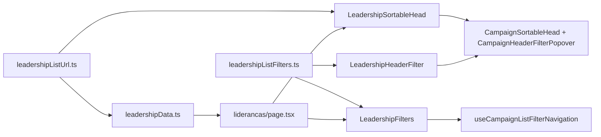

# B29 — Ordenação e filtro no header da lista de lideranças

Status: entregue em código
Atualizado em: 2026-07-28
Item do roadmap: [docs/roadmap.md](../roadmap.md) (Trilha B — superfícies de coordenação, item B29)
Impeccable: B — encaixe em tela existente (`/campanha/liderancas`), sem rota nova; herda o header rico (B15 ✓ + B16 ✓) via chrome compartilhado do B21 ✓; molde de domínio = B33 ✓ (`StateDeputy*`)
Appetite: ~1–1,5 dia eng; sem migration — módulo de URL + filtros no loader + duas colunas + wrappers; chrome já pago
Responsável: —

**As-built 2026-07-28:** join `contact.name` funcionou para `where` e `sort` (int tests verdes); `LeadershipFilters` substitui `CampaignSearchForm` (busca + resumo/Limpar, sem barra mobile empilhada); colunas Setor + Última atualização (idade relativa visível; absoluto em `title`); facet de municípios cross-filtrado; empty via `CampaignTable empty`; harden/optimize out. Critique P1s fechados (copy do header Municípios; freshness relativa).

**Atualização B21 (2026-07-25):** a extração deixou de fazer parte do appetite deste item. `shared/CampaignSortableHead` e `CampaignHeaderFilterPopover` já existem, e os wrappers de municípios já foram migrados. B29 implementa apenas os wrappers/política de liderança e o contrato de URL/filtros próprios.

**Revisão 2026-07-28 (auditoria pré-implementação):** (1) template real = B33 dobradinhas (`StateDeputySortableHead`/`StateDeputyHeaderFilter`/`StateDeputyFilters` + `useCampaignListFilterNavigation`), não re-extrair chrome; (2) Adiado "editar supportStatus na célula" fechado por **B32 ✓**; (3) `CampaignSearchForm` em lideranças é substituído por `LeadershipFilters` (preserva params de URL); (4) mobile v1 = header em todos os breakpoints + busca/resumo, sem barra empilhada.

## Design (Impeccable)

Âncoras: `PRODUCT.md` (princípios 2, 3 e 4; anti-goals §5) / `DESIGN.md` (register `product`, Field Desk) · tema `data-theme='campaign'` · sistema de listas do Pass 2 W1 (`CampaignTable`, `CampaignSearchForm`, `CampaignFilterChips`, `CampaignListFooter`, `CampaignListEmptyState`, `CampaignListPendingBoundary`) · header rico entregue em B15 ✓/B16 ✓ (`MunicipalitySortableHead`, `MunicipalityHeaderFilter`).

Na implementação (`implement-roadmap-item`): craft compacto → critique → polish. `harden`/`optimize` só sob gatilho do Passo 8 — a superfície é leitura paginada com filtros no banco; a única escrita continua sendo o cadastro, que não é deste item.

Brief compacto:

- **Persona / contexto:** Assessor com carteira de municípios (e o CG na mesa) abrindo a lista de lideranças para trabalhar uma fatia — "quem ainda está `a abordar` em Feira de Santana?", "quais lideranças religiosas de Irecê ainda não têm acesso ao app?". Hoje a única ferramenta é a busca por nome, e a ordem é sempre a última escrita.
- **Job principal:** recortar a lista de pessoas pelo critério do dia e ordená-la pela coluna que importa, sem sair da tela nem decorar quem é quem.
- **Estratégia de cor:** Restrained. O único acento continua sendo o `SupportStatusBadge` existente; filtro ativo é o funil preenchido do B16, não cor nova.
- **Edit where you see:** fora do escopo de sort/filtro deste item. A edição rápida de `supportStatus` na célula já foi entregue por **B32 ✓** (`LeadershipListSupportStatusControl`); este item não toca mutação.
- **Anti-goals:** score/nível sintético de liderança na tela (é **E14**); KPI strip / overview de lideranças; filtro por telefone ou qualquer recorte de PII sensível; segunda gramática de lista (chips próprios, sort client-side, estado fora da URL).

## Dados → decisão → apresentação

- **Vou apresentar dados?** Sim, superfície neste item — mas **sem métrica nova**: a entrega é recorte e ordenação sobre a tabela de entidades que já existe.
- **Decisões desbloqueadas:**
  - Assessor: "de quem eu falo esta semana?" — lideranças `a abordar` / `em disputa` nos meus municípios, ordenadas por nome ou pelo sinal mais antigo.
  - Coordenador Geral: "qual município da carteira tem rede cadastrada e qual está oco?" — filtro por município sobre o conjunto que ele enxerga inteiro.
  - Staff no onboarding (Onda 0 §4): "quais lideranças ainda estão sem acesso ao app?" — filtro `sem acesso` antes de disparar convites.
- **Forma escolhida:** **tabela/lista ranqueada** (degrau 2 da escada) — a forma já em uso; o que muda é a interação (ordenar/filtrar), não a representação. **Rejeitado:** KPI strip com contagem por status (contagem bruta de cadastros é anti-goal do research quando não amarra a cobertura/meta — a leitura de rede que decide alocação é a de município, no E8/E9); chart de barras por setor (uma coluna por vez, sem decisão nova); mapa de lideranças (a geografia decisória é município, e o mapa já existe lá).
- **Profile:** categórico (status de apoio 4 valores, setor 10 valores, acesso ao app booleano) × relacional (municípios, organizações) × temporal (`updatedAt`); centenas a poucos milhares de linhas com a base nominal real (C2), paginadas de 25 em 25; leitura absoluta por linha, sem razões.
- **Anti-goals de dado:** ranking sintético de lideranças; % de "engajamento" agregado; qualquer coluna que exponha `estimatedVotes` (assimetria travada) ou dado consentido do apoiador.

## Contexto

`/campanha/liderancas` (`src/app/(campaign)/campanha/(app)/liderancas/page.tsx`) já foi migrada para o sistema de listas do Pass 2 W1: usa `CampaignTable` com colunas como dado, `CampaignSearchForm`, `CampaignListFooter`, `CampaignListEmptyState` e o pending compartilhado. O que ela **não** tem é o que a lista de municípios ganhou em B15 ✓ (ordenar clicando no header, com `?sort=`/`?dir=` na URL) e B16 ✓ (filtro multi-seleção em Popover no próprio header, com busca dentro do popover, chips de filtro ativo e "Limpar"): o estado da URL é só `q` + `page` (`parseLeadershipListParams` em `src/utilities/leadershipData.ts`) e a ordem é fixa em `-updatedAt`.

Com o seed do E4R ✓ a base já entrou com lideranças nominais vindas da planilha (nome, sem telefone), e o onboarding do time (Onda 0 §4) vai trabalhar essa lista município a município. Sem recorte, o assessor pagina uma lista ordenada por "última escrita" — que é exatamente a ordem em que o seed as gravou.

Há ainda um defeito adjacente na busca atual: como o nome vive em `Contact`, `loadLeadershipListPageData` pré-resolve os contatos com `contains` e **`limit: 200`**, e depois filtra as lideranças por esses ids. Uma busca por sobrenome comum trunca silenciosamente. Este item toca exatamente esse caminho de query, então a correção entra junto (ver Objetivos).

Do lado da UI, o chrome compartilhado (`CampaignSortableHead` / `CampaignHeaderFilterPopover`) já existe (B21 ✓) e é consumido por municípios, territórios e dobradinhas (B33 ✓). Lideranças ainda usa `CampaignTableHead` simples + `CampaignSearchForm` (só `q`+`page`).

## Objetivos

- **Ordenar pelo header** em `/campanha/liderancas`, com `?sort=`/`?dir=` no contrato canônico do `campaignListUrl` — recarregável e compartilhável, no mesmo padrão do B15 ✓.
- **Filtrar pelo header** (Popover, padrão B16 ✓) em Status de apoio (multi), Setor (multi), Município (multi, com facet) e Acesso ao app (com/sem) — mais chips de filtro ativo e "Limpar" pelos shells compartilhados.
- **Toda chave de ordenação e todo filtro pousam numa coluna visível**: entram as colunas "Setor" e "Última atualização" (ambas já no `LeadershipRowViewModel`, hoje não renderizadas), para não existir ordenação invisível.
- **Ordenação e filtro executados no banco** (`payload.find` com `sort`/`where`), nunca em memória sobre a página de 25 linhas.
- **Header e filtros permanecem montados com zero resultados** — a lista passa a usar a prop `empty` do `CampaignTable` (precedente B16 ✓ / B33 ✓), em vez de trocar a tabela inteira pelo empty state.
- **Wrappers de domínio** (`LeadershipSortableHead` / `LeadershipHeaderFilter` / `LeadershipFilters`) consomem o chrome compartilhado já entregue — sem re-extração.
- **Teto de 200 na busca por nome eliminado** — a busca passa pela mesma query da lista se o caminho relacional funcionar no adapter; caso contrário, permanece a pré-resolução e o teto vira defeito nomeado, não silencioso (ver Decisões travadas).
- Guardrails: **sem migration, sem collection, sem `Consent`, sem server action**; access inalterado (`isCampaignStaff` na rota, `overrideAccess: false` na leitura, escopo do assessor pelo access da collection); liderança segue sem acesso à área.

## Decisões travadas

- **Contrato de URL próprio e congelado para esta lista** (`q`, `status`, `sector`, `municipality`, `access`, `sort`, `dir`, `page`), em `src/utilities/leadershipListUrl.ts` sobre os helpers de `campaignListUrl.ts`, com o par default omitido da querystring. É caro de reverter: vira link colado no grupo, entra em Visitados e é o que o **B18** salva. **Rejeitado:** estado em `useState`/`localStorage` (não compartilha, não recarrega, quebra B18); reaproveitar os nomes de param de municípios (`slug`, `region`, `coverage` significam outra coisa aqui — colisão semântica em `RecentVisitTracker` e nos filtros salvos); um único módulo de URL multi-lista parametrizado (acopla três contratos independentes num só ponto de mudança).
- **Ordenação por nome via join na query, não por desnormalização.** O adapter Postgres resolve `sort: 'contact.name'` por caminho pontilhado (`buildOrderBy` → `getTableColumnFromPath`, que adiciona o join), então o nome — que vive em `Contact`, a fonte única de pessoa — pode ordenar sem duplicar dado. **Rejeitado:** copiar `contact.name` para um campo `leadership.name` mantido por hook (migration + segunda fonte de verdade de nome, exatamente o cadastro paralelo que o AGENTS proíbe, e por um sort); carregar todas as lideranças do escopo e ordenar em memória (não escala com a base nominal real da C2 e duplica a paginação); ordenar só a página carregada (ordenação que mente). **Fallback nomeado:** se na implementação o caminho relacional não sair no adapter, a v1 entrega apenas as chaves locais (`supportStatus`, `sector`, `updatedAt`) e o sort por nome vira Adiado com gatilho — a desnormalização continua rejeitada.
- **Filtros v1 = as colunas visíveis** (Status, Setor, Município, Acesso ao app), todos sobre campos indexados da própria `leadership` (`supportStatus`, `sector`, `municipalities`, `user`). **Rejeitado:** filtro por organização e por dobradinha (não têm decisão nomeada hoje e cada popover custa uma query de facet — adiados com gatilho); filtro por telefone/e-mail preenchido (recorte de PII sem decisão, e o telefone é justamente o que o seed do E4R não trouxe); filtro por "criada por mim".
- **Opções dos filtros vêm de facet no escopo do ator**, unindo sempre o valor já selecionado (precedente `loadMunicipalityListFilterFacets`, `src/utilities/municipalityPageData.ts`). O assessor só vê no popover os municípios em que existem lideranças suas. **Rejeitado:** listar os 435 municípios do catálogo (o assessor veria opções que zeram a lista dele — e o payload RSC carregaria 435 pares por render); options fixas sem cross-filtragem (o B16 já pagou o preço de aprender que filtro que zera a lista é filtro quebrado).
- **Chrome compartilhado já existe (B21 ✓)** — B29 só escreve wrappers de domínio. Molde: B33 (`StateDeputy*`). **Rejeitado:** re-extrair ou duplicar o head.
- **Sem métrica, score ou nível de liderança nesta tela.** Níveis N0–N4 são **E14**, com histerese e vocabulário duplo. **Rejeitado:** coluna "engajamento" ad hoc derivada de `supportStatus` (criaria um segundo vocabulário de nível que o E14 teria de reconciliar).
- **i18n e naming** seguem o AGENTS.md: identificadores em inglês (`leadershipListUrl.ts`, `LeadershipListState`, `LeadershipListSortKey`, `buildLeadershipSortHref`, `leadershipFilterDefinitions`, `LeadershipSortableHead`, `CampaignSortableHead`, `CampaignHeaderFilterPopover`), strings visíveis em pt-BR ("Status", "Setor", "Acesso ao app", "Última atualização", "Limpar").

## Questões em aberto

- **Qual passa a ser a ordenação default?** **Opções:** manter `-updatedAt` | nome A–Z | status. **Recomendação:** manter `-updatedAt` — trocar o default muda o que a mesa vê ao abrir a tela e ninguém pediu isso; a diferença é que agora ele fica **visível** (coluna "Última atualização" com o header ativo) e reversível em um clique. Revisitar com feedback de uso. _(assumido — validar na primeira demo.)_
- **Mobile: só os popovers do header ou também controles empilhados?** **Opções:** header em todos os breakpoints (a tabela já rola na horizontal) | barra de selects empilhados como em `MunicipalityFilters` | select compacto só de ordenação. **Recomendação:** header em todos os breakpoints na v1 — a lista de municípios só precisou da barra empilhada porque no mobile ela **troca a tabela por cards**, o que não acontece aqui. O select compacto fica adiado com gatilho de uso real em celular.
- **A busca por nome migra para a query única?** **Opções:** `where: { 'contact.name': { contains } }` na mesma query | manter a pré-resolução com teto maior | manter como está. **Recomendação:** tentar a query única no tracer bullet (resolve o teto de 200 e barateia a paginação); se o caminho relacional não servir para `where` com `overrideAccess: false`, manter a pré-resolução, **paginar** a resolução de contatos e registrar o defeito no ledger em vez de deixar o `limit: 200` mudo.
- **A coluna "Municípios" deve mostrar contagem em vez da lista de nomes quando houver muitos?** **Recomendação:** fora deste item — é polish de célula (candidato ao `cellTooltip` do **B23**), não recorte.

## Abordagem proposta

Componentes (molde B33 — não re-extrair chrome):

- **`src/utilities/leadershipListUrl.ts`** (novo): contrato `q`/`status`/`sector`/`municipality`/`access`/`sort`/`dir`/`page`; where/sort/hrefs/`resolveLeadershipListUrl`. Espelha `stateDeputyListUrl.ts`.
- **`src/utilities/leadershipListFilters.ts`** (novo): toggles/clear/summary; options estáticas status/setor; municipality por id; access `com`|`sem`.
- **`src/utilities/leadershipData.ts`** (alterado): where+sort+facet de municípios; busca via `'contact.name'`; parse/hrefs saem para o módulo de URL (re-export se preciso).
- **`LeadershipSortableHead` / `LeadershipHeaderFilter` / `LeadershipFilters`** (novos): wrappers + busca que preserva URL (substitui `CampaignSearchForm`).
- **`liderancas/page.tsx`**: redirect canônico; colunas Setor + Última atualização; heads ricos; `CampaignTable empty={…}`.
- **Testes:** unit `leadershipListUrl`; int filtros + sort por nome + escopo do assessor.
- **Sem migration, sem collection, sem `Consent`, sem server action.**

## Dependências

- **Duras:** nenhuma. Consome o sistema de listas do Pass 2 W1 ✓, os padrões B15 ✓ (sort na URL) e B16 ✓ (popover de filtro) e o access já existente da `leadership`.
- **Suaves:** **B21** (ordem de chegada define quem duplica: se B21 entrar primeiro, ele duplica o head uma vez, como o plano dele já prevê, e **B29 migra os três**; se B29 entrar primeiro, B21 consome o compartilhado e fecha seu "Adiado com gatilho"); **B28** (mesma tabela: adiciona as colunas E-mail e Celular e declara "sort por coluna" fora do escopo — quem entrar depois só encaixa as colunas do outro; as colunas de contato **não** ganham head rico, ver Não escopo); **B22** (a `description` do header nasce com um só ponto de implementação); **B23** (`cellTooltip` na célula de Municípios); **B17** (as colunas desta lista já são dado — o seletor passa a valer aqui de graça); **B18** (o contrato de URL nasce salvável); **E14** (níveis N0–N4 entram como coluna + filtro nesta tela, sem tela nova); **C2 dados reais** (é quando a lista fica grande o bastante para o recorte ser obrigatório).

## Não escopo

- Edição rápida de `supportStatus` na célula (padrão B9/B24): outro appetite, outra decisão — ver Adiado com gatilho.
- Sort/filtro nas colunas de contato do **B28** (E-mail, Celular): ninguém decide nada ordenando por e-mail, e "com telefone" é recorte de PII sem decisão nomeada — as colunas convivem com `CampaignTableHead` simples ([plano](email-celular-lista-liderancas.md)).
- Níveis de envolvimento N0–N4 como coluna/filtro: **E14** ([plano](niveis-de-envolvimento.md)).
- Overview/KPIs de lideranças no topo da página: anti-goal declarado; a leitura que decide alocação é a de município (**E8**/**E9**).
- Migrar `demandas`, `dobradinhas`, `organizacoes` e `apoiadores` para o header rico: cada uma entra por pedido próprio — a peça compartilhada fica pronta.
- Filtros salvos e atalho no sidebar para esta lista: **B18** ([plano](filtros-salvos-municipios.md), que passa a valer para mais de uma lista).
- Busca acento-insensível no banco (`unaccent`/`pg_trgm`): **C8** ([plano](escala-dry-pos-c6.md)).
- Export CSV da lista filtrada: sem pedido; o admin Payload já exporta contatos.

## Rabbit holes

- **"Já que vamos extrair, vamos fazer o framework de listas de verdade."** Um motor genérico de estado de URL + facets + colunas com 3 consumidores é o clássico DRY prematuro, e travaria os três contratos num ponto de mudança. **Mitigação neste item:** extrair **apenas chrome** (head + popover); módulos de URL e de filtros continuam um por domínio, duplicados de propósito.
- **Desnormalizar o nome na `leadership` "de passagem".** Um campo + hook + migration + backfill, e uma segunda fonte de verdade do nome de uma pessoa. **Mitigação:** decisão travada acima; se o join não servir, corta-se o sort por nome, não a normalização.
- **Migrar as outras quatro listas junto.** Cada uma tem seu contrato de URL e seus facets; vira uma semana. **Mitigação:** Não escopo explícito; o ganho é a peça pronta, não a varredura.
- **Facet por popover sem teto.** Um facet por filtro em cima de uma tabela que vai crescer com a base nominal real é `SELECT` sem paginação por render. **Mitigação:** só o filtro de Município tem facet (os outros são enums estáticos), com `select` mínimo e reuso da mesma consulta quando o `where` coincide — como já faz `loadMunicipalityListFilterFacets`.
- **Filtrar por município via nome/slug.** A relação é por id; aceitar nome na URL convida a matching frouxo e a divergência com o catálogo. **Mitigação:** param `municipality` só com ids inteiros, validados no parser.

## Adiado com gatilho

- ~~**Edição rápida de `supportStatus` na célula**~~ — **fechado por B32 ✓** (2026-07-26).
- **Filtro por organização e por dobradinha.** Revisitar quando: houver decisão nomeada em sessão (ex.: "quero as lideranças do sindicato X") ou quando a cobertura de `organizations` na base real passar a ser a regra, não a exceção.
- **Select compacto / barra empilhada de ordenação no mobile.** Revisitar quando: uso real em celular mostrar que rolar o header na horizontal atrapalha (mesmo gatilho que produziu o select compacto do B15; B33 optou por paridade mobile — lideranças não).
- **Sort por nome (se o join não sair no adapter).** Revisitar quando: houver evidência de que a ordem alfabética é bloqueante — e ainda assim sem desnormalizar (a alternativa seria uma view/consulta dedicada).

## Referências

- `docs/roadmap.md` (Trilha B / "Demais itens abertos", B29; Janela 1–2; grafo; cortes seguros)
- [email-celular-lista-liderancas.md](email-celular-lista-liderancas.md) (B28 — colunas vizinhas na mesma tabela) · [ordenacao-colunas-lista-municipios.md](ordenacao-colunas-lista-municipios.md) (B15 — contrato `sort`/`dir`) · [filtros-no-header-lista-municipios.md](filtros-no-header-lista-municipios.md) (B16 — popover, facets, chips) · [pagina-territorios-identidade.md](pagina-territorios-identidade.md) (B21 — registrou o gatilho do head compartilhado) · [explicacao-colunas-header-listas.md](explicacao-colunas-header-listas.md) (B22) · [tooltip-celulas-listas.md](tooltip-celulas-listas.md) (B23) · [seletor-colunas-lista-municipios.md](seletor-colunas-lista-municipios.md) (B17) · [filtros-salvos-municipios.md](filtros-salvos-municipios.md) (B18) · [sistema-listas-campanha.md](sistema-listas-campanha.md) (Pass 2 W1) · [niveis-de-envolvimento.md](niveis-de-envolvimento.md) (E14)
- `src/app/(campaign)/campanha/(app)/liderancas/page.tsx` — superfície a estender (colunas, empty state, footer)
- `src/utilities/leadershipData.ts` — loader, view model (`sector`, `updatedAt` já disponíveis) e a pré-resolução de contatos com `limit: 200`
- `src/utilities/municipalityListUrl.ts`, `src/utilities/municipalityListFilters.ts`, `src/utilities/campaignListUrl.ts` — contrato a espelhar e helpers a reusar
- `src/utilities/municipalityPageData.ts` (`loadMunicipalityListFilterFacets`) — padrão de facet cross-filtrado
- `src/components/campaign/municipality/MunicipalitySortableHead.tsx`, `MunicipalityHeaderFilter.tsx`, `src/components/campaign/shared/CampaignTable.tsx` — origem da extração e destino das colunas
- `src/collections/Leadership.ts`, `src/utilities/access/` — campos indexados (`supportStatus`, `sector`, `municipalities`, `user`) e escopo do assessor
- AGENTS.md — Campaign auth e RBAC, `overrideAccess: false` com `user`, pessoa é sempre `Contact` + join, naming (identificadores em inglês, copy pt-BR), sem migration neste item
- `PRODUCT.md` / `DESIGN.md` — Field Desk, anti-goals de dashboard, "Edit where you see" (não se aplica na v1 desta tela) · `.cursor/rules/campanha-action-feedback.mdc` (pending honesto no resultado)
