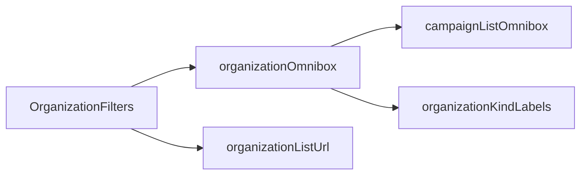

# Impl: Organizações — tipo na omnibox

Status: aprovado
Atualizado em: 2026-08-02
Issue: #307
Intenção: docs/plans/organizacoes-omnibox-tipo.md
Appetite restante: herdado (~0,5 dia)

## Leitura da intenção

- **Outcome:** Staff filtra organizações por **Tipo** na omnibox (sugestões + chip removível), coexistindo com busca por nome; sem chip de tipo = todas do escopo.
- **O que NÃO negociar:** tipos existentes (`organizationKinds`); `kind` único na URL; sem segunda toolbar; sem saved filters; busca `q` intacta.
- **O que reavaliar:** hipótese de “estender `searchOnlyListOmnibox`” — melhor um adapter de domínio dedicado, como `demandOmnibox` / `supporterOmnibox`.

## Abordagem recomendada

**Opções consideradas:**

- A — Estender `searchOnlyListOmnibox` com dimensão genérica
- B — Adapter `organizationOmnibox.ts` no domínio (precedente B128)
- C — Inline na componente `OrganizationFilters`

**Recomendação:** B — espelha `demandOmnibox` + `q` de `supporterOmnibox`; mantém `searchOnlyListOmnibox` degenerado para assessores; testável em unit.

**Rejeitadas:** A (abstração prematura para um único consumidor); C (lógica fora do adapter de domínio).

### Componentes / mudanças

- **`organizationOmnibox.ts`** (`src/utilities/organization/`): chips/sugestões/ações para `q` + `kind`; labels de `organizationKindLabels`; `emptyQueryVisible` nos tipos.
- **`OrganizationFilters.tsx`**: trocar imports de `searchOnlyListOmnibox` pelo adapter; label/placeholder mencionam tipo.
- **Migration:** sem migration.
- **Access / Consent:** inalterado (filtro de lista staff existente).
- **UI:** Impeccable B — encaixe na lista; reuso `CampaignListOmnibox` + `useCampaignListFilterNavigation`.

### Dados → forma

- N/A (só filtro de lista).

## Fases verificáveis

1. **Adapter + testes unit** — `organizationOmnibox.ts` + caso em `listOmniboxB128.unit.spec.ts`
2. **UI** — `OrganizationFilters.tsx`
3. **Gates** — `pnpm gate:fast`; push via `pnpm push`

## Rabbit holes / Não escopo (engenharia)

- Multi-tipo OR na URL
- Filtro por município / lideranças
- Saved filters

## Riscos e mitigação

- **Contrato URL `q`+`kind`:** adapter só lê/escreve `OrganizationListState` via `organizationListUrl`; testes cobrem toggle e chips.
- **Clear all:** passa a zerar `q` e `kind` (chip de tipo agora é affordance da omnibox, não deep-link oculto).

## Aceite de engenharia

- [x] Aceite de produto da intenção ainda coberto
- [x] Invariantes AGENTS/engineering-standards
- [x] Testes de domínio previstos (unit em `listOmniboxB128.unit.spec.ts`)
