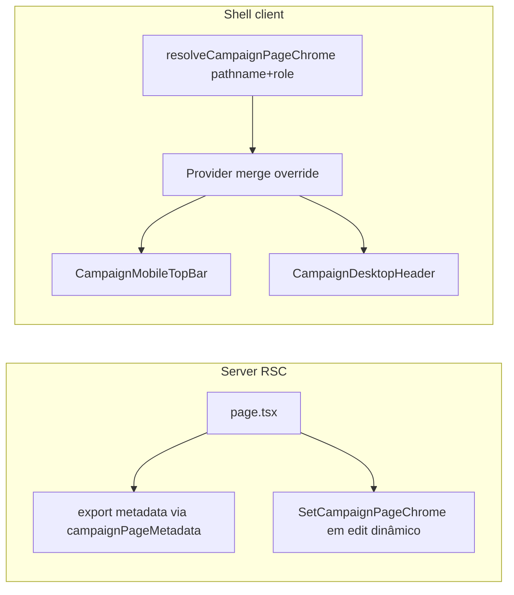

# Impl: Orientação na shell + aba — sem títulos grandes de seção

Status: aprovado
Atualizado em: 2026-08-02
Issue: #250
Intenção: docs/plans/orientacao-shell-sem-titulos-secao.md
Appetite restante: herdado (~1–1,5 dia eng)

## Leitura da intenção

- **Outcome:** orientação “onde estou” sai do corpo da página e vai para chrome estável (header mobile/desktop + aba `Solla - Campanha - <Página>`); corpo começa direto no trabalho; detalhe mantém h1 da entidade; Início sem título no header.
- **O que NÃO negociar:** wizard/auth/convite/offline intocados; h1 de entidade em detalhe; leader lockdown; chips de universo removidos (não no header).
- **O que reavaliar:** hipótese de `CampaignListPageHeader` — não existe; B118 nunca landou. Pathname registry + context override é mais maintainable que 15 nested layouts.

## Abordagem recomendada

**Opções consideradas:** A) nested `layout.tsx` por segmento · B) pathname registry + override context · C) só metadata sem shell  
**Recomendação:** B — um owner (`campaignPageChrome.ts`), precedente wizard/home-search, role no layout, override só em edit dinâmico.  
**Rejeitadas:** A (34 rotas, drift) · C (aceite exige shell)

### Componentes / mudanças

- **`campaignPageChrome.ts`** (`src/lib/`): vocabulário client-safe; `resolveCampaignPageChrome`; `campaignPageMetadata`
- **`CampaignPageChromeContext.tsx`**: provider + `SetCampaignPageChrome` (override, layout effect cleanup)
- **`CampaignPageChromeResolver.tsx`**: client; pathname + role → base chrome
- **`CampaignDesktopHeader.tsx`**: uma linha título+subtítulo md+
- **`CampaignMobileTopBar.tsx`**: app mode lê chrome efetivo; home vazio
- **`(app)/layout.tsx`**: provider + resolver + desktop header; passa `role`
- **`(campaign)/layout.tsx`**: `title.template: 'Solla - Campanha - %s'`
- **Páginas/componentes**: remover headers de seção/create; manter h1 entidade + back em detalhe; `SetCampaignPageChrome` em edit; metadata em rotas
- **Migration:** sem migration
- **Access / Consent:** inalterado

### Dados → forma

- Orientação = texto estático por rota + role (quadro); sem dados de Payload no resolver.

## Fases verificáveis

1. **Infra** — lib + context + shell headers + metadata template
2. **Páginas** — strip body headers; metadata; edit bridges
3. **Gates** — `pnpm gate:fast`; `pnpm push`

## Rabbit holes / Não escopo (engenharia)

- Reintroduzir chips de escopo no header
- Mexer em wizard chrome
- h2 internos (ex. “Meus contatos (N)”)

## Riscos e mitigação

- E2E busca `heading` level 1 → atualizar para shell slot ou manter entity h1 only
- Home search focus: chrome vazio em `/campanha` mesmo focado

## Aceite de engenharia

- [x] Aceite de produto da intenção ainda coberto
- [x] Invariantes AGENTS/engineering-standards
- [x] Testes unit mobile top bar + metadata resolver previstos
