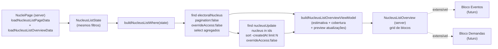

# Overview na lista de núcleos

Status: rascunho
Atualizado em: 2026-07-17
Item do roadmap: [docs/roadmap.md](../roadmap.md) (seção "Campanha → Próximos ciclos", linha 50)
Responsável: —

## Contexto

Hoje `/campanha/nucleos` é só cabeçalho + filtros + lista paginada (25/página). Não há agregados: o usuário precisa varrer a lista (ou ir ao dashboard `/campanha`) para sentir quanto daquela seleção tem estimativa confirmada, quantos votos somam, ou quais foram os últimos reportes. O dashboard geral já calcula esses agregados, mas para **todos** os núcleos ativos — não respeita os filtros de território/cobertura/estimativa da lista.

A decisão de produto (2026-07-17) é adicionar um **painel de overview acima da lista**, com blocos como "Estimativa de votos" e "Últimas atualizações", e espaço reservado para "Próximos eventos" e "Demandas" (que só ganham UI quando os domínios correspondentes existirem). O ponto-chave: **o overview usa os mesmos filtros da página** — se o usuário filtra por um território, os agregados são só daquele território. O overview é, portanto, um recorte do dashboard reagindo aos filtros da lista.

## Objetivos

- Painel de overview renderizado entre os filtros e a lista em `src/app/(campaign)/campanha/(app)/nucleos/page.tsx`.
- Bloco **Estimativa de votos**: soma de `confirmedVoteEstimate`, % com estimativa confirmada e contagem de sugestões pendentes — todos calculados sobre o conjunto **filtrado** (não só a página atual).
- Bloco **Últimas atualizações**: preview das N atualizações mais recentes (`nucleusUpdate`) entre os núcleos filtrados, com link para o detalhe do núcleo.
- Blocos **Próximos eventos** e **Demandas**: arquitetura extensível, mas sem UI órfã — só aparecem quando os domínios existirem.
- Reusar `NucleusListState` / `buildNucleusListWhere(state)` para que o overview sempre concorde com a lista visível.
- Manter access control existente: todas as queries com `user` + `overrideAccess: false`. Sem collection nova, sem migration, sem server action, sem `Consent`.

## Decisões travadas

- **Mesmos filtros da página.** O overview é computado a partir do mesmo `NucleusListState` já parseado em `loadNucleusListPageData` (`parseNucleusListParams` + `buildNucleusListWhere`). Não existe filtro "do overview" separado do filtro "da lista". (Decisão de produto 2026-07-17; roadmap linha 50.)
- **Agregados sobre o conjunto inteiro filtrado, não só a página atual.** A lista é paginada em 25, mas o overview precisa de totais — logo exige uma query adicional com `pagination: false` selecionando só os campos de agregação. Mesmo padrão já usado por `getCampaignDashboardPageData` (que carrega todos os núcleos ativos com `pagination: false`).
- **Sem collection/migration/server action.** Tudo é leitura no server component. Nenhuma escrita, nenhuma transação, nenhum `Consent`.
- **Access control por `overrideAccess: false`.** O overview herda naturalmente o escopo de papel: `geral` vê tudo, `coordenador` vê só os seus núcleos, `lideranca` vê só os núcleos com liderança engajada — exatamente como a lista já faz. Para "Últimas atualizações", `canReadNucleusUpdate` já restringe `lideranca` ao próprio autor; o preview de `lideranca` mostra só os próprios reportes nos núcleos filtrados. O plano não inventa regra nova.
- **Ordem na página: header → filtros → overview → lista.** O overview fica **abaixo** dos filtros (para refletir a seleção que o usuário acabou de fazer) e **acima** da lista. "Acima da lista" (roadmap) é respeitado; colocar abaixo dos filtros é deliberado para que os agregados correspondam à seleção visível.
- **Overview oculto quando não há resultados.** Se `result.totalDocs === 0`, o overview não renderiza — a página já mostra o `Empty` de "Nenhum núcleo encontrado". Evita agregados zerados sem sentido.
- **Eventos e Demandas não ganham UI placeholder.** "Quando o domínio existir" significa: o bloco só é implementado quando a collection existir. Não renderizar cards "em breve" — UI órfã confunde mais do que informa. A arquitetura (view model + componente) fica pronta para plugar.
- **i18n e naming** seguem o AGENTS.md: identificadores em inglês (`NucleusListOverview`, `loadNucleusListOverviewData`, `buildNucleusListOverviewViewModel`), strings visíveis em pt-BR.

## Questões em aberto

- **`lideranca` vê o overview?** A lista de núcleos é visível para os três papéis, e o roadmap não exclui `lideranca`. **Recomendação:** sim, mostrar — os agregados de estimativa e o preview das próprias atualizações são úteis e já respeitam o escopo. Se produto quiser esconder, é só não montar o componente para esse papel.
- **Quantas atualizações no preview?** O detalhe do núcleo usa 3 (`getNucleusUpdatesPageData` preview). **Recomendação:** 3 ou 4 no overview, suficiente para dar um "pulso" sem virar feed. Definir com produto.
- **"Estimativa de votos" mostra também `proposedVoteEstimate`?** Hoje a lista marca "Sugestão pendente". **Recomendação:** o bloco mostra soma das confirmadas + contagem de pendentes (não soma das propostas — proposta não é voto). Soma de propostas pode confundir com confirmado.
- **Agregados por território/cobertura extras?** Ex.: % com coordenador no conjunto filtrado (já existe no dashboard geral). **Recomendação:** incluir como KPI secundário no bloco de estimativa ou num terceiro bloco "Cobertura" — alinhado com o dashboard, mas reagindo a filtros.
- **Custo da segunda query.** Para `geral` sem filtros, o overview carrega todos os núcleos ativos (`pagination: false`) só para agregar — duplica o trabalho da listagem paginada. **Recomendação:** aceitar (o dashboard já faz isso) e selecionar só `{ id, slug, name, coordinators, confirmedVoteEstimate, proposedVoteEstimate, lastUpdateAt }`. Se virar gargalo, otimizar com `count` por cláusula depois.
- **Cache/ISR.** A página já é dinâmica (lê `searchParams`). O overview é computado por request com dados frescos — sem `unstable_cache`, sem tag nova. Confirmar se produto aceita custo por request.
- **Eventos: gatilho de ativação.** Quando o domínio de eventos existir, qual collection o bloco lê? **Recomendação:** deixar a decisão para o plano de Eventos; aqui só fixamos que o bloco consome `nucleus` + `startAt`/`status` e respeita os mesmos filtros de território.
- **Demandas: idem.** Mesma recomendação — arquitetura aberta, decisão no plano de Demandas.

## Abordagem proposta

Componentes:

- **`loadNucleusListOverviewData`** (em `src/utilities/nucleusListOverviewPageData.ts`): recebe `payload`, `user`, `state: NucleusListState`. Roda em paralelo com `loadNucleusListPageData` (mesma `state`):
  - `payload.find({ collection: 'electoralNucleus', where: buildNucleusListWhere(state), depth: 0, pagination: false, sort: 'name', select: { id, slug, name, coordinators, confirmedVoteEstimate, proposedVoteEstimate, lastUpdateAt }, user, overrideAccess: false })` → `overviewNuclei`.
  - Se `overviewNuclei.length === 0`, retorna `null` (oculta o overview).
  - `payload.find({ collection: 'nucleusUpdate', where: { nucleus: { in: overviewNuclei.map(n => n.id) } }, depth: 0, limit: previewLimit, page: 1, sort: '-createdAt', select: { author: true, kind: true, body: true, createdAt: true, nucleus: true }, user, overrideAccess: false })` → `recentUpdates`. Para `lideranca`, o access control já filtra só próprios; para `geral`/`coordenador`, vem o escopo de núcleos acessíveis.
  - Resolve nomes de autores e de núcleos via um `payload.find({ collection: 'campaignUser', where: { id: { in: authorIds } }, select: { name: true, role: true }, overrideAccess: false, user })` (mesmo padrão de `getNucleusUpdatesPageData`).
  - Retorna `{ nuclei: overviewNuclei, recentUpdates }` (tipo `NucleusListOverviewInput`).
- **`buildNucleusListOverviewViewModel`** (em `src/utilities/nucleusListOverviewViewModels.ts`): recebe o input + `now` e produz `NucleusListOverviewViewModel`:
  - `estimate: { confirmedTotal: number, confirmedPercent: number, pendingCount: number }` — soma de `confirmedVoteEstimate`, % de núcleos com `confirmedVoteEstimate != null`, contagem de `proposedVoteEstimate != null` (com `confirmedVoteEstimate == null` ou não — definir; recomendação: pendente = `proposedVoteEstimate != null`, independente de confirmada, espelhando o dashboard `pendingEstimate`).
  - `coverage: { coordinatedCount, total, percent }` — % com `coordinators.length > 0` (opcional, ver questões em aberto).
  - `recentUpdates: Array<{ id, nucleusSlug, nucleusName, authorName, kind, body, createdAt }>` — já truncado pelo `limit`.
  - Reusa `percentage` e helpers de formatação no estilo de `campaignDashboardViewModels.ts`.
- **`NucleusListOverview`** (server component, em `src/components/campaign/`): grid responsivo de blocos (`Card`/`CardHeader`/`CardContent`, reusando `src/components/ui/card`):
  - Bloco **Estimativa de votos** — total confirmado (`Intl.NumberFormat('pt-BR')` + "votos"), `% com estimativa confirmada` com `<Progress>`, e badge "N sugestões pendentes".
  - Bloco **Últimas atualizações** — lista compacta (autor, tipo, data relativa, link para `/campanha/nucleos/{slug}?tab=updates`). Reusa o `relativeFormatter` do `CampaignDashboard`. Vazio: "Nenhuma atualização recente".
  - Espaço reservado (sem UI) para **Próximos eventos** e **Demandas** — comentário no componente marcando onde plugar.
- **Integração na página** (`src/app/(campaign)/campanha/(app)/nucleos/page.tsx`): chamar `loadNucleusListPageData` e `loadNucleusListOverviewData` em paralelo (ambas usam a mesma `state` já resolvida por `resolveNucleusListUrl`). Renderizar `<NucleusFilters>` e, se `overview` não for `null` e `result.docs.length > 0`, `<NucleusListOverview view={overview} now={now} />` antes de `<NucleusList>`.
- **Sem migration, sem collection, sem server action.** Todo o fluxo é leitura no server.

## Dependências

- Nenhuma de outro plano. Reusa `NucleusListState`, `buildNucleusListWhere`, `parseNucleusListParams` (`src/utilities/nucleusUi.ts`), `getBahiaWeekRange` (`src/utilities/campaignTime.ts`) se precisar de janela semanal, access control existente (`src/utilities/campaignAccess.ts`) e UI `Card`/`Progress`/`Badge` (`src/components/ui/`).
- **Eventos** e **Demandas** dependem dos respectivos domínios serem modelados (itens separados do roadmap). Este plano entrega só a fundação + os dois blocos ativos.

## Não escopo

- Criar as collections Eventos ou Demandas — domínios separados no roadmap.
- Alterar os filtros existentes ou a paginação da lista — o overview é aditivo e reage ao estado já existente.
- Substituir o dashboard `/campanha` — o dashboard continua o recorte global (todos os ativos, sem filtros de lista); o overview é o recorte filtrado da lista.
- Estimativa estatística/previsão de votos (roadmap linha 60) — aqui só somamos `confirmedVoteEstimate`.
- Novo access control ou novo `Consent` — herda o que existe.
- Compartilhar núcleo a partir da lista (`NucleusCard` actions) — escopo do plano `compartilhar-pagina.md` (só o detalhe neste ciclo).

## Referências

- `docs/roadmap.md` (linha 50, e linhas 54–55 para Eventos/Demandas)
- `src/app/(campaign)/campanha/(app)/nucleos/page.tsx` — página onde o overview entra
- `src/utilities/nucleusPageData.ts` — `loadNucleusListPageData` (mesma `state`)
- `src/utilities/nucleusUi.ts` — `NucleusListState`, `parseNucleusListParams`, `buildNucleusListWhere`
- `src/utilities/campaignDashboardPageData.ts` e `src/utilities/campaignDashboardViewModels.ts` — padrão de agregação e KPIs a espelhar
- `src/utilities/nucleusUpdatePageData.ts` — padrão do preview de atualizações (limit 3, resolve autores)
- `src/components/campaign/CampaignDashboard.tsx` — `KpiCard`, `Progress`, `relativeFormatter`, layout de grid
- `src/utilities/campaignAccess.ts` — `canReadElectoralNucleus`, `canReadNucleusUpdate` (escopo por papel)
- AGENTS.md — Campaign auth, naming conventions, padrão de leitura com `overrideAccess: false`
