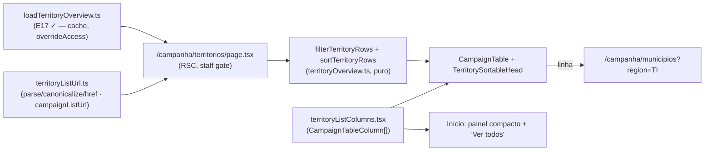

# B21 — Página própria dos Territórios de Identidade (overview + tabela)

Status: ✓ entregue em 2026-07-25
Atualizado em: 2026-07-25
Item do roadmap: [docs/roadmap.md](../roadmap.md) (Trilha B — superfícies de coordenação, item B21; conteúdo herdado de E17 ✓ e estendido por E12)
Impeccable: C — rota nova `/campanha/territorios`, mas com encaixe direto no sistema de listas existente (`CampaignPageShell` + `CampaignTable` + header sort/filtro do B15/B16)
Appetite: ~1–1,5 dia eng; sem migration, sem collection, sem server action — rota + módulo de URL + definições de coluna + entrada no sidebar
Responsável: —

## As built (2026-07-25)

- `/campanha/territorios` é RSC staff-only, com busca, filtros por TI/assessoria, sort, canonicalização e pending pela URL; `leader` redireciona para `/campanha`.
- O contrato compartilhado `resolveListUrl` exige `page`; como esta lista fixa de 27 linhas não pagina, `resolveTerritoryListUrl` usa `inspectRawListParams` e não inventa `page: 1`.
- `CampaignTable` renderiza linhas planas; `flattenTerritoryRows` transforma pai/sub-linhas num union e mantém as duas decomposições do Metropolitano adjacentes ao pai.
- `CampaignSearchForm` descartaria sort/filtros; `TerritoryFilters` segue o padrão de `MunicipalityFilters`, preservando o estado e oferecendo controles mobile.
- A extração disparada por B29/B33 foi antecipada: `shared/CampaignSortableHead` e `CampaignHeaderFilterPopover` contêm só chrome/a11y; wrappers de município e território mantêm política de domínio.
- Por decisão desta sessão, o painel de TI foi **removido** do Início, junto com `territorySlot` e `TerritoryOverviewTable`; não há variante compacta.

## Design (Impeccable)

Âncoras: `PRODUCT.md` (princípios 2 e 6; anti-goals §5) / `DESIGN.md` (register `product`, Field Desk) · tema `data-theme='campaign'` · sistema de listas do Pass 2 W1 (`src/components/campaign/shared/CampaignTable.tsx`, `CampaignSearchForm`, `CampaignFilterChips`, `CampaignListFooter`, `CampaignListPendingBoundary`) · painel entregue no Início (`TerritoryOverviewTable`).

Na implementação (`implement-roadmap-item`): shape compacto → craft → critique → polish. `harden`/`optimize` só sob gatilho do Passo 8 (a superfície é leitura agregada de 27 linhas; não há escrita nem hot path).

Brief compacto:

- **Persona / contexto:** Coordenador Geral (e candidato) na mesa, dividindo carteiras de assessor e escolhendo a região do próximo giro; a tabela dos 27 TIs no Início ficou pequena demais para essa sessão (é um painel entre outros, com 7 colunas fixas e sem filtro).
- **Job principal:** comparar os 27 Territórios de Identidade numa tela dedicada — ordenar pela coluna que importa hoje, esconder o ruído, e cair na lista de municípios do TI escolhido.
- **Estratégia de cor:** Restrained. Tabela densa e sóbria; badge âmbar só para "sem assessor" (mesma linguagem do E9/E17). Sem heatmap, sem cor por ranking.
- **Edit where you see:** **não** neste item — TI não é entidade editável (a malha é estática em `bahiaTerritories.ts`, carteiras continuam por município na lista/`/campanha/assessores`). A affordance de ação é o link para a lista filtrada.
- **Anti-goals:** dashboard regional com cards de KPI; segundo mapa; ranking gamificado entre TIs; média regional apresentada como se decidisse município (MAUP); tabela divergente da do Início (duas implementações da mesma leitura).

## Dados → decisão → apresentação

- **Vou apresentar dados?** Sim, superfície neste item — os mesmos agregados por TI que o E17 já calcula (`computeTerritoryRollup`), numa tela dedicada com ordenação e filtro por coluna.
- **Decisões desbloqueadas:**
  - Coordenador: "qual TI está descoberto de assessor e concentra votação minha o bastante para eu remanejar carteira nesta semana?"
  - Coordenador/candidato: "qual região recebe o próximo giro?" (peso eleitoral × estimativa 2026 × cobertura).
  - Staff: "deste TI, quais municípios abrem a fila?" — o clique leva a `/campanha/municipios?region=<TI>` já ordenado pelo déficit (default do E9).
- **Forma escolhida:** **tabela/lista ranqueada** (degrau 2 da escada) — 27 entidades comparáveis em 6–7 dimensões; ordenar e filtrar é a interação, não visualizar. **Rejeitado:** mapa por TI (a geometria existe em B2, mas trocar a malha do mapa é decisão de E12/B13, e a pergunta aqui é comparativa, não espacial); chart de barras (só responderia uma coluna por vez); dashboard com cards por TI (27 cards = anti-goal de PRODUCT §5); KPI strip no topo (a soma estadual já vive no Início e no overview da lista de municípios).
- **Profile:** categórico (27 TIs, +2 sub-linhas do Metropolitano) × numérico (votos 2014/2018/2022, válidos 2022, estimativa 2026, municípios, cobertura n/n); tamanho fixo e pequeno; leitura **relativa** (% da própria votação é a lente da mesa — `docs/CUSTOMER.md` 2026-07-23).
- **Anti-goals de dado:** % do eleitorado estadual como coluna principal; captura/LQ/mediana regional aqui (só com as salvaguardas MAUP do **E12**); qualquer média de razões.

## Contexto

O E17 (entregue 2026-07-24) deu ao produto a primeira superfície regional: um painel no Início staff (`src/app/(campaign)/campanha/(app)/page.tsx` → `TerritoryOverviewSection`) com `TerritoryOverviewTable`, alimentado por `loadTerritoryOverview.ts` sobre o rollup puro `territoryOverview.ts`. Aquela tabela é deliberadamente mínima: 7 colunas fixas, ordenação client-side em `useState`, sem busca, sem filtro, sem estado na URL — ela divide espaço com o mapa e os KPIs do dashboard.

Enquanto isso, a lista de municípios amadureceu num sistema completo (Pass 2 W1 + B15 + B16): colunas como dado em `CampaignTable`, estado na URL canonicalizado em `municipalityListUrl.ts`, header com sort (`MunicipalitySortableHead`) e filtro multi-seleção em Popover (`MunicipalityHeaderFilter`), pending honesto (`CampaignListPendingBoundary`), chips e footer compartilhados.

O pedido (2026-07-25) é fechar essa distância: uma **página própria** para os Territórios de Identidade, com overview + tabela no mesmo padrão da de municípios. Este item entrega a superfície; as **métricas** regionais mais ricas (captura, mediana, amplitude, município crítico, cobertura de meta por TI) continuam sendo **E12**, que passa a pousar aqui em vez de inventar tela nova.

## Objetivos

- **Rota nova `/campanha/territorios`** dentro de `(app)`: staff-only (`isCampaignStaff`), `leader` redirecionado para `/campanha` — mesmo gate de `/campanha/municipios` e `/campanha/conceitos`.
- **Tabela sobre `CampaignTable`** com as colunas do E17 como definições de dado (`id`/`head`/`cell`), herdando os seams do B17 (`mandatory` em "Território", `defaultVisible`).
- **Sort no header via URL** (`?sort=&dir=`), no contrato do `campaignListUrl` — recarregável, compartilhável e consistente com a lista de municípios; substitui o `useState` local do E17 nesta superfície.
- **Filtro no header** (Popover, padrão B16) no conjunto mínimo que decide algo com 27 linhas: Território (multi-seleção) e Cobertura (`com_assessor` / `sem_assessor`), mais busca por nome; chips de filtro ativo + "Limpar" pelos shells compartilhados.
- **Metropolitano decomposto** preservado (Salvador 19 zonas × Demais RMS) — salvaguarda permanente do relatório; sub-linhas nunca são reordenadas independentemente.
- **Linha → lista filtrada** `/campanha/municipios?region=<TI>` (comportamento já entregue no E17).
- **Uma única implementação da leitura por TI:** a página dedicada substitui o painel do Início; a tabela antiga e seu slot foram removidos para não manter duas superfícies divergentes.
- Guardrails: sem migration, sem collection, sem `Consent`, sem server action; leitura agregada com `overrideAccess: true` (precedente E17), nunca PII por município.

## Decisões travadas

- **Rota própria (`/campanha/territorios`) em vez de absorver em E12.** O E12 está escrito como "rollup nas superfícies existentes, sem rota nova" e nomeia "rollup virar segunda página de analytics" como rabbit hole; o pedido de 2026-07-25 é justamente a página. Separar mantém o E12 no que ele é bom (métricas com salvaguardas MAUP) e põe a superfície na trilha B, que já é dona do sistema de listas. **Rejeitado:** absorver como fase do E12 (mistura appetite de métrica com appetite de tela e reabre o rabbit hole sem nomear dono); estender o painel do Início até virar tela (o Início já carrega mapa + KPIs + tabela; crescer ali é o anti-goal de dashboard); rota `/campanha/municipios?group=territorio` (agrupamento colapsável — segue sendo opção do E12 na lista, mas não responde "quero comparar os 27 lado a lado").
- **URL como fonte de verdade do sort/filtro** (`campaignListUrl` + módulo de domínio `territoryListUrl.ts`), não `useState`. É o contrato congelado do produto (B15/B16/B18) — link compartilhável para a mesa, `RecentVisitTracker` e filtros salvos futuros funcionam de graça. **Rejeitado:** manter ordenação client-side (27 linhas cabem no cliente, mas produzem uma segunda gramática de lista e quebram B18); `localStorage` como persistência (não compartilha).
- **Sem paginação e sem `where` no banco.** São 27 linhas derivadas de um rollup que já lê os 435 municípios de uma vez; busca e filtro se aplicam **em memória** sobre as linhas do rollup. **Rejeitado:** replicar `buildMunicipalityListWhere`/paginação (cerimônia sem carga); `CampaignListPagination` (nada a paginar — o footer entra só com a contagem).
- **Colunas v1 = as do E17** (Território · Municípios · Votos 2022 com série · % da própria votação · Válidos 2022 · Estimativa 2026 · Com assessor), ordenação default **% da própria votação desc**. Toda métrica derivada nova (captura, LQ, mediana, amplitude, município crítico, cobertura de meta por TI) entra **com o E12**, junto das salvaguardas. **Rejeitado:** aproveitar a página nova para já somar cobertura de meta (E8 existe por município) — sem a regra "razão dos agregados + decomposição obrigatória" do E12 é exatamente a média que mente.
- **"Colunas reordenadas" = ordenação de linhas pelo header (B15) + visibilidade (B17), não drag-and-drop de colunas.** Reordenar colunas por DnD está em "Fora de escopo (por enquanto)" no roadmap desde 2026-07-24, com gatilho próprio. **Rejeitado:** abrir exceção nesta tela (o gatilho registrado é evidência de campo, não superfície nova).
- **Advisor vê a tabela completa** (`overrideAccess: true` no loader, agregados TI-level), como no E17: leitura regional é contexto, não gestão. **Rejeitado:** escopar por `municipality.advisors` (produziria "% da própria votação" calculada sobre um denominador parcial — número errado, não número reduzido).
- **i18n e naming:** `territoryListUrl.ts`, `TerritoryListState`, `TerritoryListSortKey`, `buildTerritoryListHref`, `territoryListColumns`, `TerritorySortableHead`; rota em português (`/campanha/territorios`), labels pt-BR ("Territórios de Identidade", "Com assessor").

## Questões em aberto

- **O painel do Início continua?** **Resolvido em 2026-07-25: C — saiu do Início.** A página dedicada é o lugar de comparar TIs; a remoção também eliminou `territorySlot` e `TerritoryOverviewTable`.
- **Entrada no sidebar: item próprio ou 2º nível sob Municípios?** **Opções:** item em `staffNav` logo abaixo de Municípios | submenu de Municípios (o padrão que o B18 planeja para filtros salvos). **Recomendação:** item próprio em `staffNav` (`MapIcon`), **fora** do `getCampaignBottomNav` (o bottom bar corta em 5 e Territórios não desloca Planos). O submenu do B18 é para estados salvos da mesma lista, não para outra entidade.
- **Filtro de "peso" (ex.: só TIs acima de X% da votação)?** **Recomendação:** não na v1 — com 27 linhas, ordenar por % resolve; um filtro numérico é controle a mais sem decisão nova. Reavaliar se a mesa pedir corte fixo.

## Abordagem proposta

Componentes:

- **`src/app/(campaign)/campanha/(app)/territorios/page.tsx`** (novo): RSC no molde de `municipios/page.tsx` — `getCampaignUser()`, `isCampaignLeader → redirect('/campanha')`, `resolveTerritoryListUrl` (redirect canônico), `loadTerritoryOverview(payload)`, `CampaignPageShell` + header + `CampaignListPendingBoundary`/`CampaignListResults`. Sem server action.
- **`src/utilities/territoryListUrl.ts`** (novo): estado, parse/canonicalização, serialização e `resolveListUrl` sobre os helpers de `campaignListUrl.ts` (`firstValue`, `allParamValues`, `normalizedText`, `buildListHref`). Params: `q`, `region` (multi), `coverage`, `sort`, `dir`. Sem `page`.
- **`src/utilities/territoryOverview.ts`** (existente, client-safe): ganha `filterTerritoryRows(rows, state)` puro ao lado de `sortTerritoryRows`; sub-linhas do Metropolitano acompanham a linha-mãe (nunca filtradas isoladamente). Unit tests estendem `territoryOverview.unit.spec.ts`.
- **`src/components/campaign/municipality/territoryListColumns.tsx`** (novo): as 7 colunas como `CampaignTableColumn<TerritoryOverviewRow>[]`, com `mandatory` em `region` e `defaultVisible` nas demais (seam B17). Células reaproveitam `YearSeriesCell`/`CoverageCell` extraídas do `TerritoryOverviewTable` atual.
- **`TerritorySortableHead`** (novo, client, em `components/campaign/municipality/`): irmão de `MunicipalitySortableHead` — `CampaignTransitionAnchor` + `aria-sort` + Popover de filtro quando a coluna tem `filterParam`. **Depth check:** se ao implementar as duas cabeças divergirem só no módulo de URL, extrair um head genérico em `shared/` (3º call site chega com E12) — não criar a abstração antes disso.
- **`TerritoryOverviewTable.tsx`** (existente): passa a receber as definições de coluna e o modo (`compact` no Início | `full` na página), perdendo o `useState` de sort na variante da página. É a mesma leitura em dois tamanhos, não duas tabelas.
- **`src/components/campaign/shell/nav.ts`**: entrada "Territórios" em `staffNav` após "Municípios"; excluída de `getCampaignBottomNav` (mesmo tratamento de Apoiadores/Assessores).
- **Sem migration, sem collection, sem `Consent`, sem server action.**

## Dependências

- **Duras:** nenhuma pendente. Consome E17 ✓ (`territoryOverview.ts` + `loadTerritoryOverview.ts`), o sistema de listas do Pass 2 W1 ✓ (`CampaignTable`, `campaignListUrl`, shells) e os padrões B15 ✓/B16 ✓ (sort e filtro no header).
- **Suaves:** **E12** (adiciona colunas com salvaguardas MAUP nesta página em vez de criar superfície nova); **B17** (o seletor de colunas passa a valer para esta tabela sem trabalho extra — as colunas já são dado); **B13** (se o mapa ganhar modo TI, a página vira o par tabular dele); **E4R** em produção (estimativa 2026 viva na coluna).

## Não escopo

- Métricas regionais derivadas — captura, LQ, mediana, amplitude, município crítico, gap regional, cobertura de meta por TI: **E12**.
- Mapa por TI: **E12 / B13** (a geometria de B2 existe; a decisão de malha do mapa não é deste item).
- Rota de detalhe por TI (`/campanha/territorios/<slug>`): o drill continua sendo a lista de municípios filtrada.
- Link de entrada a partir da coluna "Território" da lista de municípios (e o `id` de âncora por linha que ele exige): **B25** ([plano](link-territorio-lista-municipios.md)), que depende desta página.
- Agrupamento "por Território" **dentro** da lista de municípios: continua sendo entrega do **E12**.
- Reordenar colunas por drag-and-drop: "Fora de escopo (por enquanto)" no roadmap, com gatilho próprio ([plano](reordenar-colunas-lista-municipios.md)).
- Filtros salvos / atalho no sidebar para estados desta tabela: **B18** (o contrato de URL nasce compatível).
- Qualquer edição em nível de TI (malha, carteira regional, meta regional).

## Rabbit holes

- **"Já que é página, coloca os KPIs também."** Vira dashboard regional — anti-goal declarado. **Mitigação:** o topo da página é header + busca/chips; nenhum card de métrica. Somas estaduais continuam no Início.
- **Generalizar o sistema de listas "de verdade" nesta entrega.** Um head genérico + hook de URL genérico com 2 call sites é abstração prematura. **Mitigação:** duplicar conscientemente o head (delta pequeno) e extrair só quando E12/B17 trouxerem o 3º consumidor; registrar como Adiado com gatilho.
- **Paginação/facets copiados da lista de municípios.** 27 linhas não pedem `where`, `count`, nem paginação; copiar o pipeline inteiro custa meio dia e adiciona superfície de bug. **Mitigação:** filtro e ordenação em memória sobre o rollup, footer só com contagem.
- **Sub-linhas do Metropolitano viram drill-down.** TI → município → zona dentro da tabela é caminho para uma árvore. **Mitigação:** para nas duas sub-linhas; o drill é o link para a lista filtrada.
- **Duas tabelas de TI divergindo.** Se o Início mantiver a implementação atual e a página ganhar outra, a próxima métrica entra em uma só. **Mitigação:** definições de coluna compartilhadas desde o primeiro commit; o Início consome um subconjunto de `id`s.

## Adiado com gatilho

- **Head/URL genéricos em `shared/`.** Gatilho **disparado em 2026-07-25**: o 3º call site é o **B29** (sort + filtro no header de `/campanha/liderancas` — [plano](ordenacao-filtros-lista-liderancas.md)), que **assume** a extração do par head/filtro para `shared/` e a migração de municípios. Se B21 entrar primeiro, duplica o head uma vez como descrito acima e o B29 migra os três; se B29 entrar primeiro, esta página já nasce consumindo o compartilhado. Os **módulos de URL** seguem um por domínio em qualquer ordem.
- **Agregação SQL específica para a página.** O rollup atual lê 435 municípios e agrega os pledges vivos em memória a cada navegação de sort/filtro; isso é deliberado enquanto a cardinalidade é pequena e não existe invalidação segura para cache cross-request. Gatilho: p95 medido da rota ultrapassar 500 ms ou o volume de pledges tornar essa leitura material; então projetar somente os totais por cenário necessários no banco, sem cache de campanha sem invalidação.
- **Filtros adicionais no header** (tendência agregada, faixa de peso). Gatilho: a mesa pedir um corte que a ordenação não resolve em sessão real.
- **Coluna de cobertura de meta por TI.** Gatilho: **E12** entregue com a regra "razão dos agregados + decomposição obrigatória".

## Referências

- `docs/roadmap.md` (Trilha B / "Demais itens abertos", B21; Janela 1–2; cortes seguros)
- [tabela-ti-inicio.md](tabela-ti-inicio.md) (E17 ✓ — rollup, salvaguardas, decisões de coluna) · [camada-territorios-identidade.md](camada-territorios-identidade.md) (E12 — métricas que pousam aqui) · [sistema-listas-campanha.md](sistema-listas-campanha.md) (Pass 2 W1) · [ordenacao-colunas-lista-municipios.md](ordenacao-colunas-lista-municipios.md) (B15) · [filtros-no-header-lista-municipios.md](filtros-no-header-lista-municipios.md) (B16) · [seletor-colunas-lista-municipios.md](seletor-colunas-lista-municipios.md) (B17)
- `src/utilities/territoryOverview.ts`, `src/utilities/loadTerritoryOverview.ts` — rollup e loader a reusar
- `src/utilities/campaignListUrl.ts`, `src/utilities/municipalityListUrl.ts` — contrato de URL a espelhar
- `src/components/campaign/shared/CampaignTable.tsx`, `CampaignSearchForm.tsx`, `CampaignFilterChips.tsx`, `CampaignListFooter.tsx`, `CampaignListPending.tsx` — shells
- `src/components/campaign/municipality/MunicipalitySortableHead.tsx`, `MunicipalityHeaderFilter.tsx`, `TerritoryOverviewTable.tsx` — padrões de header e células
- `src/app/(campaign)/campanha/(app)/municipios/page.tsx`, `src/app/(campaign)/campanha/(app)/page.tsx`, `src/components/campaign/shell/nav.ts` — molde de rota, painel do Início, sidebar
- `docs/research/relatorio-entrevista-persona-campanha.md` §6.5 (TI como camada de coordenação, salvaguardas MAUP) · `docs/CUSTOMER.md` (% da própria votação como lente da mesa)
- AGENTS.md — Campaign auth e access por papel, naming (identificadores em inglês, copy pt-BR), sem migration neste item
- `PRODUCT.md` / `DESIGN.md` — Field Desk, anti-goals de dashboard SaaS, "Edit where you see" (não se aplica: leitura)
