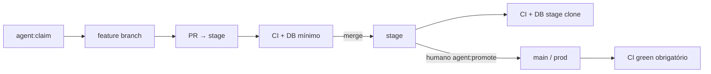

> **HISTÓRICO (2026-08-23):** plano de intenção **pré-main** (2026-07-30) do desenho stage/Neon do paradigma de agentes paralelos — **nunca implementado nessa forma** (todos ainda `pending`). O paradigma **vigente vive em [docs/AGENT-OPS.md](../AGENT-OPS.md)** ("operação do paradigma de agentes paralelos"): agentes entregam direto em `main`, deploy manual por `workflow_dispatch`, ladder de 2 ambientes (mínimo + prod), sem smoke stage. O corpo abaixo preserva **referências mortas da era stage/Neon** como registro histórico — `scripts/refresh-stage.mjs` (deletado 2026-08-01), Neon/stage (`STAGE_DATABASE_URL`, branch git `stage`, `ci-stage.yml`), job `migration-lock` (removido 2026-08-12), `gh pr create --base stage`, `pnpm agent:promote` — **nada aqui é instrução corrente.**

# Teqo ops: só GitHub + Cursor

## Norte (nesta ordem)

1. **Simplicidade** — zero Linear/Jira/Notion; zero board em markdown mutável; poucos comandos.
2. **Cursor Cloud readiness** — clone + `gh` + Postgres efêmero + **seed mínimo** bastam; always-on magro.
3. **Agent autonomy** — claim → implement → PR para **`stage`** → parar; promote a `main`/prod é humano.
4. **Guardrails programáticos progressivos** — miss → Issue → harvest → teste/ESLint em CI.
5. **Test ladder seguro** — agentes e PRs nunca tocam prod nem o clone cheio do stage; só o DB mínimo versionado.

Stack exclusiva:

| Papel                              | Onde                                                |
| ---------------------------------- | --------------------------------------------------- |
| Spec + status + deps + miss + prio | **GitHub Issues**                                   |
| Integração contínua de features    | Branch **`stage`** + PRs                            |
| Produção                           | Branch **`main`** → Vercel prod (só promote humano) |
| Qualidade                          | **GitHub Actions** (DB conforme o alvo)             |
| Execução                           | **Cursor** (Cloud/local)                            |
| Doctrine                           | **Repo** (kernels)                                  |



---

## Diagnóstico curto

Paralelismo hoje esbarra em roadmap/plans/ship-to-main/gate local; testes int dependem de `teqo_test` local sem um **seed mínimo documentado e obrigatório pós-migration**; não há **stage** entre feature e prod.

---

## Ambientes de dados (test ladder)

Três bancos, papéis distintos — não misturar:

| Ambiente                                     | Conteúdo                                              | Quem usa                                                 |
| -------------------------------------------- | ----------------------------------------------------- | -------------------------------------------------------- |
| **Mínimo** (`teqo_test` / service CI)        | Schema migrado + seed sintético pequeno, sem PII real | Agentes, Cloud, CI de **PR → stage**                     |
| **Stage** (Neon `teqo_stage` ou branch Neon) | Clone **100%** de prod, renovado periodicamente       | Só CI pós-merge em `stage` + humanos em smoke controlado |
| **Prod** (Neon prod)                         | Real                                                  | Deploy Vercel a partir de `main` apenas                  |

**Invariante de agente/Cloud:** nunca `DATABASE_URL` de stage/prod; nunca `ALLOW_REMOTE_DB` salvo promote/refresh humano documentado. Guards existentes (`assert-local-database`, `guard-dev-db`) permanecem; stage CI usa secret só no runner GHA.

### DB mínimo — script canônico

**Entrega da Onda 0:** `pnpm db:seed:minimal` (ex. [`scripts/seed-minimal.mjs`](scripts/seed-minimal.mjs)), idempotente (upsert por slug/phone).

Conteúdo inicial (ajustável à medida que o contrato de testes muda):

- `Consent` keys estáveis: `lideranca-autopreenchimento`, `apoiador-cadastro`, `apoiador-intencao-voto`, `whatsapp-inscricao` (richText mínimo).
- `campaignUser`: 1 coordinator, 1 advisor, 1 candidate, 1 leader (phones/emails sintéticos).
- `municipality`: 3–5 municípios (ex.: Salvador ZE 1, Camaçari, + 2 outros) — não as 435; fixtures de teste usam catálogo estático quando precisam de todas.
- `organization`, `stateDeputy`: 1 cada.
- `leadership`, `supporter`: 2–3 sintéticos (phones `+551199999999X`).
- `campaignGoals`: global default.
- Artefatos TSE/`electionAggregates`: já commitados — não seed.

**Não** importa TSE completo / posts de produção / planilha de projeção inteira — artefatos estáticos e fixtures de teste já cobrem o que for imutável. Documentado em `docs/AGENT-OPS.md` + [`docs/TESTING.md`](docs/TESTING.md).

**Contrato de toda tarefa (skill + checklist de PR):**

1. Se a entrega adiciona migration, collection, Consent key, dado obrigatório para boot, ou quebra o seed → **atualizar `db:seed:minimal` no mesmo PR**.
2. CI do PR falha se `migrate` + `seed:minimal` + `test:int` não passam — o seed é parte do gate, não “doc opcional”.
3. `agent:file-miss` se alguém mergeou schema sem seed (padrão → guardrail: convention test que o script exporta uma lista de keys/collections pinned, ou smoke job dedicado).

Bootstrap agente/Cloud:

```text
pnpm db:start   # ou service no environment.json
pnpm migrate
pnpm db:seed:minimal
pnpm test:unit          # fast gate local
# int completo = CI do PR (ou local opcional)
```

### Stage — snapshot de prod (Neon)

- **DB stage = Neon branch criada a partir do snapshot de prod** (PII incluída). Acesso restrito: apenas maintainers + CI stage. Agentes/Cloud **nunca** recebem essa URL.
- **Refresh = criar nova Neon branch + atualizar `STAGE_DATABASE_URL`** (não tentar DELETE/INSERT de dados reais). Script: [`scripts/refresh-stage.mjs`](scripts/refresh-stage.mjs) (humano / `workflow_dispatch` manual).
- Branch git **`stage`** (protegida): único alvo de merge dos agentes. **Auto-merge habilitado no repo + regra de branch** (PR para stage mergeia sozinho quando CI verde).
- CI stage usa GitHub Environment `stage` com `STAGE_DATABASE_URL`.
- Vercel: **preview da branch `stage` na Onda 0** (project staging ou preview branch).

---

## Fluxo git: feature → stage → main

| Passo                    | Quem                                                                                                                       | Regra                                                                                                                                                  |
| ------------------------ | -------------------------------------------------------------------------------------------------------------------------- | ------------------------------------------------------------------------------------------------------------------------------------------------------ |
| PR feature → **`stage`** | Agente (`gh pr create --base stage`)                                                                                       | CI **PR** green (DB mínimo)                                                                                                                            |
| Merge em `stage`         | **Automático** quando CI PR green                                                                                          | **NUNCA** roda `pnpm build` (migra prod). CI stage = `migrate` + `int` (+ opcional e2e smoke) contra `STAGE_DATABASE_URL`. Fecha Issue / unblock deps. |
| **`stage` → `main`**     | **Só humano**: `pnpm agent:promote --i-am-human`, confirmação explícita em sessão de agente, ou `workflow_dispatch` manual | Requer CI stage green + CI do PR promote green (service Postgres + build). Antes: rebase/merge de `main` em `stage` se divergiu.                       |
| `main` → prod            | Vercel no push de `main`                                                                                                   | Como hoje; migrate no build.                                                                                                                           |

Agente **default: para no merge a stage**. Promote não é autónomo.

`ship-to-main` local morre. `pnpm agent:promote`:

- Cria PR `stage` → `main` (ou fast-forward controlado).
- Exige confirmação humana / flag `--i-am-human`.
- Não roda em Automation sem aprovação.

Close Issue + unblock: no **merge em stage** (desbloqueia paralelos). Label opcional `in-prod` quando promote mergeia.

`docs/plans/<slug>.md`: plan snapshot só para **Issue nova** — nunca recriar plans históricos no merge (quebra links já em `docs/roadmap.md` e PRs antigos).

Se `main` divergir de `stage` (hotfix em `main`), promove exige antes: merge/rebase de `main` em `stage` + CI stage green novamente.

---

## CI por alvo (GitHub Actions)

Substituir/ampliar [`.github/workflows/ci.yml`](.github/workflows/ci.yml) em jobs claros:

### A) PR feature → stage (DB mínimo)

Workflow: `.github/workflows/ci-pr.yml` (ou job em ci.yml).

1. Service `postgres:17-alpine` → `teqo_test`.
2. `pnpm install` → lint → format → typecheck → knip → cycles → `test:unit`.
3. `pnpm migrate` → **`pnpm db:seed:minimal`** → `test:int`.
4. `pnpm build` (mesmo service; `DATABASE_URL` local).
5. Check: ≤1 PR aberto tocando `src/migrations/` | `payload-types.ts` (job próprio `migration-lock`).

### B) Merge em `stage` (CI stage)

Workflow: `.github/workflows/ci-stage.yml` (trigger `push: branches: [stage]`).

1. `environment: stage` + `STAGE_DATABASE_URL`.
2. `pnpm migrate` (contra stage; **nunca** `pnpm build` — build migra prod).
3. `test:int` (+ opcional e2e smoke contra preview) **sem** `db:seed:minimal` — dados = snapshot prod.
4. Falha → bloqueia promote (status check em `main`).

### C) PR `stage` → `main` (promote)

Workflow: `.github/workflows/ci-promote.yml` (PR base `main`).

1. Service Postgres + `migrate` + `seed:minimal` + `int` + `build` (igual PR feature).
2. Requer último CI stage green.
3. Branch protection `main`: só PR a partir de `stage`, review humano, checks required.

E2e pesado: nightly em stage ou label `run:e2e`; não bloqueia autonomy do PR mínimo.

Fast gate local do agente (antes do push): `lint + typecheck + unit` (+ opcional `migrate && seed:minimal && test:int` se tocou schema). Int completo / build = CI.

---

## Superfície de comandos

| Comando                           | Faz                                                                                              |
| --------------------------------- | ------------------------------------------------------------------------------------------------ |
| `pnpm agent:claim`                | Fila ready+unblocked por prio → `in-progress` + brief                                            |
| `pnpm agent:register`             | Cria Issue (spec + prio)                                                                         |
| `pnpm agent:prioritize`           | Reajusta prio                                                                                    |
| `pnpm agent:file-miss`            | Issue kind:agent-miss/defect                                                                     |
| `pnpm agent:promote --i-am-human` | **Humano:** PR `stage→main` + merge se CI green; recusa se `main` divergiu de `stage` sem rebase |
| `pnpm db:seed:minimal`            | DB mínimo para agentes/CI PR                                                                     |
| `pnpm db:refresh:stage`           | **Humano/CI manual:** nova Neon branch stage + atualiza secret (não roda em agente)              |

Labels: estado `ready|in-progress|blocked|done`; `kind:*`; `prio:P0`…`P3`; `needs:migration|consent`; `requirements-changed`.

Prioridade / claim: inalterados (banda + score; dry-run = fila).

---

## Autonomia do agente

```text
boot → claim → implementar
  → (se schema) atualizar db:seed:minimal
  → fast gate
  → gh pr create --base stage (Closes #N)
  → PARAR
```

Proibido ao agente sem ordem humana explícita: merge/promote para `main`, apontar stage/prod DB, refresh prod→stage, editar `vercel.json` regions, rodar `pnpm build` em CI stage.

Cloud env: `gh` autenticado (Cursor GitHub integration); sem secrets de stage/prod.

---

## Cursor Cloud readiness

| Item     | Ação                                                           |
| -------- | -------------------------------------------------------------- |
| Contexto | Fatiar AGENTS; kernels PRODUCT/DESIGN/CUSTOMER; `.agentignore` |
| Env      | Compose Postgres + `migrate` + `db:seed:minimal`               |
| Hooks    | Paths relativos                                                |
| Regra    | PR base `stage`; nunca Neon; 1 Issue/run                       |
| Brief    | stdout do claim                                                |

---

## Guardrails progressivos

Igual: `file-miss` → harvest → PR com `codebaseConventions`/ESLint → ledger `docs/GUARDRAILS.md`. Incluir padrão “migration sem atualizar seed:minimal”.

---

## Ondas

### Onda 0 — Fundação test + GitHub

0. **Remover Codeberg** de todo o projeto ([`package.json`](package.json) homepage/repository/bugs, [`AGENTS.md`](AGENTS.md), [`docs/TECH-DEBT.md`](docs/TECH-DEBT.md), `.github/workflows/ci.yml` header, qualquer doc). GitHub é a única casa.
1. **`db:seed:minimal`** (script + conteúdo + docs + CI PR).
2. **CI PR** (`.github/workflows/ci-pr.yml`): service → migrate → seed:minimal → int → build.
3. **Branch `stage`** + protection (**auto-merge** habilitado) + `ci-stage.yml` (stage DB, **sem build**).
4. **Stage DB** (Neon prod snapshot) + runbook refresh **semanal**.
5. **Vercel preview** para branch `stage` na Onda 0.
6. Labels/prio + scripts `claim|register|prioritize|file-miss|promote` + seed Issues (body = plan atual, `depends` do roadmap).
7. Contexto Cursor: `AGENT-OPS.md`, fatiar AGENTS, kernels, `.agentignore`, Cloud env (Compose+seed:minimal), hooks portáteis, standards fast-gate, PR template.
8. **README cheatsheet** — seção curta no topo do [`README.md`](README.md) para humanos: fluxo em 5 linhas, comandos `pnpm agent:*`, labels, o que o agente faz sozinho vs o que exige humano, links para `AGENT-OPS.md`/CI/skills. Não duplicar o setup local — só a operação agentic.

Ordenar: 0 primeiro (limpa base), depois 1/2, depois 3/4/5, depois 6/7/8.

### Onda 1 — Autonomy

7. Skills → PR base `stage`; Automation `requirements-changed`; matar ship-to-main.
8. Contrato de PR: seed atualizado se schema mudou (PR template checkbox + CI smoke).

### Onda 2 — Stage ops + aprendizado

9. Runbook/script `refresh-stage` (`workflow_dispatch`, só maintainers).
10. Harvest guardrails; compile-roadmap opcional; Vercel staging preview se ainda não existir.

---

## Não muda

- Guards “nunca Neon” **para agentes**; invariantes Payload; serializers; `gru1`.
- Prod continua só via `main`; o que muda é que `main` só recebe promote humano desde `stage`.

---

## Sucesso

- Agente valida com `migrate` + `seed:minimal` (+ CI PR); nunca precisa do dataset de prod.
- Toda migration que quebra o mínimo falha CI até o seed ser ajustado no mesmo PR.
- Features land em `stage`; `main`/prod só via `agent:promote` humano com CI stage + PR green.
- Stage DB = Neon prod snapshot; agentes não usam esse DB; refresh é nova branch + swap de secret.
- CI stage nunca roda `pnpm build` (migra prod); build só em PR feature/promote.
- Codeberg fora de tudo; GitHub único remote/casa.
- README tem cheatsheet de operação agentic para humanos.
- Claim por prioridade; specs em Issues; miss→guardrail; always-on &lt; ~15k tokens.
