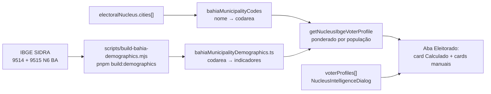

# Perfis do eleitorado — perfil médio IBGE + manuais

Status: em implementação
Atualizado em: 2026-07-19
Item do roadmap: [docs/roadmap.md](../roadmap.md) (Trilha A, item A8)
Responsável: —
Appetite: ~1–1,5 dia eng (artefato estático + derivação + UI encaixe + opt-in de cópia)
Impeccable: classe B (UI encaixada na aba Eleitorado existente)

## Contexto

A aba **Eleitorado** do detalhe do núcleo (`ElectorateContent` em `src/components/campaign/NucleusActiveTab.tsx`, só `staff`) já persiste perfis manuais no array `electoralNucleus.voterProfiles` (`label`, `ageRange`, `incomeBand`, `occupation`, `localTraits`, `notes`) — edição via `NucleusIntelligenceDialog`. Hoje a lista começa vazia; o empty state diz que perfis “serão trabalhados na próxima etapa”.

A oportunidade (decisão de produto 2026-07-19): usar **dados agregados públicos do IBGE** (Censo 2022 e tabelas relacionadas) para **derivar um perfil médio/comum do território** do núcleo a partir de `cities[]`, exibi-lo como cartão distinto, e **continuar permitindo perfis manuais** adicionais (já existentes). Isso dá um ponto de partida honesto para a coordenação sem forçar cadastro à mão, e sem inventar um cadastro paralelo de “pessoa” — é inteligência territorial, não CRM.

Já temos o join estável município → código IBGE 7 dígitos em `src/lib/bahiaMunicipalityCodes.ts` (B2) e a geografia multi-município em `cities[]` (A1).

## Objetivos

- Importar (CLI, estático) indicadores demográficos municipais BA suficientes para montar um “perfil médio” legível (faixa etária dominante, sexo, idade mediana).
- Derivar em leitura o perfil do núcleo a partir de `cities[]` (média ponderada pela população quando houver >1 município; só `regions` → união das cidades do TI via `citiesForTerritory`).
- Exibir o perfil calculado na aba Eleitorado, claramente marcado como **Calculado (IBGE)**, separado dos manuais.
- Manter CRUD de `voterProfiles` manuais; botão opt-in “Usar como perfil manual” (copia o calculado para o array, editável depois).
- Guardrails: dado público agregado (sem PII, sem `Consent`); access só staff (mesmo escopo da aba Eleitorado hoje); sem chamada HTTP ao IBGE em runtime de request; `overrideAccess: false` nas leituras de núcleo.

## Decisões travadas

- **Perfil calculado é derivado em leitura, não sobrescreve `voterProfiles`.** Persistir no array misturaria fonte IBGE com edição humana e apagaria trabalho do coordenador em re-seed. O cartão IBGE é view model; o array continua 100% manual.
- **Dado estático versionado no repo** (padrão B2/`bahiaTseZones`/`bahiaMunicipalityCodes`), não collection Payload nem fetch SIDRA por request. Script re-executável baixa SIDRA, emite `src/lib/bahiaMunicipalityDemographics.ts` (+ fixture). Sem migration, sem `Consent`, sem revalidate (páginas de campanha dinâmicas).
- **Granularidade município.** Núcleo indexa `cities[]`; bairro/seção não têm série IBGE estável alinhada ao app. Multi-cidade = ponderação por população residente do Censo.
- **Sem geografia → estado “sem perfil IBGE”** (mesmo espírito do baseline TSE sem território).
- **v1 cobre BA, Censo 2022** — tabelas SIDRA **9514** (população por sexo/idade) + **9515** (idade mediana). Faixas agregadas: `0–17` / `18–29` / `30–59` / `60+`. `incomeBand` / `occupation` / cor-raça **fora** até haver tabela municipal estável no Agregados.
- **Staff-only na v1** — aba Eleitorado continua redirecionando `lideranca` para overview.
- **UI:** números + 1 linha de síntese template (constantes versionadas), sem LLM.
- **Copiar para `voterProfiles`:** botão opt-in “Usar como perfil manual” via Server Action de append; nunca auto-append no load.
- **i18n e naming** (AGENTS.md): identificadores em inglês (`bahiaMunicipalityDemographics`, `getNucleusIbgeVoterProfile`, `ComputedVoterProfileViewModel`); strings visíveis em pt-BR (“Perfil médio do território”, “Calculado (IBGE Censo 2022)”).

## Abordagem proposta

Componentes:

- **`bahiaMunicipalityDemographics`** (`src/lib/bahiaMunicipalityDemographics.ts`): mapa `codarea` → `{ population, ageBands, sexShareFemale, medianAge }` + helpers `demographicsForCode` / `demographicsForMunicipalityName`. Cabeçalho com URL + SHA-256 dos downloads (padrão `bahiaMunicipalityCodes`).
- **`getNucleusIbgeVoterProfile`** (`src/utilities/nucleusIbgeVoterProfile.ts`): entrada `{ cities, regions }` → `ComputedVoterProfileViewModel | { status: 'semPerfil' }`. Resolve cidades efetivas (`cities` ou `citiesForTerritory`); pondera indicadores; formata `label` fixo (“Perfil médio do território”) + campos alinhados ao schema manual para a UI e para o opt-in de cópia.
- **`ElectorateContent`** (`NucleusActiveTab.tsx`): acima dos manuais, card `NucleusIbgeVoterProfile` com badge “Calculado (IBGE)”; empty state só quando não há calculado **nem** manuais.
- **Script** `scripts/build-bahia-demographics.mjs` (`pnpm build:demographics`): baixa SIDRA para os 417 municípios BA; cache `data/demographics/` (gitignored); **não toca banco**. Fora de `pnpm build` / `pnpm dev`.
- **Testes:** unit do ponderador; int de cobertura 417 `codarea` vs `bahiaMunicipalityCodes` + fixture `tests/fixtures/bahia-municipality-demographics.official.json`.
- **Migration:** nenhuma.

## Rabbit holes (não tocar)

- HTTP SIDRA em request path
- Microdados / perfilamento individual
- Abrir Eleitorado para `lideranca`
- Camada demográfica no mapa Leaflet (B3/B4)
- Acoplar loaders A3/A4/TSE
- Collection Payload / migration “só por precaução”
- RAIS/PNAD / Censo 2010 / renda sem tabela municipal estável

## Adiado com gatilho

- **Pré-agregar demographics por TI no build** (`demographicsForTerritory`). Revisitar quando núcleos só-`regions` com >15 municípios mostrarem latência perceptível em prod.
- **Semântica IBGE vs mapa TSE.** Perfil IBGE usa todas as cidades do território (`resolveNucleusTerritoryCities`); o coroplético/mapa usa geografia TSE com zonas (`resolveNucleusElectionGeography`) — footprint vazio com perfil IBGE visível é possível. Revisitar se coordenação reportar confusão; copy de empty state ou nota na UI, não mudança de fonte.
- **Impeccable polish classe B** (shape/critique/polish da aba Eleitorado). Revisitar antes de marcar A8 entregue em prod com dados reais.
- **Follow-ups de engenharia pós-`/simplify`** (lazy load ~68KB, cobertura parcial, size budget) → [escala-dry-pos-a8.md](escala-dry-pos-a8.md) (fill-in **A8+**).

## Dependências

- **Dura:** A1 Território multi-município/bairro ✓ — `cities[]` / `regions[]` e `citiesForTerritory`.
- **Suave:** B2 ✓ — `bahiaMunicipalityCodes` / `codeForMunicipality`.
- **Nenhuma dependência de A3/A4** — fonte IBGE ≠ TSE.
- Reusa: `voterProfiles` + `NucleusIntelligenceDialog` + aba Eleitorado staff-only; padrão de artefato estático de B2.

## Não escopo

- Microdados IBGE / perfilamento de indivíduos (LGPD; fora de escopo absoluto).
- Perfil por bairro/seção (sem série alinhada; E5 cobre Salvador por bairro no eixo eleitoral TSE, não demográfico).
- Insights de voto A5 (conversão, classificação, alavancagem…) — planos `insight-*.md`.
- Camada demográfica no mapa Leaflet (B3) — eventual follow-up.
- PNAD contínua, RAIS/CAGED, Estimativas anuais pós-2022 — fase futura.
- Abrir a aba Eleitorado para `lideranca` (mudança de access à parte).

## Referências

- `docs/roadmap.md` (Trilha A, item A8; Janela 2)
- `src/collections/ElectoralNucleus.ts` — campo `voterProfiles`
- `src/components/campaign/NucleusActiveTab.tsx` — `ElectorateContent` (staff-only)
- `src/components/campaign/NucleusIntelligenceDialog.tsx` — editor manual
- `src/lib/schemas/nucleus.ts` — `voterProfileSchema`
- `src/lib/bahiaMunicipalityCodes.ts` — join IBGE
- `src/lib/bahiaTerritories.ts` — `citiesForTerritory`
- `docs/plans/mapa-bahia-geometrias.md` — precedente de artefato estático + script CLI
- `docs/plans/baseline-eleitoral-tse.md` — precedente de dado público agregado (TSE; fonte distinta)
- `docs/plans/escala-dry-pos-a8.md` — fill-in A8+ (lazy demographics, cobertura parcial, size budget)
- IBGE SIDRA: https://apisidra.ibge.gov.br/
- AGENTS.md — naming EN/pt-BR; Campaign auth; sem PII; padrão estático B2
