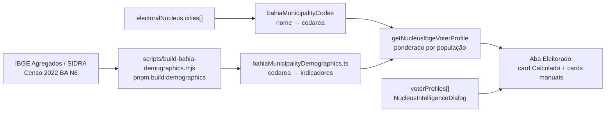

# Perfis do eleitorado — perfil médio IBGE + manuais

Status: rascunho
Atualizado em: 2026-07-19
Item do roadmap: [docs/roadmap.md](../roadmap.md) (Trilha A, item A8)
Responsável: —

## Contexto

A aba **Eleitorado** do detalhe do núcleo (`ElectorateContent` em `src/components/campaign/NucleusActiveTab.tsx`, só `staff`) já persiste perfis manuais no array `electoralNucleus.voterProfiles` (`label`, `ageRange`, `incomeBand`, `occupation`, `localTraits`, `notes`) — edição via `NucleusIntelligenceDialog`. Hoje a lista começa vazia; o empty state diz que perfis “serão trabalhados na próxima etapa”.

A oportunidade (decisão de produto 2026-07-19): usar **dados agregados públicos do IBGE** (Censo 2022 e tabelas relacionadas) para **derivar um perfil médio/comum do território** do núcleo a partir de `cities[]`, exibi-lo como cartão distinto, e **continuar permitindo perfis manuais** adicionais (já existentes). Isso dá um ponto de partida honesto para a coordenação sem forçar cadastro à mão, e sem inventar um cadastro paralelo de “pessoa” — é inteligência territorial, não CRM.

Já temos o join estável município → código IBGE 7 dígitos em `src/lib/bahiaMunicipalityCodes.ts` (B2) e a geografia multi-município em `cities[]` (A1).

## Objetivos

- Importar (CLI, estático) indicadores demográficos municipais BA suficientes para montar um “perfil médio” legível (idade dominante, sexo, renda, escolaridade/ocupação quando a tabela cobrir).
- Derivar em leitura o perfil do núcleo a partir de `cities[]` (média ponderada pela população quando houver >1 município; só `regions` → união das cidades do TI via `citiesForTerritory`).
- Exibir o perfil calculado na aba Eleitorado, claramente marcado como **Calculado (IBGE)**, separado dos manuais.
- Manter CRUD de `voterProfiles` manuais; opcionalmente oferecer “Adicionar como perfil” (copia o calculado para o array, editável depois).
- Guardrails: dado público agregado (sem PII, sem `Consent`); access só staff (mesmo escopo da aba Eleitorado hoje); sem chamada HTTP ao IBGE em runtime de request; `overrideAccess: false` nas leituras de núcleo.

## Decisões travadas

- **Perfil calculado é derivado em leitura, não sobrescreve `voterProfiles`.** Persistir no array misturaria fonte IBGE com edição humana e apagaria trabalho do coordenador em re-seed. O cartão IBGE é view model; o array continua 100% manual.
- **Dado estático versionado no repo** (padrão B2/`bahiaTseZones`/`bahiaMunicipalityCodes`), não collection Payload nem fetch SIDRA por request. Script re-executável baixa Agregados/SIDRA (ou CSV oficial), emite `src/lib/bahiaMunicipalityDemographics.ts` (+ fixture). Sem migration, sem `Consent`, sem revalidate (páginas de campanha dinâmicas).
- **Granularidade município.** Núcleo indexa `cities[]`; bairro/seção não têm série IBGE estável alinhada ao app. Multi-cidade = ponderação por população residente do Censo.
- **Sem geografia → estado “sem perfil IBGE”** (mesmo espírito do baseline TSE sem território).
- **v1 cobre BA, Censo 2022** (e tabelas de rendimento/trabalho já divulgadas no mesmo ciclo). Séries antigas (2010) e PNAD contínua ficam fora.
- **i18n e naming** (AGENTS.md): identificadores em inglês (`bahiaMunicipalityDemographics`, `getNucleusIbgeVoterProfile`, `ComputedVoterProfileViewModel`); strings visíveis em pt-BR (“Perfil médio do território”, “Calculado (IBGE Censo 2022)”).

## Questões em aberto

- **Quais indicadores entram no cartão v1?** Faixa etária modal + % sexo + renda domiciliar per capita (ou faixa) + cor/raça dominante são o mínimo útil e mapam bem aos campos já existentes (`ageRange`/`incomeBand`). Ocupação formal (RAIS) é outra fonte. **Recomendação:** v1 = população + pirâmide etária resumida (3–4 faixas) + sexo + rendimento; `occupation`/`localTraits` só no manual ou numa linha “destaque” textual gerada se houver variável estável; definir tabelas SIDRA exatas na implementação e documentar no cabeçalho do módulo.
- **`lideranca` vê o perfil IBGE?** Hoje a aba Eleitorado redireciona `lideranca` para overview. **Recomendação:** manter staff-only na v1 (dado agregado público, mas a superfície de inteligência já é staff); reavaliar com produto se quiserem kit de campo para liderança.
- **Texto gerado vs. só números?** Um parágrafo (“Predominam adultos 30–59, renda …”) ajuda o empty state; números sozinhos evitam tom “científico” falso. **Recomendação:** números + 1 linha de síntese template (constantes versionadas), sem LLM.
- **Copiar para `voterProfiles`?** **Recomendação:** botão opt-in “Usar como perfil manual” na aba (Server Action que faz append de um item pré-preenchido); nunca auto-append no load.

## Abordagem proposta

Componentes:

- **`bahiaMunicipalityDemographics`** (`src/lib/bahiaMunicipalityDemographics.ts`): mapa `codarea` → `{ population, ageBands, sexShare, incomeBand, … }` + helpers `demographicsForCode` / `demographicsForMunicipalityName`. Cabeçalho com URL + SHA-256 dos downloads (padrão `bahiaMunicipalityCodes`).
- **`getNucleusIbgeVoterProfile`** (`src/utilities/nucleusIbgeVoterProfile.ts`, `server-only`): entrada `{ cities, regions }` → `ComputedVoterProfileViewModel | { status: 'semPerfil' }`. Resolve cidades efetivas (`cities` ou `citiesForTerritory` de `bahiaTerritories.ts`); pondera indicadores; formata `label` fixo (“Perfil médio do território”) + campos alinhados ao schema manual para a UI e para o opt-in de cópia.
- **`ElectorateContent`** (`NucleusActiveTab.tsx`): acima dos manuais, card `NucleusIbgeVoterProfile` (novo, PascalCase) com badge “Calculado (IBGE)”; empty state só quando não há calculado **nem** manuais; atualizar copy (“nenhum perfil cadastrado” → distinguir ausência de IBGE vs. ausência de manuais).
- **`NucleusIntelligenceDialog`**: sem mudança obrigatória no schema; opcionalmente botão/ação “Adicionar perfil a partir do IBGE” que pré-preenche um `EditableProfile` no estado cliente (ou Server Action de append).
- **Script** `scripts/build-bahia-demographics.mjs` (`pnpm build:demographics`): baixa Agregados para os 417 municípios BA; reusa `downloadToBuffer` / cache sob `data/demographics/` (gitignored); **não toca banco** (sem `assertLocalDatabase`). Fora de `pnpm build` / `pnpm dev`.
- **Testes:** unit do ponderador (1 cidade, 2 cidades, sem geografia, município sem row); int de cobertura 417 `codarea` vs `bahiaMunicipalityCodes` + fixture `tests/fixtures/bahia-municipality-demographics.official.json`.
- **Migration:** nenhuma. Sem collection nova. Sem Consent. Server Action só se o opt-in de cópia for mutação dedicada (senão reusa o update de inteligência existente).

## Dependências

- **Dura:** A1 Território multi-município/bairro ✓ — `cities[]` / `regions[]` e `citiesForTerritory`.
- **Suave:** B2 ✓ — `bahiaMunicipalityCodes` / `codeForMunicipality` (sem isso o script teria que reimplementar o join nome→`codarea`).
- **Nenhuma dependência de A3/A4** — fonte IBGE ≠ TSE; o baseline de votos e o perfil demográfico convivem na mesma ficha sem acoplamento de dados.
- Reusa: `voterProfiles` + `NucleusIntelligenceDialog` + aba Eleitorado staff-only; padrão de artefato estático de B2.

## Não escopo

- Microdados IBGE / perfilamento de indivíduos (LGPD; fora de escopo absoluto).
- Perfil por bairro/seção (sem série alinhada; E5 cobre Salvador por bairro no eixo eleitoral TSE, não demográfico).
- Insights de voto A5 (conversão, classificação, alavancagem…) — planos `insight-*.md`.
- Camada demográfica no mapa Leaflet (B3) — eventual follow-up se o coroplético quiser densidade/renda.
- PNAD contínua, RAIS/CAGED, Estimativas anuais pós-2022 — fase futura se o Censo 2022 cobrir o ciclo.
- Abrir a aba Eleitorado para `lideranca` (mudança de access à parte).

## Referências

- `docs/roadmap.md` (Trilha A, item A8; Janela 3)
- `src/collections/ElectoralNucleus.ts` — campo `voterProfiles`
- `src/components/campaign/NucleusActiveTab.tsx` — `ElectorateContent` (staff-only)
- `src/components/campaign/NucleusIntelligenceDialog.tsx` — editor manual
- `src/lib/schemas/nucleus.ts` — `voterProfileSchema`
- `src/lib/bahiaMunicipalityCodes.ts` — join IBGE
- `src/lib/bahiaTerritories.ts` — `citiesForTerritory`
- `docs/plans/mapa-bahia-geometrias.md` — precedente de artefato estático + script CLI
- `docs/plans/baseline-eleitoral-tse.md` — precedente de dado público agregado (TSE; fonte distinta)
- IBGE API Agregados: https://servicodados.ibge.gov.br/api/v3/agregados
- IBGE SIDRA: https://apisidra.ibge.gov.br/
- AGENTS.md — naming EN/pt-BR; Campaign auth; sem PII; padrão estático B2
