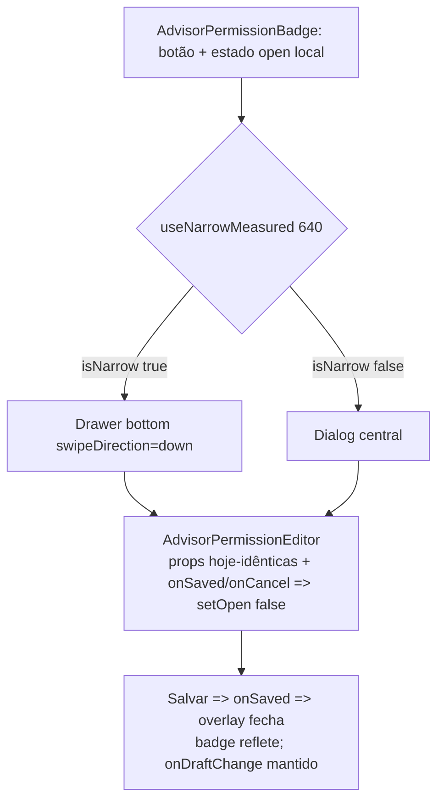

# Impl: Assessores — editor de permissão em modal central (desktop) + bottom drawer (mobile) no lugar do popover

Status: rascunho
Atualizado em: 2026-08-23
Issue: #813
Intenção: docs/plans/permissao-assessores-modal-central.md
Appetite restante: herdado (~0,5–1 dia eng)

## Leitura da intenção

- **Outcome**: na `/campanha/assessores`, tocar no badge "Permissão" abre o editor Visão × Edição num overlay **centralizado que nunca estoura o viewport** — Dialog central no desktop, bottom drawer no celular. Só o invólucro muda; o editor, os combos, a nota e as regras de coerência do C141 ficam intactos. Salvar fecha o overlay e o badge reflete o novo perfil; a linha de assessor de rascunho segue usando `onDraftChange` local.
- **O que NÃO negociar**: editor intocado (inclusive footer Cancelar condicional + Salvar e ids `advisor-permission-visibility`/`advisor-permission-editing`); `aria-label="Permissão de ${advisorName}"` do badge preservado; editor embutido no detalhe do assessor (`[id]/page.tsx`) não participa; nenhuma escrita nova no banco (acesso/transações N/A); sinal de breakpoint **vive no badge/overlay, não na tabela**.
- **O que reavaliar**: nada de produtividade aberto — bottom drawer, "salvar fecha" e footer mantido foram assumidos na intenção. Reavaliar só decisões técnicas caras (a11y do Dialog, onde mora o `isNarrow`, guarda de altura) — detalhadas abaixo.

## Abordagem recomendada

**Opções consideradas:** A (manter Popover) | B (`isNarrow` passado por prop a partir da `AdvisorsTable`) | C (troca do invólucro **dentro** do `AdvisorPermissionBadge`, `isNarrow` via hook no próprio badge) — **recomendada C**.

**Rejeitadas (só decisões caras):**

- **A — manter Popover.** É o status quo que estoura o viewport; a tabela `min-w-[56rem]` com scroll horizontal é exatamente o sintoma que o outcome manda matar. Rejeitada pela intenção.
- **B — `isNarrow` em cada call site / prop do host.** Forçaria `AdvisorsTable` a conhecer o breakpoint e a passar o sinal nos dois usos (dados ~473 e rascunho ~351) — é o rabbit hole "estado responsivo na tabela" que a intenção manda cortar; o sinal pertence ao invólucro. Rejeitada.
- _(Não considerada: componente two-in-one responsivo novo — não pedido; a troca fica no arquivo do badge.)_

### Componentes / mudanças

- **`AdvisorPermissionBadge.tsx`** (`src/components/campaign/advisor/`): o único arquivo alterado. Troca o wrapper `Popover` por `isNarrow ? <Drawer> : <Dialog>`; adiciona `useNarrowMeasured(640)` no badge; mantém o `<button>` do trigger intacto (`aria-label` preservado) e o par `open`/`onOpenChange={setOpen}`; o editor entra com as **mesmas props** de hoje incl. `onSaved`/`onCancel` → `setOpen(false)`. Remove o import de `@/components/ui/Popover` e os estilos mortos `w-80 align="start"`.
- **`AdvisorPermissionEditor.tsx`** (`src/components/campaign/advisor/`): **não toca**. `showHeading=true` default renderiza o heading visível "Permissão da conta"; footer Cancelar (condicional) + Salvar exatamente como está.
- **`dialog.tsx`** (`src/components/ui/`, minúsculo — a intenção diz `Dialog.tsx`, não existe; usar o caminho real): somente uso, sem alteração. `DialogContent` default traz `max-w-sm`, `showCloseButton=true` (X) e requer `DialogTitle` para a11y.
- **`Drawer.tsx`** (`src/components/ui/`): somente uso, sem alteração. `swipeDirection='down'` default já é bottom-anchored; capa de altura default limita o drawer na tela.
- **`useNarrowMeasured(640)`** (`src/hooks/use-mobile.ts`): existe; usar `{ isNarrow }`, ignorar `measured` (overlay só abre por interação).
- **Migration**: sem migration.
- **Access / Consent**: N/A — nenhuma escrita nova; server action `updateAdvisorPermissionFormAction` intacta.
- **UI**: Impeccable B — shape→craft→critique→polish; shell do C123 a reusar (Dialog central + Drawer bottom), sem alterar o `ui/` kit.

## Fases verificáveis

1. **Tracer** — troca mínima do invólucro em `AdvisorPermissionBadge.tsx`: hook `useNarrowMeasured`, controle `open` idêntico, editor com props inalteradas, remoção do import de Popover. Verificar no `pnpm dev` os dois pontos da `AdvisorsTable` (rascunho ~351 e dados ~473) e o detalhe `[id]/page.tsx` **intocado**. Gate: `tsc --noEmit`, lint.
2. **UI** — crafting da superfície (sem tocar o kit): `DialogContent` com `max-h-[calc(100dvh-2rem)]` + `overflow-y-auto` (guarda anticlip em viewports baixos); `DialogTitle` **sr-only** (texto "Permissão da conta") para cumprir a a11y do Radix **sem** duplicar o heading visível do editor; `DrawerContent` com `overflow-y-auto` + padding, apoiado na capa default; `DrawerHeader`/`DrawerTitle` também sr-only; tema `data-theme="campaign"` herdado pelos portais (sem re-aplicação). Verificar desktop largo/estreito (nunca estoura), mobile bottom drawer. Gate: `tests/int/campaignAdvisorPermission.int.spec.ts` (server-side, não deve mudar), build.
3. **Gates** — `pnpm gate:fast` (lint, format, typecheck, knip, cycles, test, build). Sem migration/access, sem unit novo do badge (não há unit hoje; e2e `campaignPermissionProfile` não toca o badge). Não adicionar e2e novo neste item (appetite).

## Rabbit holes / Não escopo (engenharia)

- **Cascata de troca de popovers** no `/campanha` — fora; só o badge de permissão decide.
- **Editor inline no badge** / estado responsivo na `AdvisorsTable` — fora; o sinal `useNarrowMeasured(640)` vive no badge.
- **Two-in-one responsivo novo** / alterações no `ui/dialog.tsx` ou `ui/Drawer.tsx` — não pedido; uso apenas.
- **X do Dialog como "fechar sem salvar" adicional**: manter default `showCloseButton=true` — coerente com a superfície e com Esc/backdrop que já fecham sem salvar; não toca o footer do editor.
- **Adiado com gatilho (triage simplify):** o padrão "Dialog/Drawer keyed em `isNarrow`" já se repete em >3 overlays (`ActivityOverlay`, `CampaignNotificationBell`, `CampaignUpdatesCreateModal`, `CalendarFeedDialog`, `GoogleCalendarSyncDialog`, …). Extrair um primitivo `ResponsiveSheet` genérico em `components/ui` **agora** seria abstração prematura (cada overlay é personalizado; este badge é um call site distinto). **Gatilho:** quando uma 3ª superfície precisar do MESMO wrapper repetido → extrair; registrar como débito à parte, não bloatar esta entrega.

## Riscos e mitigação

- **Radix `Dialog` sem `DialogTitle`** → warning de a11y / screen-reader lê overlay sem nome. Mitigação: `DialogTitle` sr-only com o mesmo texto do heading do editor; sem duplicação visual.
- **Overflow em viewport muito baixo** (desktop e drawer) → `max-h` + `overflow-y-auto` no DialogContent/DrawerContent; o drawer já tem capa default. Garante o "nunca estoura" do aceite.
- **Algum seletor e2e ancorado no DOM do Popover do badge** → verificado pelo explorador: `campaignPermissionProfile.e2e` (C142) e `campaignColumnPicker.e2e` (renderiza linha, não abre o badge) não selecionam o popover. Re-conferir com grep antes do merge.
- **Editor remonta por overlay** → o editor reseta estado local a cada abertura, igual ao Popover atual; nenhuma regressão. `onDraftChange` continua local, sem escrita no servidor.

## Aceite de engenharia

- [ ] Troca de invólucro inteira dentro de `AdvisorPermissionBadge.tsx`; `AdvisorPermissionEditor.tsx`, `dialog.tsx`, `Drawer.tsx`, `use-mobile.ts` e `AdvisorsTable.tsx` sem edição.
- [ ] Badge segue com o mesmo `<button>` e `aria-label={"Permissão de ${advisorName}"}` (linha 49).
- [ ] `onSaved` e `onCancel` fecham o overlay (`setOpen(false)`); ao salvar, o badge atualiza; rascunho segue via `onDraftChange` local.
- [ ] Editor recebe props idênticas às de hoje; combos, nota, footer Cancelar/Salvar e regras de coerência intactos; ids `advisor-permission-visibility`/`advisor-permission-editing` preservados.
- [ ] Desktop → Dialog central com `DialogTitle` sr-only (sem heading duplicado) e `max-h`+scroll (nunca estoura); mobile → bottom drawer com capa e scroll.
- [ ] Editor embutido em `assessores/[id]/page.tsx` intocado.
- [ ] Import de `Popover` removido; `pnpm gate:fast` verde; `tests/int/campaignAdvisorPermission.int.spec.ts` passa sem mudança.
