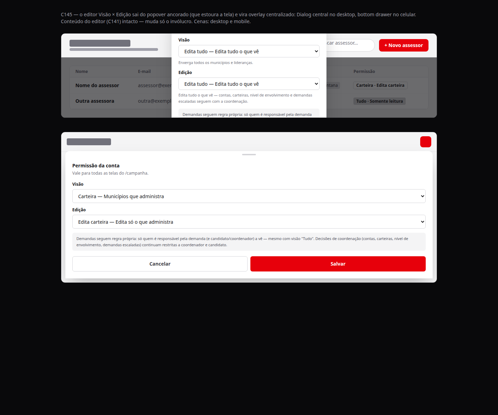
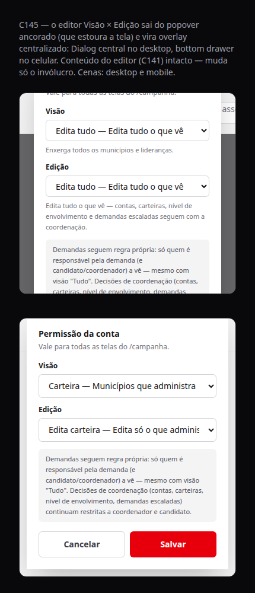

# Assessores — editor de permissão em modal central (desktop) + bottom drawer (mobile) no lugar do popover

Status: rascunho
Atualizado em: 2026-08-23
Issue: #813
Priority: P2
Impeccable: B — encaixe na superfície existente do C141
Rascunho UI: `docs/plans/permissao-assessores-modal-central-ui-draft.html`
Appetite: ~0,5–1 dia eng
Responsável: —

## Intenção

Na lista de assessores (`/campanha/assessores`), a célula "Permissão" é um badge que abre o editor Visão × Edição num popover ancorado — e a tabela é larga (`min-w-[56rem]`, com scroll horizontal), então o popover estoura o viewport com frequência. Quem está configurando o assessor precisa ver e salvar a permissão sem brigar com a janela: no desktop, um modal central (Dialog); no celular, um bottom drawer. Só o invólucro muda — o editor e as regras do C141 ficam intactos.

## Persona e fluxo

- **Persona / contexto:** coordenador(a) (ou candidato(a)) na tela de assessores, configurando o que cada assessor vê e edita; mesa com listas longas, celular ou notebook.
- **Job principal:** abrir a permissão de um assessor e definir Visão × Edição com o conteúdo sempre à vista.
- **Fluxo desejado:** toca no badge "Permissão" → abre modal centralizado (desktop) ou bottom drawer (mobile) com o editor → ajusta Visão/Edição → Salvar → overlay fecha e o badge reflete o novo perfil.
- **Anti-goals de produto:** não virar uma campanha geral de popover→modal (outras superfícies mantêm seus contêineres); não mexer no conteúdo, combos, nota ou regras de coerência do editor; não criar um segundo componente de editor.

### Esboço de fluxo (B/C/D)

```text
[badge "Permissão" na linha do assessor]
  → toque/clique
  → desktop: Dialog central (visor fixo) | mobile: bottom drawer (polegares na base)
  → editor Visão × Edição (mesmos combos, mesma nota, regras de coerência)
  → Salvar (ou Cancelar)
  → overlay fecha, badge atualizado
```

### Rascunho UI (gate)





- Rascunho UI (gate): `docs/plans/permissao-assessores-modal-central-ui-draft.html` — duas cenas estáticas: dialog central desktop (~1280px) e bottom drawer mobile (~390px), tema zinc do draft C141.

## Objetivo e aceite

- A permissão de qualquer assessor é editada num overlay centralizado que nunca estoura o viewport, no desktop e no celular.
- O editor continua sendo o mesmo do C141: mesmos combos Visão/Edição, mesma nota, Cancelar/Salvar, regras de coerência (edição 'tudo' ⇒ visão 'tudo'; visão 'carteira' ⇒ edição cai para 'carteira').
- Ao salvar, o overlay fecha e o badge mostra o perfil novo; a linha de assessor em rascunho continua usando `onDraftChange` local (não salva no servidor).
- O `aria-label` do badge e os ids dos selects (`advisor-permission-visibility` / `advisor-permission-editing`) são preservados.
- O editor embutido na página de detalhe do assessor segue exatamente como está — não participa desta entrega.

## Dados (intenção)

- **Vou apresentar dados?** Não.
- **Decisões desbloqueadas:** N/A — sem métrica e sem decisão de dados; é re-superfície do editor existente, server actions e escrita em banco intactas.
- **Forma:** N/A.

## Direção no codebase (hipótese)

- **Áreas prováveis:** `src/components/campaign/advisor/` (`AdvisorPermissionBadge.tsx` é o único ponto de troca de invólucro; `AdvisorsTable.tsx` não muda além do que o badge já expõe), `src/components/ui/Dialog.tsx` e `src/components/ui/Drawer.tsx`, `src/hooks/use-mobile.ts` (`useNarrowMeasured(640)`).
- **Precedente a olhar:** C123 — `docs/plans/agenda-criacao-modal-central-impl.md` (Dialog desktop + Drawer mobile selecionados por `useNarrowMeasured`); célula "Carteira do assessor" da mesma tabela já abre sheet compartilhada em ponteiros grossos (`RelationChipCell` variant="sheet" → `CampaignListSheetProvider`); drawer default de `src/components/ui/Drawer.tsx` já é bottom-anchored.
- **Risco de acoplamento:** troca de contêiner só dentro do `AdvisorPermissionBadge` — o badge é usado em dois pontos (linha de dados com `advisorId`+`formAction`, linha de rascunho sem `advisorId` com `onDraftChange`); o editor do detalhe não pode herdar a troca; a tabela continua com scroll horizontal e o overlay não depende do layout da tabela.

## Dependências

- Nenhuma (C141 entregue — badge + editor; C142 entregue — e2e `campaignPermissionProfile` não toca o badge, sem risco de seletor).

## Fora de escopo

- Outros popovers do `/campanha` (mantêm seus contêineres atuais).
- Editor embutido na página de detalhe do assessor.
- Conteúdo, combos, nota e regras de permissão do C141.
- Cards mobile da tabela de assessores.

## Rabbit holes de produto

- **Cascata de troca de popovers.** Se alguém "só completar": converter todas as superfícies com popover do `/campanha`. **Corte neste item:** só o badge de permissão; outras superfícies decidem em itens próprios.
- **Editor embutido no badge.** Se alguém "só completar": o badge abrir um editor inline na célula. **Corte neste item:** overlay central/drawer, sempre.
- **Breakpoint na tabela.** Se alguém "só completar": introduzir estado responsivo na `AdvisorsTable`. **Corte neste item:** o sinal `useNarrowMeasured(640)` vive no badge/overlay, não na tabela.

## Questões em aberto (produto)

- **Bottom vs top drawer?** **Opções:** bottom (default do primitivo) | top (como C123 usou para a agenda). **Recomendação:** bottom — o editor é curto, o botão Salvar fica perto dos polegares e o `max-h` do drawer mantém tudo na tela; o top do C123 era um quirk do C103, não um padrão. _(assumido — validar com produto)_
- **Salvar fecha o overlay?** **Opções:** fecha | mantém aberto com feedback. **Recomendação:** fecha, como o popover atual já faz (`onSaved` → fecha); o badge atualizado é o feedback. _(assumido — validar com produto)_
- **Footer Cancelar/Salvar no modal?** **Opções:** mantém o footer do editor (Cancelar condicional) | só Salvar. **Recomendação:** mantém o footer exatamente como está — o conteúdo do editor é intocável.

## Referências

- Rascunho UI (gate): `docs/plans/permissao-assessores-modal-central-ui-draft.html` (novo; tema do `docs/plans/permissao-granular-assessores-ui-draft.html` do C141)
- `src/components/campaign/advisor/AdvisorPermissionBadge.tsx` — ponto único da troca de invólucro
- `src/components/campaign/advisor/AdvisorPermissionEditor.tsx` — conteúdo intocado
- `src/components/campaign/advisor/AdvisorsTable.tsx` — usos do badge (linha de dados ~473, rascunho ~351)
- `src/app/(campaign)/campanha/(app)/assessores/[id]/page.tsx` — editor embutido no detalhe (fora de escopo)
- `src/hooks/use-mobile.ts` (`useNarrowMeasured(640)`) + `src/components/ui/Dialog.tsx` + `src/components/ui/Drawer.tsx` (default bottom-anchored)
- Precedente C123: `docs/plans/agenda-criacao-modal-central-impl.md`
- Célula "Carteira do assessor" da mesma tabela (`RelationChipCell` variant="sheet" → `CampaignListSheetProvider`)
