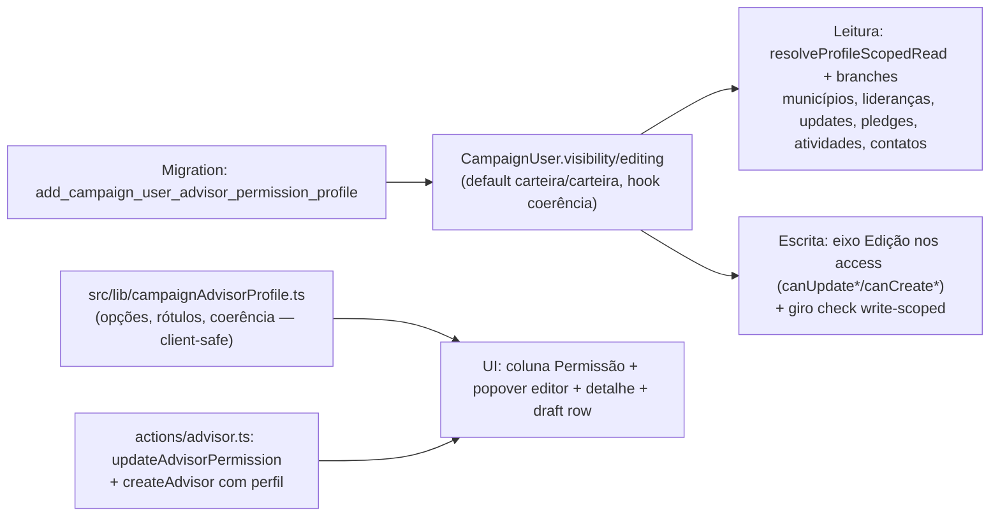

# Impl: Perfis de permissão por assessor (visão × edição), configuráveis pelo coordenador/candidato

Status: aprovado
Atualizado em: 2026-08-19
Issue: #105 (C141)
Intenção: docs/plans/permissao-granular-assessores.md
Appetite restante: herdado (~2–3 dias eng) — cortes abaixo no "Rabbit holes / Não escopo"

## Leitura da intenção

- **Outcome:** coordenador/candidato define por assessor **Visão** (`Tudo | Carteira`) e **Edição** (`Tudo | Carteira | Somente leitura`) em `/campanha/assessores` (lista + detalhe + novo), com enforcement fail-closed no servidor; default = comportamento atual (Carteira · Edita carteira).
- **O que NÃO negociar:**
  - Default Carteira·Carteira para contas novas e existentes — zero mudança até configurar.
  - Demandas ficam FORA dos eixos: Visão "Tudo" não abre demandas (regra de responsáveis = C143; aqui: carteira segue sendo o teto).
  - Apoiadores (PII) capados na carteira para todo staff abaixo de candidato/coordenador, mesmo com Visão "Tudo" — e por simetria, mesmo com Edição "Tudo".
  - Edição "Tudo" não libera escritas de coordenação (contas, `municipality.advisors`, nível de envolvimento E14, decisão de demandas escaladas).
  - Combinação incoerente (editar o que não vê) não é oferecida — e é rejeitada no servidor.
  - Leader lockdown e assimetria de votos (estimativas staff-only) intactos.
- **O que reavaliar:** a hipótese de direção apontava "perfis na conta + enforcement nos módulos de acesso + gates nas actions + UI nos três pontos" — confirma-se, com duas correções de engenharia: (a) **`getAccessibleMunicipalityIds` NÃO pode virar o escopo de visão** (ele alimenta superfícies PII — apoiadores, telefones, feeds — que o gate capa na carteira); (b) o prologue `resolveActorScopedRead` compartilhado com demandas **não pode alargar em bloco** (vazaria demandas com Visão Tudo) — prologue irmão, profile-aware, para as coleções não sensíveis.

## Abordagem recomendada

**Opções consideradas:** A (perfis sobre o papel `advisor` em dois selects na conta) | B (role novo `viewer`) | C (matriz por coleção) | D (alargar `getAccessibleMunicipalityIds` por visão)
**Recomendação:** A — dois selects (`visibility`, `editing`) em `campaignUser` + eixo de leitura profile-aware nos access de coleção + eixo de escrita por `editing`; UI em três pontos com o mesmo editor. Mantém o modelo de papéis congelado, enforcement centralizado onde o código já decide escopo (`overrideAccess: false` + `user`), e as superfícies PII intactas.
**Rejeitadas:**

- B porque recria seed/modelo de papéis (rabbit hole do gate).
- C porque explode em matriz N×M (anti-goal do gate).
- D porque `getAccessibleMunicipalityIds` alimenta apoiadores, telefones de contas e feeds — alargá-lo abriria PII além da carteira, violando o gate; o escopo "carteira" continua sendo O escopo de operação, e a visão ampla é um eixo separado.

### Componentes / mudanças

**Modelo — `src/collections/CampaignUser.ts`**

- `visibility`: select `'carteira' | 'tudo'`, default `'carteira'`, label "Visão" (pt-BR no admin), `admin.condition` só p/ `role === 'advisor'`, `access.update: canManageCampaignUserRole` (unrestricted/admin).
- `editing`: select `'carteira' | 'tudo' | 'somente_leitura'`, default `'carteira'`, mesma condição/access.
- `beforeValidate` novo `enforceCoherentAdvisorProfile`: `role === 'advisor' && editing === 'tudo' && visibility !== 'tudo'` → APIError (fail-closed também via REST/admin, não só na action).
- `preventSelfServicePrivilegedFields`: adicionar `visibility`, `editing` ao strip.
- **Migration:** `add_campaign_user_advisor_permission_profile` (duas colunas select com default `'carteira'`; sem backfill — default cobre linhas existentes).

**Lib — `src/lib/campaignAdvisorProfile.ts`** (novo, client-safe)

- Tipos `AdvisorVisibility` / `AdvisorEditing`; `ADVISOR_VISIBILITY_OPTIONS` / `ADVISOR_EDITING_OPTIONS` (value + label + description pt-BR do draft: "Tudo — enxerga todos os municípios e lideranças.", "Somente leitura — nenhum controle de edição em lugar nenhum.", …); `advisorProfileLabel(v, e)` ("Carteira · Edita carteira", "Tudo · Somente leitura", "Tudo · Edita tudo"); `isCoherentAdvisorProfile(v, e)` (`e === 'tudo' ⇒ v === 'tudo'`). Combinar com `campaignRoles.ts` (papéis), não duplicar.

**Access — `src/utilities/access/`**

- `shared.ts`:
  - `resolveProfileScopedRead(req, scopeField, loadAccessibleIds)` — mesmo prólogo de `resolveActorScopedRead`, mas advisor com `visibility === 'tudo'` → `true`. `resolveActorScopedRead` fica como está (demandas continuam carteira — C143 substitui depois).
  - `advisorEditingAccess(currentUser)` → `'none' | 'carteira' | 'tudo'` a partir de `editing` (somente_leitura → none; tudo → tudo; senão carteira; não-assessor → none).
  - `resolveAccessibleIds`: permitir `compute` retornar `null` (= "tudo") — necessário para `getAccessibleLeadershipIds`/`getAccessibleContactIds` ampliarem sem virar `true` (que abriria PII).
- `municipalities.ts`: `canReadMunicipality` — advisor com `visibility === 'tudo'` → `true`; `canUpdateMunicipality` — eixo: none → `false`, tudo → `true`, carteira → `{ advisors: { contains: self } }` (where atual inalterado).
- `leaderships.ts`: `canReadLeadership` → `resolveProfileScopedRead`; `getAccessibleLeadershipIds` — advisor com visão tudo → `null`; `canCreateLeadership`/`canManageLeadership` — eixo de escrita.
- `municipalityUpdates.ts` (+ alias `allocationDecisions.ts`): `canReadMunicipalityUpdate`/`canReadAllocationDecision` → `resolveProfileScopedRead`; `canCreateMunicipalityUpdate` — eixo.
- `votePledges.ts`: `canReadVotePledge` → `resolveProfileScopedRead`; `canCreateVotePledge`/`canUpdateVotePledge` — eixo (tudo → `true`; none → `false`; carteira → fragmento atual).
- `activities.ts`: `canReadActivity` — advisor com visão tudo → `true`; `canCreateActivity`/`canUpdateActivity` — eixo (carteira mantém o or-where `responsible`/`municipality`; tudo → `true`; none → `false`).
- `demands.ts`: **inalterado na leitura** (carteira — C143 dono). Só `canUpdateCampaignDemand`/`canCreateCampaignDemand`: eixo none → `false`; tudo/carteira → comportamento atual (carteira; C143 substitui a regra depois).
- `supporters.ts`: `canCreateSupporter`/`canManageSupporter` — eixo none → `false`; senão comportamento atual (carteira SEMPRE; PII cap nos dois eixos). `canReadSupporter` inalterado.
- `organizations.ts` / `stateDeputies.ts`: booleans staff → eixo (none → `false` para advisor; senão comportamento atual).
- `contacts.ts`: `getAccessibleContactIds` — ramo lideranças: advisor com visão tudo → `where: {}` (dobradinhas já são todas); ramo apoiadores: SEMPRE carteira (PII cap). `canReadContacts` segue derivando ids.
- `calendarFeeds.ts`, `campaignUsers.ts` (phone): **inalterados** — feeds são superfície pessoal (contrato C96 re-deriva escopo na leitura) e telefone é PII; continuam carteira.

**Actions — `src/app/(campaign)/campanha/actions/`**

- `advisor.ts`: `updateAdvisorPermission` (novo) — `reloadUnrestrictedActor` + `assertTargetAdvisor` + `payload.update({ visibility, editing }, user, overrideAccess: false)` (field access `canManageCampaignUserRole` re-checa); `createAdvisorRecord` aceita `visibility`/`editing` opcionais (default carteira). `revalidateAdvisorPaths`.
- `activity.ts` `createTourDraftActivitiesRecord`: trocar o check de escopo do giro de **leitura** para **escrita** — hoje lê municípios com access (com visão tudo o read alargaria e um assessor "Carteira" comporia giro fora da carteira). Usar `getWritableMunicipalityIds` (novo helper em `municipalities.ts`: unrestricted/tudo → `null`; none → `[]`; carteira → ids da carteira).
- `formActions.ts` (assessores): `updateAdvisorPermissionFormAction`; `createAdvisorFormAction` lê `visibility`/`editing` do FormData.

**Dados/view models — `src/utilities/advisorData.ts`**

- `AdvisorRowViewModel` / `AdvisorDetailViewModel` ganham `visibility`/`editing`; `loadAdvisorListPageData`/`loadAdvisorDetail` incluem os campos no `select`.

**UI — `src/components/campaign/advisor/`** (Impeccable B — encaixe na superfície existente)

- `AdvisorPermissionEditor` (novo, client): dois `NativeSelect` (Visão/Edição) + nota de demandas + Cancelar/Salvar; ao escolher Edição "Tudo" com Visão "Carteira", auto-eleva Visão para "Tudo" (só combos coerentes são oferecidos); salva via formAction + `router.refresh()`.
- `AdvisorPermissionBadge` (novo, client): badge "Carteira · Edita carteira" etc. (botão) abrindo Popover com o editor — reusado na lista e no draft row.
- `AdvisorsTable`: coluna **`permission`** (mandatory, `headerClassName` ~`w-48`) com o badge; draft row ganha célula de permissão (estado local, default carteira/carteira) e `saveDraft` envia os campos; `DraftAdvisor` ganha `visibility`/`editing`.
- Detalhe `[id]/page.tsx`: seção "Permissão da conta" (título + editor inline + nota de demandas/coordenação), mesma formAction.
- Coluna participa do picker como mandatory (contrato B197+ — body sempre renderiza).

### Dados → forma (se aplicável)

- Sem KPI/dado novo: superfície de configuração. Rótulo "Permissão" em badge curto (coluna) e textos descritivos no editor — forma do draft do gate, reutilizada como vocabulário único (`campaignAdvisorProfile.ts`).

## Fases verificáveis

1. **Tracer — schema + leitura** (~0,5 dia): campos + hook + migration + `campaignAdvisorProfile.ts` + `resolveProfileScopedRead`/`advisorEditingAccess` + leitura dos access (municípios, lideranças, updates, pledges, atividades, contatos) + `generate:types` + int spec de leitura (visão tudo alarga; carteira não; demandas/apoiadores continuam carteira).
2. **Escrita** (~0,5–0,75 dia): eixo `editing` nos `canUpdate*`/`canCreate*` + `getWritableMunicipalityIds` + giro + int spec (somente_leitura nega tudo; tudo permite fora da carteira exceto PII/coordenação; carteira = hoje).
3. **Actions + dados** (~0,25 dia): `updateAdvisorPermission`, create com perfil, zod, form actions, view models/loaders.
4. **UI** (~0,75–1 dia): editor + badge + coluna + draft row + detalhe; shape→craft→critique→polish; unit specs dos componentes/labels.
5. **Gates**: `pnpm migrate:create` + `pnpm migrate` (local), `generate:types` (com `S3_*` dummy setados), `tsc --noEmit`, `pnpm lint`, `format:check`, `knip`, `check:cycles`, `pnpm test` (unit+int), `pnpm build`. e2e roda no CI.

## Rabbit holes / Não escopo (engenharia)

- Redesenho mobile da lista de assessores em cards (draft cena 2) — a tabela atual rola; apresentação por perfil é o item irmão C142. Não escopo aqui.
- Mudar a regra de demandas (responsáveis) — C143 é o dono; aqui só o bloqueio "somente leitura" e o teto carteira.
- Histórico/auditoria de mudanças de perfil; autoatendimento; perfil para coordinator/candidate/leader.
- `saveToJWT` para os campos novos — desnecessário: `getFreshCampaignUser` recarrega por ID.
- Migration de backfill — default cobre linhas existentes.

## Riscos e mitigação

- **Mapa/quantis/dashboard** leem `loadMunicipalityScope` (access-driven) — alargam automaticamente com visão tudo; esperado e desejado ("mesa de trabalho completa"). Mitigação: int spec pina que o escopo do mapa acompanha o perfil.
- **`getAccessibleLeadershipIds` alargada** abre convites para todas as lideranças com visão tudo — coerente com a visão; registrar no resumo (C142 apresenta; se a mesa discordar, item sucessor).
- **Sollinha** usa as mesmas queries/access — segue automaticamente; conferir B185/B186 (fragmentos allowlistados por escopo já resolvido) em fase 2.
- **Contatos**: a lista de pessoas deriva de lideranças (alarga) + apoiadores (carteira) — composição por ids, nunca `true` (evita abrir PII). Teste pina o ramo apoiadores.
- **Combinação incoerente via API** — hook no `beforeValidate` + zod; teste pina o 400.
- **Giro (tour)** — o check read→write é a única correção fora dos access; teste específico.

## Aceite de engenharia

- [ ] Aceite de produto da intenção ainda coberto (dois eixos, default carteira, fail-closed, PII/demandas/coordenação intocados)
- [ ] Invariantes AGENTS/engineering-standards: Local API com `user` → `overrideAccess: false`; sem re-escrita do fragmento P3-D (guarda em `codebaseConventions`); identificadores em inglês, valores/UI pt-BR
- [ ] Testes de domínio previstos (unit/int) onde access/write paths mudam: `campaignAdvisorPermission.int.spec.ts` + unit dos helpers de perfil
