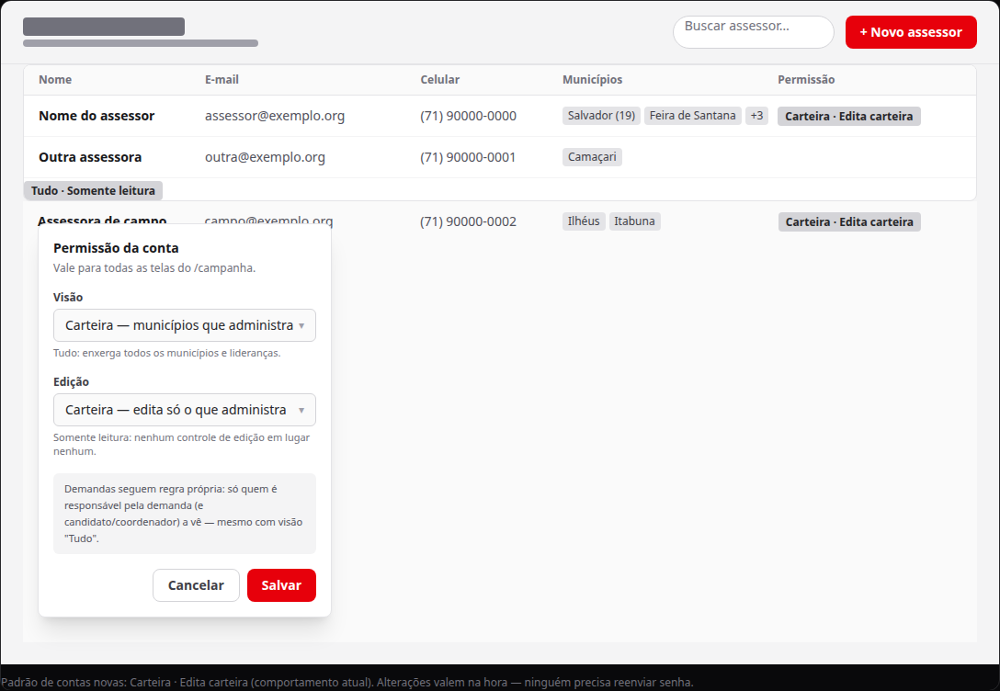
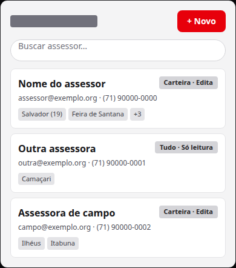
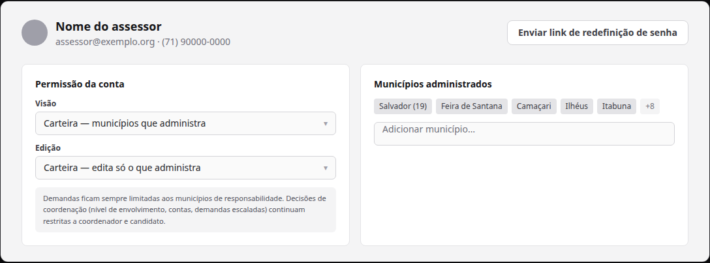

# Perfis de permissão por assessor (visão × edição), configuráveis pelo coordenador/candidato

Status: aguardando execução
Atualizado em: 2026-08-19
Issue: #105
Priority: P1
Model: cursor-grok-4.5-high
Impeccable: B — encaixe em `/campanha/assessores` (lista + detalhe + novo)
Rascunho UI: docs/plans/permissao-granular-assessores-ui-draft.html
Appetite: ~2–3 dias eng; um modelo de permissão + configuração + enforcement fail-closed
Responsável: —

## Intenção

Hoje todo assessor tem exatamente um perfil: **vê e edita só os municípios da carteira**. No campo, a equipe descobriu que isso não cobre a mesa real: há assessor que precisa **ver tudo** (panorama, relatório, cobertura) sem poder **alterar nada**; há assessor que **vê tudo** mas só pode mexer **naquilo pelo que é responsável**; há assessor que só vê o que é seu — com ou sem edição. E **demandas** carregam custo e comprovantes (controle interno): só candidato, coordenador e as **pessoas responsáveis pela demanda** as veem — regra própria, detalhada no item irmão (C143).

O coordenador/candidato precisa configurar isso **por conta**, na vertical `/campanha`, sem depender do Payload admin.

## Persona e fluxo

- **Persona / contexto:** Alex (Coordenador Geral) e o Candidato na mesa — montar e ajustar o time de assessores conforme o papel real de cada um; e o assessor, operando o `/campanha` dentro do que lhe foi liberado.
- **Job principal:** para cada assessor, definir **o que ele vê** e **o que ele pode editar**, em dois controles simples; e ter isso aplicado na hora, em todas as telas.
- **Fluxo desejado:**
  1. Alex abre `/campanha/assessores` e vê uma coluna "Permissão" por assessor (ex.: "Carteira · Edita carteira").
  2. Toca no perfil de um assessor e escolhe **Visão** (Tudo | Carteira) e **Edição** (Tudo | Carteira | Somente leitura); a tela explica cada combinação e lembra que demandas seguem regra própria.
  3. Salva. O assessor entra e opera exatamente dentro do perfil — se "Somente leitura", não encontra nenhum controle de edição; se "Tudo", navega o estado inteiro (demandas fora, que seguem a regra de responsáveis).
  4. Conta nova nasce no padrão atual (Carteira · Carteira) — nada muda até alguém mexer.
- **Anti-goals de produto:** papel novo (só o assessor ganha perfis; liderança continua em lockdown e candidato/coordenador intocados); IAM tipo SaaS (grupos, herança, policy engine); permissão fina por coleção ("vê lideranças mas não atividades"); autoatendimento do próprio perfil.

### Esboço de fluxo (B/C/D)

```text
[assessores lista] → [coluna Permissão] → [editor: Visão × Edição + avisos]
   → [salvar] → [perfil ativo imediatamente]
[assessor entra] → [telas renderizam e respondem dentro do perfil — fail-closed no servidor]
```

### Rascunho UI (B/C/D)







## Objetivo e aceite

- O coordenador/candidato define, por assessor: **Visão** (Tudo | Carteira) e **Edição** (Tudo | Carteira | Somente leitura), nas superfícies de `/campanha/assessores` (lista, detalhe, novo).
- Contas novas e existentes mantêm o perfil atual por default — zero mudança de comportamento até configurarem.
- O assessor vê/edita **exatamente** o que o perfil permite, em todas as telas do `/campanha` e nas APIs — a checagem falha-fechada no servidor (nunca só ocultar botão no cliente).
- **Demandas:** ficam fora dos eixos — mesmo com Visão "Tudo", o assessor só vê demandas de que é responsável (regra explícita do item C143); Visão "Tudo" não abre demandas nem custo/comprovantes.
- Edição "Tudo" **não** libera escritas de coordenação: gerenciar contas, atribuir assessores a municípios, mover nível de envolvimento e decidir demandas escaladas seguem restritos a candidato/coordenador.
- Combinação incoerente (ex.: editar o que não vê) não é oferecida.
- **Apoiadores** (PII) continuam capados na carteira para todo staff abaixo de candidato/coordenador, mesmo com Visão "Tudo" _(decidido no gate)_.
- Configuração em três pontos: coluna + editor inline na lista, seção no detalhe e campos no formulário de novo assessor _(decidido no gate)_. Edit-where-you-see.
- Guardrails do repo intactos: liderança em lockdown, assimetria de votos (estimativas staff-only), postura LGPD fail-closed.

## Dados (intenção)

- **Vou apresentar dados?** Não — superfície de configuração de contas; sem KPI eleitoral.
- **Decisões desbloqueadas:** coordenador decide quem vê o quê e quem edita o quê, por pessoa.

## Direção no codebase (hipótese)

- **Áreas prováveis:** perfis na conta em `src/collections/CampaignUser.ts`; enforcement nos módulos de acesso `src/utilities/access/*` (o prologue `resolveActorScopedRead`/`resolveAccessibleIds` em `shared.ts` e os módulos por domínio — municípios, lideranças, pledges, demandas, atividades, organizações, dobradinhas, apoiadores); gates de escrita nas server actions `src/app/(campaign)/campanha/actions/*.ts`; UI em `src/components/campaign/advisor/` (`AdvisorsTable`, detalhe `[id]`, formulário novo) e helpers de papel client-safe em `src/lib/campaignRoles.ts`.
- **Precedente a olhar:** B19 (`gerenciar-assessores.md`) — a superfície e os gates de conta; a convenção P3-D do escopo de assessor (uma só grafia do fragmento `{ municipality(s): { in: ids } }`); C116/C116+ — células edit-in-place com estados read-only por papel.
- **Risco de acoplamento:** o escopo do assessor é central e compartilhado (mapa, quantis por escopo, listas, dossiê, Sollinha); qualquer mudança no "o que o assessor vê" propaga. Respeitar leader lockdown e o "não re-escrever o fragmento de escopo" da convenção.

## Dependências

- Nenhuma dura. **Guardrail:** a regra de demandas (C143) não depende deste item, e Visão "Tudo" nunca a contorna. C142 (superfícies respeitando o perfil) depende deste.

## Fora de escopo

- Perfis para `coordinator`/`candidate`/`leader` (congelados por política de produto).
- Demanda com "responsáveis" explícitos por demanda (vínculo por pessoa) — ver Questões; se confirmado, item sucessor.
- Permissão fina por coleção ou por campo além da regra de demandas.
- Autoatendimento/edição do próprio perfil.
- Histórico/auditoria de mudanças de perfil.

## Rabbit holes de produto

- **"Já que tem visão, vou adicionar um role novo."** Papel novo (`viewer`, `auditor`) recria o modelo de papéis e o seed de contas. **Corte:** perfis sobre o papel `advisor` existente — um assessor "visão Tudo · Somente leitura" É o leitor.
- **"Vou pedir permissão por coleção."** Cada campo novo vira matriz N×M e a tela vira IAM. **Corte:** dois eixos só; o que não couber nos eixos fica com a regra das demandas ou fora.
- **"Vou esconder botão no cliente e pronto."** Acesso de verdade mora no servidor; esconder botão é cosmético. **Corte:** enforcement no acesso de dados e nas actions primeiro; a apresentação é a entrega irmã (item seguinte).
- **"Visão Tudo abre as planilhas PII."** Apoiadores/custo de demandas são sensíveis (LGPD/controle interno). **Corte:** apoiadores capados na carteira (decidido); demandas seguem a regra de responsáveis (C143).

## Decisões do gate (2026-08-19)

- **Responsável por uma demanda = vínculo explícito por demanda** (opção B da rodada) — mesmo o assessor do município da demanda, se não estiver marcado como responsável, não vê. A regra vive no item irmão **C143**; este item apenas garante que Visão "Tudo" não a contorna.
- **Visão "Tudo" não abre superfícies sensíveis** (opção A) — apoiadores (PII) seguem capados na carteira; demandas seguem a regra de responsáveis (C143).
- **Edição "Tudo" não libera escritas de coordenação** (opção A).
- **Configuração na lista + detalhe + formulário de novo assessor** (opção A).

## Referências

- Pedido de produto 2026-08-19 (vertical `/campanha` — granularidade de acesso por conta); decisões do gate na seção acima.
- Item irmão: `docs/plans/demandas-responsaveis.md` (C143 — regra de responsáveis de demanda).
- Rascunho UI (gate): `docs/plans/permissao-granular-assessores-ui-draft.html` + PNGs acima.
- Para abrir primeiro: `src/utilities/access/shared.ts` (`resolveActorScopedRead`), `src/utilities/access/demands.ts` (regra atual de demandas = escopo de leitura), `src/components/campaign/advisor/AdvisorsTable.tsx`, `docs/plans/gerenciar-assessores.md` (B19).
- `AGENTS.md` — modelo de papéis de campanha, convenção P3-D do escopo de assessor.
