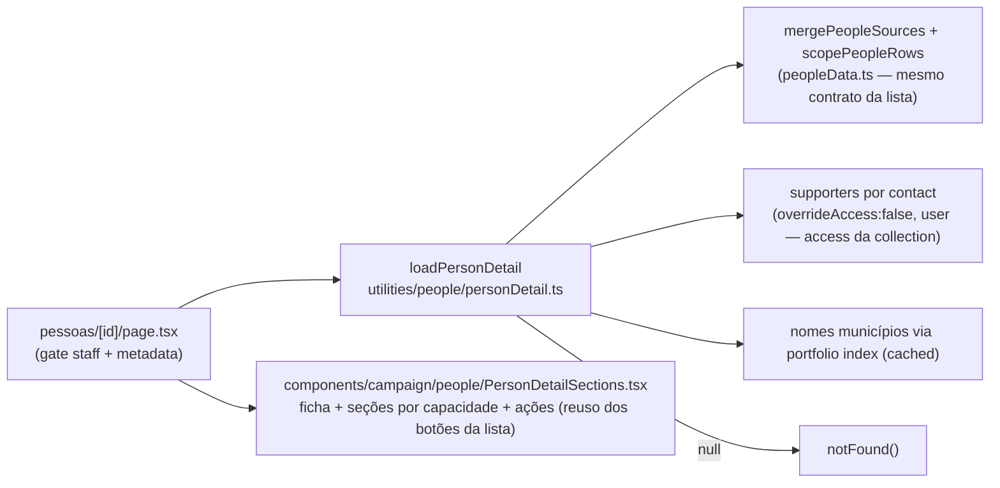

# Impl: Pessoas — página de detalhe da pessoa (seções montadas pelas capacidades)

Status: aprovado
Atualizado em: 2026-08-11
Issue: #657
Intenção: docs/plans/pessoas-detalhe-por-capacidades.md
Appetite restante: ~2 dias eng (herdado; sem corte necessário — sem migration, sem escrita)

## Leitura da intenção

- **Outcome:** `/campanha/pessoas/<id>` acessível a staff — uma ficha única por pessoa (qualquer capacidade), montada pelas capacidades dela: Ficha, Liderança, Dobradinha, Assessora, Assessorado, Apoiador, Ações. Seção ausente = não renderiza. O detalhe de liderança existente não regride (convivência v1: seção de liderança linka para ele).
- **O que NÃO negociar:** gate staff (leader → `/campanha/contatos`); escopo do assessor espelhado do merge da lista (nunca alargado); sem migration; `Contact` continua a fonte da ficha; sem KPI/votos na página (assimetria votos × estimativas intacta — não há votos aqui, o detalhe de liderança os tem e fica linkado); seções só quando a capacidade existe.
- **O que reavaliar:** a hipótese apontava "loader por `contactID` reusando o merge de `peopleData.ts` (ou um irmão `loadPersonDetail`)". Confirmada — o merge (`mergePeopleSources` + `scopePeopleRows`) é o mesmo contrato do escopo da lista e **deve** ser reusado para o escopo não divergir. O ponto novo: a seção Apoiador exige leitura de `supporter` por `contact`, que o view model da lista não carrega — é dado novo do loader, com o access da própria collection.

## Abordagem recomendada

**Opções consideradas:** A | B | C
**Recomendação:** A — rota nova `pessoas/[id]` com loader irmão no mesmo subdomínio e seções RSC declarativas por capacidade — porque mantém o escopo do assessor literalmente idêntico ao da lista (mesmo merge, mesmas fontes, mesmos selects) e a página fica fina (dado na rota, forma nas seções).
**Rejeitadas:** B — estender `peopleData.ts` (474 linhas; o loader de detalhe adiciona supporters + nomes de assessorado com granularidade por pessoa — responsabilidade nova, módulo separado no mesmo `people/` é o padrão da casa); C — reusar `loadPeopleListPageData` e achar a linha (carrega a tabela inteira sem paginação só para pegar um id — trabalho ilimitado para uma ficha).

### Decisões de engenharia

- **D1 — Contrato do parâmetro de rota.** `[id]` **é `contactID`** (a chave de linha da lista C100, o que a C116 linkará). Validado por `/^[1-9]\d*$/`. _Rejeitadas:_ `leadershipID` (só cobre lideranças — quebra "qualquer pessoa"); slug (Contact não tem slug; criá-lo é migration + colisão).
- **D2 — Loader.** `loadPersonDetail(payload, user, contactID)` em `src/utilities/people/personDetail.ts` (novo; importa `mergePeopleSources`/`scopePeopleRows` de `./peopleData`). Lê as três fontes com `where: { contact: { equals } }` e **os mesmos selects/shapes do `loadPeopleListPageData`** (leadership com `overrideAccess: false`; staff com `overrideAccess: true` e o MESMO comentário de justificativa — `contact` é identity-gated, o escopo é provado pelo merge). Depois: merge → scope (advisor → `getAdvisorMunicipalityIds`) → resolve nomes de assessorado (só para a pessoa) → carrega supporters → resolve nomes de municípios via `loadMunicipalityPortfolioIndex()` + `resolvedPortfolioEntriesById` (cached, admin bypass justificado — dados de referência). Retorna `null` quando a pessoa não existe em nenhuma capacidade ou está fora do escopo → `notFound()`.
- **D3 — Escopo (contrato inegociável da intenção).** O view model do detalhe = `PeopleRowViewModel` estendido. O escopo do assessor é o do merge (`scopePeopleRows`), nunca o contrário. Leitura de supporters adicionalmente pelo access da collection (`overrideAccess: false, user` — advisor vê só municípios da carteira): camada dupla, nunca alarga.
- **D4 — Seção Apoiador.** Query `supporter` por contact; resumo por registro: fonte (`supporterSourceLabels`), município (nome), intenção de voto (label `supporterVoteIntentionLabels`, só quando `voteIntentionConsentedAt` — convenção do detalhe de apoiador), criado em. Zero registros → seção não renderiza. Sem blocos de texto de Consent na página (o consent em tela continua nas superfícies de apoiador; aqui é resumo de leitura já autorizada pela collection).
- **D5 — Composição de seções.** Um módulo `PersonDetailSections.tsx` em `components/campaign/people/`: shell compartilhado `PersonSectionCard` (ícone + título + badge trailing) + `PersonFichaSection` (nome/partido/contato/base + pills de capacidade "o que a pessoa é") + seções por capacidade + `PersonActionsSection`. Condicional na página: `leadershipID !== null`, `deputyID !== null`, `staff.length > 0`, `assessoradoNames.length > 0`, supporters > 0. _Rejeitada:_ um componente monolítico de detalhe (página deixa de ser fina); um "registro de capacidades" genérico (5 seções de leitura não são arquitetura de plugin).
- **D6 — Ações.** Reuso direto do padrão da lista: WhatsApp (`whatsAppHrefForPhone` + `Button asChild`, disabled sem telefone), `LeadershipInviteRowAction` (só liderança), `DeletePersonButton` com **prop opcional `onDeleted`** — no detalhe navega para `/campanha/pessoas` após o delete (sem isso o usuário fica preso num 404). _Rejeitadas:_ envolver o delete num client component do detalhe (duplicação); deixar como está (tela morta pós-delete).
- **D7 — Chrome/metadata.** `SetCampaignPageChrome { title: 'Pessoa', subtitle: name }` + `generateMetadata` = `campaignPageMetadata({ title: 'Pessoa', subtitle: name })` — padrão exato de `liderancas/[id]`.
- **D8 — Chips de município do detalhe.** Componente read-only próprio (`PersonMunicipalityChips`, `Badge` outline, mesmo visual da célula da lista), via índice resolvido. _Decisão barata adiada:_ extrair `PeopleMunicipalityCell` da lista para compartilhar — a C116 a transforma em chips internos ao input; o detalhe é read-only; futuros divergentes, extração hoje criaria componente que a C116 deleta.

### Componentes / mudanças

- **`loadPersonDetail`** (`src/utilities/people/personDetail.ts`): o loader do detalhe; reusa merge/scope; novo: supporters por contact + nomes de assessorado por pessoa.
- **`pessoas/[id]/page.tsx`** (rota nova): gate staff, metadata, loader, notFound, monta seções.
- **`PersonDetailSections.tsx`** (`src/components/campaign/people/`): ficha + 5 seções + ações; shell `PersonSectionCard`.
- **`DeletePersonButton`**: +1 prop opcional (`onDeleted`) — lista intocada.
- **Migration:** sem migration (ficha = `Contact` + capacidades existentes; nada de schema novo).
- **Access / Consent:** nenhum access novo — o loader herda o access de cada collection dona + o merge; sem chave de Consent nova (seção Apoiador lê só o que o access da collection já autoriza).
- **UI:** Impeccable **C** (fluxo novo — rota de detalhe + composição por capacidade): shape → craft → critique → polish. Shells da casa (`CampaignPageShell`, `SetCampaignPageChrome`, `Badge`, `Button`); sem componente de lista novo.

### Dados → forma (se aplicável)

- Sem dados analíticos (a intenção corta KPI/votos). A única forma numérica é a contagem de municípios em chips quando excede o colapso "+X" — mesmo padrão da lista. Sem pergunta 3 de data-presentation.

## Fases verificáveis

1. **Tracer (server)** — `loadPersonDetail` + rota mínima (ficha + seções sem polish) + `notFound`/metadata. Verificação: int spec da matriz de escopo verde.
2. **UI (shape → craft → critique → polish)** — seções por capacidade, pills, chips, ações reusadas, estados (sem telefone, sem capacidade, assessor).
3. **Gates** — int (matriz de escopo + supporters) e e2e (`campaignPeople.e2e.spec.ts`: coordinator abre detalhe por URL e vê seções certas; pessoa só-dobradinha sem bloco de liderança; leader redirecionado). Depois: `tsc`, `lint`, `format`, `knip`, `cycles`, unit+int, `build`; entrada no CHANGELOG; `pnpm push` → PR.

## Rabbit holes / Não escopo (engenharia)

- Registro de capacidades / sistema de plugins de seção — 5 seções read-only não justificam abstração.
- Edição na página (dono é a C116, in-place na lista); escala para "mini-admin".
- Migrar `/campanha/liderancas/[id]` para a rota nova — v1 convive (decisão assumida da intenção); seção de liderança linka para o detalhe rico (votos/ações vivem lá).
- Votos/estimativas na ficha — fora (a intenção corta); a assimetria atual fica onde está.
- Mostrar texto de Consent na seção Apoiador — as superfícies de apoiador já o mostram; aqui é resumo autorizado pelo access.
- Extrair `PeopleMunicipalityCell` da lista — C116 reescreve a célula; divergente do detalhe read-only.

## Riscos e mitigação

- **Divergência de escopo assessor entre lista e detalhe** — mitigado por construção: mesmo merge, mesmos selects, mesma função de scope; matriz pinada no int spec.
- **Apoiador vazar município fora da carteira do assessor** — o access da collection corta na query (`overrideAccess: false`); int test pinando o corte.
- **Convivência com C116** — contrato do link fixado: `/campanha/pessoas/<contactID>` (D1). C116 linka para liderança enquanto C118 não existe; se C118 entrar primeiro, C116 aponta para cá. Sem overlap de arquivos (C116 mexe na célula da lista; C118 na rota nova). Se houver conflito de merge, é trivial (uma linha).
- **`overrideAccess: true` na fonte staff** — o MESMO bypass já justificado na lista (identity-gated + escopo pelo merge); comentário replicado.
- **Pessoa sem nenhuma capacidade digitada à mão na URL** → loader retorna `null` → `notFound()` — rota honesta, sem lookup de Contact solto (que vazaria fichas admin-gated).

## Aceite de engenharia

- [x] Aceite de produto da intenção ainda coberto (rota staff, seções por capacidade, ausentes não aparecem, escopo preservado, sem migration, liderança não regride)
- [x] Invariantes AGENTS/engineering-standards (Local API `user` → `overrideAccess: false` exceto bypass justificado; leader lockdown; copy pt-BR / identificadores em inglês)
- [ ] Testes de domínio previstos: `tests/int/personDetail.int.spec.ts` (matriz de escopo: unrestricted completo; advisor na carteira vê; advisor fora não vê → null; corte de supporter fora da carteira; pessoa só-staff visível só a unrestricted; contato sem capacidade → null) + e2e da rota
