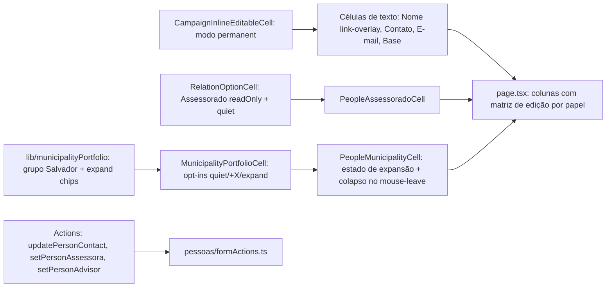

# Impl: Pessoas — edição onde você vê (edit-where-you-see) na lista desktop

Status: aprovado
Atualizado em: 2026-08-11
Issue: #655
Intenção: docs/plans/pessoas-edicao-inplace-lista.md
Appetite restante: ~1,5–2 dias eng; um outcome verificável — a linha da lista é editável sem sair da tabela

## Leitura da intenção

- **Outcome:** na tabela desktop de `/campanha/pessoas`, toda célula (exceto Ações) é um **input permanente sem destaque** — parece texto, se comporta como input; salva no blur/Enter (Esc descarta); Nome mantém o valor como link; colunas de municípios (Assessora, Lidera, Aliada em) e Assessorado usam **chips internos** com colapso por território ("Sertão do São Francisco (5)"), grupo "Salvador (19)", "+X" expande, X no hover remove; ações ganham tooltip.
- **O que NÃO negociar:** sem migration (escreve no dono da ficha — `Contact` nome/telefone/e-mail/cidade; vínculos nas collections donas); leader fora da rota; escopo do assessor preservado (só a carteira dele); mobile intacto; nada criado fora do catálogo (texto sem match não vira chip); link do Nome navega; "—" vira placeholder apagado.
- **O que reavaliar:** a hipótese de reusar `CampaignInlineEditableCell` (B163) — seu `editTrigger='cell'` tem estado de edição explícito; o paradigma travado exige input **sempre montado**, então a mudança é um **modo novo** no componente compartilhado, não um ajuste do modo existente. A hipótese de reusar `MunicipalityPortfolioCell`/`RelationChipCell` confirma-se: colapso por território já existe (chips batch); o trabalho novo é **expandir chip batch por clique/hover** (interação que nenhuma célula do sistema tem hoje), o grupo "Salvador (19)" (zona-cidade completa) e o modo `quiet` (sem tint de hover/foco).

## Abordagem recomendada

**Opções consideradas:**

- **A — estender os componentes compartilhados com props opt-in** (`CampaignInlineEditableCell` modo `permanent`; `RelationChipCell` com `quiet`/`onChipClick`/`overflowToggleLabel`; `MunicipalityPortfolioCell` repassa e expande chips; novo grupo no `buildMunicipalityPortfolioChips`): uma máquina de save e uma máquina de chips para todo o sistema; as outras listas ficam intactas (defaults inalterados).
- **B — componentes novos `people/*` que duplicam a máquina de save/chips**: isolamento total, mas dois donos para blur/Enter/Esc/pending/erro e para o combobox ARIA — exatamente o twin que o repo proíbe.
- **C — modo `permanent` virar o novo default do B163**: coerente com o paradigma, mas muda o comportamento visual das dobradinhas/lideranças sem ser pedido deste item.

**Recomendação: A** — o trabalho de interação nova (expandir chip batch, +X, quiet) entra como opt-in nas máquinas existentes e a expansão fica como **estado de apresentação** do wrapper `PeopleMunicipalityCell` (puro, sem tocar o ciclo de commit do `RelationChipCell`). C é rejeitada porque altera superfícies fora do escopo; B porque cria twin.

### Componentes / mudanças

**Puro (lib, client-safe):**

- **`src/lib/municipalityPortfolio.ts`**: (1) novo kind de chip `city` — zonas de uma zona-cidade **completas** viram UM chip `{ kind: 'city', label: 'Salvador', city: 'Salvador', municipalityIds: [19 ids] }`, checado **antes** do colapso por território (senão as 19 zonas colapsariam como "Metropolitano de Salvador (19)"); `MunicipalityPortfolioChip` ganha o variant; (2) helper puro `expandMunicipalityPortfolioChips(chips, expandedKeys)` — substitui chip batch (territory/city) cuja key está expandida pelos chips municipais membros; (3) testes unit.
- **`src/lib/schemas/contact.ts`**: variante `city` no `contactFieldUpdateSchema` compartilhado (bounds da collection: 2–100; aditivo — as actions de dobradinhas/liderança não expõem `city` e continuam falhando em campo desconhecido).

**Server (`person.ts` + formActions):**

- **`src/app/(campaign)/campanha/actions/person.ts`**: três record-functions novas, todas `withPayloadTransaction` + `req`, Local API com `user`/`overrideAccess: false` e bypass justificado só depois da checagem:
  - `updatePersonContactRecord(payload, actor, input)` — escopo: irrestrito sempre; assessor somente se **pelo menos uma** entidade da pessoa (leadership OU stateDeputy, lida com `overrideAccess: false`) é gerenciável por ele (regra "edita o que vê" da linha; staff-only → assessor nega). Depois, bypass do Contact (precedente B163/C99).
  - `setPersonAssessoraMembershipRecord(payload, actor, { contactID, municipalityIds, assigned })` — `reloadUnrestrictedActor` (canAssignMunicipalityAdvisors é unrestricted-only); transação única: resolve as contas staff da pessoa por `contact`, **asserta exatamente uma** (multi-conta → célula read-only no client; o server nega com mensagem segura), e para cada município: lock advisory `municipality-advisors:<id>` + toggle — **extrair** o toggle de `setMunicipalityAdvisorMembershipRecord` (`src/app/(campaign)/campanha/actions/municipality.ts`) para um helper compartilhado usado pelos dois (edit the owner, sem duplicar o bloco lock+toggle).
  - `setPersonAdvisorMembershipRecord(payload, actor, { contactID, advisorId, assigned })` — `reloadUnrestrictedActor` (regra B156); transação única: aplica o delta de advisor em **cada entidade** da pessoa (leadership e/ou stateDeputy) via `nextAdvisorIdsAfterMembership`/helper existente — semântica person-centric: a coluna Assessorado é atributo da pessoa, adicionar/remover atinge os dois vínculos quando ambos existem.
- **`src/app/(campaign)/campanha/(app)/pessoas/formActions.ts`** (novo): `updatePersonContactFormAction`, `setPersonAssessoraFormAction`, `setPersonAssessoradoFormAction`, `setPersonLeadershipMunicipalitiesFormAction` (envolve `setLeadershipMunicipalitiesMembership`), `setPersonStateDeputyMunicipalitiesFormAction` (envolve `setStateDeputyMunicipalitiesBatch`) — cascas `runCampaignFormAction` no padrão das dobradinhas, com safe-messages existentes.
- **Revalidação:** `/campanha/pessoas` + caminhos de detalhe das entidades tocadas (`liderancas/[id]`, `dobradinhas/[id]`, municípios tocados no assessora) — espelhando `revalidateStateDeputyPaths`/`revalidateLeadershipMunicipalityPaths`.
- **`src/utilities/people/peopleData.ts`**: `PeopleRowViewModel` ganha `assessoradoIDs: number[]` (união `leadershipAdvisorIDs ∪ deputyAdvisorIDs`, já resolvida hoje para os nomes) — ids que os chips do Assessorado precisam.

**UI (Impeccable B — encaixe em tela existente):**

- **`src/components/campaign/shared/CampaignInlineEditableCell.tsx`**: prop `permanent?: boolean` (default false — B163/dobradinhas/lideranças intactos). Em `permanent`:
  - texto (Contato/E-mail/Base): input **sempre montado**, `bg-transparent border-transparent` (mesmo vocabulário de `campaignInlineInputClassName`), valor = draft, salva no blur/Enter, Esc reverte, vazio → `placeholder="—"` apagado (o "—" atual vira placeholder), telefone mantém formatação; máquina de save/pending/erro/saved-feedback/requestId reutilizada tal qual.
  - Nome (`permanent` + `href`): **mecanismo travado no gate** — input sempre montado `absolute inset-0 z-0` com `value` **sempre vazio** (`bg-transparent`), link em `z-10` com `pointer-events-auto` cujo texto renderiza `draft || value`; cada tecla atualiza o draft **no display** (texto do link), o valor real do input permanece vazio; clique no link navega; foco por Tab/clique fora do texto → digitação; blur/Enter salva, Esc descarta. Sufixo `({party})` permanece fora do link como texto read-only.
  - Indicador de foco **discreto**: `focus-visible` ring suave; nada em hover (paradigma sem fundo/borda).
- **`src/components/campaign/shared/RelationChipCell.tsx`**: três opt-ins, defaults inalterados (B34/B36/B37/B156/B157/B159/B169 intactos):
  - `quiet?: boolean` — remove `pointer-fine:hover:bg-muted/40` do container; mantém apenas indicador discreto de foco (guardrail de acessibilidade);
  - `onChipClick?: (chip) => void` — chip **sem href** clicável (hoje só navega); com stopPropagation;
  - `overflowToggleLabel?: (hiddenCount) => string` — o toggle de overflow do B170 renderiza como chip `+N` em vez de "Ver mais…".
- **`src/components/campaign/shared/MunicipalityPortfolioCell.tsx`**: repassa os três opt-ins ao `RelationChipCell` e aplica `expandMunicipalityPortfolioChips` no `buildChips` quando `expandedKeys` é passado.
- **`src/components/campaign/people/PeopleMunicipalityCell.tsx`** (novo, substitui o `PeopleMunicipalityCell` local do page.tsx): wrapper de `MunicipalityPortfolioCell` com estado local `expandedKeys` + `onMouseLeave` que **colapsa** chips expandidos cujos membros continuam todos atribuídos (lê `ids` da prop via ref); serve as colunas Assessora/Lidera/Aliada com `commitAction`/`buildFormData`/`minItems`/`readOnly` definidos pela página.
- **`src/components/campaign/people/PeopleAssessoradoCell.tsx`** (novo): wrapper de `RelationOptionCell` — chips = assessorados com href `/campanha/assessores/[id]` (só para irrestrito; regra B156), `options` de `loadEligibleAdvisorOptions`, `readOnly` para assessor; copy do `ADVISOR_COPY` (sem o twin: extrair/reusar a copy de `LeadershipAdvisorRelationCell` se o diff permitir, senão constante local).
- **`src/app/(campaign)/campanha/(app)/pessoas/page.tsx`**: colunas Contato/E-mail/Base com `CampaignInlineEditableCell permanent`; Nome com `permanent` + `href` (`/campanha/liderancas/[id]` quando `leadershipID`); Assessora/Lidera/Aliada com `PeopleMunicipalityCell`; Assessorado com `PeopleAssessoradoCell`; **matriz de edição por papel** (helper puro na page ou `lib`): irrestrito edita tudo; assessor edita células de texto e Lidera/Aliada (com `addableIds = administeredIds`, `minItems=1` em Lidera) apenas nas linhas cujo vínculo cruza a carteira; Assessora e Assessorado **read-only** para assessor (canAssignMunicipalityAdvisors / B156 são unrestricted-only). Ações: `CampaignHoverTooltip` com a label (WhatsApp, Convidar, Apagar) nos três botões. `PeopleMobileCards` intacto.
- **Migration:** nenhuma — sem mudança de schema.

### Dados → forma

- **Forma escolhida:** inputs permanentes sem destaque + chips internos ao input — o paradigma travado no gate 2026-08-11, que É a forma deste item (não há dado analítico; o chip de território mostra contagem, não métrica). Rejeitadas: toggle global de edição, lápis obrigatório e células read→edit com estado visual — tudo divergente do aceite.

## Fases verificáveis

1. **Tracer / puro + UI machines** (~1/2 appetite): grupo `city` de Salvador + `expandMunicipalityPortfolioChips` + unit tests; opt-ins no `RelationChipCell`/`MunicipalityPortfolioCell`; modo `permanent` no `CampaignInlineEditableCell`; `PeopleMunicipalityCell` + `PeopleAssessoradoCell`. Validar que dobradinhas/lideranças não regridem (testes existentes + revisão visual).
2. **Server / access** (~1/3 appetite): variante `city` no schema; as três record-functions + formActions; `assessoradoIDs` no VM; int tests — coordenador/candidato editam tudo, assessor só a carteira (célula de texto em linha em escopo ok; linha staff-only negada; Lidera/Aliada com addableIds; Assessora/Assessorado read-only), multi-conta do Assessora nega, union do Assessorado escreve nas duas entidades, telefone conflitante falha com mensagem segura.
3. **Page + polish** (~1/3 appetite): colunas com a matriz por papel, tooltips nas ações, indicador de foco discreto, `+X`, colapso por mouse-leave; shape→craft→critique→polish.
4. **Gates:** após cada slice `pnpm exec tsc --noEmit` + testes focados; ao final `pnpm lint` (0 warnings), `pnpm format:check`, `pnpm exec knip`, `pnpm check:cycles`, `pnpm test`, `pnpm test:e2e` (se tocar jornada), `pnpm build` local.

## Rabbit holes / Não escopo (engenharia)

- Contenteditable real para chips internos — o comportamento continua o de input (chips como dados, teclado previsível); a mecânica é chips + input inline do `RelationChipCell`.
- Estado de expansão global / animações entre linhas — expansão é local à célula, por hover/foco, sem estado persistido.
- Tree-view de território com sub-chips persistentes — grupo colapsa/expande in loco; nada de hierarquia.
- Edição em lote / spreadsheet mode / reorder de colunas / coluna nova.
- C112 (telefones múltiplos) e B155+ (rota em vez de form action) continuam suaves — o editor de Contato segue o shape atual e o padrão de escrita vigente (form action).
- Migration de schema — nenhuma.

## Riscos e mitigação

- **Regressão B163/dobradinhas/lideranças:** modo `permanent` default-off; testes existentes do controle compartilhado cobrem os modos antigos; revisão visual das duas listas na Fase 1.
- **Regressão `RelationChipCell` (B34/B36/B37/B156/B157/B159/B169):** três props opt-in com defaults inalterados; testes unit/int existentes das células de relação rodam intactos na Fase 1.
- **Mecanismo do Nome (input vazio + draft no link):** caret invisível é trade-off do mecanismo travado; a navegação e a digitação coexistem; teste de componente cobre clique-no-link (navega) vs clique-fora (edita), Enter/Esc/blur.
- **Assessor com linha visível por capacidade fora da carteira:** matriz por coluna derruba a edição quando a entidade subjacente não é gerenciável (Lidera/Aliada read-only na linha); o server nega de qualquer forma (access da collection dona).
- **Pessoa com múltiplas contas staff (Assessora):** célula read-only + server nega; edge raro e honesto.
- **Chips batch (território/Salvador) removidos no X removem o grupo todo:** semântica já existente no sistema; o undo toast cobre a remoção em lote.
- **Revalidação de paths novos** (`/campanha/pessoas` + detalhes das entidades): seguir os helpers de revalidação existentes por entidade; nunca `revalidatePath` global.

## Aceite de engenharia

- [ ] Aceite de produto da intenção ainda coberto (inputs permanentes, Nome-link, chips com colapso por território/Salvador, +X, X no hover, tooltips, mobile intacto, sem lote)
- [ ] Sem migration; escrita no dono da ficha (`Contact`) e nas collections donas dos vínculos
- [ ] Local API com `user` + `overrideAccess: false`; bypass do Contact/entities justificado após checagem de escopo; transações com `req` em toda escrita multi-collection
- [ ] Escopo do assessor preservado (matriz por coluna + access da collection dona); leader fora da rota; multi-conta do Assessora nega
- [ ] `contactFieldUpdateSchema` ganha `city` de forma aditiva; mensagens seguras allowlisted
- [ ] Testes previstos: unit (grupo Salvador, expand chips, +X) e int (escopo de célula por papel, assessora single-account, union do assessorado, telefone conflitante)
- [ ] Nome em identificadores inglês; copy pt-BR

**Self-score decision-quality: 5/5** — decisões caras (estender vs criar twin, mecanismo do Nome, semântica do Assessorado/Assessora) têm alternativas rejeitadas com justificativa; appetite bounded por fases; rabbit holes nomeados; reuso máximo das máquinas existentes; o aceite da intenção não foi alterado.
