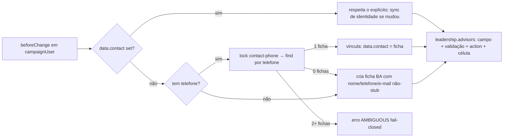

# Impl: Identidade — toda pessoa da campanha tem uma ficha Contact

Status: aprovado
Atualizado em: 2026-08-09
Issue: #494
Intenção: docs/plans/pessoas-identidade-contact.md
Appetite restante: ~1–1,5 dia eng (herdado); uma migration aditiva

## Leitura da intenção

- **Outcome:** `campaignUser` ganha vínculo opcional com `Contact` (uma conta → uma ficha), garantido no fluxo de criação/edição de staff (cria ou vincula — nunca pede dados da pessoa duas vezes); `leadership` ganha `advisors` (assessores responsáveis, mesmo padrão de `stateDeputy.advisors`). C100 (lista unificada) passa a conseguir juntar staff, lideranças e dobradinhas pela mesma ficha.
- **O que NÃO negociar:** auth intacta (login e-mail/celular, token, sessão, WebAuthn, convites, notificações); leader lockdown; consentimentos intactos; `leadership.user` permanece; sem backfill por heurística (vínculo só por decisão explícita de criação/edição); estado de produto "sem superfície nova".
- **O que reavaliar:** a hipótese "mudar cada fluxo de criação de usuário" — um hook de collection cobre admin + criação inline de assessor (action + popover do município) + convite, com um dono só; e o vínculo NÃO precisa ser único no sentido inverso (duas contas da mesma pessoa física podem apontar para a mesma ficha — é exatamente o dedupe que a C100 quer).

## Abordagem recomendada

**Opções consideradas:** A) hook `beforeChange` em `campaignUser` (cria/vincula por telefone + sync de identidade) | B) chamadas explícitas em cada server action + campo manual no admin | C) hook só no create, sem sync em update
**Recomendação:** A — um dono só para a invariante "conta tem ficha"; cobre o admin (Payload não permite hook de UI) e os três fluxos de criação (action de assessor, popover inline do município, resgate de convite) sem N call sites espalhados; o sync de identidade em update mantém a ficha fresca quando a coordenação edita o staff em `/campanha/assessores`.
**Rejeitadas:** B porque deixa o admin sem o comportamento "sem pedir duas vezes" (a coordenação criaria a ficha à parte) e duplica a invariante em N ações; C porque o aceite fala em "criação/edição" e a C100 leria telefone/nome obsoletos da ficha após edições rotineiras do staff.

### Componentes / mudanças

- **`src/collections/CampaignUser.ts`**:
  - Campo novo `contact` (relationship → `contact`, optional, `index: true`, label "Ficha de contato").
  - Field access: read = `canReadCampaignUserIdentity` (própria conta ou admin — mesmo tratamento de email/username); create/update = `canSetCampaignSystemField` (só admin escreve explícito; o hook preenche no fluxo staff).
  - `preventSelfServicePrivilegedFields`: adicionar `contact` à lista de campos removidos em self-service (usuário não realinha a própria identidade).
  - Hook novo `beforeChange` `ensureCampaignUserContactIdentity` (último da ordem, após `preventSelfServicePrivilegedFields`):
    - Create: `data.contact` explícito → respeita; senão → cria/vincula por telefone (lock `contact-phone:<phone>` adq. na própria transação; >1 ficha → `CONTACT_PHONE_AMBIGUOUS_MESSAGE`; 1 → vincula; 0 → cria ficha `{ name, email: só e-mail não-placeholder, phone, state: 'BA', city: null }` com `overrideAccess` justificado — precedente `createStateDeputyWithContact`).
    - Update: `contact` presente no data → respeita (inclusive null explícito); ausente e `originalDoc.contact` set → sync 1 via (conta → ficha) de name/email (não-placeholder)/phone quando a identidade mudou (a ficha tem o próprio hook `enforceUniqueContactPhone` → conflito = falha da operação com mensagem padrão, fail-closed, mesma semântica do fluxo de contato de dobradinha); ausente e sem vínculo → mesmo cria/vincula do create.
  - Sem `unique: true` no campo (ver Decisões).
- **`src/collections/Leadership.ts`**: campo `advisors` (relationship → `campaignUser`, hasMany, `index: true`, label "Assessores responsáveis", `filterOptions: eligibleCampaignStaffWhere`, access create = `canAssignCampaignStaffAdvisors`, update = `canManageCampaignStaffAdvisors`) + validação `beforeValidate` via hook compartilhado extraído.
- **`src/utilities/contactIdentity.ts`** (novo, extraído): `findOrCreateContactByPhone` — lock + find (limit 2) + ambíguo/reusa/cria com `state: 'BA'` (aceita `phone: null` → ficha name-only; `gender`/`city` opcionais). `supporter.ts` migra `upsertContactByPhone` para ele (lock passou a ser interno ao utility — reentrante na mesma transação; o `skipContactPhoneInvariant` do create é mantido, adquirido junto com o lock na mesma transação, fail-closed do hook da ficha). `campaignUser` hook e o create de liderança usam o mesmo utility (3 call sites, política "cidade padrão BA" com dono único).
- **`src/utilities/campaignStaffAdvisors.ts`** (novo): hook de validação `validateEligibleCampaignStaffAdvisors` (3ª cópia idêntica → extrai de `Municipality.ts` e `StateDeputy.ts`) + acesso `canAssignCampaignStaffAdvisors` / `canManageCampaignStaffAdvisors` (rename+move de `access/stateDeputies.ts`, que tinha nomes específicos de dobradinha). Municípios mantém `canAssignMunicipalityAdvisors` próprio (semântica de carteira, pode divergir — comentário E14 existente).
- **`src/lib/leadershipAdvisorMembership.ts`** (novo): `nextLeadershipAdvisorIdsAfterMembership` — mesmo bounded-delta de `stateDeputyAdvisorMembership.ts` com cap `MAX_ADVISORS_PER_LEADERSHIP = 10`.
- **`src/app/(campaign)/campanha/actions/leadership.ts`**: `setLeadershipAdvisorMembership` — espelho de `setStateDeputyAdvisorMembershipRecord` (lock `leadership-advisors:<id>`, `reloadUnrestrictedActor`, update com `overrideAccess`).
- **`src/components/campaign/leadership/LeadershipAdvisorRelationCell.tsx`** (novo): 2º thin wrapper sobre `RelationOptionCell` (padrão B156; chips linkam `/campanha/assessores/[id]`, `readOnly` para staff sem atribuição).
- **`src/app/(campaign)/campanha/(app)/liderancas/[id]/page.tsx` + `formActions.ts`**: seção "Assessores responsáveis" na ficha existente (mesmo layout da dobradinha: `canEditAdvisors = isCampaignUnrestricted(user)`, `loadEligibleAdvisorOptions` quando editável) + `setLeadershipAdvisorMembershipFormAction` (revalidate `/campanha/liderancas/[id]`).
- **`src/utilities/leadership/leadershipData.ts`**: `LeadershipDetailViewModel` ganha `advisors: Array<{ id, name }>` resolvidos via `loadCampaignUserNamesByIds` (bypass justificado já documentado no helper).
- **`src/utilities/campaignInviteRedemption.ts`**: create do account de líder ganha `contact: leadership.contact` (a ficha já existe — vínculo do dedupe liderança/staff).
- **Migration:** `migrate:create` — `campaign_user.contact_id` (FK → contacts, `ON DELETE set null`) + join `leadership_rels.campaign_user_id` (FK → campaign_users, cascade — a tabela join padrão do Payload para o hasMany). **Sem backfill** (intenção corta varredura por heurística).
- **Access / Consent:** nenhuma chave nova; fail-closed herdado (`AMBIGUOUS`, conflito de telefone). Locks de telefone nos padrões existentes.
- **UI:** Impeccable A (sem superfície nova) — a seção de assessores usa o shell/layout da ficha de liderança existente e o padrão B156 de células.

### Dados → forma (se aplicável)

N/A — C99 não apresenta dados; habilita o dedupe da C100 (um vínculo, não um número). A coluna "Assessorado" da C100 lê `leadership.advisors` / `stateDeputy.advisors`.

## Fases verificáveis

1. **Tracer / schema+server** — migration aditiva (campo em `campaignUser` + `leadership.advisors`), utility `contactIdentity`, hook `ensureCampaignUserContactIdentity`, hook/access de assessores compartilhados, action `setLeadershipAdvisorMembership`, `contact` no resgate de convite, `contact` no strip de self-service. Gates: `generate:types`, `tsc`, unit/int novos.
2. **UI** — célula `LeadershipAdvisorRelationCell` + seção na ficha de liderança + view-model com advisors + form action. Gates: `lint`, int de página/access.
3. **Gates** — `pnpm gate:fast` na iteração; entrega com `pnpm push`. Testes novos: `contactIdentity` (int: cria/vincula por telefone, ambíguo, sync de identidade, e-mail stub não vai para a ficha, contato explícito respeitado, duas contas → mesma ficha sem conflito), `campaignLeadershipAdvisorMembership.int.spec.ts` (espelho do spec de dobradinha), extensão de `campaignAdvisorManagement.int.spec.ts` (vínculo no create) e do spec de access (criação/update do campo).

## Rabbit holes / Não escopo (engenharia)

- **Sync de username** (celular de login) para a ficha — username é credencial, não identidade.
- **Dedupe por e-mail** — `Contact.email` não é único e o precedente de dedupe é telefone.
- **Vincular staff antigo em varredura (backfill)** — intenção corta; só edição/criação por documento.
- **Relink/merge de fichas duplicadas** — pós-eleição (intenção).
- **Tocar `stateDeputy`/`supporter`** — já vinculados; `supporter` só ganha o import do utility extraído.

## Riscos e mitigação

- **Hook roda em toda escrita de `campaignUser`** (ex. troca de senha, avatar): sync só dispara quando identidade muda e há vínculo; avatar/senha/advisors não tocam a ficha. Login não passa por hooks (sessão via adapter, precedente WebAuthn).
- **Contato da ficha é `state` obrigatório**: cria com `'BA'` + `city: null` (precedente dobradinha); a ficha de staff nasce com telefone opcional, como hoje.
- **Dois `campaignUser` com o mesmo telefone** (permitido hoje): passam a compartilhar a mesma ficha — sem erro, e é o dedupe desejado da C100 (uma pessoa, duas contas).
- **Fixtures de teste criam `campaignUser` → hook cria `Contact`**: a purge de fixtures já varre `contact` por runID (nome com marcador) — verificado em `campaignFixtures.ts`; rodar suíte int completa para confirmar nenhum count de contact quebrou.
- **E-mail placeholder (`@planilha.invalid`/`@criado.invalid`) na ficha**: filtrado pelo predicate `isPlanilhaPlaceholderEmail` (só e-mails reais vão para a ficha).
- **`removePrivateAuthFields`** (afterRead): não remove `contact` — vínculo não é credencial; exposição do ID da ficha é inócua (a ficha em si é access-gated), e o field access read own/admin limita a superfície.
- **Recursão de hook**: o vínculo é injetado no `data` em `beforeChange` (sem segunda escrita); o sync de update escreve na ficha, que tem hooks próprios mas não chama hooks de `campaignUser` — sem loop.
- **Locks de telefone exigem transação ativa**: `beforeChange` de operação roda dentro da transação da operação (precedente `enforceUniqueContactPhone` em produção); `skipContactPhoneInvariant` do utility herda o fail-closed existente.

## Decisões de engenharia (formato obrigatório)

- **Mecanismo do vínculo:** Opções: hook `beforeChange` único | N ações + admin manual | hook só create. Recomendação: hook único — um dono da invariante, cobre admin e os 3 fluxos. Rejeitadas: N ações (invariante espalhada, admin fica de fora); só-create (ficha fica obsoleta na edição, contradiz "criação/edição").
- **Unicidade do vínculo:** Opções: `unique: true` no campo | sem unique (inverso pode ter N contas por ficha). Recomendação: sem unique — a mesma pessoa física com duas contas (ex. liderança + assessora) precisa do dedupe pela MESMA ficha; o "1:1" da intenção é a direção conta→ficha, que o campo único de relationship já garante. Rejeitado: unique (bloquearia o cenário real de papéis múltiplos com erro de duplicate key opaco).
- **Sync de identidade em update:** Opções: sync 1-via (conta → ficha) quando mudou | sem sync (ficha é só do admin). Recomendação: sync — `/campanha/assessores` é onde a coordenação edita o staff; sem ele a C100 leria telefone obsoleto. Falha em conflito = fail-closed com a mensagem padrão da ficha. Rejeitado: sem sync (ficha obsoleta, contradiz o fluxo "edição" do aceite).
- **Assessores da liderança — acesso/validação:** Opções: renomear+extrair `canAssign*/canManage*` e a validação para módulo compartilhado | copiar nomes de dobradinha na liderança. Recomendação: extrair (3ª cópia da validação, 3º consumidor do acesso — DRY ≥3 call sites; nomes honestos). Municípios mantém o próprio (semântica de carteira).
- **Cap de assessores da liderança:** espelhar o cap 10 da dobradinha (`MAX_ADVISORS_PER_LEADERSHIP`) no bounded-delta da action — consistência com o padrão existente.
- **Ficha com e-mail stub:** Opções: copiar `@criado.invalid` para a ficha | filtrar placeholders. Recomendação: filtrar (a ficha é a identidade pública; stub é artefato de conta de login).

## Aceite de engenharia

- [ ] Aceite de produto da intenção ainda coberto (vínculo conta→ficha; assessores responsáveis na liderança; auth intacta; sem backfill)
- [ ] Invariantes AGENTS/engineering-standards (transações + `req.transactionID`; overrideAccess justificado; líderes não leem `estimatedVotes` — não tocado; identificadores em inglês / labels pt-BR)
- [ ] Testes de domínio previstos (int de `contactIdentity` + membership de assessores da liderança + extensão dos specs de advisor/access)
- [ ] Migration aditiva commitada + `generate:types` + importmap se preciso; gates completos (`tsc`, `lint`, `format:check`, `knip`, `check:cycles`, unit+int, build)
