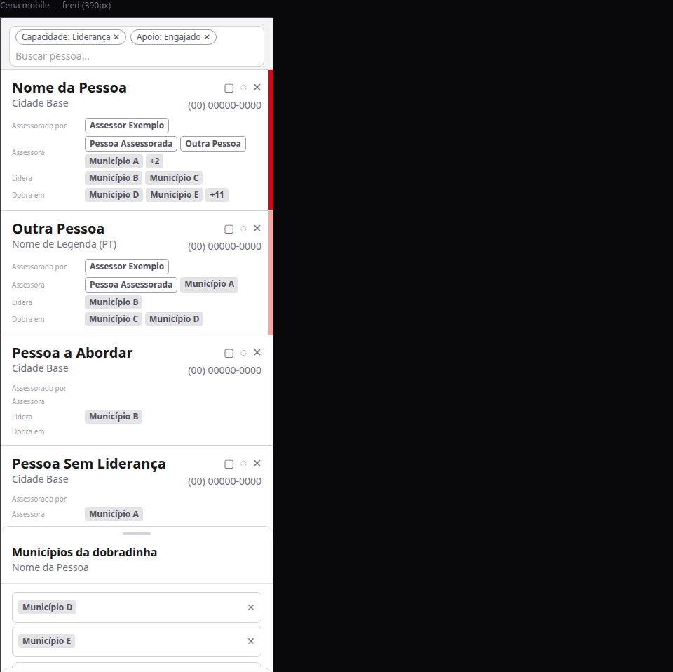

# Pessoas mobile: feed e cards edge-to-edge com edição por bottom drawer e faixa de status de liderança

Status: rascunho
Atualizado em: 2026-08-11
Issue: #714
Priority: P1
Model: composer-2.5
Impeccable: B — encaixe na tela mobile existente de `/campanha/pessoas` (interação tap→drawer já existe no desktop C116; aqui vira a superfície mobile)
Rascunho UI: docs/plans/pessoas-mobile-feed-cards-edicao-drawer-status-ui-draft.html + PNGs embutidos abaixo
Appetite: ~1–1,5 dia eng; um outcome verificável (feed mobile redesenho + edição por drawer + faixa de status)
Responsável: —

## Intenção

No celular, a lista de pessoas hoje é uma sequência de linhas simples e **só de leitura** (nome, telefone, badges sem interação) — a mesa no campo não consegue fazer nada além de abrir o WhatsApp. O desktop já edita "onde você vê" (C116: chips, nome, telefone, base). O pedido: levar o mesmo princípio ao mobile com um card denso e edge-to-edge — cada linha/campo do card vira uma porta de edição (bottom drawer), o toque no vazio do card abre a ficha, e uma faixa vertical à direita do card comunica o status de liderança de relance (é a leitura que orienta quem abordar no corpo a corpo).

## Persona e fluxo

- **Persona / contexto:** coordenador, candidato e assessor na mesa, no celular (o assessor continua vendo só o recorte da carteira dele e editando só o que a matiz C116 permite).
- **Job principal:** olhar o feed, entender num relance quem está engajado/lembrança e ainda "a abordar", e corrigir um dado (nome, telefone, municípios de uma capacidade) sem sair da lista nem abrir a ficha.
- **Fluxo desejado:** abro `/campanha/pessoas` no celular → o feed é edge-to-edge, o primeiro card cola no omnibox → vejo a faixa de status na direita (sem faixa = sem liderança ou a abordar; vermelho claro = lembrança; vermelho cheio = engajado; card apagado = negativo) → toco num chip de "Dobra em" e o bottom drawer abre com os municípios daquela linha para editar → toco no vazio do card e vou para a ficha da pessoa → toco no telefone e edito o telefone num drawer de texto.
- **Anti-goals de produto:** não é um segundo layout de tabela desktop no mobile (sem headers sortáveis na tela — a ordenação continua no omnibox, C125); não é um cadastro paralelo de pessoa (a ficha continua `Contact`); a faixa de status **não** é editável a partir do card (status continua no fluxo de lideranças).

### Esboço de fluxo (B/C/D)

```text
[/campanha/pessoas mobile] → [feed edge-to-edge, 1º card colado no omnibox]
  ├─ tap no vazio do card → [/campanha/pessoas/[id] ficha]
  ├─ tap no chip/label de uma linha (Assessora | Lidera | Dobra em | Assessorado por)
  │    → [bottom drawer daquela linha inteira: chips + busca + remover/adicionar]
  ├─ tap no nome / telefone / base → [bottom drawer de texto do campo]
  └─ faixa direita lida no scroll (engajado=cheio · lembrança=50% · negativo=apagado · a abordar/sem liderança=ausente)
```

### Rascunho UI (B/C/D)




## Objetivo e aceite

- No mobile (`< md`), os cards de pessoa ficam edge-to-edge (sem moldura lateral) e o primeiro card começa colado no omnibox de filtro — mesmo chassi do precedente de municípios.
- **Omnibox:** os chips de filtro ficam **dentro do campo** (ao lado do texto digitado), nunca numa linha abaixo dele — mesmo padrão do chassis compartilhado de hoje.
- Cada card mostra: nome com subtítulo (cidade-base **ou** nome de legenda com partido, quando houver — nunca os dois), ações (convidar quando houver liderança, WhatsApp, apagar para coordenação) no topo à direita, **telefone abaixo das ações** (alinhado à direita), e as quatro linhas **"Assessorado por", "Assessora", "Lidera" e "Dobra em" sempre visíveis** (mesmo vazias, só com o label) com chips (+N para overflow).
- **Linguagem visual dos chips:** fundo branco com borda cinza = **pessoa**; fundo cinza = **município**. A linha "Assessorado por" mostra pessoas; "Lidera" e "Dobra em" mostram municípios; a linha "Assessora" pode mostrar **os dois tipos** — as pessoas que esta pessoa assessora e os municípios da carteira dela (quando staff).
- Tocar em qualquer chip ou no label de uma linha abre o bottom drawer para editar **aquela linha inteira**; tocar no telefone abre o drawer do telefone; no nome, o do nome; na base, o da base — as mesmas escritas e a mesma matiz de permissão do desktop (assessor edita só o que está na carteira; Assessora/Assessorado seguem restritos). A linha "Assessora" abre **um drawer só, com um único input de busca que recebe valores de pessoas e de municípios** (chips atribuídos das duas naturezas listados com remoção).
- Tocar no vazio do card abre a ficha da pessoa (`/campanha/pessoas/[id]`); os elementos interativos interceptam o toque sem navegar.
- Faixa vertical de ~6px na borda direita do card conforme o status de liderança: sem liderança → sem faixa; "A abordar" → sem faixa; "Em disputa" → sem faixa; "Negativo" → sem faixa **e** card com visual desabilitado (mas ainda interativo); "Lembrança" → vermelho claro (~50% de opacidade); "Engajado" → vermelho de destaque do app.
- Desktop (`md+`) intacto: a tabela C116 não muda.

## Dados (intenção)

- **Vou apresentar dados?** Não — a faixa é um código visual de status (comunicação de relance), não métrica. Forma da cor: fixada no aceite acima (produto), os tokens exatos ficam para o plano de implementação.
- **Natureza dupla da linha "Assessora":** a linha mostra pessoas (quem esta pessoa assessora — o inverso da relação de assessorado) e municípios (a carteira dela quando staff). O executor precisa enxergar as duas naturezas no dado de origem da pessoa; o drawer da linha é um só, com **uma busca única** sobre pessoas e municípios (decidido no gate).

## Direção no codebase (hipótese)

- **Áreas prováveis:** `src/app/(campaign)/campanha/(app)/pessoas/page.tsx` (cards mobile atuais `PeopleMobileCards` e matiz de editabilidade C116), `src/components/campaign/people/` (cells C116: `PeopleMunicipalityCell`, `PeopleAssessoradoCell`; `PeopleMunicipalityCellMobile` é substituída), `src/components/campaign/shared/CampaignListSheetHost.tsx` (bottom drawer compartilhado da superfície, hoje escopado à tabela desktop), `src/components/campaign/shared/CampaignListOmnibox.tsx` + scrollport (chassi B196/B184 de omnibox colado/edge-to-edge).
- **Reuso do card mobile de municípios (revisão B193/B196/B200):** `MunicipalityMobileCard.tsx` já resolve a anatomia pedida aqui — **título/subtítulo** do card (`h3` com link esticado `after:inset-0` + subtítulo `text-sm text-muted-foreground`), toque no vazio caindo no link da ficha, **faixa direita via `border-r-[6px] border-r-primary`** (o card de municípios já usa a faixa de 6px para prioridade — mesmo mecanismo da faixa de status de liderança), blocos de chip com label acima, e edição por bottom sheet. Preferência de produto (revisão recente): **reaproveitar esses padrões e seguir progredindo para uma coleção de componentes voltados aos cards mobile de entidades de lista** — o executor deve reutilizar/estender o que já existe em vez de criar um sistema de card paralelo (se algum primitivo precisar sair do card de municípios para ser compartilhado, é direção bem-vinda — decisão do executor).
- **Precedente a olhar:** B196/B184 (omnibox colado + cards edge-to-edge de municípios), B193/B200 (card denso de municípios e sua revisão de encaixes), C116 (cells quiet + drawers por célula), C125 (omnibox mobile), C128 (ciclo de vida de capacidade, em andamento).
- **Risco de acoplamento:** a edição mobile precisa respeitar a **mesma** matiz de acesso do desktop (assessor não edita Assessora/Assessorado; matriz `buildPeopleEditability`); o drawer compartilhado não pode virar "um Drawer por célula" (regra B42/miss #52); leader lockdown não se aplica (a rota é staff-only); mudanças no `MunicipalityMobileCard`/primitivas compartilhadas não podem quebrar a lista de municípios (regressão coberta pelos e2e existentes de municípios).

## Dependências

- **Soft:** C128 (ciclo de vida "qualquer pessoa ganha capacidade") — se estiver em `main` na execução, a linha vazia (ex. "Dobra em" sem chips) abre o drawer para **criar** a capacidade; se não, linhas vazias renderizam só o label, sem drawer.
- **Soft:** C130 (renomear coluna "Aliada em" → "Dobra em" no desktop) — o card adota "Dobra em" de qualquer forma (mock do usuário), e a consistência com o desktop é esperada quando C130 entrar.

## Fora de escopo

- Editar o **status de liderança** a partir do card (faixa é display-only; status continua no fluxo de lideranças/ficha).
- Criar pessoa nova na lista (C132) e "Salvador" agregado no dropdown (C131) — itens próprios da fila.
- Mudar a **coluna "Assessora" da tabela desktop** para também mostrar pessoas — o mock e este item são mobile; o desktop segue como está (C128/C130 cuidam do desktop).
- Polir a ficha `/campanha/pessoas/[id]` — só a navegação por toque no card.
- Mudar o desktop, a ordenação no mobile (C125) ou o omnibox além do necessário para o encaixe do primeiro card.

## Rabbit holes de produto

- **Cada campo vira um sheet próprio de engenharia.** Se alguém "só completar", o nome/telefone/base ganham três drawers com três fluxos de save diferentes. **Corte neste item:** um único drawer de texto por campo (mesma ação de escrita do desktop, mesmo feedback de "Salvo."), sem validação nova além da que já existe nos formulários atuais.
- **Spreadsheet mode mobile.** O pedido é edição por campo tocado — não edição em lote, não "todos os cards editáveis de uma vez". **Corte:** nada além do tap→drawer.
- **Paleta nova para os status.** A faixa usa o vermelho de destaque do app e a mesma cor a 50% — sem criar escala de cores nova nem status colors em outras listas. **Corte:** só o vermelho, só em pessoas.
- **Linhas vazias sempre visíveis inflam o card.** O mock mostra os labels mesmo sem chips; para pessoas com poucas capacidades o card cresce. **Corte:** labels sempre visíveis (são o alvo do toque para adicionar — o "where you see" mobile), chips só quando houver valor.
- **"Assessora" vira duas relações no mesmo drawer.** A linha mistura pessoas e municípios; um sheet que tenta "editar tudo de uma vez" pode acabar em estado de formulário híbrido. **Corte neste item:** um drawer por linha com **um único input** que busca pessoas e municípios no mesmo índice (sugestões rotuladas por natureza) — a máquina de escrita existente por chips, sem submachine nova.
- **Sistema de card paralelo.** O card de municípios já tem título/subtítulo, faixa lateral e sheet-edit; criar o card de pessoas "do zero" duplicaria a anatomia. **Corte:** reusar/extender os padrões de `MunicipalityMobileCard` (e extrair primitivas compartilhadas se fizer sentido na execução) — direção explícita da revisão de UI de municípios (B200).

## Questões em aberto (produto)

_Decididas no gate 2026-08-11 (não reabrir sem evidência nova):_

- **"Em disputa"?** **Decidido:** sem faixa, como "A abordar" — a faixa comunica compromisso; disputa não é compromisso (filtro por status já distingue no omnibox).
- **Linhas de capacidade vazias?** **Decidido:** labels sempre visíveis; tocar abre o drawer (vazio; adicionar vira o ciclo de vida do C128 quando ele estiver em main).
- **Terceiro ícone do mock?** **Decidido:** sem menu ⋮ — as três ações explícitas atuais (convidar/WhatsApp/apagar) no topo do card, telefone abaixo delas.
- **Subtítulo do card?** **Decidido:** cidade-base **ou** nome de legenda "(partido)" quando a pessoa tem (C129) — nunca os dois juntos.
- **Drawer da linha "Assessora" — duas naturezas?** **Decidido:** um drawer só, com **um único input** que recebe valores de pessoas e de municípios (chips das duas naturezas com remoção; sugestões rotuladas por natureza).

## Referências

- Rascunho UI (gate): [pessoas-mobile-feed-cards-edicao-drawer-status-ui-draft.html](pessoas-mobile-feed-cards-edicao-drawer-status-ui-draft.html) + PNGs embutidos acima
- Arquivos para o executor abrir primeiro: `src/app/(campaign)/campanha/(app)/pessoas/page.tsx` (cards + matiz C116), `src/components/campaign/people/PeopleMunicipalityCell.tsx` / `PeopleAssessoradoCell.tsx`, `src/components/campaign/shared/CampaignListSheetHost.tsx`, `src/components/campaign/shared/CampaignListOmnibox.tsx`
- Precedentes: `docs/plans/municipios-mobile-polimento-omnibox-cards.md` (B196/B184), `docs/plans/pessoas-pos-c117-ux.md` (C125), `docs/plans/pessoas-edicao-inplace-lista.md` (C116)
- Card mobile de municípios (reuso direto): `src/components/campaign/municipality/MunicipalityMobileCard.tsx` (título/subtítulo + link esticado + faixa `border-r-[6px]` + sheet-edit) e a revisão B200 dos encaixes
- `AGENTS.md` — modelo Municípios, roles, B42/miss #52 (um drawer por superfície)
