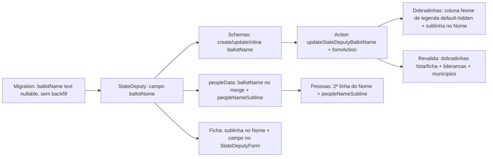

# Impl: Pessoas — nome de legenda da dobradinha (campo + display discreto sob o nome)

Status: aprovado
Atualizado em: 2026-08-11
Issue: #696
Intenção: docs/plans/pessoas-nome-de-legenda-dobradinha.md
Appetite restante: ~0,5–1 dia eng; um campo + display em 3 superfícies (pessoas, dobradinhas lista/ficha)

## Leitura da intenção

- **Outcome:** a dobradinha ganha um campo opcional **nome de legenda**; na tabela de `/campanha/pessoas` ele aparece discreto sob o nome real; é editável onde hoje se edita dado de dobradinha (lista de Dobradinhas, precedente B163) e display-only na tabela de pessoas.
- **O que NÃO negociar:** o nome real continua sendo a chave (sem busca/ordenação/facets por legenda); sem legenda a linha não muda (sem linha vazia, sem traço); **não** inline na célula de Nome de `/campanha/pessoas` (gate 2026-08-11: dois inputs na mesma célula não funcionam); regra da 2ª linha compartilhada com C130 — precedência combinada legenda sobrepõe base.
- **O que reavaliar:** a hipótese de "exibir na lista/ficha de Dobradinhas se barato" — decidido no gate: aparece lá, mesmo padrão discreto sob o nome. Onde editar na ficha (seção Contato vs form "Editar dobradinha") não estava decidido — resolvido aqui (D4).

## Abordagem recomendada

**Opções consideradas:** A | B | C
**Recomendação:** A — campo novo `ballotName` na collection `stateDeputy` (texto, opcional), plumbado no merge de pessoas e nas duas superfícies, reusando a máquina de célula B163 (mesmo padrão do partido) para edição na lista de Dobradinhas; display "discreto sob o nome" em pessoas (2ª linha), lista e ficha de Dobradinhas. Custo concentrado em: migration + campo, schema/action espelhando o partido, e a regra da 2ª linha num único lugar nomeado (`peopleNameSubline`) para C130.

### Decisões de engenharia

- **D1 — Campo `ballotName`** (`StateDeputy`): text opcional, `maxLength: 30` (limite real do nome de urna do TSE — é o dado que a mesa registra), **sem index** (nunca é consultado/filtrado; partido é indexado porque tem facet). Label pt-BR "Nome de legenda". Sem access próprio: herda `canManageStateDeputy` como `party`.
  - Opções: A `ballotName` | B `urnaName` | C `legendName`.
  - Recomendação: A — termo inglês padrão para "nome de urna"; `legendName` colide semanticamente com "legenda" = sigla partidária no TSE (confusão real).
  - Rejeitadas: B porque a mesa chama de "nome de legenda" e o domínio interno não usa "urna"; C porque "legenda" em eleitoral brasileiro é o partido (ambiguidade).
- **D2 — Regra da 2ª linha do Nome em `/campanha/pessoas`: legenda-only nesta branch, numa costura nomeada.** `peopleNameSubline(row)` (puro, em `peopleData.ts`) retorna `row.ballotName`; comentário declara que C130 estende com `?? row.city` (regra final combinada: legenda sobrepõe base — registrada nos dois planos). Render: `{subline ? {subline} : null}` — mesma marcação que a branch C130 já usa para a base, então o merge final é trivial.
  - Opções: A legenda-only com função nomeada | B `legenda ?? base` já agora | C markup inline.
  - Recomendação: A — cumpre o aceite "sem nome de legenda, nada muda na linha" nesta branch (com `?? base` a cidade apareceria duas vezes: sublinha + coluna Base, que só sai em C130) e dá a C130 um seam de uma expressão só.
  - Rejeitadas: B porque viola o aceite da intenção e duplica a base no interim; C porque inline espalharia a regra em 2 lugares sem ponto único para C130.
- **D3 — Lista de Dobradinhas: sublinha sob o Nome (display decidido no gate) + coluna "Nome de legenda" default-hidden.** A coluna usa `CampaignInlineEditableCell` (B163, `editTrigger="cell"`, `saveOnChange={false}`) como Partido; entra em `DEFAULT_HIDDEN_COLUMN_IDS.dobradinhas` (precedente da coluna E-mail, B197). A sublinha fica **fora** da região click-to-edit da célula do Nome (a célula é um div autossuficiente; a sublinha é irmã dela num wrapper flex-col), então clicar na sublinha não dispara edição do nome.
  - Opções: A coluna própria default-hidden + sublinha | B sublinha como editor (click na sublinha → input) | C só sublinha, edição apenas na ficha | D coluna default-visible.
  - Recomendação: A — display "discreto sob o nome" (decidido) e edição no lugar onde a lista já edita dado de dobradinha (B163), sem duplicar o valor duas vezes na largura padrão; quem edita acha a coluna no picker.
  - Rejeitadas: B porque reintroduz "dois inputs na mesma célula" (o princípio do gate); C porque "edita onde hoje se edita dado de dobradinha" aponta para a lista (B163); D porque duplica o valor em toda linha com legenda — sublinha + coluna.
- **D4 — Ficha: sublinha no Nome da seção Contato (display) + campo no `StateDeputyForm` (edição).** O `StateDeputyForm` é o form dono dos campos de `stateDeputy` (partido/observações) e serve criar + editar — `ballotName` entra lá (create e update schemas). A seção Contato (células B163) fica de fora: ela edita campos de `Contact`, e `ballotName` é campo da dobradinha.
  - Opções: A form dono | B seção Contato | C ambos.
  - Recomendação: A — uma superfície de edição só para o campo, no lugar que já edita os demais campos da entidade.
  - Rejeitadas: B porque a seção Contato é a fronteira dos campos de Contact (B163 separou as duas); C porque duas superfícies de edição para um campo opcional infla o appetite sem ganho.
- **D5 — Escrita: espelhar a máquina do partido, sem transação/locks/Consent novos.** `stateDeputyBallotNameUpdateSchema` (= `stateDeputyPartyUpdateSchema`, com `trimmedNullableText(30)` — vazio limpa o campo), `updateStateDeputyBallotNameRecord` via `runStaffEntityMutation` (escrita single-collection, staff-only), form action própria no `dobradinhas/formActions.ts`, `revalidateStateDeputyPaths` no wrapper público. `CampaignInlineEditableField` ganha `'ballotName'` (aditivo no union compartilhado).
  - Rejeitadas: rota/action nova de célula genérica (não há 3º consumidor); lock advisory (sem unicidade/concorrência de escrita multi-collection).

### Componentes / mudanças

- **`src/collections/StateDeputy.ts`**: campo `ballotName` (text, `maxLength: 30`, label "Nome de legenda", sem index) ao lado de `party`.
- **Migration:** `pnpm migrate:create add_state_deputy_ballot_name` — coluna nullable, sem backfill, sem índice; down drop. Revisar SQL e snapshot antes de rodar.
- **`src/lib/schemas/stateDeputy.ts`**: `ballotName: trimmedOptionalText(30)` no `stateDeputyCreateSchema` e no `stateDeputyUpdateSchema`; novo `stateDeputyBallotNameUpdateSchema` + tipos.
- **`src/app/(campaign)/campanha/actions/stateDeputy.ts`**: `updateStateDeputyBallotNameRecord` (clone do party), `updateStateDeputyBallotName` público com `revalidateStateDeputyPaths`; `StateDeputyCreationData` + `createStateDeputyWithContact` propagam `ballotName`; update form flui pelo schema.
- **`src/app/(campaign)/campanha/(app)/dobradinhas/formActions.ts`**: `updateStateDeputyBallotNameFormAction` (clone do party).
- **`src/utilities/people/peopleData.ts`**: `ballotName` em `PeopleDeputySource`, `toPeopleDeputySource`, `MergedPerson`, `personFor`, `mergePeopleSources`, `toPeopleRowViewModel`, `PeopleRowViewModel`; `select: { …, ballotName: true }` no `loadPeopleListPageData`; novo `peopleNameSubline` (puro, seam C130).
- **`src/utilities/stateDeputyData.ts`**: `ballotName` em `StateDeputyRowViewModel` + loader select/map; `StateDeputyDetailViewModel` + `loadStateDeputyDetail`.
- **`src/components/campaign/shared/CampaignInlineEditableCell.tsx`**: `'ballotName'` no union `CampaignInlineEditableField` (display/type pass-through — sem formatação).
- **`src/app/(campaign)/campanha/(app)/pessoas/page.tsx`**: célula de Nome vira flex-col; 2ª linha = `peopleNameSubline(row)` (mesma classe do C130).
- **`src/app/(campaign)/campanha/(app)/dobradinhas/page.tsx`**: coluna `ballotName` ("Nome de legenda", cell B163, `editTrigger="cell"`) + wrapper flex-col no Nome com sublinha.
- **`src/lib/campaignColumnVisibility.ts`**: `DEFAULT_HIDDEN_COLUMN_IDS.dobradinhas` += `'ballotName'`.
- **`src/app/(campaign)/campanha/(app)/dobradinhas/[id]/page.tsx` + `StateDeputyContactSection.tsx`**: sublinha sob o Nome da seção Contato.
- **`src/components/campaign/stateDeputy/StateDeputyForm.tsx`**: campo "Nome de legenda" (Input, maxLength 30) no form criar/editar.
- **Access / Consent:** nenhum — dado interno de staff; herda `canManageStateDeputy`; sem `Consent` (sem PII nova de opt-in).
- **UI:** Impeccable B — encaixe nas células existentes; sem rota nova; mesma família tipográfica, `text-xs text-muted-foreground`.

### Dados → forma

- **Vou apresentar dados?** Não — texto de identidade (nome de urna), sem métrica (pergunta 3 de data-presentation não se aplica). Forma: texto discreto sob o nome, sem label (a posição é o rótulo).

## Fases verificáveis

1. **Tracer / schema+server** (quota principal): migration + campo + schemas + action + form action; `pnpm generate:types`; criar/editar dobradinha com legenda via int spec.
2. **Dados**: plumb `ballotName` em `peopleData`/`stateDeputyData` + `peopleNameSubline`; unit tests (merge carrega o valor; subline legenda-only).
3. **UI**: sublinha em pessoas; coluna + sublinha em dobradinhas (+ default-hidden); ficha (sublinha + form).
4. **Gates**: `pnpm gate:fast`, `pnpm format:check`, `pnpm exec knip`, `pnpm check:cycles`, `pnpm test`, `pnpm test:e2e` (se viável) e `pnpm build` local; int specs novos/focados.

## Rabbit holes / Não escopo (engenharia)

- Busca/ordenação/facets por legenda (aceite: nome real é a chave) — nem `q` nem sort tocam `ballotName`.
- Nome de legenda para liderança/staff (pedido atual é só dobradinha).
- Redesign das superfícies de dobradinha (só sublinha + coluna).
- Index em `ballotName`, admin column picker customizado, campo na seção Contato da ficha (D4).
- Edição inline na célula de Nome de `/campanha/pessoas` (gate).
- Mobile cards de pessoas (intenção: tabela desktop).

## Riscos e mitigação

- **C130 em paralelo toca a mesma célula de Nome e `peopleData`** (branch C130 em progresso, com mudanças uncommitted): a sublinha nasce na função nomeada `peopleNameSubline` com a MESMA marcação do diff C130 (`truncate text-xs text-muted-foreground`), então o rebase pós-merge resolve substituindo o bloco da base pela sublinha combinada `legenda ?? base` (regra documentada nos dois planos de intenção). Se C130 mergir primeiro, o rebase converte o bloco `{row.city…}` na sublinha combinada.
- **Union `CampaignInlineEditableField` compartilhado**: aditivo; `tsc --noEmit` pega qualquer consumidor quebrar.
- **Migration em prod via build**: nullable, sem backfill, sem índice — reversível e não-destrutiva.
- **Cookie de colunas**: id novo é inerte em cookies antigos → visível para quem nunca mexeu no picker (contrato documentado em `toggleHiddenColumn`); default-hidden só vale para picker intacto — comportamento esperado (precedente E-mail).
- **Clicar na sublinha da lista de Dobradinhas disparar edição do Nome**: a sublinha é irmã da célula no wrapper flex-col, fora da região do cell editor — sem `stopPropagation` necessário.

## Aceite de engenharia

- [ ] Aceite de produto da intenção ainda coberto (campo opcional; display discreto; editável na lista de Dobradinhas; display-only em pessoas; sem linha vazia)
- [ ] Identificadores em inglês (`ballotName`), labels pt-BR ("Nome de legenda")
- [ ] Escrita staff-only via `runStaffEntityMutation` (precedente partido), sem alargar access
- [ ] Seam `peopleNameSubline` documentado para C130 (regra combinada legenda sobrepõe base)
- [ ] Sem migration destrutiva; `pnpm generate:types` após migration
- [ ] Testes de domínio: unit (merge + subline) e int (update ballotName por coordenador/assessor; líder negado; limpeza do campo)

**Self-score decision-quality: 5/5** — decisões caras (D1–D5) têm alternativas rejeitadas; appetite bounded (~0,5–1 dia); rabbit holes nomeados; depth check reusa B163, `runStaffEntityMutation`, `DEFAULT_HIDDEN_COLUMN_IDS` e a máquina de partido; outcome da intenção intacto (display-only em pessoas, edição na lista, legenda não vira chave de busca).
