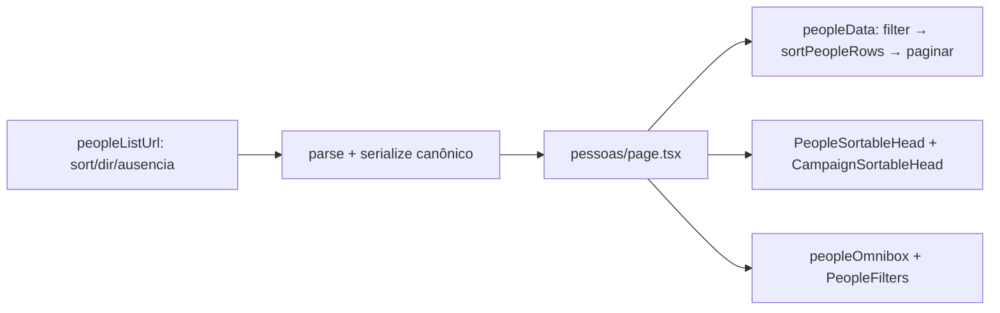

# Impl: Pessoas — ordenação (omnibox + header) e filtros de ausência

Status: aprovado
Atualizado em: 2026-08-11
Issue: #656
Intenção: docs/plans/pessoas-ordenacao-filtros-ausencia.md
Appetite restante: herdado (~1–1,5 dia eng)

## Leitura da intenção

- **Outcome:** ordenar a lista de pessoas por qualquer coluna visível (header desktop + omnibox em todos os breakpoints) e filtrar ausência ("Sem assessor", "Sem base", "Sem contato"), com estado na URL como os demais recortes; default inalterado (nome A–Z).
- **O que NÃO negociar:** toda chave de ordenação pousa numa coluna visível; filtro de ausência só expõe presença/ausência (telefone nunca vira facet); sort sobre o conjunto filtrado (não a página); sem migration/collection; escopo do assessor preservado no merge; leader segue fora da rota.
- **O que reavaliar:** a intenção deixa em aberto a _semântica_ dos três filtros de ausência (combináveis entre si — AND ou OR?) e não fixa quais colunas são sortáveis (o anti-goal "coluna visível" colide com `email`, oculta por padrão). Decisões abaixo.

## Abordagem recomendada

**Opções consideradas:** A (esta) | B (absence como 3 params booleanos AND) | C (email na lista de sort keys)
**Recomendação:** A — espelha os precedentes B15 (header) + territórios (omnibox) sem inventar contrato novo; ausência como um facet multi-valor OR (mesma semântica de todo facet do repo).
**Rejeitadas:** B porque cada absence vira um param novo sem precedente, e a leitura operacional ("quero ver quem está sem _algum_ destes dados") é união — com AND, marcar os três reduz a quase nada; C porque `email` é oculta por padrão (visibilidade de coluna `pessoas: ['email']`) e o anti-goal da intenção é explícito: chave de ordenação que não pousa em coluna visível é estado que mente.

### Decisões de engenharia

1. **Contrato de URL** (`peopleListUrl.ts`): params `sort`, `dir`, `ausencia` somam-se a `q|capacity|municipality|status|page`. `PeopleListSortKey = 'name' | 'contact' | 'assessora' | 'lidera' | 'aliada' | 'assessorado' | 'base'` (as colunas visíveis por padrão; `actions` inerte, `email` oculta). `ausencia` é facet multi-valor `sem_assessor | sem_base | sem_contato` via `parseExhaustiveEnumParam` — selecionar todos = "todas" = ausente (canonicalização grátis, contrato B18). Serializer omite `sort`/`dir` quando default (molde territórios); `dir` só quando difere do default da chave. `buildPeopleSortHref = createSortToggleHref` (algoritmo P3-F). `resolvePeopleListUrl` ganha os novos params no set.
2. **Semântica dos filtros de ausência**: um único facet `ausencia`, OR dentro do facet (padrão do repo), AND com os demais filtros. Rótulos: "Sem assessor" (= coluna Assessorado vazia — união dos advisor IDs de leadership+dobradinha), "Sem base" (= `city` nulo), "Sem contato" (= `phone` nulo, gate da intenção).
3. **Sort em memória sobre o conjunto filtrado, antes da paginação** (`peopleData.ts`): função pura `sortPeopleRows(rows, sort, dir)` exportada para testes. Nulls SEMPRE no fim (precedente B15 `sortByNullableValue`), tiebreak por nome → contactID (comportamento atual). Por chave: `name`/`contact`/`base` comparam string (`localeCompare` pt-BR); `assessora`/`lidera`/`aliada` ordenam pela contagem de municípios da coluna; `assessorado` pela contagem da união dos advisor IDs (`new Set([...leadershipAdvisorIDs, ...deputyAdvisorIDs]).size`) — **os nomes (`assessoradoNames`) só são resolvidos para a página visível** (otimização existente), então o sort NÃO pode depender deles.
4. **Default dir por chave**: textuais (name/contact/base) → `asc`; contagens (assessora/lidera/aliada/assessorado) → `desc` (leitura de ranking, "quem tem mais rede?" primeiro — precedente `sortKeysWithDescDefault` de municípios). Default da lista inteira: name asc (inalterado).
5. **`clearPeopleListFilters(state)` preserva o sort** (precedente municípios/territórios): assinatura muda de `() => state` para `(state) => state` — 2 call sites (`clearPeopleOmnibox`, empty state da página; `SavePeopleFilterControl` só usa `buildPeopleFilterHref`). Resumo de filtros ativos ganha os rótulos de ausência; sort NÃO entra no resumo (precedente territórios — recorte só-de-ordenação não gera "Salvar filtro", mesmo comportamento).
6. **UI**: novo `PeopleSortableHead` ('use client', forma simples sem header-filters — os filtros da lista vivem só na omnibox), molde `LeadershipSortableHead`/`StateDeputySortableHead`, colado via slot `head` de `CampaignTableColumn`. Omnibox: seeds "Ordenação" (`sort:<key>|<dir>`, grupo "Ordenação", keywords `ordenar|ordenacao|ordem|sort`, não visíveis com query vazia — molde territórios) e seeds "Ausência" (`ausencia:<value>`, `emptyQueryVisible: true` — atalho de triage, mesmo padrão de capacidade/status); chips `ausencia:<value>` ("Ausência: Sem assessor") e chip `sort` ("Ordenação: …") quando não-default; remoção de chip desfaz o facet / zera o sort.

### Componentes / mudanças

- **`PeopleListState` + parse/serialize + `buildPeopleSortHref`** (`src/utilities/people/peopleListUrl.ts`): contrato de URL estendido; sem migration (param de URL).
- **`sortPeopleRows`** (`src/utilities/people/peopleData.ts`): sort puro sobre `MergedPerson[]`; chamado em `loadPeopleListPageData` no lugar do sort fixo de nome.
- **`PeopleSortableHead`** (`src/components/campaign/people/PeopleSortableHead.tsx`, novo): header sortável com `aria-sort` + seta, reusa `CampaignSortableHead` + `buildPeopleSortHref`.
- **`peopleListFilters.ts` / `peopleOmnibox.ts`**: toggle de ausência, summary, chips/seeds/apply/remove de `ausencia` e `sort`.
- **`PeopleFilters.tsx` / `pessoas/page.tsx`**: colunas com `head` sortável (nome, contato, assessora, lidera, aliada, assessorado, base); `hasFilters` inclui `ausencias`; empty state usa o novo `clearPeopleListFilters(state)`.
- **Migration:** sem migration. **Access / Consent:** nenhum — escopo do assessor segue no merge; nenhuma chave nova.
- **UI:** Impeccable B (encaixe em tela existente). Shells reusados: `CampaignTable` slot `head`, `CampaignSortableHead`, `CampaignListOmnibox`, `createSortToggleHref`, `parseExhaustiveEnumParam`, `resolveListUrl`.

### Dados → forma (se aplicável)

- Nenhum dado novo: recorte e ordenação sobre a tabela existente (intenção, pergunta 3 do data-presentation). Ausência é predicado, não métrica exibida — sem KPI no topo.

## Fases verificáveis

1. **Contrato de URL + filtros + omnibox (puro)** — `peopleListUrl` (parse/serialize/sort toggle), `peopleListFilters` (ausência), `peopleData.sortPeopleRows`, `peopleOmnibox` (chips/seeds/apply); testes unitários do puro. Verificação: `pnpm test` focado.
2. **UI** — `PeopleSortableHead` + fiação em `pessoas/page.tsx` + `PeopleFilters` (nada novo de props: seeds são estáticas); testes unitários existentes ajustados (o teste que hoje rejeita `sort` como param desconhecido inverte de expectativa); e2e leve (`campaignPeople.e2e.spec.ts`: ordenar por header com `aria-sort` + filtrar ausência), se o appetite permitir.
3. **Gates** — `pnpm gate:fast` (tsc, lint zero-warnings, format:check, knip, check:cycles, unit+int, e2e) + `pnpm build` local; commit e PR com auto-merge em main.

## Rabbit holes / Não escopo (engenharia)

- Sort client-side da página (faz ranking falso) — proibido; sort sempre no conjunto filtrado completo.
- Resolver `assessoradoNames` para todas as linhas só para ordenar — desperdício; contagem da união de IDs já ordena.
- Ordenar por `email` — oculta por padrão, anti-goal explícito (gatilho de revisitação: se `email` voltar a ser visível, adicionar a chave é um diff de uma linha no record de labels).
- Chave `sort` canônica nova em URLs salvas (saved filters guardam href — nada a migrar).
- Header-filters por coluna (popover de filtro no header) — os filtros de pessoas vivem na omnibox; não inventar segundo caminho.

## Riscos e mitigação

- **Canonicalização do redirect**: `sort`/`dir`/`ausencia` entram no set de params conhecidos e no serializer — URL com `sort=name` (default) deve redirecionar para a URL limpa. Coberto por testes de `resolvePeopleListUrl`.
- **`clearPeopleListFilters` muda de assinatura**: 3 call sites (página, omnibox, navegação) — tsc pega qualquer call site esquecido.
- **Sort × visibilidade de coluna**: chaves fixadas nas colunas visíveis por padrão; se a mesa esconder outra coluna no futuro, o set de chaves é revisado com ela.

## Aceite de engenharia

- [x] Aceite de produto da intenção ainda coberto (ordenação header + omnibox, ausência combinável, default nome A–Z, escopo assessor no merge)
- [x] Invariantes AGENTS/engineering-standards (sem migration/collection, sem access novo, identificadores EN / copy pt-BR)
- [x] Testes de domínio previstos (unit do contrato de URL + `sortPeopleRows` + omnibox; e2e leve se couber no appetite)
