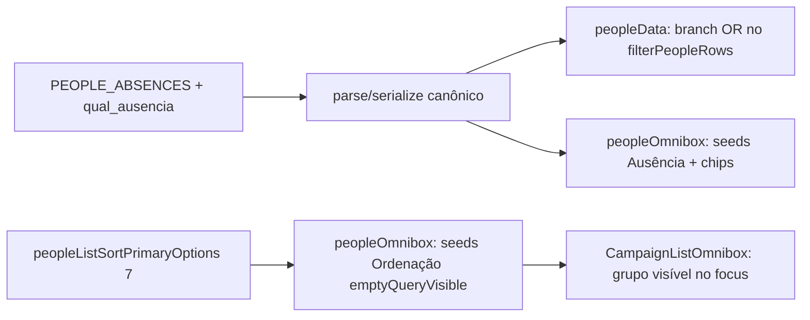

# Impl: Pessoas pós-C117 — descoberta de ordenação no mobile e facet de ausência completo

Status: aprovado
Atualizado em: 2026-08-11
Issue: #681
Intenção: docs/plans/pessoas-pos-c117-ux.md
Appetite restante: herdado (~0,5–1 dia eng)

## Leitura da intenção

- **Outcome:** (1) a consulta "quem está sem _algum_ dado" (fichas incompletas) é expressível no facet de ausência de `/campanha/pessoas` e o terceiro clique do facet não faz os chips sumirem; (2) no mobile (sem headers sortáveis) o usuário descobre que pode ordenar e alcança as 7 chaves de ordenação.
- **O que NÃO negociar:** canonicalização B18 intacta (`parseExhaustiveEnumParam` — selecionar todos = "todas" = ausente); mesma superfície (omnibox de pessoas, sem rota nova); sem migration/collection; copy pt-BR / identificadores EN; achados S2/S3/S4/S6/S9/S10/S11/S13 do simplify continuam fora (gatilhos registrados na intenção).
- **O que reavaliar:** a intenção deixa a forma do "qualquer ausência" em aberto (4º valor no enum OU toggle tri-state) e o desenho da descoberta mobile em aberto ("7 seeds de direção primária visíveis com query vazia, ou busca por coluna"). Decisões abaixo.

## Abordagem recomendada

**S14 — facet de ausência completo:** 4º valor `qualquer_ausencia` ("Qualquer ausência") no enum `PEOPLE_ABSENCES` (append-last). O colapso B18 é por contagem de membros (`parseExhaustiveEnumParam`), então com 4 membros:

- marcar os 3 específicos **não colapsa mais** (3 < 4) → os chips ficam e o filtro vale "alguma das três" — o bug do terceiro clique some sozinho, sem tocar no B18 genérico;
- `ausencia=qualquer_ausencia` sozinho = o mesmo conjunto de resultados, em UM chip;
- todos os 4 (URL digitada à mão) → colapso canônico B18, como sempre.
  Predicado novo em `filterPeopleRows`: `qualquer_ausencia` casa `!hasAdvisor || city === null || phone === null` (a união exata dos três), OR dentro do facet como os demais valores. **Absorção no parse (pós-review /simplify):** `parsePeopleListParams` para `ausencia` usa um parser próprio em vez de `parseExhaustiveEnumParam` — com 4 membros, o colapso genérico B18 ("todos os membros = ausente") dispararia no 4º clique (guarda-chuva + 3 específicos) — o bug dos chips sumirem um clique adiante. Regra: `qualquer_ausencia` presente ⇒ estado canônico `['qualquer_ausencia']` (o guarda-chuva absorve os específicos; o combo redundante vira 1 chip, e "todos os 4" deixa de colapsar). As 3 específicas seguem composicionais (cada chip removível); capacity/status continuam no parser genérico B18.

**Opções consideradas:** A (4º valor no enum, OR) | B (toggle tri-state no chip) | C (normalizar "3 específicos" → `qualquer_ausencia` no serializer)
**Recomendação:** A — um valor no enum é a menor forma que mantém B18, é unit-testável no contrato de URL (parse/serialize) e no predicado, e o omnibox ganha o chip de graça via `peopleAbsenceFilterOptions`/labels derivados.
**Rejeitadas:** B porque inventa estado de UI não-representável na URL (o facet vive todo na URL neste repo — precedente B18); C porque quebra a composicionalidade dos chips (3º clique trocaria 3 chips por 1) e é uma regra canônica nova específica de pessoas fora do B18 genérico — sem ganho de aceite. **Defer pós-review /simplify:** record de predicados por enum (`Record<PeopleAbsence, (row) => boolean>` com o guarda-chuva derivado) — o OR explícito em `filterPeopleRows` está ao lado das definições dos três termos (o código é o contrato); revisitar quando houver um 4º predicado de ausência (aí o guarda-chuva vira derivação real).

**S12 — descoberta de ordenação no mobile:** o cap de 8 por grupo (`campaignListOmnibox.ts`, compartilhado por 8+ listas) corta as 14 seeds (7 chaves × 2 direções) em 8, escondendo `aliada|assessorado|base`. Solução: as seeds do grupo "Ordenação" de pessoas passam a ser **as 7 direções primárias** (`dir === defaultPeopleListSortDir(key)`) — novo export `peopleListSortPrimaryOptions` em `peopleListUrl.ts` (derivação, não duplicação: `peopleListSortOptions` filtrado) — com `emptyQueryVisible: true`. Com query vazia o grupo aparece ao tocar no bar (padrão já usado por Capacidade/Apoio/Ausência — atalhos de dimensão); digitando "ordenar" → 7 hits, abaixo do cap, todas as chaves visíveis. `peopleListSortOptions` (14) continua sendo o catálogo canônico para chips/labels/apply/URL/headers.

**Opções consideradas:** A (7 seeds primárias + emptyQueryVisible) | B (manter 14, subir o cap do grupo no lib compartilhado) | C (keywords por coluna nas seeds)
**Recomendação:** A — fixa o achado (7 chaves alcançáveis por keyword E visíveis no toque mobile), zero mudança no lib compartilhado (cap/ordem afetam todas as listas — municípios precisam do cap 8), e é exatamente o exemplo da intenção ("7 seeds de direção primária visíveis com query vazia").
**Rejeitadas:** B porque o cap é compartilhado por design (grupo Município com centenas de opções) e um cap-por-grupo adiciona API ao lib para um caso; C porque não resolve o achado — digitando o genérico "ordenar" as 14 continuam batendo no cap 8 e as 3 chaves somem mesmo com keyword por coluna.

**Trade-off aceito (S12):** direções secundárias (ex. `name desc` Z–A, `lidera asc`) deixam de ser alcançáveis via omnibox; no desktop o header continua fazendo o flip (segundo clique), e no mobile a leitura secundária é a menos relevante (cards sem contexto direcional; a direção primária é a leitura pretendida — contagens `desc` "quem tem mais rede primeiro", textuais `asc`). Gatilho de revisitação: se a mesa pedir controle de direção no mobile, um padrão de seed por direção volta ao desenho.

### Componentes / mudanças

- **`peopleListUrl.ts`**: `PEOPLE_ABSENCES` ganha `qualquer_ausencia` (último) + label "Qualquer ausência"; novo export `peopleListSortPrimaryOptions` (7, direção primária por chave). Parse/serialize/toggle/set ganham o 4º valor de graça (tudo derivado).
- **`peopleData.ts`**: branch `qualquer_ausencia` no `filterPeopleRows` (união exata dos três predicados, OR dentro do facet).
- **`peopleOmnibox.ts`**: seeds "Ausência" — keywords do grupo ganham `incompleto`/`incompleta` (linguagem natural de "ficha incompleta", achado S14); seeds "Ordenação" — loop passa a usar `peopleListSortPrimaryOptions` com `emptyQueryVisible: true`. Nada mais muda (chips/apply/remove são derivados dos mesmos options).
- **Migration:** sem migration (param de URL + enum de código).
- **Access / Consent:** nenhum — mesma superfície staff, nenhuma chave nova.
- **UI:** Impeccable B — encaixe no omnibox existente; zero componente novo; `CampaignListOmnibox` já renderiza grupos com query vazia no focus.

### Dados → forma (se aplicável)

- Nenhum dado novo: `qualquer_ausencia` é um valor de facet (predicado), não uma métrica; o group "Ordenação" com 7 itens no popover é a forma escolhida por caber no `max-h-72` scrollável do popover compartilhado e por ser o mesmo padrão visual dos atalhos de dimensão existentes (Capacidade/Apoio/Ausência já são `emptyQueryVisible`).

## Fases verificáveis

1. **Puro (contrato + filtro + omnibox)** — `peopleListUrl` (4º valor + primary sort options), `filterPeopleRows` (qualquer_ausencia), `peopleOmnibox` (seeds/chips/apply); testes unitários novos/ajustados: `peopleListUrl.unit.spec.ts` (o teste de colapso "todas" passa a usar os 4 membros; 3 específicos não colapsam mais), `peopleMerge.unit.spec.ts` (união do qualquer_ausencia + AND com outros facets), **novo** `tests/unit/peopleOmnibox.unit.spec.ts` ("ordenar" → 7 seeds primárias; query vazia → grupo visível; apply/toggle/chips, incluindo chip de sort secundária aplicada via header com label completo).
2. **E2E** — `campaignPeople.e2e.spec.ts`: (a) facet de ausência via omnibox com "Qualquer ausência" (chip único, pessoa sem contato visível, ficha completa oculta) e o fluxo "marcar os três" sem sumir chips; (b) mobile (`390×844`): foco no omnibox → grupo "Ordenação" visível → escolher "Lidera (maior → menor)" → URL `sort=lidera`.
3. **Gates** — `pnpm gate:fast` (tsc, lint zero-warnings, format:check, knip, check:cycles, unit+int, e2e) + `pnpm build` local; commit e PR com auto-merge em main.

## Rabbit holes / Não escopo (engenharia)

- Cap-por-grupo no `campaignListOmnibox.ts` — o cap 8 é compartilhado de propósito; as 7 seeds primárias resolvem sem tocá-lo.
- Normalizar "3 específicos" → `qualquer_ausencia` — ver rejeitadas (C).
- Seeds de direção secundária no mobile — trade-off aceito, gatilho registrado.
- S2/S3/S4/S6/S9/S10/S11/S13 do simplify — fora, gatilhos na intenção.
- Outras listas (municípios/lideranças têm o mesmo gap mobile de descoberta de sort) — escopo é pessoas (a intenção é do recorte de pessoas; abrir para outras listas é item novo).

## Riscos e mitigação

- **B18 fica intacto?** O colapso agora exige os 4 membros; testes de `parseExhaustiveEnumParam` e o teste atualizado de pessoas garantem que selecionar todos = ausente continua sendo a regra genérica (o teste do contrato muda de 3 para 4 membros).
- **Cap corta as seeds primárias?** 7 < 8 — e o teste novo de omnibox fixa "todas as 7 chaves aparecem com 'ordenar'".
- **Chip de sort secundária (aplicada no desktop) perde o label?** `buildPeopleOmniboxChips` continua usando `peopleListSortOptions` completo — coberto por teste unitário novo.
- **e2e mobile flaky (stream dinâmico)?** reuso do padrão `campaignUpdatesMobile.e2e.spec.ts` (`MOBILE_VIEWPORT` + locators visíveis); asserções por URL/chip, não por ordem visual onde possível.

## Aceite de engenharia

- [x] Aceite de produto da intenção ainda coberto (fichas incompletas expressível; 7 chaves alcançáveis e visíveis no mobile; B18 intacto)
- [x] Invariantes AGENTS/engineering-standards (sem migration/collection, sem access novo, identificadores EN / copy pt-BR)
- [x] Testes de domínio previstos (unit do contrato + filtro + omnibox; e2e do facet e da descoberta mobile)
