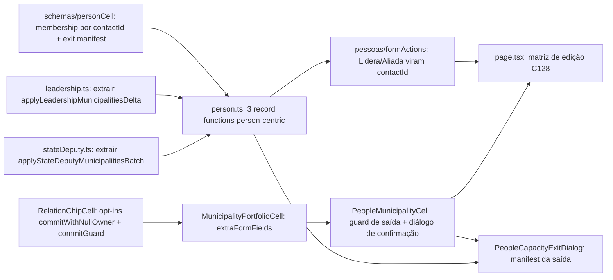

# Impl: Pessoas — qualquer pessoa pode assessorar, liderar e/ou dobrar — ciclo de vida nas tabelas pela lista

Status: aprovado
Atualizado em: 2026-08-11
Issue: #695
Intenção: docs/plans/pessoas-qualquer-capacidade-para-toda-pessoa.md
Appetite restante: ~2–3 dias eng; ciclo de vida completo das três capacidades num único recorte

## Leitura da intenção

- **Outcome:** em `/campanha/pessoas`, as três células de capacidade (Assessora, Lidera, Aliada em) ficam editáveis para toda pessoa visível — a primeira cidade adicionada cria a entidade na tabela da capacidade (conta staff / liderança / dobradinha) e a remoção da última cidade a remove daquela tabela; saídas destrutivas (votos declarados, conta de acesso) pedem confirmação explícita listando o que será removido (precedente da cascata "Apagar pessoa"). O ciclo de vida passa a garantir o piso de 1 município da liderança.
- **O que NÃO negociar:** escopo por ator preservado (criação/remoção de conta staff = coordenação/candidato; assessor só o que está na carteira); leader fora da rota; lote inteiro = uma transação única (nada pela metade); as três capacidades independentes (criar/remover uma não toca as outras); contas staff pré-existentes com carteira vazia continuam como estão; contas vazias nascidas do ciclo de vida SÃO removidas (aceite); sem busca de Contatos sem capacidade; sem migration (escreve nas collections donas + `campaignUser`); copy pt-BR / identificadores em inglês.
- **O que reavaliar:** a hipótese de "reusar `setLeadershipMunicipalitiesMembership`/`setStateDeputyMunicipalitiesBatch` nas células" — são escritas por `ownerId` (leadership/deputy id) e começam transação própria; o ciclo de vida precisa de **escritas person-centric por `contactId`** (mesmo padrão que C116 já usou em `setPersonAssessoraMembership`/`setPersonAdvisorMembership`), com a criação/remoção da entidade decidida por existência de vínculo. A hipótese de "extender as células compartilhadas" confirma-se (opt-ins com defaults intactos). **Bug latente C116 encontrado:** a célula Assessora nunca salva — `MunicipalityPortfolioCell.buildFormData` só envia `ownerId`, mas `setPersonAssessoraFormAction` exige `contactId` (FormDataBoundaryError "Campo obrigatório." em toda tentativa; int tests chamam a record function direto, então não pegaram). O refactor person-centric corrige.

## Abordagem recomendada

**Opções consideradas:**

- **A — escritas person-centric por `contactId` + extração dos deltas das actions de domínio (edit the owner)**: `setPersonLeadershipMunicipalitiesRecord`/`setPersonStateDeputyMunicipalitiesRecord` novas em `person.ts`, resolvendo a entidade da pessoa por `contact` dentro da transação (cria se não existe, apaga se esvazia); os deltas municipais puros (`applyLeadershipMunicipalitiesDelta`, `applyStateDeputyMunicipalitiesBatch`) são extraídos das actions B34/B37 e reusados pelos dois call sites (as listas de lideranças/dobradinhas continuam chamando os wrappers existentes com contrato idêntico).
- **B — células chamarem as actions de domínio existentes passando `ownerId`**: precisaria de ownerId mesmo sem entidade (id inventado), transações aninhadas (as record functions de domínio abrem transação própria), e o "cria/apaga no último" teria que vazar para fora delas. Rejeitada: contrato quebrado e duplicação da lógica de ciclo de vida em três lugares.
- **C — componentes novos `people/*` com máquina própria de commit+diálogo**: twin da máquina de chips. Rejeitada: o repo proíbe.

**Recomendação: A** — segue o padrão C116 já estabelecido (record functions person-centric em `person.ts`, toggles extraídos como helpers transaction-agnostic — precedente `toggleMunicipalityAdvisorMembership`); a interação nova (guard de saída destrutiva) entra como **opt-in no `RelationChipCell`** (`commitGuard`), defaults inalterados (B34/B36/B37/B156/B157/B159/B169 intactos).

### Decisões de engenharia travadas

- **Saída destrutiva (esvaziar a relação) por escopo, não por papel** (gate 2026-08-11): **coordenação/candidato sempre podem encerrar**; **assessor também encerra Lidera/Aliada** quando **todos** os municípios atuais da capacidade estão na carteira dele (o "piso" dele é a visibilidade: chips fora da carteira nem renderizam, então o esvaziamento só ocorre quando a capacidade inteira está na carteira). **Assessora segue coordenação/candidato** (decisão do gate da intenção — criação/remoção de conta staff). O servidor re-checa o escopo completo antes do delete (não só o lote removido) e o diálogo de confirmação precede a destruição; assessor que não cobre a capacidade inteira nunca esvazia — remover os chips visíveis deixa os municípios fora da carteira intactos (remoção normal, sem delete).
- **Fim de assessoria: a conta staff é APAGADA** (aceite) — com cascata dos itens autorados (`campaignInvite.createdBy`, `municipalityUpdate.author`, `calendarFeed.createdBy`, `supporterImportBatch.actor` — mesma ordem do `personDelete`, FK NOT NULL) e dos vínculos de assessorado (`leadership.advisors`, `stateDeputy.advisors`, `activity.advisors` — join tables cascateiam no `campaign_user_id`); o diálogo lista conta + autorias + assessorado. Extrair a cascata de conta do `personDelete.ts` para helper compartilhado (edit the owner, não twin).
- **Fim de liderança:** confirmação **somente quando houver votos declarados ou convites pendentes** (manifest lista ambos; intenção: "com confirmação se houver votos declarados"); sem eles, remove direto (nada próprio a perder). Ordem do delete: `votePledge` → `campaignInvite` → `leadership` (contrato FK do `personDelete`).
- **Fim de dobradinha:** sem confirmação extra (rabbit hole da intenção — "limpeza automática dos vínculos na mesma transação"); o delete da linha limpa os vínculos restantes de `municipality.stateDeputies`/`leadership.stateDeputies` pelos FKs (mesmo comportamento do `personDelete`).
- **Criação de conta staff:** `{ name: <nome da ficha>, role: 'advisor', contact: contactId, password: randomBytes(24).base64url }` — **sem e-mail/username** (decisão do gate: "conta criada sem e-mail/username utilizáveis"); `contact` explícito via `overrideAccess: true` justificado (o hook C99 `resolveContactForAccount` criaria ficha órfã quando a pessoa não tem telefone — com `contact` explícito ele não roda). A conta não consegue logar até o provisionamento (mesmo contrato do `createMunicipalityAdvisorRecord`).
- **Criação de liderança:** `{ contact: contactId, municipalities: ids }` com `user: currentActor, overrideAccess: false` — `canCreateLeadership` re-checa o escopo do assessor (todos os municípios na carteira); cap `MAX_LEADERSHIP_MUNICIPALITIES` mantido; nunca update com array vazio (o hook `requireAtLeastOneMunicipality` recusaria) — esvaziou, vai direto ao delete.
- **Criação de dobradinha:** `{ contact: contactId }` (slug auto do nome; `party` null) com `user` + `overrideAccess: false` (`canCreateStateDeputy` = staff); conflito de slug (dobradinha com mesmo nome em outra ficha) mapeado para mensagem segura; depois o batch municipal (reusa o helper extraído, que re-checa `canUpdateMunicipality` por município).
- **FormData das células:** `MunicipalityPortfolioCell` ganha `extraFormFields` (append de `contactId` ao FormData) e `commitWithNullOwner` (o early-return de `ownerId === null` no `RelationChipCell` é o que hoje impede o commit de criar). As formActions Lidera/Aliada de `/pessoas` passam a ler `contactId` (deixam de ler `ownerId`); as listas de domínio não mudam.
- **Guarda de saída:** opt-in `commitGuard` no `RelationChipCell`, chamado em `attemptRemove`/`pickHit` **antes** do apply otimista (mesmo ponto dos refusals de floor/cap) — recebe `{ changedIds, assigned, currentIds }` (currentIds = `effectiveIds`, ciente do otimista). `false` aborta sem apply; `true` segue o commit normal. O path de undo-toast (re-adicionar) não passa pela guarda (nunca esvazia). **Fail-closed:** falha ao carregar o manifest aborta o commit com toast de erro (nada é apagado sem confirmação).

### Componentes / mudanças

**Puro (lib, client-safe):**

- **`src/lib/schemas/personCell.ts`**: `personLeadershipMembershipSchema` / `personStateDeputyMembershipSchema` (`contactId` + `municipalityIds` + `assigned` — mesmo shape do `personAssessoraMembershipSchema`), `personCapacityExitSchema` (`capacity: 'account' | 'leadership'` + `contactId`); novas mensagens seguras: `PERSON_CAPACITY_EXIT_SCOPE_MESSAGE` ("Você só pode encerrar a capacidade quando todos os municípios dela estão na sua carteira."), `PERSON_LEADERSHIP_CREATE_CONFLICT_MESSAGE` (já existe liderança para a ficha), `PERSON_STATE_DEPUTY_CREATE_CONFLICT_MESSAGE` (slug/nome já em uso). `PERSON_ASSESSORA_NO_ACCOUNT_MESSAGE` deixa de ser usada na célula (criação substitui a recusa) — removida das safeMessages, mantida a constante por compatibilidade de testes a ajustar.

**Server (`person.ts` + formActions + utilities):**

- **`src/app/(campaign)/campanha/actions/person.ts`** — três record functions novas/estendidas, todas `withPayloadTransaction` + `req`:
  - `setPersonAssessoraMembershipRecord` (**estendida**): `reloadUnrestrictedActor`; resolve contas por `contact` (limite 2): 0 contas + `assigned` → **cria** a conta (decisão acima) e aplica o toggle; 0 contas + remoção → no-op (nada a remover); 1 conta → toggle existente; 2+ → recusa multi-conta (inalterada). Esvaziou a carteira → **delete da conta** (cascata autorias via helper compartilhado extraído do `personDelete.ts`).
  - `setPersonLeadershipMunicipalitiesRecord` (**nova**): `reloadStaffActor`; resolve liderança por `contact` (`user`-threaded); sem liderança + `assigned` → cria; sem + remoção → no-op; com + `assigned` → `applyLeadershipMunicipalitiesDelta` (extraído); com + remoção esvaziando → **guarda de escopo do exit** (unrestricted sempre; assessor exige que TODOS os municípios atuais da liderança estejam na carteira — senão recusa com mensagem segura) → delete pledges/invites/leadership em ordem (bypass justificado pela guarda + diálogo). Retorna slugs tocados para revalidação.
  - `setPersonStateDeputyMunicipalitiesRecord` (**nova**): `reloadStaffActor`; resolve dobradinha por `contact`; sem + `assigned` → cria (conflito de slug mapeado) + batch; sem + remoção → no-op; com + `assigned` → `applyStateDeputyMunicipalitiesBatch` (extraído); com + esvaziando → mesma guarda de escopo do exit (todos os municípios atuais na carteira para assessor) → delete da linha (refs limpam pelos FKs, mesmo contrato do `personDelete`).
  - `getPersonCapacityExitManifestAction` (**nova**): `reloadStaffActor` + mesma guarda de escopo do exit (fail-closed: assessor que não cobre a capacidade inteira não vê manifest); manifest read-only: `account` → `{ accountName, authored: { inviteCount, updateCount, feedCount }, assessorado: { leadershipNames, deputyNames, activityNames } }` (unrestricted-only — decisão do gate); `leadership` → `{ declaredVoteCount, inviteCount, municipalityNames }`. Sem escrita, sem locks.
  - Wrappers `setPersonLeadershipMunicipalities` / `setPersonStateDeputyMunicipalities` com revalidação: `/campanha/pessoas` + `/campanha/liderancas` (page + `[id]`) ou `/campanha/dobradinhas` (page + `[id]`) + `/campanha/municipios/<slug>` tocados (+ `/campanha/assessores` page + `[id]` no assessora).
- **`src/app/(campaign)/campanha/actions/leadership.ts`**: extrair `applyLeadershipMunicipalitiesDelta(payload, currentActor, req, leadershipId, municipalityIds, assigned)` → `{ next, slugs }` (read `user`-threaded → `nextMunicipalityIdsAfterLeadershipMembership` → `assertMunicipalitiesWithinScope` nos adicionados → update `user`-threaded → slugs). `setLeadershipMunicipalitiesMembershipRecord` passa a chamá-la (contrato externo idêntico).
- **`src/app/(campaign)/campanha/actions/stateDeputy.ts`**: extrair `applyStateDeputyMunicipalitiesBatch(payload, currentActor, req, stateDeputyId, municipalityIds, assigned)` → `{ slugs }` (corpo atual do batch: locks por município, read/update `user`-threaded). `setStateDeputyMunicipalitiesBatchRecord` passa a chamá-la.
- **`src/utilities/people/personDelete.ts`**: extrair `deleteCampaignUserAccount(payload, req, accountID)` (autorias → `payload.delete` por id para rodar hooks) reusado pelo `deletePersonRecord` e pelo fim de assessoria.
- **`src/app/(campaign)/campanha/(app)/pessoas/formActions.ts`**: `setPersonLeadershipMunicipalitiesFormAction` / `setPersonStateDeputyMunicipalitiesFormAction` passam a ler `contactId` e delegar às record functions person-centric; `setPersonAssessoraFormAction` inalterada (já é contactId — o bug latente some quando a célula passa a enviar o campo). SafeMessages: `personAssessoraSafeMessages` perde `NO_ACCOUNT`; novas mensagens adicionadas às listas.
- **`src/utilities/people/peopleData.ts`**: sem mudança (o VM já expõe `staff`, `leadershipID`, `deputyID`, municipios por capacidade).
- **Migration:** nenhuma (sem mudança de schema).

**UI (Impeccable B — encaixe em tela existente):**

- **`src/components/campaign/shared/RelationChipCell.tsx`**: dois opt-ins, defaults inalterados: `commitWithNullOwner?: boolean` (skip do early-return `if (ownerId === null) return` quando ligado) e `commitGuard?: (delta: { changedIds: number[]; assigned: boolean; currentIds: number[] }) => Promise<boolean>` (chamado em `attemptRemove`/`pickHit` antes do apply otimista; `false` aborta).
- **`src/components/campaign/shared/MunicipalityPortfolioCell.tsx`**: repassa os dois opt-ins; novo `extraFormFields?: Record<string, string | number>` (append no `buildFormData`, ex. `contactId`).
- **`src/components/campaign/people/PeopleCapacityExitDialog.tsx`** (novo): AlertDialog no padrão `DeletePersonButton` (manifest carregado ao abrir, lista verbatim, botão destrutivo com spinner); copy por capacidade ("Encerrar liderança" / "Encerrar assessoria"): liderança → "N votos declarados · M convites pendentes · municípios"; assessoria → "conta de acesso (nome) · autorias · assessorado". Cancelar/fechar aborta.
- **`src/components/campaign/people/PeopleMunicipalityCell.tsx`** (estendido): props novas `contactId: number`, `exitMode?: 'account' | 'leadership' | 'stateDeputy'`; passa `extraFormFields={{ contactId }}` + `commitWithNullOwner`; implementa `commitGuard`: esvaziar relação → manifest action (`account`/`leadership`; `stateDeputy` retorna `true` direto — sem diálogo); `account` sempre abre diálogo; `leadership` abre se `declaredVoteCount > 0 || inviteCount > 0`; confirmado → `true`; cancelado/falha → `false`.
- **`src/app/(campaign)/campanha/(app)/pessoas/page.tsx`**: matriz `buildPeopleEditability` C128 — `canEditAssessora = unrestricted && row.staff.length <= 1` (0 = cria, 1 = edita, 2+ = read-only); `canEditLidera`/`canEditAliada = unrestricted || row.leadershipID/deputyID === null || inCarteira(...)` (pessoa sem a capacidade fica editável para o assessor, com `addableIds` = carteira); **sem `minItems` em nenhuma coluna** (o piso do assessor é a visibilidade — chips fora da carteira não renderizam; o esvaziamento só ocorre com a capacidade inteira na carteira); `exitMode` por coluna. `PeopleMobileCards` intacto.

### Dados → forma

- **Forma escolhida:** o diálogo de confirmação é a única forma "nova" — lista textual do manifest, precedente `DeletePersonButton` (sem dado analítico; contagens do que será removido). Rejeitadas: tooltip/popover de confirmação (gesto destrutivo merece diálogo modal, precedente da cascata) e checkbox de "ciência" (gasto desnecessário).

## Fases verificáveis

1. **Server core** (~1/3 appetite): schemas + extrações (`applyLeadershipMunicipalitiesDelta`, `applyStateDeputyMunicipalitiesBatch`, `deleteCampaignUserAccount`) + as três record functions + manifest action + wrappers/revalidação. Int tests: cria-conta-na-primeira-cidade (sem email/username, contact linkado, sem ficha órfã), cria-liderança/dobradinha na primeira cidade, remove-última-cidade (delete + cascata), manifest (liderança com/sem votos, assessora com autorias/assessorado), guardas: assessor esvazia Lidera/Aliada com a capacidade inteira na carteira, assessor com municípios fora da carteira NÃO esvazia (recusa server + manifest negado), assessora continua coordenação/candidato (assessor recusa), multi-conta recusa, assessor fora da carteira recusa, no-op de remoção sem entidade, conflito de slug da dobradinha, undo re-cria (assigned=true após delete).
2. **UI machines** (~1/3 appetite): opt-ins no `RelationChipCell`/`MunicipalityPortfolioCell` + `PeopleMunicipalityCell` com `commitGuard` + `PeopleCapacityExitDialog`; testes de componente do guard (aborta sem apply, confirmado aplica, falha aborta) e do early-return `commitWithNullOwner`; regressão visual das listas B34/B37/B156/B157/B159/B169 (defaults intactos).
3. **Page + polish** (~1/3 appetite): matriz C128, `extraFormFields`/`exitMode` por coluna, tooltip/aria do diálogo, indicador discreto de foco; **correção do bug latente da célula Assessora** (e2e do commit Assessora agora salva); shape→craft→critique→polish.
4. **Gates:** após cada slice `pnpm exec tsc --noEmit` + testes focados; ao final `pnpm lint` (0 warnings), `pnpm format:check`, `pnpm exec knip`, `pnpm check:cycles`, `pnpm test`, `pnpm test:e2e` (estender `campaignPeople.e2e.spec.ts` com um fluxo de ciclo de vida: criar conta na primeira cidade + diálogo de encerramento), `pnpm build` local. Entrada no `docs/CHANGELOG-AGENTS.md`.

## Rabbit holes / Não escopo (engenharia)

- Assessor encerrar a **Assessora** (conta staff) — fora: decisão do gate da intenção (coordenação/candidato).
- Remover conta com carteira vazia pré-existente sem passar pela célula (fica no fluxo "Apagar pessoa", como decidido).
- Busca/autocomplete de Contatos sem capacidade (v1 sem, decisão da intenção).
- Contenteditable, tree-view de território, edição em lote — fora (herdado do C116).
- Migration de schema — nenhuma.
- Não mexer nas listas de domínio além dos helpers extraídos (contrato externo idêntico).

## Riscos e mitigação

- **Transações aninhadas** (person action chamando record function de domínio): só helpers transaction-agnostic (`req`-threaded) dentro da transação; as extrações mantêm o contrato dos wrappers existentes.
- **Célula Assessora quebrada hoje (bug latente C116)**: o refactor envia `contactId`; int test do formAction (não só da record function) cobre o commit completo.
- **Hook `requireAtLeastOneMunicipality` vs esvaziamento**: o esvaziamento nunca faz update com array vazio — vai direto ao delete dentro da mesma transação.
- **Cascata da conta staff esquecendo autorias (FK NOT NULL)**: helper compartilhado extraído do `personDelete` (ordem já validada em prod); int test do delete com autorias presentes.
- **Undo-toast após delete de entidade**: "Desfazer" re-adiciona (assigned=true) e a criação-no-add re-cria a entidade — int test do ciclo undo.
- **Regressão das células compartilhadas**: opt-ins com defaults; testes unit/int existentes das células de relação rodam intactos na Fase 2.
- **Manifest divergindo do delete (race)**: o manifest é preview, o delete re-enumera dentro da transação (mesmo contrato do `personDelete`); guard fail-closed (erro de manifest aborta).

## Aceite de engenharia

- [ ] Aceite de produto da intenção ainda coberto (células editáveis para toda pessoa visível; primeira cidade cria; última remove; confirmação destrutiva lista o que será removido; capacidades independentes; escopo por ator preservado)
- [ ] Sem migration; Local API com `user`/`overrideAccess: false`; bypasses justificados (criação de conta com `contact` explícito, deletes destrutivos) após a checagem de escopo; transações com `req` em toda escrita multi-collection
- [ ] Saída destrutiva por escopo: assessor encerra Lidera/Aliada só com a capacidade inteira na carteira (servidor re-checa); Assessora continua coordenação/candidato; multi-conta do Assessora recusa
- [ ] Mensagens seguras allowlisted; copy pt-BR; identificadores em inglês
- [ ] Bug latente C116 (contactId nunca no FormData da Assessora) corrigido e coberto por teste
- [ ] Testes previstos: int (ciclo de vida das três capacidades, manifest, guardas de acesso, undo, cascatas) + componente (guard) + e2e (um fluxo completo)
- [ ] Entrada curta no `docs/CHANGELOG-AGENTS.md`

**Self-score decision-quality: 5/5** — decisões caras (person-centric vs ownerId, extração de helpers vs twin, saída destrutiva por escopo de carteira vs papel, criação de conta sem credenciais, guard no `RelationChipCell` vs interceptação externa) têm alternativas rejeitadas com justificativa; appetite bounded por fases; rabbit holes nomeados; reuso máximo das máquinas existentes; o aceite da intenção não foi alterado.
