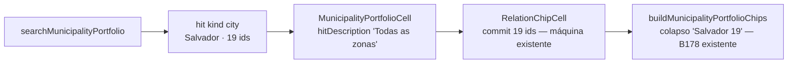

# Impl: Pessoas: "Salvador" como opção no dropdown de municípios (agregado das 19 zonas)

Status: aprovado
Atualizado em: 2026-08-11
Issue: #698
Intenção: docs/plans/pessoas-salvador-completa-dropdown.md
Appetite restante: ~0,25–0,5 dia eng (herdado; sem corte)

## Leitura da intenção

- **Outcome:** o dropdown de adição de municípios (células de capacidade de `/campanha/pessoas` e demais superfícies do mesmo dropdown) oferece "Salvador" com descrição "Todas as zonas" como hit buscável, que adiciona as 19 zonas de uma vez; soma com o selecionado; respeita o escopo do assessor; a exibição colapsa no chip "Salvador (19)" que já existe.
- **O que NÃO negociar:** não é cidade virtual (nada de catálogo/collection/linha de lista nova); é atalho de seleção; escopo de acesso (nunca adiciona zona fora da carteira do assessor); label "Salvador" + "Todas as zonas" (decidido no gate, não reabrir).
- **O que reavaliar:** a hipótese de "Direção no codebase" aponta `searchMunicipalityPortfolio` + `MunicipalityPortfolioCell` — confirmada pelo grep: a busca é consumida **apenas** por `MunicipalityPortfolioCell` (assessores/lideranças/dobradinhas/pessoas herdam via a mesma célula). Nenhuma superfície fora da célula precisa de trabalho extra; o wizard de atividade usa busca própria (fora de escopo).

## Abordagem recomendada

**Opções consideradas:** A | B | C
**Recomendação:** A — estender `searchMunicipalityPortfolio` com um hit agregado `kind: 'city'` (primeiro da lista), mapeado pela célula com a descrição decidida. A máquina inteira do lado do consumo (delta otimista multi-id, cap/floor, undo toast, colapso de chip "Salvador (19)", remoção das 19, exact-match C116 que faz "Salvador" + Enter eleger o agregado) já existe e é reusada sem tocar em `RelationChipCell`.
**Rejeitadas:** B — criar entidade "Salvador" agregada no catálogo/collection: viola o anti-goal explícito da intenção (não entra no catálogo, não vira linha de lista) e exigiria migration + access + filtros; C — pós-filtrar/adicionar o agregado no client fora da busca pura: duplicaria a derivação de ids por cidade e o gate de escopo fora do módulo que já memoiza a derivação por index (`portfolioIndexDerivations`), além de não resolver a ordem sob o `limit`.

### Decisões de engenharia

**1. Gate de escopo — o agregado só aparece quando a cidade inteira está no escopo addable.**
Opções: A | B | C
Recomendação: A — o hit só é oferecido quando `idsByCity.get(city)` (derivado do index **escopado** por `addableIds`, então já é "o que o ator pode adicionar") tem exatamente o número de zonas que o catálogo tem para a cidade (19). Para assessor com carteira parcial, o agregado não aparece — as opções individuais "Salvador — ZE N" continuam servindo; para staff e assessor com a cidade inteira, aparece com todas as zonas.
Alternativas rejeitadas: B — mostrar com subset (agregado com só as zonas da carteira): a label decidida no gate ("Todas as zonas") mentiria e a contagem seria ambígua; C — mostrar sempre que houver ≥1 zona não atribuída: mesma mentira, pior.

**2. Posição do hit — primeiro, antes do loop de municípios.**
Recomendação: antes do loop de municípios — com `limit` 12 e 19 hits individuais "Salvador — ZE N", o agregado depois dos municípios nunca seria alcançado (o loop retorna ao bater o limite). Adicionalmente o exact-match C116 ("a linha cujo label normalizado == query") faz "Salvador" + Enter eleger o agregado — comportamento desejado do fluxo ("digito salvador → seleciono"). Sem regressão: o território "Metropolitano de Salvador" já era inalcançável para "salvador" antes (o limite cortava no loop de municípios).

**3. Sem `count` no hit `city`.**
Recomendação: a descrição do hit é fixa ("Todas as zonas" — decidida no gate), diferente de território/ZE que carregam a contagem na descrição; um campo não consumido é YAGNI. `MunicipalityPortfolioSearchHit` ganha `{ kind: 'city'; key: string; label: string; city: string; municipalityIds: number[] }`; a key segue a convenção do chip (`city:Salvador`). TS força o branch novo em `hitDescription` (o `return` final usaria `hit.count`).

**4. Nada muda em `RelationChipCell` / chips / escrita.**
O commit de um hit com `ids[]` de 19 já é o caminho de território/ZE (um toque = um lote na mesma transação); o colapso "Salvador (19)" e a remoção das 19 são B178. `toRelationHit` já cobre `city` no braço genérico (`hit.municipalityIds`).

### Componentes / mudanças

- **`searchMunicipalityPortfolio`** (`src/lib/municipalityPortfolio.ts`): novo bloco antes do loop de municípios, iterando `ZONE_MUNICIPALITY_CITIES` com constante estática (como `NORMALIZED_ZONE_LABELS`): nome normalizado + contagem de zonas no catálogo (`municipalityCatalogEntriesForCity(city).filter(e => e.kind === 'zona').length`). Gate de escopo por contagem, filtro de `alreadyAssignedIds`, push do hit `city`, respeito ao `limit`. Extensão do tipo `MunicipalityPortfolioSearchHit`.
- **`hitDescription`** (`src/components/campaign/shared/MunicipalityPortfolioCell.tsx`): branch `hit.kind === 'city'` → `'Todas as zonas'`.
- **Migration:** nenhuma — lógica pura sobre catálogo estático; nada de schema/DB.
- **Access / Consent:** nenhum — read paths e write paths intactos; o escopo do assessor já é aplicado pelo `scopedPortfolioIndex` que o bloco consome.
- **UI:** Impeccable B — encaixe no dropdown existente; sem shape novo (mesma linha label + descrição dos demais hits). Copy: "Todas as zonas" (decidida no gate).

## Fases verificáveis

1. **Busca pura + tipos** — `src/lib/municipalityPortfolio.ts` + unit tests em `tests/unit/municipalityPortfolio.unit.spec.ts` (hit com 19 ids; soma com selecionado; supressão por escopo parcial; supressão com tudo atribuído; primeiro da lista).
2. **Célula** — `hitDescription` + unit test de render em `tests/unit/municipalityPortfolioCell.unit.spec.ts` (index com as 19 zonas; digita "salvador"; espera opção "Salvador" + descrição "Todas as zonas"). Se o Popover Radix flakear em jsdom, cair para cobertura pura (decisão registrada no impl).
3. **E2E** — 1 teste em `tests/e2e/campaignPeople.e2e.spec.ts` no padrão do `campaignLeaderships` (fill "salvador" na célula Lidera → opção "Salvador"/"Todas as zonas" → persist() → chip "Remover Salvador — 19 municípios" → estado no DB: 19 zonas + o município já vinculado, com assert condicional para o caso de o `claimMunicipality` cair em zona de Salvador).
4. **Gates** — `pnpm gate:fast` (tsc, lint, format, knip, cycles, test); e2e `campaignPeople` local; entrada curta em `docs/CHANGELOG-AGENTS.md`; push via `pnpm push` (PR Ready + merge auto).

Self-score decision-quality: 5/5 (rejeitadas documentadas; appetite cabe; rabbit holes nomeados; reusa busca/chips existentes — depth check sem módulo novo; aceite de produto intacto).

## Rabbit holes / Não escopo (engenharia)

- Nova entidade/collection/migration — anti-goal da intenção.
- Alterar `RelationChipCell`, copy, chips, ações de escrita — máquina existente cobre.
- Wizard de atividade / outras buscas que não passam por `searchMunicipalityPortfolio`.
- "Salvador" como facet/filtro/ordenação — fora de escopo da intenção.
- Agregados de outras cidades — o mecanismo é derivado de `ZONE_MUNICIPALITY_CITIES` (catálogo), cobre sozinho se um dia existir outra.

## Riscos e mitigação

- **`limit` 12 engole o agregado** → posicionado antes do loop de municípios (decisão 2).
- **Label "Todas as zonas" mentindo para assessor parcial** → gate de escopo por contagem (decisão 1); testado em unit.
- **Radix Popover em jsdom (cell test)** → tentativa com fallback explícito para cobertura pura; a regressão visível (descrição errada) também ficaria presa pelo e2e real.
- **e2e: `claimMunicipality` pode cair em zona de Salvador** → assert condicional pelo slug (`salvador-ze-*`): 19 ou 20 municípios no DB, sempre superset das 19 zonas.
- **Mudança de comportamento herdada pelas outras superfícies (assessores/lideranças/dobradinhas)** → é o aceite ("herdam o atalho sem trabalho extra"); readOnly não renderiza busca; `addableIds` de assessor editando assessor aplica o mesmo gate.

## Aceite de engenharia

- [x] Aceite de produto da intenção ainda coberto (opção buscável "Salvador" / "Todas as zonas"; soma com o selecionado; escopo; chip colapsado)
- [x] Invariantes AGENTS/engineering-standards (sem migration, sem access change, sem escrita multi-collection nova, identificadores EN / copy pt-BR)
- [x] Testes de domínio previstos (unit busca pura + cell render + e2e pessoas)
