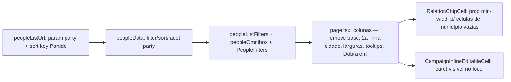

# Impl: Pessoas — ajustes da tabela desktop (contato completo, base sob o nome, caret, tooltips, "Dobra em", filtro/ordenação por partido)

Status: aprovado
Atualizado em: 2026-08-11
Issue: #697
Intenção: docs/plans/pessoas-tabela-desktop-ajustes.md
Appetite restante: herdado (~0,5–1 dia eng)

## Leitura da intenção

- **Outcome:** a mesa lê a tabela desktop de `/campanha/pessoas` sem perder dado (telefone cortado, base espremida, caret sumido) e encontra pessoas por partido — cinco ajustes de superfície, sem fluxo novo, sem migration, sem mudança de modelo.
- **O que NÃO negociar:** renomear só o LABEL "Aliada em" → "Dobra em" (chave de URL/ordenação `aliada` e `sort` intactas); facet de ausência "Sem base" e ordenação por Base **permanecem**; partido continua exibido como sufixo do nome (sem coluna própria); mobile muda apenas o label; leader lockdown / escopo de assessor intactos.
- **O que reavaliar:**
  - A hipótese "larguras por coluna" generalizada: **rejeitada** — corte do próprio rabbit hole da intenção ("generalizar só com 2º consumidor"). Ajustes via `cellClassName` nas colunas de pessoas (padrão já usado: `max-w-56 whitespace-normal` do e-mail) + **uma prop mínima** no shell compartilhado de chips (`RelationChipCell`) onde o piso `min-w-56` é o culpado das colunas de município largas quando vazias. O mecanismo de largura do `CampaignTable` não ganha nada novo.
  - A hipótese "caret via CSS" no `CampaignInlineEditableCell`: o mecanismo C116 (input invisível sobre o link) exige **troca de papéis no focus** (link some de vista, input vira o display com caret real) — alinhamento exato do caret, sem z-index puzzle.
  - C129 não está nesta entrega: a 2ª linha do Nome é **só a base (cidade)**; a precedência "legenda sobrepõe base" é da entrega C129 quando ela entrar.
  - Consequência de produto do gate (coluna Base removida): a edição inline da cidade some da tabela (fica no detalhe da pessoa / admin) — a linha vira display-only, como o card mobile já era.

## Abordagem recomendada

**Opções consideradas:**

- **Larguras:** A) mecanismo novo de largura por coluna no `CampaignTable` — rejeitado (2º consumidor inexistente; toca todas as listas); B) `cellClassName` localizado + prop `minWidthClassName` (default `min-w-56`) no `RelationChipCell`/`MunicipalityPortfolioCell`/`PeopleMunicipalityCell`, pessoas passa `min-w-32` — **recomendado**.
- **Caret:** A) z-index swap (caret do input acima do link) — alinhamento quebra para nomes longos (input rola internamente, link truncado não); B) **troca de papéis no foco** — link `opacity-0 pointer-events-none`, input mostra texto `text-primary font-medium px-0` + `caret-foreground` — caret e texto do MESMO elemento, alinhamento exato; **recomendado**. C) contenteditable/fake-caret — rejeitado (rabbit hole do C116).
- **Tooltip em desabilitados:** botão `disabled` não dispara mouse events — envolver num `` receptor do `CampaignHoverTooltip` (padrão Radix documentado); **recomendado**.
- **Partido (facet dinâmico):** precedente exato do facet de município (valores do recorte + selecionados unionados, sem canonicalização "todas") — sem enum, sem lista fixa; **recomendado**.

**Rejeitadas (gerais):** renomear a chave `aliada`/`ausencia=sem_base` (contrato de URL público); remover a ordenação por Base (decisão do gate); coluna própria de Partido (anti-goal).

### Componentes / mudanças

- **`src/utilities/people/peopleListUrl.ts`**: estado `parties?: string[]`; param `party` no parse/serialize (valores não-vazios, ≤ 40 chars, dedupe — precedente município, sem enum); `peopleListSortLabels.party = 'Partido'`; `peopleSortOptionLabel` ganha `party` no ramo de texto (A–Z/Z–A); default asc. `base` permanece (sort). Chave `aliada` intacta.
- **`src/utilities/people/peopleData.ts`**: `filterPeopleRows` — facet `parties` OR (match `row.party`); `sortPeopleRows` — case `'party'` (nulls por último, padrão B15); `PeopleListFilterFacets` ganha `parties: string[]` + `peopleFilterFacetsFromRows` (union sobre rows escopadas + selecionados).
- **`src/utilities/people/peopleListFilters.ts`**: `PeopleMultiFilterParam` += `'party'`; `togglePeoplePartyFilter` (valida 1..40 chars); `formatPeopleActiveFiltersSummary` lista partidos (filtro salvo B18 descreve o recorte).
- **`src/utilities/people/peopleOmnibox.ts`**: seeds grupo `Partido` (keywords `partido`, `sigla`), chips `Partido: <sigla>`, apply/remove.
- **`src/components/campaign/people/PeopleFilters.tsx`**: nova prop `partyFilterOptions` → seeds (como município).
- **`src/app/(campaign)/campanha/(app)/pessoas/page.tsx`**:
  - coluna `base` **removida** (some do picker B17 automaticamente; hidden no cookie fica inerte);
  - Nome: `cellClassName: 'max-w-72'` (outliers truncam — o link já tem `truncate`); célula vira `flex-col` com 2ª linha display-only `truncate text-xs text-muted-foreground` com `row.city` (sem label, sem traço quando vazia); sufixo partido inalterado;
  - Contato: `cellClassName: 'min-w-40'` e **sem** `whitespace-normal` (volta ao `whitespace-nowrap` do TableCell — telefone nunca quebra; `min-w` garante a largura contra o input `w-full`);
  - municípios: `minWidthClassName="min-w-32"` nas três `PeopleMunicipalityCell` (vazias ficam estreitas; com chips a largura segue o conteúdo até o `max-w-56`);
  - Ações: WhatsApp desabilitado ganha `CampaignHoverTooltip content="WhatsApp indisponível — sem celular"` sobre ``; Convidar desabilitado idem com "Convidar indisponível — sem celular" (o tooltip atual "Convidar" não dispara em botão disabled);
  - cards mobile: label `'Aliada em'` → `'Dobra em'` (só isso no mobile);
  - `hasFilters` inclui `parties`.
- **`src/components/campaign/shared/RelationChipCell.tsx` + `MunicipalityPortfolioCell.tsx` + `PeopleMunicipalityCell.tsx`**: prop `minWidthClassName` (default `'min-w-56'`) no wrapper do RelationChipCell (2 ocorrências); pessoas passa `'min-w-32'`. Demais listas intactas.
- **`src/components/campaign/shared/CampaignInlineEditableCell.tsx`**: ramo permanent name-link — estado `focused` (onFocus/onBlur); focado → link `opacity-0 pointer-events-none`, input `text-primary font-medium px-0 caret-foreground`; desfocado → classes atuais (`text-transparent caret-transparent px-1`). Input não é o display quando não-focado — mecanismo C116 preservado.
- **Migration:** nenhuma. **Access / Consent:** nenhum (staff-only, sem escrita nova).
- **UI:** Impeccable B — encaixe na tabela existente; shape → craft → critique → polish do caret e larguras no browser (playwright).

### Dados → forma (se aplicável)

- Não se aplica (vínculos/texto, sem métrica). O facet de partido usa a forma padrão do sistema (omnibox, OR na facet) — mesma escolha já aceita nos outros facets.

## Fases verificáveis

1. **URL + merge (partido)** — `peopleListUrl.ts`, `peopleData.ts` + unit tests (`peopleListUrl.unit.spec.ts`, `peopleMerge.unit.spec.ts`).
2. **Filtros/omnibox (partido)** — `peopleListFilters.ts`, `peopleOmnibox.ts`, `PeopleFilters.tsx`, `page.tsx` (options + hasFilters).
3. **Tabela (C130 core)** — `page.tsx`: colunas/larguras/2ª linha/renome/tooltips; props de min-width no shell; caret no `CampaignInlineEditableCell`.
4. **Verificação visual** — browser (playwright): caret ao digitar no Nome, telefone inteiro, colunas vazias estreitas, tooltips (inclusive desabilitados), "Dobra em".
5. **Gates** — `pnpm gate:fast` (tsc, lint, format, knip, cycles, unit+int), e2e `campaignPeople`, `pnpm build` local.

## Rabbit holes / Não escopo (engenharia)

- Não mexer em `min-w-56`/`max-w-56` das outras listas (lideranças/dobradinhas/assessores) — prop com default preserva o comportamento.
- Não canonicalizar "todos os partidos" como sem-filtro (precedente município — o facet é dinâmico, o parse não conhece o conjunto).
- Não mudar `field="party"`/`field="city"` do `CampaignInlineEditableField` (dobradinhas usa `party`; `city` sai de uso nesta página mas o membro fica — outros consumidores futuros).
- Sem tooltip custom em `DeletePersonButton` (já coberto, sempre habilitado).
- Caret em nomes muito longos (truncados): aceito como edge do mecanismo — o input é o display enquanto focado, então caret e texto nunca divergem.

## Riscos e mitigação

- **`max-w`/`min-w` em `td` auto-layout:** padrão já comprovado nas colunas atuais (`max-w-56` no e-mail/municípios). Mitigação: verificação visual no browser em tela 1280px com dados largos.
- **Troca de papéis do caret ≠ mecanismo travado no gate C116:** o contrato (draft no texto do link, input sem estado de edição, link clicável) é preservado — só o estado focado muda a camada visível. Documentar no changelog.
- **Tooltip em span envolve controle desabilitado:** acessibilidade mantida via `aria-label` existente no botão; o span não ganha tab stop.
- **E2E:** nenhuma asserção existente usa "Aliada em"/"Base" — rename seguro. Int `peopleList.int.spec.ts` ganha cobertura do facet de partido (a fixture de dobradinha tem `party`).

## Aceite de engenharia

- [x] Aceite de produto da intenção ainda coberto (todos os 7 itens)
- [x] Invariantes AGENTS/engineering-standards (sem migration, sem access, staff-only)
- [x] Testes de domínio previstos: unit (URL party + sort party + filter/facet party), int (facet partido no recorte)
