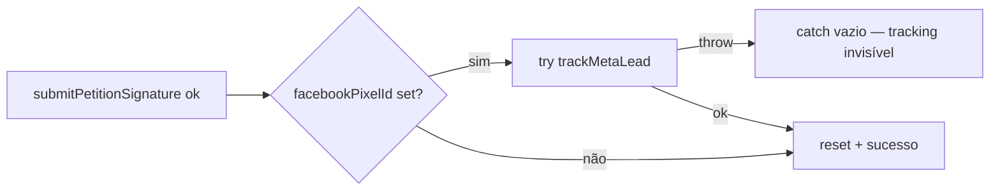

# Impl: PetitionForm — Lead dentro do try pode transformar assinatura commitada em erro (retry duplica)

Status: rascunho
Atualizado em: 2026-08-24
Issue: #766
Intenção: body da Issue #766 (sem plano de intenção separado — body é a spec)
Appetite restante: herdado (chore P3, ~4 linhas + teste)

## Leitura da intenção

- **Outcome:** falha de tracking (`crypto.randomUUID` em contexto não-secure, navegadores antigos) nunca mais vira erro de UI após assinatura commitada — eliminando retry duplicado e re-disparo de `Lead`.
- **O que NÃO negociar:** assinatura commitada deve sempre mostrar sucesso; tracking invisível ao visitante; no máximo um `Lead` por captura.
- **O que reavaliar:** nada — padrão já resolvido no S10 (`CampaignNewsletterForm`), replicar no `PetitionForm`.

## Abordagem recomendada

**Opções consideradas:** A) guarda interna try/catch no bloco de tracking; B) mover tracking para fora do try de submit.
**Recomendação:** A — espelha exatamente o padrão S10 já aplicado e revisado em `CampaignNewsletterForm.tsx:59-65`.
**Rejeitadas:** B — cria fluxo de sucesso fora do try com estado sutil; divergiria do precedente consolidado.

### Componentes / mudanças

- **`PetitionForm.onSubmit`** (`src/components/PetitionForm.tsx`): envolver `trackMetaLead(...)` em `try/catch` próprio com catch vazio.
- **Migration:** sem migration.
- **Access / Consent:** não se aplica.
- **UI:** nenhuma mudança de UI.

## Fases verificáveis

1. **Código** — guarda interna no `PetitionForm` (~4 linhas).
2. **Teste** — unit espelhando `campaignNewsletterLead.unit.spec.tsx`: Lead uma vez com pixel em captura ok; tracking que lança não vira erro de UI; nenhum Lead sem pixel.
3. **Gates** — `pnpm gate:fast`; push via `pnpm push`.

## Rabbit holes / Não escopo (engenharia)

- Não mexer no `trackMetaLead` (já no-op seguro sem `fbq`).
- Não tocar no `CampaignNewsletterForm` (já corrigido).
- Sem e2e novo: superfície já coberta por e2e existente da petição; o teste unit cobre o contrato do Lead.

## Riscos e mitigação

- Teste unit do form é frágil (jsdom + Radix comboboxes): copiar scaffolding já provado do spec S10 (ResizeObserver stub, `fireEvent.input` nativo). Baixo.

## Aceite de engenharia

- [x] Aceite de produto da intenção ainda coberto
- [x] Invariantes AGENTS/engineering-standards
- [x] Testes de domínio previstos (unit) onde write paths mudam
