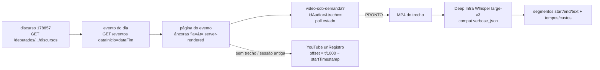

# Impl: Piloto da fonte: vídeos e transcrição minutada de um discurso da Câmara

Status: executado
Atualizado em: 2026-09-12
Issue: #954
Intenção: docs/plans/piloto-fonte-videos-camara.md
Appetite restante: herdado (~1 dia)

## Leitura da intenção

- **Outcome:** 2–3 discursos de legislaturas diferentes processados ponta a ponta (evento → trecho do orador → MP4 do VOD → transcrição com segmentos `início/fim/texto`), com relatório curto que responde as 4 incógnitas e mede custos/tempos. Nada em banco de produção; artefatos fora do git; o relatório commitado é o entregável durável.
- **O que NÃO negociar:** sem DB/Payload/collection/migration e sem `assertLocalDatabase`; 2–3 discursos (nunca o acervo); nenhuma mídia/HTML/JSON bruto commitado; crédito CC BY 4.0 no relatório e marca-d'água intocada; identificadores em inglês, strings pt-BR.
- **O que reavaliar (achados ao vivo que contradizem a intenção):**
  1. `video-sob-demanda` **não é GET síncrono** — é _poll de geração assíncrona_ que devolve `{estado}` (`PRONTO|INDISPONIVEL|…`); o front polla a cada 3s por até ~2min e recarrega a página quando `PRONTO`. O plano trata como máquina de estados com backoff/limite, não como download direto.
  2. A página de trecho (`?a=…&t=…`) respondeu **400 "Acesso via bot não permitido"** a UA de curl — há anti-crawl; exige UA de browser e talvez `crawl=no`/cookies. O caminho de evidência principal passa a ser a **página do evento** (âncoras server-rendered com `a`/`t`), que respondeu 200.
  3. `uriEvento` vem **vazio** nos discursos 2023–2024 e `urlVideo`/`urlAudio` são nulos → o casamento discurso↔evento é **por data/hora**, não por id direto.

## Abordagem recomendada

**Opções consideradas:**

- **A — CLI fino commitado: `scripts/pilot-camara-speeches.mjs` (orquestra I/O) + `scripts/lib/camaraSpeeches.mjs` (lógica pura), cache em `data/camara/` (gitignored), relatório em `docs/research/`.** **Recomendada.**
- **B — Scratch/one-off fora do repo (curl + um notebook descartável).** Rejeitada: sem evidência reproduzível, sem unit tests das regras (poll, offset, parser) e sem base para C153; contraria o espírito de "piloto documentado".
- **C — Estender `scripts/recover-media.mjs`.** Rejeitada: aquele script é acoplado a DB/S3/`assertLocalDatabase`; domínio errado, arrastaria Payload para o piloto.

**Recomendação: A** — o problema é um spike de fonte com regras puras e testáveis (parser das âncoras, montador de URL do VOD, offset YouTube, normalização dos segmentos), então o custo baixo de um módulo puro + script de orquestração já entrega os dois artefatos duráveis do piloto (código unit-testado + relatório) sem tocar o app.

**Decisões CARAS (cada uma com opções/recomendação/rejeitadas):**

- **(a) Áudio sem ffmpeg.** **A)** enviar o **arquivo do trecho VOD (MP4 curto) direto** ao Whisper multipart — o provedor faz o demux; o trecho é a fala do orador, curto, provavelmente abaixo do limite de tamanho. **B)** exigir `ffmpeg` local para extrair WAV. **C)** baixar áudio da sessão inteira no YouTube via lib. **Recomendação: A** — ffmpeg está ausente do repo e do Dockerfile (`apk add libc6-compat` só), B adiciona dependência de sistema e C adiciona dep pesada + sessão inteira. **Medir no piloto:** o Deep Infra aceita `video/mp4` no multipart e qual o tamanho do `linkParaDownload` (critério: transcrição 200 com segmentos para o trecho; se rejeitar o container, registrar o formato aceito e cair para B como pré-requisito manual _do piloto_, sem mudar repo/Dockerfile).
- **(b) Segmentos Deep Infra: compat vs nativo.** **A)** compat `POST /v1/openai/audio/transcriptions` com `model=openai/whisper-large-v3`, `language=pt`, `response_format=verbose_json` (+ `timestamp_granularities[]=segment`), shape `segments[{start,end,text}]`. **B)** nativo `/v1/inference/…` com `chunk_level: segment`. **C)** reusar `src/utilities/ai/deepInfraTranscribe.ts`. **Recomendação: A se devolver segmentos; B como fallback; C rejeitada** — o wrapper atual devolve só `{text}`, é `server-only` TS (exigiria tsx) e não expõe timestamps. **Medir no piloto:** presença de `segments[].start`/`.end` no compat (critério: ≥1 segmento com `start` e `end` numéricos); senão B com o mesmo critério.
- **(c) Local dos artefatos.** **A)** `data/camara/` no repo + entrada explícita `/data/camara/` no `.gitignore`. **B)** fora do repo (`/tmp`, `$HOME`). **C)** `private/`. **Recomendação: A** — não existe `/data/` global no `.gitignore` (só `/data/tse/`, `/data/geometries/`, `/data/ai-fill/`, `/data/encode/`, `/data/poster-candidates/`), então um `data/camara/` novo **vazaria sem entrada explícita**; A mantém os caminhos do script/relatório estáveis e reproduzíveis. B quebra reprodutibilidade; C é para material sensível.
- **(d) Trechos: parser HTML vs API.** **A)** parsear a **página do evento** server-rendered (âncoras `?a=<idAudio>&t=<epoch ms>&trechosOrador=&crawl=no`). **B)** engenharia reversa de endpoint JSON interno de trechos. **C)** página `Resultado.asp?txtCodigo=` (áudio, sem vídeo). **Recomendação: A** — não há API de trechos; a página do evento é a superfície observada (200, ~878 KB) e a que carrega `a`/`t`; B é não-documentado e frágil; C não dá vídeo. **Medir no piloto:** parser extrai ≥1 trecho do orador-alvo (critério: nome normalizado bate e `t` é epoch ms plausível).
- **(e) Escopo de teste.** Unit puro sobre `scripts/lib/camaraSpeeches.mjs` (sem rede): `parseEventExcerpts(html)`, `buildVodUrl(eventId, audioId, t)`, `parseVodStatus(json)`, `youtubeOffsetSeconds(tMs, startTimestamp)`, `selectSpeechEvent(events, speech)`, `matchExcerpt(excerpts, speech)`, `normalizeTranscription(json)`. **Recomendação: só unit** — é spike de rede; int/e2e não têm alvo local. Fixture sintética pequena inline no spec (não commitar HTML bruto da Câmara).

### Componentes / mudanças

- `scripts/pilot-camara-speeches.mjs` (novo, top-level): orquestra fetch (`AbortSignal.timeout`, UA de browser por constante), poll do VOD com backoff/limite, download cacheado, transcrição, impressão do relatório. Importa `dieWithLabel`/`loadCliEnv` de `scripts/lib/cli.mjs` (não re-espelha `die`/dotenv/`sha256`; não chama `assertLocalDatabase`). Flags: `--speech`, `--legislature`, `--out`, `--help`.
- `scripts/lib/camaraSpeeches.mjs` (novo, puro): os 7 helpers acima. **Deve ser importado pelo script** (knip acusa `scripts/lib/*.mjs` órfão).
- `tests/unit/camaraSpeeches.unit.spec.ts` (novo, `// @vitest-environment node`, import relativo do `.mjs`).
- `package.json`: atalho `"camara:pilot": "node scripts/pilot-camara-speeches.mjs"` (`.mjs` puro roda node seco — sem `tsx`).
- `.gitignore`: `/data/camara/`.
- `docs/research/piloto-fonte-videos-camara.md` (relatório, commitado) e `docs/changelog/2026-09-12-c152.md` (curto).

### Dados → forma (N/A)

Não há superfície de produto — é spike de engenharia. A "forma" é o relatório: por discurso, uma tabela `evento · trecho(a,t) · estado VOD · bytes MP4 · segmentos(start/end/text)` + bloco de custos/tempos; sem UI, sem collection.

## Fases verificáveis

1. **Tracer recente (quota ~0,35 dia).** Um discurso 2023–2024: listar discursos (`GET /deputados/178857/discursos`, ler `X-Total-Count`), casar o evento por data (`GET /eventos?dataInicio=&dataFim=`), buscar as âncoras na página do evento, chamar `video-sob-demanda`, pollar até `PRONTO`, baixar o MP4 do trecho, transcrever no compat com `verbose_json`. Junto: esqueleto do script, `/data/camara/` no `.gitignore`, `package.json`. **Pronto quando:** o console imprime os segmentos `start/end/text` de 1 discurso e os tempos de download/transcrição. Responde (parcial) incógnitas 1 e 3.
2. **Discurso antigo 55ª/56ª (2011–2015) (quota ~0,3 dia).** Repetir o fluxo; se a página do evento não tiver trecho do orador, exercitar o fallback YouTube (`urlRegistro` + `offset = t/1000 − startTimestamp`). **Pronto quando:** 2–3 discursos de legislaturas diferentes processados, com o casamento discurso↔evento↔trecho (ou o motivo de não casar) registrado. Responde incógnitas 2 e 4.
3. **Fallbacks e permanência (quota ~0,2 dia).** Re-resolver o mesmo trecho do tracer após intervalo para checar permanência do link; tentar o endpoint nativo se o compat não trouxer `start/end`; tratar o 400 anti-crawl (UA de browser + `crawl=no`/cookies) e registrar o resultado. **Pronto quando:** as 4 incógnitas têm resposta com evidência ou "medir no piloto" com critério explícito.
4. **Fechamento (quota ~0,15 dia).** Unit tests do módulo puro; relatório `docs/research/piloto-fonte-videos-camara.md` com as 4 respostas, custos/tempos e fallback por incógnita; changelog. **Pronto quando:** lint + typecheck + `pnpm test:unit` verdes e nenhum artefato de mídia no `git status`.

## Rabbit holes / Não escopo (engenharia)

- **Crawler resiliente genérico** (retry framework, cookie jar, headless browser): não — fetch direcionado com UA e timeout; se o anti-crawl bloquear, registrar como incógnita residual.
- **Instalar/embutir ffmpeg** no repo/Dockerfile: não — envio direto do MP4 (decisão a); ffmpeg, se necessário, é pré-requisito manual do piloto e fica documentado, sem tocar a imagem.
- **Refatorar `ensureCachedDownload` para streaming / criar `createWriteStream`/`pipeline`:** não — o trecho é curto; buffer em memória (padrão atual de `recover-media.mjs:233` e `electionResultsZip.ts:63`).
- **Criar client/collection/tipos da Câmara em `src/`:** não — fica em `scripts/`; C153 é que modela o acervo.
- **Baixar os 45/99 discursos ou a sessão inteira:** não — 2–3 discursos.
- **Commitar mídia/HTML/JSON bruto:** não — só relatório + código + testes; mídia em `data/camara/` gitignored.
- **Knip trap:** não criar `scripts/lib/camaraSpeeches.mjs` sem importá-lo no script.

## Riscos e mitigação

- **VOD nunca chega a `PRONTO` / expira.** Poll com backoff e teto (~3s × até 2min, com limite explícito), capturando o JSON cru do cache; fallback YouTube quando houver `urlRegistro`; senão registrar "sem vídeo" para o discurso.
- **400 anti-crawl na página de trecho/paginação.** Usar UA de browser + `crawl=no`; caminho principal continua sendo as âncoras da página do evento (200) + o JSON do VOD por `idAudio`/`t`, que não dependem da página de trecho.
- **Compat sem timestamp / provedor rejeita MP4.** Fallback nativo (`chunk_level`); normalizador aceita os dois shapes; se rejeitar o container, decidir ffmpeg manual só para o piloto e registrar.
- **Sessão antiga sem trecho por orador.** Fallback YouTube com offset; sem `urlRegistro`, resposta da incógnita 2 = "não cobre" com a evidência da contagem de âncoras.
- **Casamento ambíguo** (vários eventos no dia; nome do orador divergente). Casar por data normalizada + nome normalizado + `t` mais próximo de `dataHoraInicio`; logar candidatos e, se ainda ambíguo, registrar no relatório.
- **Vazamento de mídia no git.** Entrada explícita `/data/camara/` + checagem de que todo caminho de escrita está sob a raiz do cache antes de gravar; `git status` limpo é aceite.
- **Chave ausente.** `DEEPINFRA_API_KEY` é lida via `loadCliEnv`; ausente → `dieWithLabel` com mensagem pt-BR (a execução ao vivo já tem a chave no env).
- **Estouro de appetite.** Teto rígido de 3 discursos e trechos curtos; custo é ~US$ 0,00045/min, desprezível vs. tempo de busca/poll.

## Aceite de engenharia

- [x] `scripts/pilot-camara-speeches.mjs` roda com node seco e imprime, por discurso: evento, `a`/`t` do trecho, `estado` do VOD, caminho/bytes do MP4 e segmentos `start/end/text`.
- [x] 2–3 discursos de legislaturas diferentes processados ponta a ponta.
- [x] Lógica pura em `scripts/lib/camaraSpeeches.mjs`, importada pelo script (knip) e coberta por `tests/unit/camaraSpeeches.unit.spec.ts` (`// @vitest-environment node`).
- [x] Sem `assertLocalDatabase`, sem Payload/DB/collection/migration; sem re-spell de `die`/`sha256`/dotenv/`LOCAL_HOSTS`; `dieWithLabel` importado de `scripts/lib/cli.mjs`.
- [x] `data/camara/` fora do git via entrada explícita no `.gitignore`; nenhuma mídia/HTML/JSON bruto commitado.
- [x] `docs/research/piloto-fonte-videos-camara.md` commitado: as 4 incógnitas respondidas (com evidência ou critério de "medir no piloto"), custos/tempos e fallback por incógnita, crédito CC BY 4.0.
- [x] `docs/changelog/2026-09-12-c152.md` criado.
- [x] `pnpm lint`, `pnpm typecheck` e `pnpm test:unit` verdes.

## Débitos (triage pós-simplify)

Nenhum achado dos dois revisores virou Issue: é spike, os achados eram baixos/médios e ou foram resolvidos na sessão, ou ficam como gatilho para C153. Isso evita poluir o backlog (ver `capture-review-debts`).

**Já resolvido no simplify (não reabrir):**

- `youtubeOffsetSeconds` era export especulativo sem call site → removido (a fórmula fica documentada no relatório; C153 liga o fallback).
- `normalizeTranscription` convertia `duration: null` em `0` (`Number(null) === 0`) → guard `typeof number`.
- Uma exceção de rede/Deep Infra derrubava o run e não gravava o JSON → `processSpeech` agora captura e registra em `failures[]`.
- `--skip-download` dizia resolver o VOD mas pulava o `resolveVod` → agora resolve e registra; help corrigido.
- `--out` aceitava `..` sem guard → fail-closed adicionado.
- `chunk` do parser podia capturar o card do próximo trecho → fatiado até a próxima âncora.
- `matchExcerpt` casava qualquer orador com `speaker` vazio → guard de string vazia.
- `headers` redundante, validação de presença de valor nos args, cast do teste, duração do `--skip-download`.

**Adiado com gatilho (C153):**

- **Parser de âncoras ancorado na ordem de atributos/query literal** (`scripts/lib/camaraSpeeches.mjs`): qualquer reordenação do HTML da Câmara quebra silenciosamente (retorna `[]`). Gatilho: quando C153 montar o import robusto, usar seleção estrutural + teste com HTML real versionado.
- **Fallback YouTube** (`urlRegistro` + offset `t/1000 − startTimestamp`): registrado no relatório e no `report.youtube`, mas não calculado (o `startTimestamp` do VOD não vem na API). Gatilho: C153, se o acervo precisar cobrir eventos sem trecho.

**Explicitamente fora / descartado:** duplicação `fileExists`/`readFile` vs cache interno de `ensureCachedDownload` (score 1–2); builders de URL inline no driver (nit de consistência); `includes` do match de orador (leniência intencional no piloto).

### Self-score decision-quality

1. **Fidelidade ao outcome e anti-goals — 5/5:** cada fase fecha um pedaço do aceite (2–3 discursos, 4 incógnitas); os guardrails (sem DB, sem acervo, mídia fora do git) viram itens de aceite verificáveis.
2. **Decisões caras com opções/recomendação/rejeitadas — 5/5:** (a) áudio sem ffmpeg, (b) compat vs nativo, (c) local dos artefatos, (d) parser vs API, (e) escopo de teste — todas deliberadas com rejeitadas explícitas.
3. **Fases verificáveis e tracer primeiro — 4/5:** tracer já exercita o caminho mais arriscado (poll do VOD + transcrição com segmentos); quota estimada, sem baseline histórico do repo para calibrar (daí o 4).
4. **Incerteza tratada com critério mensurável — 5/5:** os dois pontos contraditórios ao vivo (VOD assíncrono, anti-crawl) foram incorporados; cada incógnita tem "medir no piloto" com critério objetivo.
5. **Aderência ao codebase e convenções — 5/5:** reusa `scripts/lib/cli.mjs` sem duplicar helpers, respeita os guards de `codebaseConventions`/`scriptCliConventions`, o knip de `scripts/lib`, o formato `.mjs` puro e o padrão de relatório em `docs/research/`.
