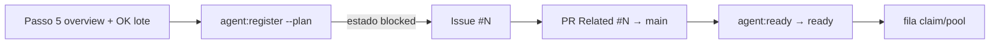

# Impl: Ciclo de vida do plan-issue — colaboração fechada antes de claim

Status: aprovado
Atualizado em: 2026-08-02
Issue: #292
Intenção: docs/plans/plan-issue-lifecycle-ready.md
Appetite restante: ~0,5d (scripts + skills + pins; sem UI; Action dual = OPS18)

## Leitura da intenção

- **Outcome:** colaborar no `/plan-issue` não cria Issue/PR até confirmação explícita pós-overview; Issue com plano só fica claimável (`ready`) depois do plano de intenção em `main`.
- **O que NÃO negociar:** chores sem `--plan` nascem `ready`; não inventar segundo tracker; não exigir review humano no PR de planos; não verificar blob do plano a cada tick do pool.
- **O que reavaliar:** hipótese “só skill soft” — insuficiente; contrato tem de viver em `agent:register` (default com `--plan`) + promote explícito. Action no merge = sucessor OPS18 (#296), fora deste item.

## Abordagem recomendada

**Opções consideradas:** A) só checklist na skill (soft) · B) `--plan` ⇒ `blocked` no register + `agent:ready` pós-merge (sessão) · C) novo label `needs:plan` + gate no pool  
**Recomendação:** **B** — reusa `blocked` (já exclui claim/pool); enforce no script (não depende do agente lembrar `--blocked`); promote determinístico na sessão após merge.  
**Rejeitadas:** A (já falhou na prática — race com pool); C (prolifera estados; intenção cortou rabbit hole).

### Decisões de engenharia

1. **Estado enquanto espera plano em `main`:** `blocked` (não `needs:plan`).
   - Opções: A `blocked` | B `needs:plan` | C sem Issue até merge
   - Recomendação: A — vocabulário existente; claim/pool já excluem.
   - Rejeitadas: B (label nova sem necessidade); C (quebra `Related #N`).

2. **Enforce no register vs só skill:** default `blocked` quando `--plan` presente.
   - Opções: A default no script | B skill manda `--blocked` | C pool checa arquivo em `main`
   - Recomendação: A — fail-closed no ponto de criação.
   - Rejeitadas: B (esquecível); C (IO no tick — rabbit hole da intenção).

3. **Promote v1:** `pnpm agent:ready -- --issue N[,N…]` na mesma sessão (Passo 6 pós-merge).
   - Opções: A script de sessão | B Action no merge | C humano sempre
   - Recomendação: A neste item; B = OPS18 (#296).
   - Rejeitadas: C (opaco); B fora de escopo (comentário na Issue #292).

4. **Nome do comando:** `agent:ready` (não reviver `agent:promote` do cutover stage→main).

### Componentes / mudanças

- **`scripts/lib/agent-plan-lifecycle.mjs`:** puro — `resolveRegisterStateLabel({ hasPlan, explicitBlocked })`, `canPromotePlanIssue(issue)` (blocked + link `docs/plans/` + open + sem in-progress/done/in-prod).
- **`scripts/agent-register.mjs`:** usa o helper; com `--plan` nasce `blocked` (mesmo sem `--blocked`); sem `--plan` preserva `ready` / `--blocked`.
- **`scripts/agent-ready.mjs` + `pnpm agent:ready`:** flip `blocked`→`ready` idempotente; comenta motivo; recusa se não for “aguardando plano”.
- **`.cursor/skills/plan-issue/SKILL.md`:** Passo 5 = gate duro (sem Issue/PR até OK explícito ao lote); Passo 6 = register → PR `Related #N` → merge → `agent:ready`.
- **`docs/AGENT-OPS.md` + skill `agent-pool` (menção curta) + nota em `capture-review-debts`:** contrato de labels / promote após plano em `main`.
- **Tests:** `tests/unit/agentPlanLifecycle.unit.spec.ts` (register label + canPromote).
- **Migration / Access / Consent / UI:** N/A (Impeccable A).

## Fases verificáveis

1. **Tracer** — helper puro + register + pins unit; `agent:ready` + skill/docs.
2. **Gates** — `pnpm gate:fast`; entrega com `pnpm push`.

## Rabbit holes / Não escopo (engenharia)

- **Action dual no merge (OPS18 #296).**
- **Checagem de blob do plano no tick do pool.**
- **Label `needs:plan`.**
- **Reescrever `capture-review-debts` para auto-promote** (só nota + defer para OPS18).
- **Rename cosmético `canPromotePlanIssue` → `canMarkPlanIssueReady`** — defer; API estável para OPS18 Action.

## Riscos e mitigação

- **Issue com `--plan` fica `blocked` para sempre se Passo 6 pular promote** — mitiga OPS18; v1 documenta `agent:ready` obrigatório no Passo 6.
- **Confundir `blocked` por dep de produto com “aguardando plano”** — `canPromotePlanIssue` exige link `docs/plans/` no body; promote sem link falha fechado.

## Aceite de engenharia

- [x] Aceite de produto da intenção ainda coberto
- [x] Invariantes AGENTS/engineering-standards (N/A runtime app)
- [x] Testes de domínio previstos (unit no lifecycle)

Self-score decision-quality: 5/5
