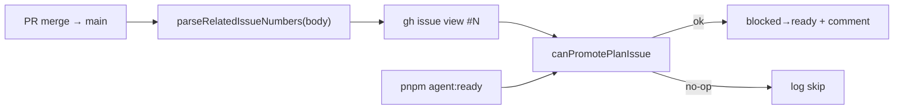

# Impl: Promote plan-issue — agente + Action no merge (dual)

Status: aprovado
Atualizado em: 2026-08-03
Issue: #296
Intenção: docs/plans/plan-issue-promote-dual.md
Appetite restante: ~0,5d (workflow + helper puro + script + pins; sem UI)

## Leitura da intenção

- **Outcome:** depois do plano em `main`, a Issue `blocked` aguardando plano vira `ready` mesmo se o agente do plan-issue não rodou `pnpm agent:ready`.
- **O que NÃO negociar:** promote só no **merge** (nunca no CI do PR aberto); não promover `blocked` de produto/deps sem heurística conservadora (`blocked` + link `docs/plans/` + sem gates humanos / estados ativos-terminais).
- **O que reavaliar:** “estender `issue-done-on-main-merge.yml` vs job irmão”; “bash inline vs node reusando `canPromotePlanIssue`”; restrição extra a diff `docs/plans/**`.

## Abordagem recomendada

**Opções consideradas:** A) segundo job no mesmo workflow de `Closes`→`done` · B) workflow irmão dedicado + script node que reusa `canPromotePlanIssue` · C) bash inline reimplementando a heurística  
**Recomendação:** B — porque o predicado de promote já vive em `scripts/lib/agent-plan-lifecycle.mjs` (OPS17); duplicar em bash é débito; misturar com o job de `Closes` acopla dois contratos e força checkout/`node` no job que hoje é só `gh`.  
**Rejeitadas:** A — checkout + install no workflow de done só para um job; C — diverge do pin unitário e do `agent:ready`.

### Decisões de engenharia

1. **Onde vive o parse de `Related #N`?**  
   Opções: A) `plansOnlyClosesGuard.mjs` · B) `agent-plan-lifecycle.mjs` · C) só no script da Action.  
   **Recomendação:** B — é o lifecycle de promote; o guard de closes só rejeita keywords de fechamento.  
   **Rejeitadas:** A (domínio errado); C (sem pin unitário).

2. **Restringir a PRs que tocam `docs/plans/`?**  
   Opções: A) sim · B) não — só `Related` + `canPromotePlanIssue`.  
   **Recomendação:** B — `Related #N` já é o contrato dos PRs de planos (`plans-only-closes`); o predicado conservador evita flip de deps de produto. Restrição de path é rabbit hole (API de files, false negatives em PRs mistos).  
   **Rejeitada:** A até haver falso positivo real.

3. **Script da Action vs estender `agent:ready`?**  
   Opções: A) `agent:ready -- --from-pr N` soft · B) script dedicado `agent-promote-related-on-merge.mjs` soft-skip.  
   **Recomendação:** B — `agent:ready` continua fail-closed para o humano/agente; a Action precisa soft-skip em Issues Related que não estão “aguardando plano”.  
   **Rejeitada:** A — mistura UX CLI com safety net.

4. **`pnpm install` no workflow?**  
   Opções: A) install frozen · B) só `actions/setup-node` + `node scripts/…` (deps só stdlib).  
   **Recomendação:** B — a cadeia `agent-plan-lifecycle` → `agent-github` / `agent-pool-eligibility` não importa packages npm.  
   **Rejeitada:** A — custo sem ganho.

### Componentes / mudanças

- **`parseRelatedIssueNumbers(body)`** (`scripts/lib/agent-plan-lifecycle.mjs`): puro; case-insensitive; dedupe; ignora `Closes`/`Fixes`.
- **`scripts/agent-promote-related-on-merge.mjs`:** lê body do PR via `gh`; para cada `#N`, `canPromotePlanIssue`; flip + comentário “Action OPS18”; soft-skip (incl. already-ready).
- **`.github/workflows/plan-issue-ready-on-main-merge.yml`:** `pull_request` closed + merged → `main`; checkout + node 24; sem pnpm.
- **Docs:** `docs/AGENT-OPS.md` (tabela CI + nota OPS17/18); changelog curto; skill `plan-issue` já cita OPS18 — só amarrar o nome do workflow se faltar.
- **Migration / Access / Consent / UI:** N/A.

## Fases verificáveis

1. **Tracer** — helper + pins unit + script + workflow.
2. **Docs** — AGENT-OPS + changelog; skill se necessário.
3. **Gates** — `pnpm gate:fast`; entrega com `pnpm push`.

## Rabbit holes / Não escopo (engenharia)

- Promover no `ci-pr` / checks do PR aberto.
- Label nova `needs:plan`.
- Matar o promote do agente (`agent:ready`).
- Hoist `HUMAN_GATE_LABELS` / `issueHasPlanLink` / lista ativa-ou-terminal para módulo neutro — defer até 3º consumidor fora do lifecycle.
- Extrair executor compartilhado promote-one-issue (`agent:ready` × Action) — defer até 3º call site ou política de falha convergente.
- Unificar workflows de merge (`issue-done` + plan-ready) num único runner — defer; acoplamento rejeitado na decisão B.
- Comentário duplicado se agente e Action promovem na mesma janela — benigno; labels idempotentes.

## Riscos e mitigação

- **Flip frouxo de `Related` de dep de produto:** mitiga `canPromotePlanIssue` (exige link `docs/plans/` + `blocked` + sem needs:\*/estados).
- **Segunda execução (agente + Action):** idempotente — already-ready = skip.
- **Workflow só na default branch:** igual aos outros merge triggers; merge em `main` é o evento.

## Aceite de engenharia

- [x] Aceite de produto da intenção ainda coberto
- [x] Invariantes AGENTS/engineering-standards (sem schema/access)
- [x] Testes de domínio: unit em `parseRelatedIssueNumbers` + predicado existente

Self-score decision-quality: 5/5
