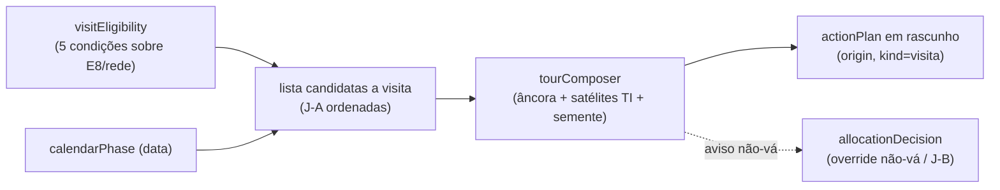

# E13 — Planejador de presença e giros (agenda do candidato)

Status: rascunho
Atualizado em: 2026-07-24 (refs sincronizadas pós-remodelagem Municípios + hardening)
Item do roadmap: [docs/roadmap.md](../roadmap.md) (seção "Inteligência de campanha", E13; plano-mestre [inteligencia-campanha.md](inteligencia-campanha.md))
Impeccable: C — superfície nova de planejamento dentro de `/campanha/planos` (visão "Giros"), sem design-ref
Appetite: ~1,5 dia eng; sem migration própria (usa `actionPlan.origin` de C12)
Responsável: —

## Design (Impeccable)

Âncoras: `PRODUCT.md` (princípios 2 e 5) / `DESIGN.md` (register `product`) · `/campanha/planos` existente (C3: tabs, cards, filtros).

Na implementação: shape → craft → critique → polish (classe C).

Brief compacto:

- **Persona / contexto:** coordenador montando a semana do candidato sob pressão de pedidos ("quem grita mais leva" — T5); precisa dizer não com critério.
- **Job principal:** compor giros de 2–3 dias por território com municípios elegíveis — e tornar visível o que NÃO justifica visita.
- **Estratégia de cor:** Restrained; elegibilidade como checklist de 5 condições (✓/—), nunca score numérico com falsa precisão.
- **Edit where you see:** sim — criar `actionPlan` (kind visita/giro) direto do município candidata.
- **Anti-goals:** otimizador de rota (TSP/mapas de estrada); score 0–100 de município; agenda auto-aprovada; expor "não vá" com esse rótulo fora do staff (é despriorização — vocabulário duplo).

## Contexto

Relatório §6.7: visita tem efeito modesto e o canal é mobilização do núcleo — "a visita vale o que a rede local converte dela; agenda é multiplicador de estrutura". Elegibilidade = 5 condições (volume, headroom, rede de recepção, janela política, encaixe em giro); o calendário muda o produto (construção jul–ago / consolidação set / ativação última semana); há "não vá" explícitos e intermediários ("mande o coordenador/vídeo/dobradinha"); padrões J-A (município elegível maduro sem visita), J-B (pedida vs. justificada — `actionPlan.origin` de C12), J-C (composição do giro: âncora+satélites+semente, por contiguidade de TI). O `/campanha/planos` (C3) já tem eventos com município/advisors/status; falta a camada de decisão de agenda. A sessão de campo de 2026-07-23 reforçou o item por dois lados: a restrição dominante nomeada é **"perna"/agenda** ("não posso marcar um compromisso que eu não possa cumprir" — o roadmap rebaixou E13 na fila de corte), e o pedido O6 de **dossiê pré-agenda** virou **E16** ([dossie-municipio.md](dossie-municipio.md)) — o compositor de giro linka o dossiê de cada município do giro como preparação da visita.

## Objetivos

- **Elegibilidade por município:** checklist das 5 condições derivadas (volume E8; headroom E8; rede = lideranças ativas + responsável; janela = campo livre de datas + nota manual; encaixe = contiguidade TI com giro existente) — exposta no município e numa lista "candidatas a visita" ordenada.
- **Fase do calendário:** rótulo automático (construção/consolidação/ativação por data) mudando o texto do "produto da visita" sugerido.
- **Visão "Giros" em `/campanha/planos`:** agrupar planos de kind visita por giro (TI + intervalo de datas); compositor simples — escolher TI, ver âncora sugerida (maior estoque comprometido), satélites contíguos e 1 semente de expansão (P12), gerar os `actionPlan` em rascunho.
- **J-B na prática:** criar plano a partir de pedido registra `origin=pedido_broker` + contra-oferta sugerida (coordenador/vídeo/parada em giro); painel "pedidos sem dado" para a reunião.
- **"Não vá" visível ao staff:** município K-B/N0–N1/sem rede aparece com a contraindicação citada quando alguém tenta agendá-lo (aviso com override registrado — não bloqueio duro).

## Decisões travadas

- **Planejador compõe `actionPlan`s existentes; não cria entidade "giro" persistida na v1** — giro = agrupamento por TI+datas dos planos gerados. **Rejeitado:** collection `tour` nova (migration + access + UI por um agrupamento derivável; revisitar com gatilho).
- **Checklist ✓/— em vez de score numérico.** Falsa precisão é o erro documentado (Hersh — §6.4); a disciplina das 5 condições é o valor. **Rejeitado:** score composto 0–100.
- **Aviso com override registrado, não bloqueio.** "A geografia serve à política" (T5-contraindicação); override grava `allocationDecision` (patternId `J-B`/`nao-va`) com motivo. **Rejeitado:** hard-block de municípios N0/N1.
- **i18n e naming:** `visitEligibility`, `tourComposer`, `calendarPhase` (`construcao|consolidacao|ativacao`), `origin` (C12); labels pt-BR.

## Questões em aberto

- **Kind novo `visita`/`giro` no enum de `actionPlan.kind`?** Opções: kinds novos | usar kinds existentes + flag. **Recomendação:** adicionar `visita` ao enum (kinds atuais são caminhada/comício etc.; visita de construção é reunião de lideranças, não comício) — entra na migration de C12 se este plano for aprovado antes dela rodar; senão migration própria mínima.
- **Janela política manual: campo onde?** **Recomendação:** nota curta no próprio rascunho do plano (campo `description` existente) — não criar campo estruturado para algo conversacional.

## Abordagem proposta

Componentes:

- **`src/utilities/visitEligibility.ts`**: as 5 condições + fase, puro sobre derivados E8/bundle (lideranças ativas via `MunicipalityLeadershipsPanel` data, contiguidade via `bahiaTerritories.ts`).
- **`src/components/campaign/TourComposer*.tsx`**: visão "Giros" na página de planos (tab nova ao lado de Próximos/Todos); gera rascunhos via action existente de criação de plano (estendida com `origin`).
- **Detalhe do município:** card compacto "Elegibilidade para visita" (checklist) com CTA "agendar em giro".
- **Sem migration própria** (assumindo kind `visita` na migration C12; senão `pnpm migrate:create add_action_plan_visit_kind`).

## Dependências

- Duras: **E8** (volume/headroom), **C12** (`origin`; `allocationDecision` para overrides). Suaves: **E16** dossiê ([dossie-municipio.md](dossie-municipio.md) — preparação da visita, link por município do giro), **E12** (contiguidade/agrupamento TI — usa `bahiaTerritories.ts` direto se E12 não estiver pronto), **A6** dobradinha (janela política ganha dado real pós-15/08), E14 (níveis alimentam o "não vá").
- Reusa: `/campanha/planos` inteiro (C3), `actionPlan` actions, `bahiaTerritories.ts`.

## Não escopo

- Roteirização fina/otimização de deslocamento (humano decide a ordem); sincronização com calendário externo (Google/ics — fora deste ciclo); agenda do majoritário; padrões J como sugestões automáticas (E11 fase 2).

## Rabbit holes

- **Virar otimizador de rota.** Contiguidade de TI + ordenação é o teto; qualquer "distância por estrada" explode o item.
- **Compositor virar wizard de 6 passos.** Escolher TI → revisar 4–6 municípios sugeridos → gerar rascunhos. Três interações.
- **Janela política estruturada** (datas de festas/feiras por município). Catálogo inexistente; campo livre + conhecimento do assessor. Não construir base de eventos municipais.

## Adiado com gatilho

- **Entidade `tour` persistida** (com resultado do giro). Gatilho: 3º giro real composto e time pedindo visão consolidada pós-giro.
- **Padrões J no motor (sugestão automática "município maduro sem visita").** Gatilho: E11 fase 2.

## Referências

- `docs/roadmap.md` (Inteligência de campanha, E13) · [plano-mestre](inteligencia-campanha.md)
- `docs/research/relatorio-entrevista-persona-campanha.md` §6.7 (elegibilidade, fases, não-vá, J-A/J-B/J-C), Rodada 6 J1–J4
- `src/collections/ActionPlan.ts` (kinds/status/access), `src/app/(campaign)/campanha/(app)/planos/` (superfície C3)
- `src/utilities/municipalityPageData.ts`, `src/lib/bahiaTerritories.ts`
- `PRODUCT.md`/`DESIGN.md` — âncoras da superfície nova
- AGENTS.md — transações, access, naming
