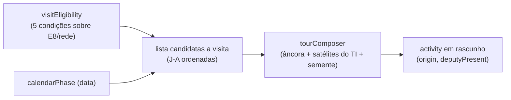

# E13 — Planejador de presença e giros (agenda do candidato)

Status: **entregue 2026-07-27** (v1 = núcleo decisório; os cortes seguem em "Cortes da v1", cada um com gatilho)
Atualizado em: 2026-07-27 (as-built da implementação acrescentado; no mesmo dia, auditoria contra o repositório antes de implementar — duas premissas falsas derrubadas, refs do C13 corrigidas, questões em aberto fechadas, seção Dados acrescentada; revisão anterior 2026-07-24 sincronizou refs pós-remodelagem Municípios + hardening)
Item do roadmap: [docs/roadmap.md](../roadmap.md) (seção "Inteligência de campanha", E13; plano-mestre [inteligencia-campanha.md](inteligencia-campanha.md))
Impeccable: C — superfície nova de planejamento em `/campanha/atividades/giros` (sub-rota), sem design-ref
Appetite: ~2 dias eng; sem migration (ver "Revisão 2026-07-27", achado 1)
Responsável: —

## Revisão 2026-07-27 — o que a auditoria mudou

O plano foi escrito em 2026-07-24 e o repositório andou. Cinco achados materiais, registrados aqui para que nenhuma fase seja executada contra o estado antigo:

1. **`kind: 'visita'` NÃO entrou na migration do C12 — e não deve entrar.** O C12 entregou `origin` (`dado | pedido_broker | obrigacao_politica`), mas `activityKinds` ([src/lib/schemas/activity.ts](../../src/lib/schemas/activity.ts)) segue sem `visita`; adicioná-lo é `ALTER TYPE ... ADD VALUE`, ou seja, migration. **Decisão: não criar o kind.** `activity.deputyPresent` (checkbox indexado, existe desde o C3) já é o marcador de presença do candidato — é literalmente o que um "planejador de presença" filtra. O giro é derivável por `deputyPresent: true` + TI + janela de datas, e o kind de cada parada continua sendo o real (`reuniao_apoio` no satélite, `comicio`/`ato` na âncora). _Rejeitado:_ novo valor de enum, que custaria migration e criaria um kind sobreposto a `reuniao_apoio`/`ato` sem dizer nada que `deputyPresent` já não diga.
2. **`allocationDecision` não tem write path.** A collection e o access existem (`canCreateAllocationDecision` e irmãos), mas **nada em `src/` cria um registro** — só `tests/int/campaignAllocationDecision.int.spec.ts`. O "aviso com override registrado" exigiria construir a primeira action + zod + testes, trabalho que o appetite de ~1,5d não cobria. **Fora da v1**; o aviso "não vá" aparece como texto, e a gravação vira gatilho do **E11**, que precisa desse write path de qualquer forma.
3. **Rota e collection renomeadas pelo C13 (2026-07-25).** `actionPlan` → `activity`, `/campanha/planos` → `/campanha/atividades`, componentes em `src/components/campaign/activity/`. Não é cosmético: `tests/unit/codebaseConventions.unit.spec.ts` § "banned campaign terminology" **falha o build** se `action[\s_-]?plan`, `plano de a[çc][aã]o` ou `/campanha/planos` aparecer em `src`, `tests` ou `scripts`. O caminho `src/components/campaign/TourComposer*.tsx` da versão anterior também morreu — o Pass 2 W2 organizou `components/campaign` em subpastas de domínio, então o compositor nasce em `src/components/campaign/tour/`.
4. **Não existe grafo de contiguidade em runtime.** [src/lib/bahiaTerritories.ts](../../src/lib/bahiaTerritories.ts) tem só **pertencimento** município→TI (`territoryForCity`, `citiesForTerritory`); adjacência de polígono existe apenas dentro dos scripts de build das malhas. Em v1, "encaixe em giro" significa **mesmo TI**, dito com essas palavras na UI — construir adjacência real é exatamente o rabbit hole "otimizador de rota" que este plano já proibia.
5. **E14 (níveis N0–N4) não foi entregue; E12 e E16 foram.** O gatilho do "não vá" no texto original lê `N0/N1`: em v1 ele lê a classe do **E10 ✓** (`sem_base` / `marginal`) somada a rede vazia. Em compensação, `loadTerritoryOverview` (**E12 ✓**) e o dossiê (**E16 ✓**) já existem e são reusados — o compositor linka o dossiê de cada parada, como previsto.

## As-built 2026-07-27 — o que a implementação descobriu

Entregue como planejado (sem migration, sem collection, sem `Consent`, sem entidade `tour`), com oito desvios que valem registro:

1. **O número de headroom passou a ter uma dona só.** O classificador do **E10** calculava teto-do-campo-não-capturado e a mediana do catálogo por conta própria, e a checklist do E13 precisa exatamente dos mesmos dois números. Em vez de um segundo cálculo, `uncapturedFieldVotes` e as medianas (`catalogMedianUncapturedFieldVotes` / `catalogMedianProjectedValidVotes`, memoizadas) foram extraídas para [municipalityPotential.ts](../../src/utilities/municipalityPotential.ts) e o classificador passou a consumi-las. Sem isso, o card "Elegibilidade" e a coluna "Classe" poderiam discordar na mesma tela — e ninguém teria como saber qual das duas contas estava certa.
2. **A escrita precisou de uma checagem de escopo própria, fail-closed.** O `create` de `activity` é um booleano de staff — Payload não expressa restrição por município no create —, então `createTourDraftActivitiesRecord` relê os ids das paradas com `overrideAccess: false` **dentro** da transação e aborta se algum não voltar. Foi um teste de integração que expôs o buraco: sem essa releitura, um assessor podia semear rascunhos no estado inteiro postando ids que o compositor nunca lhe ofereceu.
3. **"Encaixe em giro" não é avaliável para um município sozinho.** A condição é uma afirmação sobre os vizinhos, então `loadMunicipalityVisitEligibility` roda o **mesmo** loader recortado no TI do município em vez de um segundo avaliador — é assim que o card do detalhe e a proposta do compositor não começam a discordar.
4. **A ordem da composição é âncora → semente → satélites.** A primeira versão preenchia satélites antes e a semente de expansão nunca aparecia, porque os satélites consumiam todas as vagas. Caps: `TOUR_MAX_SATELLITES` 3, `MAX_TOUR_STOPS` 8 (um giro é um dia ou dois), verificado no cliente e revalidado na action.
5. **O seletor de TI recebe cada href já serializado pelo RSC, não importa o serializador** — a lição do **B14**: importar `buildTourComposerHref` num client component arrasta `bahiaTerritories` + `municipalityCatalog` para o bundle do navegador. O href é dado da opção; o cliente só navega. `/campanha/atividades/giros` fechou em **8,61 kB / 226 kB** de First Load JS, na faixa das rotas irmãs; o detalhe do município ficou em 7,3 kB / 232 kB com o card novo.
6. **Duas suítes foram fundidas, não acrescentadas.** Arquivos separados para as views do planejador (unit) e para o compositor (int) empurraram as suítes para timeout; o conteúdo vive em `tests/unit/visitEligibility.unit.spec.ts` e `tests/int/campaignActivity.int.spec.ts`. As listas de ids (`CALENDAR_PHASES`, `VISIT_CONDITIONS`, `VISIT_CONTRAINDICATIONS`) são exportadas e varridas lá para provar que todo rótulo existe — um `const` usado só como tipo é warning de ESLint, e a varredura é o motivo honesto de ele ser público.
7. **O título do rascunho passou a sair do banco, não do formulário (`/simplify`).** A primeira versão compunha `"<giro> — <município>"` na borda do `FormData`, com o nome que o cliente havia enviado, e validava esse nome à mão. A action já relê os municípios das paradas para checar escopo — então ela passou a pedir `name` nessa mesma leitura e a compor o título ali: o cliente só manda o **id**, que é a única coisa que autoriza algo. Com isso a validação artesanal das paradas virou um schema zod (`tourStopDraftsSchema`, colhido dos próprios campos de `activity`) e a checagem de comprimento do título morreu — `MAX_TOUR_NAME_LENGTH` (90) mais o maior nome de município não alcança o limite de 160 do título.
8. **`campaignMunicipalities.e2e.spec.ts` continua instável, e não é desta entrega.** Com a árvore em `git stash` o mesmo arquivo falha, em teste diferente a cada corrida (o flake já registrado no AGENTS.md). Gate verde no resto: `tsc`, `lint`, `format:check`, `knip`, `check:cycles`, 429 testes unit+int, `build`, e scan Aikido sem findings.

## Design (Impeccable)

Âncoras: `PRODUCT.md` (princípios 2 e 5) / `DESIGN.md` (register `product`) · `/campanha/atividades` existente (C3: tabs, cards, filtros).

Na implementação: shape → craft → critique → **harden** (Fase 4: form/action nova + empty state novo) → polish (classe C). `optimize` fica fora — sem sinal de perf.

Brief compacto:

- **Persona / contexto:** coordenador montando a semana do candidato sob pressão de pedidos ("quem grita mais leva" — T5); precisa dizer não com critério. A restrição que ele nomeou na sessão de campo é **"perna"** — "não posso marcar um compromisso que eu não possa cumprir".
- **Job principal:** compor giros de 2–3 dias por território com municípios elegíveis — e tornar visível o que NÃO justifica visita.
- **Estratégia de cor:** Restrained; elegibilidade como checklist de 5 condições (✓/—), nunca score numérico com falsa precisão.
- **Edit where you see:** sim — criar `activity` (com `deputyPresent`) direto do município candidato.
- **Anti-goals:** otimizador de rota (TSP/mapas de estrada); score 0–100 de município; agenda auto-aprovada; expor "não vá" com esse rótulo fora do staff (é despriorização — vocabulário duplo).

## Dados → decisão → apresentação

- **Decisão que a tela autoriza:** "incluir este município no próximo giro, ou oferecer contra-oferta" — e, no detalhe do município, "vale a pena levar o candidato aqui?".
- **Forma:** checklist de 5 condições **✓/—** por município + lista agrupada por TI. **Nunca score numérico**: falsa precisão é o erro documentado ([docs/research](../research/) §6.4) e a disciplina de exigir as cinco é o valor. Nenhum chart novo — a escada de pobreza para esta pergunta termina em texto e lista.
- **Anti-goals** (`PRODUCT.md` §6): score 0–100, gauge de SaaS, quilometragem como métrica, % estadual absoluto, contagem bruta, sugestão automática sem humano no loop.

## Contexto

Relatório §6.7: visita tem efeito modesto e o canal é mobilização do núcleo — "a visita vale o que a rede local converte dela; agenda é multiplicador de estrutura". Elegibilidade = 5 condições (volume, headroom, rede de recepção, janela política, encaixe em giro); o calendário muda o produto (construção jul–ago / consolidação set / ativação última semana); há "não vá" explícitos e intermediários ("mande o coordenador/vídeo/dobradinha"); padrões J-A (município elegível maduro sem visita), J-B (pedida vs. justificada — `activity.origin` de C12), J-C (composição do giro: âncora+satélites+semente, por agrupamento de TI). O `/campanha/atividades` (C3) já tem eventos com município/advisors/status; falta a camada de decisão de agenda. A sessão de campo de 2026-07-23 reforçou o item por dois lados: a restrição dominante nomeada é **"perna"/agenda**, e o pedido O6 de **dossiê pré-agenda** virou **E16 ✓** ([dossie-municipio.md](dossie-municipio.md)) — o compositor de giro linka o dossiê de cada município do giro como preparação da visita.

## Objetivos

- **Elegibilidade por município:** checklist das 5 condições derivadas — volume (E8), headroom (E8), rede (lideranças + assessor responsável), janela (dobradinha vinculada ou tendência não-desfavorável, mais nota livre), encaixe (mesmo TI de outra candidata) — exposta no município e numa lista "candidatas a visita" ordenada.
- **Fase do calendário:** rótulo automático (construção/consolidação/ativação por data) mudando o texto do "produto da visita" sugerido.
- **Visão "Giros" em `/campanha/atividades/giros`:** compositor simples — escolher TI, ver âncora sugerida (maior estoque comprometido), satélites do mesmo TI e 1 semente de expansão (P12), gerar as `activity` em rascunho com `deputyPresent`.
- **J-B na prática:** criar atividade a partir de pedido registra `origin: 'pedido_broker'` + contra-oferta sugerida em texto (coordenador/vídeo/parada em giro).
- **"Não vá" visível ao staff:** município de classe `sem_base`/`marginal` ou sem rede aparece com a contraindicação citada (aviso, nunca bloqueio).

## Decisões travadas

- **Planejador compõe `activity`s existentes; não cria entidade "giro" persistida na v1** — giro = agrupamento por TI+datas das atividades geradas. **Rejeitado:** collection `tour` nova (migration + access + UI por um agrupamento derivável; revisitar com gatilho).
- **Checklist ✓/— em vez de score numérico.** Falsa precisão é o erro documentado (Hersh — §6.4); a disciplina das 5 condições é o valor. **Rejeitado:** score composto 0–100.
- **Presença marcada por `deputyPresent`, não por kind novo** (ver Revisão 2026-07-27, achado 1).
- **Aviso sem gravação na v1.** "A geografia serve à política" (T5-contraindicação), mas gravar o override exige o primeiro write path de `allocationDecision` — adiado para o **E11** com gatilho. **Rejeitado:** hard-block de municípios de classe baixa; e construir o write path aqui, fora do appetite.
- **Sub-rota, não tab nova.** As tabs de `/campanha/atividades` são filtros de status traduzidos em `buildActivityListWhere`; um planejador não é um where-clause. `/campanha/atividades/giros` alcançada por botão "Planejar giro", sem entrada nova no sidebar. **Rejeitado:** 5ª tab "Giros" (abriria exceção no contrato tab→where); rota de 1º nível `/campanha/giros` (mais uma entrada num sidebar com 9).
- **Cenário fixo `central`** na conta de headroom, como o card do E8 já faz. **Rejeitado:** seletor de cenário no planejador.
- **i18n e naming:** `visitEligibility`, `tourComposer`, `calendarPhase` (`construcao|consolidacao|ativacao`), `origin` (C12); labels pt-BR.

## Abordagem proposta

Componentes:

- **`src/lib/visitPlannerAnchors.ts`**: `CALENDAR_PHASE_ANCHORS` num único objeto versionado, no precedente de `territorialClassAnchors.ts` — cortes **ilustrativos**, recalibração é diff de uma linha.
- **`src/utilities/visitEligibility.ts`**: as 5 condições + fase, puro sobre um input explícito (espelha `TerritorialClassInput`), então detalhe e lista alimentam o mesmo avaliador de fontes diferentes.
- **`src/utilities/visitPlannerData.ts`** (`server-only`): `loadVisitCandidates` com uma leitura própria de `municipality` (`overrideAccess: false`) — **não** `loadMunicipalityScope`, cujo select é superset compartilhado do dashboard/mapa/lista e não carrega `politicalTrend`/`stateDeputies`; alargá-lo cobraria de todos por dois campos que só o planejador usa. Contagem de lideranças em **uma** query com Map, no precedente de `leadershipCount` em `organizationData.ts`.
- **`src/components/campaign/tour/*`**: compositor na sub-rota; gera rascunhos por uma action em transação única.
- **Detalhe do município:** card compacto "Elegibilidade para visita" (checklist) com CTA "Planejar giro".
- **Sem migration** — nenhuma mudança de schema.

## Cortes da v1

Decididos nesta sessão, com o gatilho de cada um:

- **Override "não vá" gravando `allocationDecision`** → **E11** (que precisa do write path de qualquer forma).
- **Níveis N0–N4 no gatilho do "não vá"** → **E14**; até lá, classe E10 + rede vazia.
- **Padrões J como sugestão automática** → E11 fase 2.
- **Entidade `tour` persistida** (com resultado do giro) → 3º giro real composto e time pedindo visão consolidada pós-giro.

## Dependências

- Duras: **E8 ✓** (volume/headroom), **C12 ✓** (`origin`). Suaves: **E16 ✓** dossiê ([dossie-municipio.md](dossie-municipio.md) — preparação da visita, link por município do giro), **E12 ✓** (rollup de TI), **E4R ✓** (semeou `stateDeputies` e `politicalTrend`, que sustentam a condição de janela), **A6** dobradinha (janela política ganha dado real pós-15/08), **E14** (níveis alimentam o "não vá" quando existirem).
- Reusa: `/campanha/atividades` inteiro (C3), actions de `activity`, `bahiaTerritories.ts`, `municipalityCatalog.ts`.

## Não escopo

Roteirização fina/otimização de deslocamento (humano decide a ordem); sincronização com calendário externo (Google/ics); agenda do majoritário; padrões J como sugestões automáticas (E11 fase 2); registro de override em `allocationDecision` (E11); base de eventos municipais para janela política.

## Rabbit holes

- **Virar otimizador de rota.** Agrupamento por TI + ordenação é o teto; qualquer "distância por estrada" explode o item — e o dado de adjacência não existe em runtime (achado 4).
- **Compositor virar wizard de 6 passos.** Escolher TI → revisar 4–6 municípios sugeridos → gerar rascunhos. Três interações.
- **Janela política estruturada** (datas de festas/feiras por município). Catálogo inexistente; proxy derivado + campo livre + conhecimento do assessor. Não construir base de eventos municipais.

## Referências

- `docs/roadmap.md` (Inteligência de campanha, E13) · [plano-mestre](inteligencia-campanha.md)
- `docs/research/relatorio-entrevista-persona-campanha.md` §6.7 (elegibilidade, fases, não-vá, J-A/J-B/J-C), Rodada 6 J1–J4 · [CUSTOMER.md](../CUSTOMER.md) (restrição "perna", pedido O6)
- `src/collections/Activity.ts` (kinds/status/access, `deputyPresent`), `src/app/(campaign)/campanha/(app)/atividades/` (superfície C3)
- `src/utilities/municipalityGoalAccount.ts`, `src/utilities/municipalityPotential.ts`, `src/utilities/municipalityTerritorialClass.ts`, `src/lib/bahiaTerritories.ts`
- `PRODUCT.md`/`DESIGN.md` — âncoras da superfície nova
- AGENTS.md — transações, access, naming
