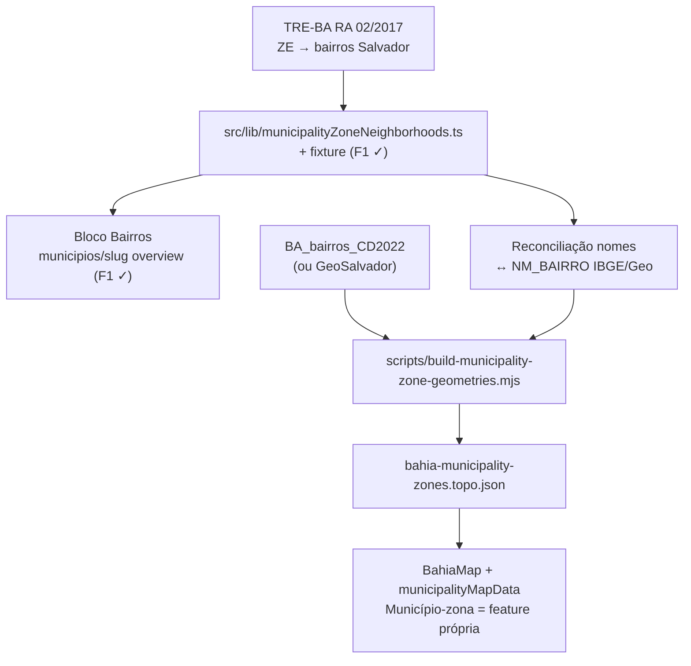

# B8 — Polígonos dos Municípios-zona de Salvador (ZE 1–19)

Status: F1 entregue em código (2026-07-21; em produção desde 2026-07-23); F2 pendente
Atualizado em: 2026-07-24
Revisão 2026-07-24 (remodelagem Municípios M1): **Camaçari saiu do escopo** — virou município inteiro (ZE 170/171 agregadas), e as entradas de Camaçari foram removidas do catálogo (`MunicipalityZoneNeighborhoodCity = 'Salvador'`; fonte única `tre-ra-02-2017`). B8 agora cobre **só as 19 zonas de Salvador**. Identificadores renomeados `plaza*` → `municipality*` na M1. As menções a Camaçari abaixo foram mantidas apenas como histórico de pesquisa.
Revisão 2026-07-21: F1 implementada — `municipalityZoneNeighborhoods.ts`, fixture+int, `MunicipalityZoneNeighborhoodsCard` no overview do Município-zona; mapa inalterado (F2).
Revisão 2026-07-21 (pós-`/simplify` + capture-review-debts): débitos S1–S3 absorvidos como **F2 prep** (~½ dia, dentro do appetite F2); S4–S10 em Explicitamente fora / Adiado; JR1–JR7 em Já resolvido (não reabrir no simplify).
Item do roadmap: [docs/roadmap.md](../roadmap.md) (Trilha B, item B8)
Impeccable: B — encaixe em `/campanha/municipios/[slug]` (lista de bairros) + `MunicipalityMapPanel`/`BahiaMap` (polígonos); sem rota nova
Appetite: F2 restante ~1,5–2,5 dias eng (+~½ dia F2 prep); F1 (~1 dia) já entregue
Responsável: —

## Design (Impeccable)

Âncoras: `PRODUCT.md` / `DESIGN.md` (register product — Field Desk) · tema `data-theme='campaign'` · shells existentes (`CampaignPageShell`, `MunicipalityMapPanel`, `BahiaMap`, cards do detalhe do município).

Na implementação (`implement-roadmap-item`): craft compacto → critique → polish (superfícies já existem; F1 é bloco de leitura; F2 estende o mapa).

Brief compacto:

- **Persona / contexto:** Assessor (ou Alex) abre um Município-zona de Salvador e precisa saber **quais bairros** ele cobre; no mapa, quer ver a zona colorida sozinha — não o município inteiro agregado.
- **Job principal:** geografia operacional do Município-zona legível (bairros) e desenhável (polígono) sem inventar camada estadual de ZE.
- **Estratégia de cor:** Restrained; coroplético existente (sequencial / divergente) inalterado em tokens.
- **Anti-goals:** não geocodificar seções; não PostGIS; não redesign do mapa; não unidade = seção; não segundo sistema de geometrias paralelo ao padrão B2.

## Contexto

Os 19 Municípios-zona de Salvador (ZE 1–19) são unidades operacionais reais, mas o mapa ainda pinta **só o polígono municipal** de Salvador e lista as zonas num painel textual:

- `MunicipalityMapPanel` copy explícita: zonas não têm polígono oficial — Salvador aparece agregada.
- `loadMunicipalityMapBundle` (`municipalityMapData.ts`) soma votos da zona no `ibgeCode` do município; `zoneBreakdown` é a única visão por Município-zona.
- [remodelagem-pracas.md](remodelagem-pracas.md) e o roadmap marcavam polígonos de zona como rabbit hole / fora de escopo (B4 histórico = dissolver municípios membros de ZE multi-município — **problema diferente**).

Pedido de produto (2026-07-21): mapear polígonos das unidades-zona; bairros por zona já são úteis na página do município. _(Na época o pedido incluía Camaçari; a remodelagem M1 de 2026-07-23 tirou Camaçari do modelo de zona.)_

### Pesquisa de fontes (2026-07-21)

| Necessidade                      | Salvador                                                                                                                                                                                                                                                                                 |
| -------------------------------- | ---------------------------------------------------------------------------------------------------------------------------------------------------------------------------------------------------------------------------------------------------------------------------------------- |
| Lista zona → bairros/localidades | **Oficial:** TRE-BA — Resolução Administrativa nº 2/2017 (Anexo I, circunscrição por bairro das ZE 1–19) + PDFs de rezoneamento em [tre-ba.jus.br/servicos-eleitorais/rezoneamento](https://www.tre-ba.jus.br/servicos-eleitorais/rezoneamento). **Já no repo** (F1).                    |
| Polígonos oficiais de ZE         | **Não existem** no TSE/TRE-BA (só tabular). Consenso comunitário ([mapaslivres/zonas-eleitorais](https://github.com/mapaslivres/zonas-eleitorais)): construir por cruzamento.                                                                                                            |
| Polígonos de bairro              | IBGE Censo 2022 `BA_bairros_CD2022` ([geoftp](https://geoftp.ibge.gov.br/organizacao_do_territorio/malhas_territoriais/malhas_de_setores_censitarios__divisoes_intramunicipais/censo_2022/bairros/shp/UF/)); alternativa municipal GeoSalvador. Cobertura parcial; gaps exigem fallback. |

_Histórico Camaçari (fora de escopo desde M1):_ não havia lista oficial zona↔bairro; a aproximação seria via locais de votação TRE (ZE 171 = Abrantes/Arembepe/orla; ZE 170 = sede) + curadoria. Registrado caso o modelo volte a dividir Camaçari.

## Objetivos

- **F1 (entregue):** catálogo estático versionado `zoneNumber → neighborhoods[]` de Salvador (TRE RA 02/2017), com fixture/teste; bloco “Bairros” no detalhe `/campanha/municipios/[slug]` quando `kind === 'zona'`.
- **F2:** TopoJSON dos 19 Municípios-zona (`properties: { municipalitySlug, zoneNumber, cityCode }`) por **dissolução** dos polígonos de bairro mapeados; script re-executável no padrão B2; mapa pinta o Município-zona individualmente (não só Salvador agregada).
- Guardrails: sem migration, sem collection, sem Consent, sem PostGIS; leitura com access existente; geometrias estáticas no repo; disclaimer de aproximação (não é limite oficial TSE).

## Decisões travadas

- **Item novo B8 (não reviver B4 nem absorver em B7).** B4 era “camada ZE estadual por dissolução de municípios membros”; aqui o gap é **intra-municipal** (19 unidades dentro de Salvador). B7 é filtro URL do mapa. (2026-07-21, roadmap-item.) **Rejeitado:** reabrir B4 com o desenho antigo; fill-in sem plano (escopo explode em geoprocessamento).
- **F1 shipável sem F2.** Catálogo + UI no município entregam valor imediato e são pré-requisito do dissolve. (Confirmado: F1 está em produção sem F2.)
- **Fonte Salvador = TRE-BA RA 02/2017 (+ PDFs de rezoneamento se divergirem).** Circunscrição oficial por bairro. **Rejeitado:** scrapers de “Onde Votar” / e-Título (frágil, PII-adjacent); aba SALVADOR da planilha E5 (DE-PARA não-oficial).
- **Escopo geográfico = só os 19 Municípios-zona de Salvador** (desde M1). Demais ZE da BA continuam fora; Camaçari é município inteiro. **Rejeitado:** camada ZE estadual no mapa; manter Camaçari dividida.
- **Polígonos = dissolve de bairros (IBGE e/ou malha municipal), não geocodificar seções.** Mesmo padrão de dissolução já usado em TIs (B2). Gaps: polígono manual leve ou omitir pedaço com nota. **Rejeitado:** geocodificar milhares de seções → casco; pedir shapefile ao TRE neste ciclo; PostGIS.
- **i18n e naming** (AGENTS.md): identificadores `municipalityZoneNeighborhoods` (existente), `build-municipality-zone-geometries.mjs`, `bahia-municipality-zones.topo.json`, `getMunicipalityZoneFeature(slug)`; strings UI em pt-BR.

## Questões em aberto

- **Malha de bairros: IBGE 2022 vs GeoSalvador?** **Opções:** A) só IBGE BA | B) GeoSalvador. **Recomendação:** A na F2 com reconciliação de nomes TRE↔`NM_BAIRRO`; se cobertura de Salvador for insuficiente no spike de ½ dia, pivotar B. Validar no spike antes de lock de artefato.
- **Chave do coroplético no mapa: `municipalitySlug` ou continuar `ibgeCode` + overlay?** **Opções:** A) mode/`values` por `municipalitySlug` para Municípios-zona + município para o resto | B) split Salvador em features de zona substituindo o polígono municipal. **Recomendação:** B no footprint de Salvador (um polígono por Município-zona; o polígono municipal some lá) e A/`ibgeCode` no restante da Bahia — evita dupla contagem visual. _(assumido — validar no craft)_

## Abordagem proposta

Componentes:

- **`src/lib/municipalityZoneNeighborhoods.ts`** _(F1, existente)_ — catálogo estático Salvador indexado por `municipalitySlug`; helpers `municipalityZoneNeighborhoodEntryForSlug(slug)` + `municipalityZoneNeighborhoodSourceLabel(source)`; cabeçalho de proveniência. Fixture `tests/fixtures/municipality-zone-neighborhoods.official.json` + int (19 zonas, sem bairro órfão duplicado). **F2 prep:** refatorar para autorar só `{ municipalitySlug, source, neighborhoods[] }` e hidratar `city`/`zoneNumber` de `getMunicipalityCatalogEntry` (ver seção abaixo).
- **UI detalhe** _(F1, existente)_ (`municipios/[slug]/page.tsx` overview): se `view.kind === 'zona'`, `MunicipalityZoneNeighborhoodsCard` a partir do helper (sem Payload). Copy: fonte TRE.
- **`scripts/build-municipality-zone-geometries.mjs`** (`pnpm build:municipality-zone-geometries`): baixa/cache malha de bairros (padrão `downloadToBuffer` / cache `data/geometries/`), filtra Salvador, dissolve por zona via catálogo reconciliado (`topojson` merge como TIs), emite `src/lib/geometries/bahia-municipality-zones.topo.json`; reporta bairros sem match.
- **`src/lib/bahiaGeometries.ts`** (ou módulo irmão profundo, sem pass-through): `getMunicipalityZoneFeature(slug)` + tipo da topologia; decode lazy como o restante das geometrias (B5 F1 já entregue no hardening — seguir `loadMunicipalityGeometryModule`).
- **`municipalityMapData.ts` / `municipalityMapContract.ts` / `MunicipalityMapPanel` / `BahiaMap`:** valores por `municipalitySlug` (ou chave estável da feature) para Municípios-zona; remover/ajustar copy “sem polígono oficial”; manter disclaimer de aproximação. `zoneBreakdown` pode permanecer como lista ou virar highlight no mapa. Tipos do bundle vivem em `municipalityMapContract.ts` (client-safe) — estender lá.
- **Depth check:** reusar padrão B2 (`bahiaGeometries`, `build-bahia-geometries`, fixtures); não criar collection de geometria; não segundo Leaflet stack.
- **Migration:** Sem migration, sem collection, sem server action.

### Fases

| Fase    | Entrega                                                                        | Appetite      |
| ------- | ------------------------------------------------------------------------------ | ------------- |
| F1 ✓    | Catálogo + testes + bloco no município (entregue; Salvador-only desde M1)      | ~1 dia        |
| F2 prep | Hidratação via `municipalityCatalog` + canônico JSON→TS + teste ordem de slugs | ~½ dia        |
| F2      | Spike cobertura malha → script → TopoJSON → mapa                               | ~1,5–2,5 dias |

**F2 prep** (débitos pós-`/simplify`, capture-review-debts 2026-07-21 — não item paralelo no roadmap):

1. **S1 — Hidratar identidade do catálogo:** autorar entradas como `{ municipalitySlug, source, neighborhoods[] }`; derivar `city` e `zoneNumber` de `getMunicipalityCatalogEntry(slug)` em `entry()` ou no read path (padrão `municipalityElectionGeographyForSlug`). Reduz campos duplicados e risco de drift antes do dissolve.
2. **S2 — Fonte única TS ↔ fixture:** o script `build-municipality-zone-geometries.mjs` (ou gerador irmão) emite `municipalityZoneNeighborhoods.ts` a partir de `municipality-zone-neighborhoods.official.json` (ou o inverso com JSON como canônico de evidência). Elimina linhas espelhadas; `evidenceSha256` permanece no fixture.
3. **S3 — Ordem de slugs:** int leve `municipalityZoneNeighborhoods.map(e => e.municipalitySlug)` vs slugs `kind === 'zona'` de `municipalityCatalog` (alinha ao snapshot do catálogo).

## Dependências

- **Dura:** R2 (mapa + detalhe) — entregue e em produção (2026-07-23).
- **Suave:** padrão B2 geometrias; B7 (filtro do mapa) entregue — B8 respeita o mesmo `buildMunicipalityListWhere`.
- Reusa: `municipalityCatalog`, `MunicipalityMapPanel`, `BahiaMap`, `municipalityMapData`/`municipalityMapContract`, `bahiaGeometries` / script B2.

## Não escopo

- Geocodificação de seções / unidade = seção → permanece **fora de escopo** no roadmap.
- Camada ZE para toda a Bahia / B4 histórico (dissolve multi-município) — não reabrir.
- **Camaçari** (município inteiro desde M1) — só volta se o modelo territorial mudar.
- E5 Salvador por bairro como unidade operacional (supersedido; aqui bairro é **atributo** do Município-zona).
- Filtro URL do mapa → **B7** (entregue); `setStyle` incremental → **B6** (entregue).
- PostGIS; edição de geografia no admin.

## Rabbit holes

- **Geocodificar seções “só para fechar o polígono”.** Semanas + cascos frágeis. **Mitigação:** dissolve por bairro + gaps manuais; seções fora deste item.
- **Reconciliação perfeita de 100% dos nomes TRE↔IBGE.** Explode o appetite. **Mitigação:** cobertura mínima documentada (ex. ≥90% Salvador); lista de unmatched no script; gaps manuais só nos críticos.
- **Desenhar 19 polígonos à mão no QGIS sem catálogo.** Irrepetível e sem teste. **Mitigação:** F1 obrigatória (feita); manual só para unmatched.
- **Tratar polígono derivado como limite oficial TSE.** Risco jurídico/comunicação. **Mitigação:** copy “aproximação a partir de bairros; não é limite oficial”.

## Já resolvido no simplify/critique (não reabrir)

- **JR1** — `MunicipalityZoneNeighborhoodsCard`: um lookup `municipalityZoneNeighborhoodEntryForSlug` (sem duplo hit no `entryBySlug`).
- **JR2** — export wrapper redundante removido.
- **JR3** — guard do card: `!entry?.neighborhoods.length`.
- **JR4** — assert de integridade só no módulo (não exportado).
- **JR5** — testes redundantes de sort e checksum duplicado removidos do int spec.
- **JR6** — cobertura usa `zoneMunicipalities.length` em vez de constante fixa.
- **JR7** — _(histórico)_ exclusividade de Camaçari sem teste — obsoleto: Camaçari saiu do catálogo na M1.
- Impeccable compacto na F1: sem snapshot `.impeccable/critique/` nem P0–P3 abertos nesta superfície; polish visual amplo → **R6**.

## Explicitamente fora (skips `/simplify` + descartes do triage)

- **S4 — Remover assert de integridade no import.** Fail-fast no import é aceitável aqui; int spec já cobre slugs zona.
- **S5 — Incluir `source` no SHA-256 canônico.** `deepEqual` fixture↔código já detecta mudança de `source`.
- **S7 — Tipo de cidade paralelo.** Absorvido por S1 se F2 prep rodar (hoje `MunicipalityZoneNeighborhoodCity = 'Salvador'`).
- **S8 — Proveniência em 3 camadas** (header TS, fixture `provenance`, `municipalityZoneNeighborhoodSourceLabel`). Padrão aceitável para catálogo com copy UI por `source`.
- **S9 — Double gate** `view.kind === 'zona'` na página + card `null`. Defesa em profundidade; não simplificar só por DRY.
- **S10 — `key={neighborhood}` no card.** Seguro com exclusividade Salvador testada.

## Adiado com gatilho

- **S6 — CSS compartilhado lista zona** (`MunicipalityMapPanel` zone breakdown ↔ `MunicipalityZoneNeighborhoodsCard`). **Gatilho:** F2 alterar `MunicipalityMapPanel`/`BahiaMap` ou R6 citar duplicação visual em ≥2 superfícies de zona.
- **Malha GeoSalvador em vez de IBGE.** Revisitar quando: spike F2 mostrar unmatched críticos em Salvador (>10% bairros TRE sem polígono).
- **Camada ZE estadual (B4 antigo).** Revisitar quando: produto pedir mapa de ZE fora de Salvador (improvável neste ciclo).

## Referências

- `docs/roadmap.md` (B8; fora de escopo estreitado; supersedido B4)
- `docs/plans/mapa-bahia-geometrias.md` — padrão estático + dissolução; B4 histórico (multi-município)
- `docs/plans/remodelagem-municipios.md` — M1 (Camaçari inteira; rename `plaza*`→`municipality*`); precedente: `remodelagem-pracas.md`
- `docs/plans/mapa-pracas-filtrado.md` — B7 (filtro; entregue)
- `src/utilities/municipalityMapData.ts`, `src/utilities/municipalityMapContract.ts`, `src/components/campaign/MunicipalityMapPanel.tsx`, `src/lib/municipalityCatalog.ts`, `src/lib/municipalityZoneNeighborhoods.ts`, `src/lib/bahiaGeometries.ts`, `scripts/build-bahia-geometries.mjs`
- TRE-BA RA 02/2017 Anexo I; [rezoneamento](https://www.tre-ba.jus.br/servicos-eleitorais/rezoneamento)
- IBGE `BA_bairros_CD2022.zip` (geoftp)
- AGENTS.md — geometrias B2, naming, modelo Municípios
- `PRODUCT.md` / `DESIGN.md` — Field Desk / Restrained
