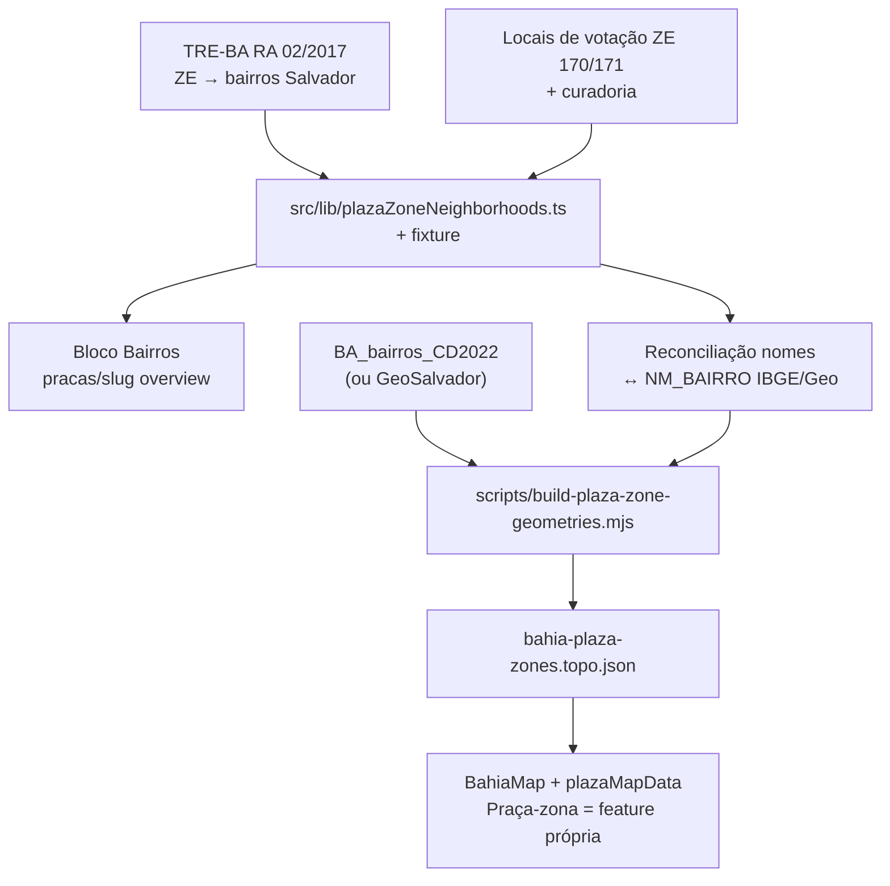

# Polígonos das Praças-zona (Salvador / Camaçari)

Status: rascunho
Atualizado em: 2026-07-21
Item do roadmap: [docs/roadmap.md](../roadmap.md) (Trilha B, item B8)
Impeccable: B — encaixe em `/campanha/pracas/[slug]` (lista de bairros) + `PlazaMapPanel`/`BahiaMap` (polígonos); sem rota nova
Appetite: ~2,5–3,5 dias eng; F1 catálogo+UI (~1 dia) shipável sozinha; F2 dissolve+TopoJSON+mapa (~1,5–2,5 dias)
Responsável: —

## Design (Impeccable)

Âncoras: `PRODUCT.md` / `DESIGN.md` (register product — Field Desk) · tema `data-theme='campaign'` · shells existentes (`CampaignPageShell`, `PlazaMapPanel`, `BahiaMap`, cards do detalhe da Praça).

Na implementação (`implement-roadmap-item`): craft compacto → critique → polish (superfícies já existem; F1 é bloco de leitura; F2 estende o mapa).

Brief compacto:

- **Persona / contexto:** Assessor (ou Alex) abre uma Praça-zona de Salvador/Camaçari e precisa saber **quais bairros** ela cobre; no mapa, quer ver a zona colorida sozinha — não o município inteiro agregado.
- **Job principal:** geografia operacional da Praça-zona legível (bairros) e desenhável (polígono) sem inventar camada estadual de ZE.
- **Estratégia de cor:** Restrained; coroplético existente (sequencial / divergente) inalterado em tokens.
- **Anti-goals:** não geocodificar seções; não PostGIS; não redesign do mapa; não Praça = seção; não segundo sistema de geometrias paralelo ao padrão B2.

## Contexto

As Praças-zona (19 em Salvador ZE 1–19 + 2 em Camaçari ZE 170/171) são unidades operacionais reais, mas o mapa ainda pinta **só o polígono municipal** e lista as zonas num painel textual:

- `PlazaMapPanel` copy explícita: “Zonas não têm polígono oficial — Salvador e Camaçari aparecem agregadas…”
- `loadPlazaMapBundle` (`plazaMapData.ts`) soma votos da zona no `ibgeCode` do município; `zoneBreakdown` é a única visão por Praça-zona.
- [remodelagem-pracas.md](remodelagem-pracas.md) e o roadmap marcavam polígonos de zona como rabbit hole / fora de escopo (B4 histórico = dissolver municípios membros de ZE multi-município — **problema diferente**).

Pedido de produto (2026-07-21): mapear polígonos das Praças-zona; bairros por zona já são úteis na página da Praça; pesquisar Camaçari; se não houver fonte online de polígonos, planejar construção a partir dos bairros.

### Pesquisa de fontes (2026-07-21)

| Necessidade                      | Salvador                                                                                                                                                                                                                                                                                                                                          | Camaçari                                                                                                                                                                                                                                               |
| -------------------------------- | ------------------------------------------------------------------------------------------------------------------------------------------------------------------------------------------------------------------------------------------------------------------------------------------------------------------------------------------------- | ------------------------------------------------------------------------------------------------------------------------------------------------------------------------------------------------------------------------------------------------------ |
| Lista zona → bairros/localidades | **Oficial:** TRE-BA — Resolução Administrativa nº 2/2017 (Anexo I, circunscrição por bairro das ZE 1–19) + PDFs de rezoneamento em [tre-ba.jus.br/servicos-eleitorais/rezoneamento](https://www.tre-ba.jus.br/servicos-eleitorais/rezoneamento). Ainda **não** está no repo.                                                                      | **Não há** lista oficial zona↔bairro comparável. Aprox.: relação TRE de **locais de votação** por zona (bairro/povoado no endereço) — ZE 171 concentra Abrantes, Arembepe, orla/povoados; ZE 170 a sede urbana — + curadoria manual com a coordenação. |
| Polígonos oficiais de ZE         | **Não existem** no TSE/TRE-BA (só tabular). Consenso comunitário ([mapaslivres/zonas-eleitorais](https://github.com/mapaslivres/zonas-eleitorais)): construir por cruzamento.                                                                                                                                                                     | Idem.                                                                                                                                                                                                                                                  |
| Polígonos de bairro              | IBGE Censo 2022 `BA_bairros_CD2022` ([geoftp](https://geoftp.ibge.gov.br/organizacao_do_territorio/malhas_territoriais/malhas_de_setores_censitarios__divisoes_intramunicipais/censo_2022/bairros/shp/UF/)); alternativa municipal GeoSalvador. Bahia tem **455** bairros na malha IBGE — cobertura intramunicipal parcial; gaps exigem fallback. | IBGE pode ou não cobrir todos os nomes locais; gaps + orla/povoados → polígonos manuais ou casco aproximado.                                                                                                                                           |

## Objetivos

- **F1:** catálogo estático versionado `zoneNumber × city → neighborhoods[]` (Salvador completo a partir do TRE; Camaçari derivado + curado), com fixture/teste; bloco “Bairros desta Praça” no detalhe `/campanha/pracas/[slug]` quando `kind === 'zona'`.
- **F2:** TopoJSON das 21 Praças-zona (`properties: { plazaSlug, zoneNumber, cityCode }`) por **dissolução** dos polígonos de bairro mapeados; script re-executável no padrão B2; mapa pinta Praça-zona individualmente (não só o município).
- Guardrails: sem migration, sem collection, sem Consent, sem PostGIS; leitura com access existente; geometrias estáticas no repo; disclaimer de aproximação (não é limite oficial TSE).

## Decisões travadas

- **Item novo B8 (não reviver B4 nem absorver em B7).** B4 era “camada ZE estadual por dissolução de municípios membros”; aqui o gap é **intra-municipal** (19+2 Praças dentro de 2 municípios). B7 é filtro URL do mapa. (2026-07-21, roadmap-item.) **Rejeitado:** reabrir B4 com o desenho antigo (não resolve Salvador/Camaçari); fill-in sem plano (escopo explode em geoprocessamento).
- **F1 shipável sem F2.** Catálogo + UI na Praça entregam valor imediato e são pré-requisito do dissolve. **Rejeitado:** só polígonos sem lista (assessor não vê bairros no detalhe); só lista sem plano de polígono (não responde ao pedido do mapa).
- **Fonte Salvador = TRE-BA RA 02/2017 (+ PDFs de rezoneamento se divergirem).** Circunscrição oficial por bairro. **Rejeitado:** scrapers de “Onde Votar” / e-Título (frágil, PII-adjacent); aba SALVADOR da planilha E5 (DE-PARA não-oficial).
- **Fonte Camaçari = locais de votação TRE → localidades + curadoria.** Sem lista oficial zona↔bairro. **Rejeitado:** inventar paridade com Salvador sem evidência; esperar shapefile TRE (não existe).
- **Polígonos = dissolve de bairros (IBGE e/ou malha municipal), não geocodificar seções.** Mesmo padrão de dissolução já usado em TIs (B2). Gaps: polígono manual leve ou omitir pedaço com nota. **Rejeitado:** geocodificar milhares de seções → casco (rabbit hole da remodelagem); pedir shapefile ao TRE neste ciclo; PostGIS.
- **Escopo geográfico = só as 21 Praças-zona.** Demais ZE da BA continuam fora. **Rejeitado:** camada ZE estadual no mapa.
- **i18n e naming** (AGENTS.md): identificadores `plazaZoneNeighborhoods`, `buildPlazaZoneGeometries`, `bahia-plaza-zones.topo.json`, `getPlazaZoneFeature(slug)`; strings UI em pt-BR.

## Questões em aberto

- **Malha de bairros: IBGE 2022 vs GeoSalvador (só capital)?** **Opções:** A) só IBGE BA | B) GeoSalvador + IBGE/manual Camaçari | C) só desenho manual. **Recomendação:** A na F2 com reconciliação de nomes TRE↔`NM_BAIRRO`; se cobertura de Salvador for insuficiente no spike de ½ dia, pivotar B para a capital. Validar no spike antes de lock de artefato.
- **Camaçari F2 se a malha de bairros for pobre?** **Opções:** A) dois polígonos manuais grossos (sede × orla/Abrantes) | B) adiar F2 Camaçari | C) casco por geocoding de locais de votação. **Recomendação:** A se F1 já tiver localidades estáveis; B se a coordenação aceitar mapa só Salvador; C só se A falhar (ainda sem seção-a-seção).
- **Chave do coroplético no mapa: `plazaSlug` ou continuar `ibgeCode` + overlay?** **Opções:** A) mode/`values` por `plazaSlug` para Praças-zona + município para o resto | B) split Salvador/Camaçari em features de zona substituindo o polígono municipal. **Recomendação:** B no footprint SSA/CMS (um polígono por Praça-zona; município some nesses dois) e A/`ibgeCode` no restante da Bahia — evita dupla contagem visual. _(assumido — validar no craft)_

## Abordagem proposta

Componentes:

- **`src/lib/plazaZoneNeighborhoods.ts`** — mapa estático `{ city: 'Salvador'|'Camaçari', zoneNumber, neighborhoods: string[] }` indexado por `plazaSlug` (via `plazaCatalog`); helpers `neighborhoodsForPlazaSlug(slug)`; cabeçalho de proveniência (URL + data da resolução / lista de locais). Fixture `tests/fixtures/plaza-zone-neighborhoods.official.json` + int (19+2 zonas, sem bairro órfão duplicado entre ZE do mesmo município quando a fonte for exclusiva).
- **UI detalhe** (`pracas/[slug]/page.tsx` overview): se `view.kind === 'zona'`, card/lista “Bairros desta Praça” a partir do helper (sem Payload). Copy: fonte TRE / aproximação Camaçari.
- **`scripts/build-plaza-zone-geometries.mjs`** (`pnpm build:plaza-zone-geometries`): baixa/cache malha de bairros (padrão `downloadToBuffer` / cache `data/geometries/`), filtra município, dissolve por zona via catálogo reconciliado (`topojson` merge como TIs), emite `src/lib/geometries/bahia-plaza-zones.topo.json`; reporta bairros sem match.
- **`src/lib/bahiaGeometries.ts`** (ou módulo irmão profundo, sem pass-through): `getPlazaZoneFeature(slug)` + tipo da topologia; lazy com o mapa (alinhar B5 F1 se ainda aberto).
- **`plazaMapData.ts` / `PlazaMapPanel` / `BahiaMap`:** valores por `plazaSlug` (ou chave estável da feature) para Praças-zona; remover/ajustar copy “sem polígono oficial”; manter disclaimer de aproximação. `zoneBreakdown` pode permanecer como lista ou virar highlight no mapa.
- **Depth check:** reusar padrão B2 (`bahiaGeometries`, `build-bahia-geometries`, fixtures); não criar collection `plazaGeometry`; não segundo Leaflet stack.
- **Migration:** Sem migration, sem collection, sem server action.

### Fases

| Fase | Entrega                                          | Appetite      |
| ---- | ------------------------------------------------ | ------------- |
| F1   | Catálogo + testes + bloco na Praça               | ~1 dia        |
| F2   | Spike cobertura malha → script → TopoJSON → mapa | ~1,5–2,5 dias |

## Dependências

- **Dura:** R2 (mapa + detalhe Praça) — entregue.
- **Suave:** padrão B2 geometrias; B7 (filtro do mapa) independente — B8 deve respeitar o mesmo `buildPlazaListWhere` quando B7 existir.
- Reusa: `plazaCatalog`, `PlazaMapPanel`, `BahiaMap`, `plazaMapData`, `bahiaGeometries` / script B2.

## Não escopo

- Geocodificação de seções / Praça = seção → permanece **fora de escopo** no roadmap.
- Camada ZE para toda a Bahia / B4 histórico (dissolve multi-município) — não reabrir.
- E5 Salvador por bairro como unidade operacional (supersedido; aqui bairro é **atributo** da Praça-zona).
- Filtro URL do mapa → **B7**; `setStyle` incremental → **B6**.
- PostGIS; edição de geografia no admin.

## Rabbit holes

- **Geocodificar seções “só para fechar o polígono”.** Semanas + cascos frágeis. **Mitigação:** dissolve por bairro + gaps manuais; seções fora deste item.
- **Reconciliação perfeita de 100% dos nomes TRE↔IBGE.** Explode o appetite. **Mitigação:** cobertura mínima documentada (ex. ≥90% Salvador); lista de unmatched no script; gaps manuais só nos críticos.
- **Desenhar 19 polígonos Salvador à mão no QGIS sem catálogo.** Irrepetível e sem teste. **Mitigação:** F1 obrigatória; manual só para gaps Camaçari/ unmatched.
- **Tratar polígono derivado como limite oficial TSE.** Risco jurídico/comunicação. **Mitigação:** copy “aproximação a partir de bairros / locais de votação; não é limite oficial”.

## Adiado com gatilho

- **Malha GeoSalvador em vez de IBGE.** Revisitar quando: spike F2 mostrar unmatched críticos em Salvador (>10% bairros TRE sem polígono).
- **Refino fino de Camaçari (povoados).** Revisitar quando: coordenação de campo reportar confusão operacional entre ZE 170/171 no mapa.
- **Camada ZE estadual (B4 antigo).** Revisitar quando: produto pedir mapa de ZE fora de SSA/CMS (improvável neste ciclo).

## Referências

- `docs/roadmap.md` (B8; fora de escopo estreitado; supersedido B4)
- `docs/plans/mapa-bahia-geometrias.md` — padrão estático + dissolução; B4 histórico (multi-município)
- `docs/plans/remodelagem-pracas.md` — rabbit hole de polígono de zona; 21 Praças-zona
- `docs/plans/mapa-pracas-filtrado.md` — B7 (filtro; independente)
- `src/utilities/plazaMapData.ts`, `src/components/campaign/PlazaMapPanel.tsx`, `src/lib/plazaCatalog.ts`, `src/lib/bahiaGeometries.ts`, `scripts/build-bahia-geometries.mjs`
- TRE-BA RA 02/2017 Anexo I; [rezoneamento](https://www.tre-ba.jus.br/servicos-eleitorais/rezoneamento); relação de locais de votação TRE-BA 2024
- IBGE `BA_bairros_CD2022.zip` (geoftp)
- AGENTS.md — geometrias B2, naming, Praças-zona
- `PRODUCT.md` / `DESIGN.md` — Field Desk / Restrained
