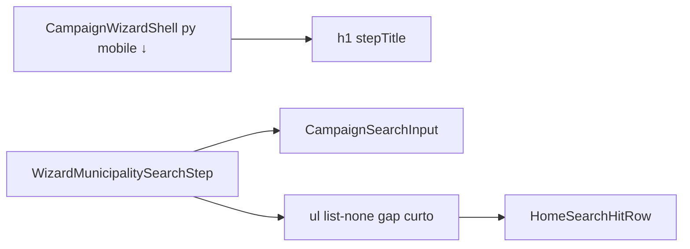

# Polimento — busca de município no wizard (bullets, gaps, título mobile)

Status: rascunho
Atualizado em: 2026-08-01
Issue: —
Priority: P1
Model: composer-2.5
Impeccable: B — encaixe em `WizardMunicipalitySearchStep` + padding do `CampaignWizardShell`
Appetite: ~0,25–0,5d eng; CSS/markup; sem migration
Responsável: —

## Design (Impeccable)

Âncoras: `PRODUCT.md` (Clarity under pressure) / `DESIGN.md` · tema `data-theme='campaign'` · B60/B75 shells.

Na implementação (`work-issue`): craft compacto → critique → polish.

Brief compacto:

- **Persona / contexto:** CG/assessor no celular no passo 1 do ritual ação→município.
- **Job principal:** escanear hits sob a busca sem ruído visual; título “Em qual município?” colado ao chrome vermelho.
- **Estratégia de cor:** inalterada.
- **Edit where you see:** não — só layout do passo.
- **Anti-goals:** redesign da row (`HomeSearchHitRow`); mudar ranking B92–B94; cards.

### Wireframe (texto)

```text
┌─ header wizard (Mandate Red) ───────────────────────┐
│            Ajustar votos                        [X] │
└─────────────────────────────────────────────────────┘
┌─ conteúdo (pt menor no mobile) ─────────────────────┐
│ Em qual município?                                  │  ← perto do header
│ ┌─ Buscar município ─────────────────────────────┐  │
│ │ Nome do município…                             │  │
│ └────────────────────────────────────────────────┘  │
│ ← gap curto (não gap-4)                             │
│ Cairu · Baixo Sul                                   │  ← sem • bullet
│ Salinas da Margarida · …                            │
└─────────────────────────────────────────────────────┘
  Fora do frame: chrome B75; suggest idle B92–B94.
```

## Dados → decisão → apresentação

Dados: N/A — apresentação de hits já existentes; sem métrica nova.

## Contexto

`WizardMunicipalitySearchStep` renderiza resultados em `<ul className="flex flex-col">` **sem** `list-none` — o UA desenha bullets. O stack interno usa `gap-4` entre input e região de resultados. O shell (`CampaignWizardShell`) aplica `py-6` no `<main>`, afastando o `h1` do header mobile Mandate Red (B75).

Pedido de produto (2026-08-01): remover bullets; encurtar distância lista↔busca; no mobile, aproximar o título do header.

## Objetivos

- Lista de hits sem marcadores (`list-none` + reset `m-0 p-0` no `ul`/`li`, alinhado a `CampaignHomeActionStrip` / grupos do Início).
- Gap input→resultados menor (recomendação: `gap-4` → `gap-2` no stack do passo 1; critique pode `gap-1.5`).
- No mobile, reduzir padding-top do conteúdo do wizard (recomendação: `main` `pt-3 pb-6 md:py-6` ou equivalente) — título mais perto do header; desktop inalterado ou quase.
- Sem migration / action / mudança de copy de empty tipado.

## Decisões travadas

- **Um item (B95) para os três ajustes da mesma superfície.** Mesmo passo, mesmo PR. **Rejeitado:** três Issues cosméticas (ruído no grafo).
- **Só markup/CSS do passo 1 + padding do shell; não reescrever `HomeSearchHitRow`.** **Rejeitado:** inventar row só do wizard.
- **Padding do shell: mobile-first no `CampaignWizardShell` (afeta todos os passos).** Título longe do header é problema mobile geral; reduzir `pt` no mobile beneficia tendência/sinal também. **Rejeitado:** wrapper só no search step (inconsistência entre passos). Se critique achar votos/tendência “apertados”, subir `pt` só onde `contentAlign`/`isEntryStep` — gatilho no polish.
- **i18n:** classes Tailwind; ids intactos.

## Questões em aberto

- **`gap-2` vs `gap-1` entre busca e lista?** **Opções:** A `gap-2` | B `gap-1`. **Recomendação:** **A** — ainda separa input da região live. _(assumido)_
- **`pt-3` vs `pt-2` no mobile do shell?** **Opções:** A `pt-3` | B `pt-2`. **Recomendação:** **A** no craft; B se ainda parecer “flutuando”. _(assumido)_

## Abordagem proposta



Componentes:

- **`WizardMunicipalitySearchStep.tsx`**: `gap-4` → `gap-2` no flex do passo; `<ul className="m-0 flex list-none flex-col p-0">` + `li` sem padding de lista.
- **`CampaignWizardShell.tsx`**: `py-6` → `pt-3 pb-6 md:py-6` (ou token equivalente pós-critique).
- **Testes:** unit smoke se já pinam classes; senão assert visual via class string / e2e não obrigatório.
- **Migration:** Sem migration.

## Dependências

- Soft: B60 ✓ / B75 ✓ / B92–B94 (suggest). Nenhuma dura.
- Nota: ver empty/suggest em **prod** depende de **OPS11** (deploy); o polimento em si não.

## Não escopo

- Ranking/geo/continuity do idle → B92–B94.
- X vs Pular → **B96**. Encadeamento → **B98**. Strip do Início → **B99**.
- Mudar placeholder/empty copy.

## Rabbit holes

- **“Já que mexo no shell, redesenho o h1 tipográfico.”** **Mitigação:** só padding.
- **Extrair `WizardResultList` genérico.** **Mitigação:** &lt;3 call sites; inline.

## Adiado com gatilho

- **Padding diferenciado por `isEntryStep`.** Revisitar se passos longos (nota de tendência) ficarem visualmente colados ao header após o `pt` global mobile.

## Referências

- `src/components/campaign/shared/WizardMunicipalitySearchStep.tsx`
- `src/components/campaign/shared/CampaignWizardShell.tsx`
- `src/components/campaign/dashboard/HomeSearchHitRow.tsx`
- [busca-municipio-wizard.md](busca-municipio-wizard.md) (B60) · [header-mobile-wizard-campanha.md](header-mobile-wizard-campanha.md) (B75)
- `PRODUCT.md` / `DESIGN.md`

Qualidade de decisão: 5/5
