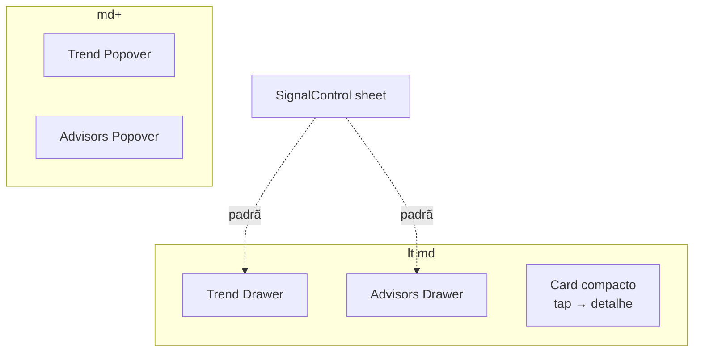

# Polimento mobile da lista de municípios (drawers + card compacto)

Status: rascunho
Atualizado em: 2026-07-26
Item do roadmap: [docs/roadmap.md](../roadmap.md) (Trilha B, item B42)
Impeccable: B — encaixe nos cards `md:hidden` + controles Tendência/Assessores; sem rota nova
Appetite: ~1 dia eng; Drawer nos dois controles (padrão B26) + densificar card + tap-to-open
Responsável: —

## Design (Impeccable)

Âncoras: `PRODUCT.md` (Edit where you see, Feel the action, Clarity under pressure) / `DESIGN.md` · regras `campanha-edit-where-you-see` / `campanha-action-feedback` · precedente **B26 ✓** (`MunicipalityListSignalControl`: Popover desktop / Drawer mobile).

Na implementação: craft compacto → critique → polish.

Brief compacto:

- **Persona / contexto:** Assessor em campo no celular, varrendo a fila; o card está alto demais e os popovers de Tendência/Assessores competem com o teclado (o Sinal já abre em Drawer).
- **Job principal:** editar tendência/assessores no mesmo gesto confortável do sinal; varrer mais municípios por viewport; abrir o detalhe com um toque no card.
- **Estratégia de cor:** Restrained — sem novo chrome; Drawer do kit (`src/components/ui/Drawer`).
- **Edit where you see:** sim — mantém edição in-card; só muda o container mobile.
- **Anti-goals:** Popover genérico "sempre Drawer"; spreadsheet; segundo botão "Abrir" depois do card inteiro ser clicável; perder stopPropagation nos controles editáveis.

## Dados → decisão → apresentação

- **Vou apresentar dados?** Sim, só **reapresentação** do que o card já mostra (classe E10, cobertura E8).
- **Decisões desbloqueadas:** Assessor/CG — "este município merece abrir agora?" com menos scroll; edição de tendência/assessores sem luta com teclado.
- **Forma escolhida:** badge de classe sem prosa; cobertura em layout **`compact`** (número + déficit curto, como desktop). **Rejeitado:** tirar Classe/Cobertura do card (ainda informam a fila); chart/KPI novo.

## Contexto

Cards mobile em [`MunicipalityList.tsx`](../../src/components/campaign/municipality/MunicipalityList.tsx) (`data-view="mobile-cards"`, `md:hidden`):

- **Classe** usa `TerritorialClassReadout` `layout="card"` — mostra o "por quê" em texto (`text-xs`); na tabela o mesmo texto é `sr-only` + tooltip B23.
- **Cobertura da meta** usa `MunicipalityListGoalCoverageCell` **sem** `layout="compact"` — soletra déficit + cenário; desktop passa `compact`.
- Botão outline **"Abrir município"** no rodapé do card.
- **Tendência** (`MunicipalityListTrendControl`) e **Assessores** (`MunicipalityListAdvisorsControl`) abrem **Popover** em qualquer viewport.
- **Último sinal** (`MunicipalityListSignalControl`) já distingue `variant: 'popover' | 'sheet'` — mobile usa Drawer (**B26 ✓**).

Pedido de produto (2026-07-26), agrupado neste item (mesma superfície mobile):

1. Tendência → Drawer no mobile, Popover no desktop.
2. Assessores → idem.
3. Card menor: sem descrição da classe; cobertura só no formato número (compact); sem botão "Abrir município"; toque no card abre o município.

## Objetivos

- `MunicipalityListTrendControl` e `MunicipalityListAdvisorsControl`: **Popover em `md+`**, **Drawer (bottom sheet) abaixo de `md`**, espelhando o contrato visual/a11y do sinal (título + nome do município no header do Drawer).
- Auto-save / endpoints JSON de B24/B27 **inalterados** — só o container muda.
- Card mobile: Classe como na tabela (badge + `sr-only` why); Cobertura com `layout="compact"`; remover o `Button` "Abrir município"; o `<article>` (ou região equivalente) navega para `/campanha/municipios/[slug]` no toque/clique **fora** dos controles interativos.
- Controles internos (tendência, votos, sinal, assessores, `TerritoryLink`) **não** disparam a navegação (`stopPropagation` / `pointer-events` / link overlay com buracos — escolher o padrão mais simples no craft).
- Guardrails: sem migration/action/Consent; desktop table fora (exceto se o controle compartilhado ganhar o branch de viewport); access inalterado.

## Decisões travadas

- **Um item só para drawers + card** (lote 2026-07-26). Mesma viewport, mesmos arquivos, appetite cabe em ~1 d. **Rejeitado:** três fill-ins separados (custo de coordenação > ganho); absorver em R6 (atrasa quick win de campo).
- **Mesmo breakpoint do sinal / cards (`md` = 768)** via padrão já usado (`md:hidden` cards, `useIsMobile` se o controle precisar montar um único tree). **Rejeitado:** breakpoint diferente por controle.
- **Card inteiro como hit target de navegação, não botão extra.** **Rejeitado:** manter o botão "Abrir" + card clicável (dois affordances); só remover o botão sem tornar o card clicável (regressão de descoberta).
- **Classe no card = paridade com tabela** (`layout="table"` ou flag `hideWhy`). O research §6.4 ("nunca só o label") continua via `sr-only` + eventual tooltip/tap no badge se B23 já cobre — no card mobile, `sr-only` basta no v1 (paridade pedida). **Rejeitado:** tirar a Classe do card.
- **i18n/naming:** reusar `variant: 'popover' | 'sheet'` do sinal ou extrair helper `useCampaignOverlayMode()` no 3º call site — depth: se Trend+Advisors+Signal forem o 3º, extrair; senão copiar o branch uma vez.

## Questões em aberto

- **Extrair shell Popover|Drawer compartilhado agora?** **Opções:** A) branch local nos dois controles (copiar B26) | B) extrair `CampaignResponsiveOverlay` já. **Recomendação:** A na primeira PR; se o diff duplicar &gt;~40 linhas iguais, extrair no `/simplify` do mesmo item (3º call site = sinal + estes dois). _(assumido.)_

## Abordagem proposta

Componentes:

- **`MunicipalityListTrendControl.tsx`**: espelhar estrutura de `MunicipalityListSignalControl` (conteúdo do form numa função; Popover vs Drawer).
- **`MunicipalityListAdvisorsControl.tsx`**: idem (chips + Command dentro do Drawer; cuidado com foco/teclado virtual).
- **`MunicipalityList.tsx` (cards):** `TerritorialClassReadout` sem why visível; `GoalCoverageCell layout="compact"`; remover `Button`/`Link` "Abrir município"; navegação no card com exclusão dos controles.
- **Testes:** unit/e2e leves — no mobile viewport, trigger de tendência abre dialog/sheet (role); tap no título navega; tap no controle não navega.
- **Migration:** nenhuma.

Depth check: reusa `Drawer` shadcn + padrão B26; não cria design system de overlay novo até o simplify provar duplicação.

## Dependências

- Duras: nenhuma. Consome **B24 ✓** / **B27 ✓** / **B26 ✓**.
- Soft: **B41** (scroll desktop) — paralelo; não bloqueia.

## Não escopo

- Scroll horizontal / sticky da tabela desktop → **B41**.
- Mudar auto-save, endpoints, ou schema de tendência/assessores.
- Paridade Drawer em outras listas (lideranças) — Adiado.
- Seletor de colunas / filtros salvos.

## Rabbit holes

- **Card clicável + botões internos = navegação acidental.** **Mitigação:** testes e2e do gesto; `stopPropagation` nos triggers; critique em device real.
- **Command dentro de Drawer (foco trap / teclado).** **Mitigação:** espelhar padrões Radix já usados no Sheet do sidebar; testar Android Chrome.
- **Extrair overlay genérico cedo demais.** **Mitigação:** decisão A acima + simplify.

## Adiado com gatilho

- **Tooltip/tap da Classe no card mobile** (mostrar o why sob demanda). Revisitar se a mesa sentir falta após a paridade com desktop.
- **Drawer para votos estimados** no card. Revisitar se o Popover de votos reclamar do teclado como tendência.

## Referências

- `docs/roadmap.md` (Trilha B · B42)
- `src/components/campaign/municipality/MunicipalityList.tsx`
- `MunicipalityListTrendControl.tsx`, `MunicipalityListAdvisorsControl.tsx`, `MunicipalityListSignalControl.tsx`
- `MunicipalityListGoalCoverageCell.tsx`
- `docs/plans/registrar-sinal-lista-municipios.md` (B26)
- `docs/plans/autosave-tendencia-lista-municipios.md` (B24)
- `docs/plans/combobox-assessores-lista-municipios.md` (B27)
- `PRODUCT.md` / `DESIGN.md`
