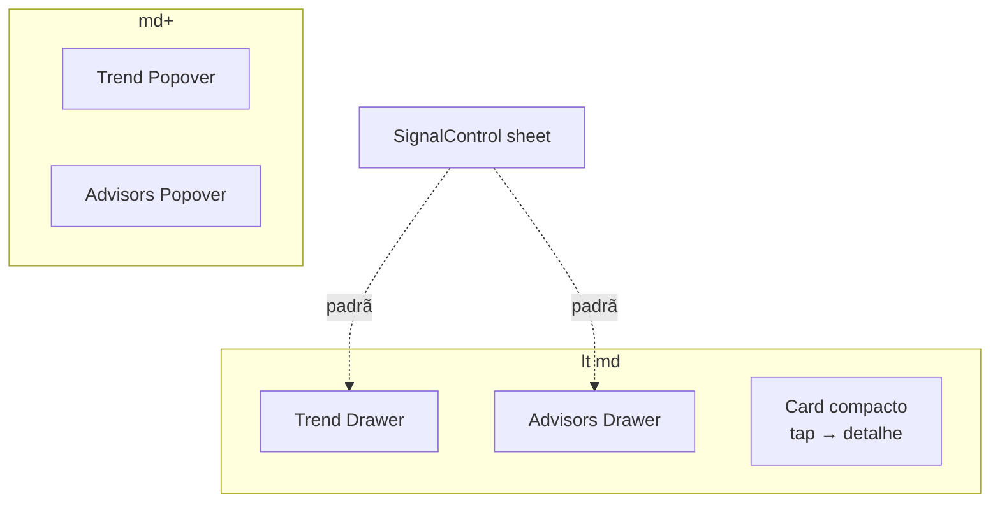

# Polimento mobile da lista de municípios (drawers + card compacto)

Status: **entregue em código (2026-07-27)** — ver "As-built" no fim
Atualizado em: 2026-07-27
Item do roadmap: [docs/roadmap.md](../roadmap.md) (Trilha B, item B42)
Impeccable: B — encaixe nos cards `md:hidden` + controles Tendência/Assessores; sem rota nova
Appetite: ~1 dia eng; Drawer nos dois controles (padrão B26) + densificar card + tap-to-open
Responsável: —

## Design (Impeccable)

Âncoras: `PRODUCT.md` (Edit where you see, Feel the action, Clarity under pressure) / `DESIGN.md` · regras `campanha-edit-where-you-see` / `campanha-action-feedback` · precedente **B26 ✓** (`MunicipalityListSignalControl`: Popover desktop / Drawer mobile).

Na implementação: craft compacto → critique → polish.

Brief compacto:

- **Persona / contexto:** Assessor em campo no celular, varrendo a fila; o card está alto demais e os popovers de Tendência/Assessores competem com o teclado (o Sinal já abre em Drawer).
- **Job principal:** editar tendência/assessores no mesmo gesto confortável do sinal; varrer mais municípios por viewport; abrir o detalhe com um toque no card.
- **Estratégia de cor:** Restrained — sem novo chrome; Drawer do kit (`src/components/ui/Drawer`).
- **Edit where you see:** sim — mantém edição in-card; só muda o container mobile.
- **Anti-goals:** Popover genérico "sempre Drawer"; spreadsheet; segundo botão "Abrir" depois do card inteiro ser clicável; perder stopPropagation nos controles editáveis.

## Dados → decisão → apresentação

- **Vou apresentar dados?** Sim, só **reapresentação** do que o card já mostra (classe E10, cobertura E8).
- **Decisões desbloqueadas:** Assessor/CG — "este município merece abrir agora?" com menos scroll; edição de tendência/assessores sem luta com teclado.
- **Forma escolhida:** badge de classe sem prosa; cobertura em layout **`compact`** (número + déficit curto, como desktop). **Rejeitado:** tirar Classe/Cobertura do card (ainda informam a fila); chart/KPI novo.

## Contexto

Cards mobile em [`MunicipalityList.tsx`](../../src/components/campaign/municipality/MunicipalityList.tsx) (`data-view="mobile-cards"`, `md:hidden`):

- **Classe** usa `TerritorialClassReadout` `layout="card"` — mostra o "por quê" em texto (`text-xs`); na tabela o mesmo texto é `sr-only` + tooltip B23.
- **Cobertura da meta** usa `MunicipalityListGoalCoverageCell` **sem** `layout="compact"` — soletra déficit + cenário; desktop passa `compact`.
- Botão outline **"Abrir município"** no rodapé do card.
- **Tendência** (`MunicipalityListTrendControl`) e **Assessores** (`MunicipalityListAdvisorsControl`) abrem **Popover** em qualquer viewport.
- **Último sinal** (`MunicipalityListSignalControl`) já distingue `variant: 'popover' | 'sheet'` — mobile usa Drawer (**B26 ✓**).

Pedido de produto (2026-07-26), agrupado neste item (mesma superfície mobile):

1. Tendência → Drawer no mobile, Popover no desktop.
2. Assessores → idem.
3. Card menor: sem descrição da classe; cobertura só no formato número (compact); sem botão "Abrir município"; toque no card abre o município.

## Objetivos

- `MunicipalityListTrendControl` e `MunicipalityListAdvisorsControl`: **Popover em `md+`**, **Drawer (bottom sheet) abaixo de `md`**, espelhando o contrato visual/a11y do sinal (título + nome do município no header do Drawer).
- Auto-save / endpoints JSON de B24/B27 **inalterados** — só o container muda.
- Card mobile: Classe como na tabela (badge + `sr-only` why); Cobertura com `layout="compact"`; remover o `Button` "Abrir município"; o `<article>` (ou região equivalente) navega para `/campanha/municipios/[slug]` no toque/clique **fora** dos controles interativos.
- Controles internos (tendência, votos, sinal, assessores, `TerritoryLink`) **não** disparam a navegação (`stopPropagation` / `pointer-events` / link overlay com buracos — escolher o padrão mais simples no craft).
- Guardrails: sem migration/action/Consent; desktop table fora (exceto se o controle compartilhado ganhar o branch de viewport); access inalterado.

## Decisões travadas

- **Um item só para drawers + card** (lote 2026-07-26). Mesma viewport, mesmos arquivos, appetite cabe em ~1 d. **Rejeitado:** três fill-ins separados (custo de coordenação > ganho); absorver em R6 (atrasa quick win de campo).
- **Mesmo breakpoint do sinal / cards (`md` = 768)** via padrão já usado (`md:hidden` cards, `useIsMobile` se o controle precisar montar um único tree). **Rejeitado:** breakpoint diferente por controle.
- **Card inteiro como hit target de navegação, não botão extra.** **Rejeitado:** manter o botão "Abrir" + card clicável (dois affordances); só remover o botão sem tornar o card clicável (regressão de descoberta).
- **Classe no card = paridade com tabela** (`layout="table"` ou flag `hideWhy`). O research §6.4 ("nunca só o label") continua via `sr-only` + eventual tooltip/tap no badge se B23 já cobre — no card mobile, `sr-only` basta no v1 (paridade pedida). **Rejeitado:** tirar a Classe do card.
- **i18n/naming:** reusar `variant: 'popover' | 'sheet'` do sinal ou extrair helper `useCampaignOverlayMode()` no 3º call site — depth: se Trend+Advisors+Signal forem o 3º, extrair; senão copiar o branch uma vez.

## Questões em aberto

- **Extrair shell Popover|Drawer compartilhado agora?** **Opções:** A) branch local nos dois controles (copiar B26) | B) extrair `CampaignResponsiveOverlay` já. **Recomendação:** A na primeira PR; se o diff duplicar &gt;~40 linhas iguais, extrair no `/simplify` do mesmo item (3º call site = sinal + estes dois). _(assumido.)_

## Abordagem proposta

Componentes:

- **`MunicipalityListTrendControl.tsx`**: espelhar estrutura de `MunicipalityListSignalControl` (conteúdo do form numa função; Popover vs Drawer).
- **`MunicipalityListAdvisorsControl.tsx`**: idem (chips + Command dentro do Drawer; cuidado com foco/teclado virtual).
- **`MunicipalityList.tsx` (cards):** `TerritorialClassReadout` sem why visível; `GoalCoverageCell layout="compact"`; remover `Button`/`Link` "Abrir município"; navegação no card com exclusão dos controles.
- **Testes:** unit/e2e leves — no mobile viewport, trigger de tendência abre dialog/sheet (role); tap no título navega; tap no controle não navega.
- **Migration:** nenhuma.

Depth check: reusa `Drawer` shadcn + padrão B26; não cria design system de overlay novo até o simplify provar duplicação.

## Dependências

- Duras: nenhuma. Consome **B24 ✓** / **B27 ✓** / **B26 ✓**.
- Soft: **B41** (scroll desktop) — paralelo; não bloqueia.

## Não escopo

- Scroll horizontal / sticky da tabela desktop → **B41**.
- Mudar auto-save, endpoints, ou schema de tendência/assessores.
- Paridade Drawer em outras listas (lideranças) — Adiado.
- Seletor de colunas / filtros salvos.

## Rabbit holes

- **Card clicável + botões internos = navegação acidental.** **Mitigação:** testes e2e do gesto; `stopPropagation` nos triggers; critique em device real.
- **Command dentro de Drawer (foco trap / teclado).** **Mitigação:** espelhar padrões Radix já usados no Sheet do sidebar; testar Android Chrome.
- **Extrair overlay genérico cedo demais.** **Mitigação:** decisão A acima + simplify.

## Adiado com gatilho

- ~~**Tooltip/tap da Classe no card mobile**~~ — **fechado no critique da própria sessão** (ver As-built): o `sr-only` sozinho deixava o veredito inalcançável no toque, o que contraria `DESIGN.md`.
- ~~**Drawer para votos estimados** no card~~ — **entrou nesta entrega** por decisão do usuário; foi o 3º call site que justificou extrair a casca.
- **Slot `footer` + `formId` na casca, para o Sinal (B26) migrar.** Gatilho: um 2º controle precisar de submit explícito num Drawer, ou o Sinal divergir visualmente dos outros três.
- **Montar o Drawer só no primeiro `open`** (`everOpened`, não `open`). Gatilho: a lista mobile aparecer num profile de render, ou o caminho `pagination: false` (435 linhas × 4 overlays) passar a ser rota quente. Números medidos no As-built.
- **`prefers-reduced-motion` no `Drawer`.** O `Dialog`/`Sheet` do kit também não respeita; a animação de entrada é do base-ui e vem do kit, então a correção é do componente `ui/`, não deste item. Gatilho: qualquer trabalho de acessibilidade de movimento no kit.
- **`DrawerVirtualKeyboardProvider`.** Sem ele, o teclado do Android pode cobrir os inputs de votos dentro da folha; hoje mitigado por não focar campo na abertura. Gatilho: relato de campo em Android.

## As-built (2026-07-27)

**Escopo ampliado por decisão do usuário na sessão:** **Votos estimados entrou** no mesmo tratamento (estava em "Adiado com gatilho" acima). Isso levou o item de 2 para **3 controles com a mesma casca** — que é o critério de extração do repo —, então a **questão em aberto foi resolvida ao contrário da recomendação**: `src/components/campaign/shared/CampaignCellEditOverlay.tsx` nasceu já nesta entrega, não no `/simplify`. Appetite ~1d → ~1,25d.

- **`CampaignCellEditOverlay`** carrega só o container: `variant` (`popover` | `sheet`), `open`/`onOpenChange`, `title`/`description`, `trigger`/`triggerLabel`, `tooltipContent` (B23, só no popover — não há hover no toque) e `preventPopoverAutoFocus`. **Cada controle continua dono do seu auto-save** (debounce, abort, flush no fechamento): fechar o Drawer grava exatamente como dispensar o Popover, porque o `handleOpenChange` de cada um passa direto para `onOpenChange`.
- **O Sinal (B26) não migrou — mas o motivo registrado antes estava errado.** O `/simplify` derrubou a alegação de que "a casca não expressa isso sem virar genérica": o `<form>` **não** precisa envolver o `DrawerHeader` (um título não é campo) e um submit fora do form é HTML padrão via `form="<id>"`. O que falta é um **slot `footer`** (mais um `formId` do chamador) — adiado com gatilho abaixo, não impossível. O Sinal segue sendo o precedente visual e agora **consome** a classe de trigger da casca (`campaignCellEditTriggerClassName`) e os três atributos ARIA que lhe faltavam (`aria-expanded`/`aria-haspopup`/`aria-busy`).
- **`useIsMobile` descartado:** os cards (`md:hidden`) e a tabela (`hidden md:block`) são árvores irmãs, então o call site já sabe em que viewport está. Uma media query aqui trocaria o container depois da hidratação.
- **Navegação do card = link esticado, zero JS:** `<Link>` dentro do `<h3>` com `after:absolute after:inset-0` sobre o `<article className="relative">`. **Quem é `relative` é o controle, não a célula** — a primeira versão posicionou os seis `
` do `<dl>`, o que levantou também os rótulos e o padding de cada célula acima do overlay e transformou metade do card em toque que não editava nem navegava (P0 do critique). Hoje o `relative` mora na classe compartilhada do trigger; nada mais dentro do card pode ser posicionado. `MunicipalityList` continua Server Component e o foco/teclado seguem nativos. O botão "Abrir município" saiu.
- **Dois props `layout` morreram** com a paridade pedida: `TerritorialClassReadout` (badge + `sr-only` do porquê, como na tabela — E10 nunca entrega veredito nu) e `MunicipalityListGoalCoverageCell` (sempre `compact`). Com um único comportamento cada, o prop e o branch órfão foram deletados.
- **`autoFocusScenario` suprimido no `sheet`:** no desktop o Popover é transitório e digitar é o ponto; no toque, focar um `input` na abertura subiria o teclado virtual antes de o número ser lido.
- **`municipalityName` é obrigatório exatamente onde há Drawer:** os props de Votos estimados são uma união discriminada — `sheet` **exige** o nome (uma folha sempre nomeia seu assunto, e isso é erro de compilação, não nota de revisão), `popover` o deixa **opcional**, porque o 3º call site (`MunicipalityGoalAccountCard`, na ficha do município) já está sob o título do próprio município. A primeira versão **proibia** o nome no `popover` (`?: never`), o que criou uma assimetria na mesma linha da tabela: Tendência e Assessores anunciavam "… em Feira de Santana — …" e Votos estimados não. Resolvido para o lado de incluir depois de verificar que a célula do nome é um `<td>` comum, **não** um `<th scope="row">` — não existe associação de cabeçalho de linha para o leitor de tela suprir o contexto quando o foco entra num trigger. Custo medido do nome nos dois variants: **0,22 KiB gzip** na página de 25 linhas (2,9 KiB no caminho `pagination: false` de 435).

**Testes:** `tests/unit/campaignCellEditOverlay.unit.spec.ts` (jsdom, 6 casos = 3 controles × 2 variants: `sheet` abre `role="dialog"` com título + nome do município e botão "Fechar"; `popover` mantém `popover-content` e não repete o nome) — precisou dos stubs de `ResizeObserver` e `Element.prototype.scrollIntoView` que o `cmdk` do combobox de assessores exige. E2e novo `test.describe` com `viewport: { width: 390, height: 844 }` em `campaignMunicipalities.e2e.spec.ts`: abrir Tendência no card **não** navega, e o toque fora dos controles abre `/campanha/municipios/<slug>`.

**Gate:** tsc, `lint --max-warnings=0`, `format:check`, knip (só o erro pré-existente de `payload.config.ts`, P3), `check:cycles`, **592 unit / 420 int**, build (`/campanha/municipios` 13,4 kB / 320 kB First Load JS) e Aikido sem achados. O e2e mobile passou; as falhas rotativas da suíte cheia foram reproduzidas **piores na árvore limpa** (4 falhas contra 3, o mesmo teste de demanda falhando na mesma linha) sob contenção de outra sessão Playwright no mesmo host — mesmo padrão de ambiente já registrado no B27 ✓/B32 ✓, não regressão.

### Critique + `/simplify` (mesma sessão, depois do gate)

O critique rodou **sobre o código**, não sobre a tela: a coleta de evidência visual em viewport 390×844 falhou por falta de automação de browser nesta sessão, então nada aqui foi confirmado em device real — os alvos de toque são checados por classe (`min-h-11`), não medidos. Mesmo assim achou um **P0 de correção no gesto central**, e os revisores paralelos (qualidade, performance, reuso) convergiram no resto. O que entrou:

- **P0 — zonas mortas do link esticado.** Descrito no bullet de navegação acima. O e2e passou a tocar num **rótulo `dt` dentro da grade de métricas** (não mais no canto do card), que é exatamente a área que o bug engolia.
- **O Drawer abre com foco no título, nunca num campo.** `initialFocus={titleRef}` num `DrawerTitle` com `tabIndex={-1}`: o default do base-ui (primeiro tabbable) subia o teclado virtual sobre a folha antes de ela ser lida — e o `preventContentAutoFocus` que devia mitigar isso era **inerte no branch `sheet`**, um prop que mentia. Renomeado para `preventPopoverAutoFocus` (é só do Popover) e o comportamento do Drawer virou incondicional. Pinado no unit spec, porque é o ponto mais frágil da entrega.
- **Rótulo acessível carrega o valor.** Um `aria-label` **substitui** o conteúdo do trigger: as quatro células de edição anunciavam o verbo e engoliam justamente o valor que todo mundo lê no pill/no avatar/no número. Agora seguem a forma que o Sinal (B26) já usava — "Editar tendência política em Feira de Santana — Favorável". Isso resolveu o achado de payload do revisor de performance **ao contrário** do que ele propôs: ele mediu `municipalityName` como payload RSC **morto** no desktop (27,9 KiB crus / 2,9 KiB gzip em 435 linhas) e sugeriu proibi-lo no `popover` nos três controles; com o nome dentro do rótulo ele deixou de ser morto, e a célula do nome ser um `<td>` sem `scope="row"` é o que diz que ninguém mais fornece esse contexto (ver o bullet do `municipalityName` acima).
- **Falha silenciosa depois do fechamento.** Fechar é o que **commita** o rascunho e também o que desmonta o `Alert` e a região `aria-live` que carregariam o erro: uma gravação que falhava na saída revertia o badge sem avisar ninguém. Os três controles de auto-save por debounce (+ o de lideranças) ganharam `toast.error` **apenas quando já estão fechados**; abertos, o `Alert` inline continua sendo o canal mais próximo.
- **Alvos de toque dentro do Drawer.** Os três inputs compactos de votos passam a 44px abaixo de `md` e continuam 36px no `md+` (única call site do variant `compact`); o chip de remover assessor e cada linha do `Command` ganham `min-h-11` só no `sheet`.
- **A explicação voltou a ser alcançável no toque.** A Classe no card ganhou `CampaignHoverTooltip` (o canal tap-to-open que a tabela já tem via `cellTooltip`) — `DESIGN.md` exige que a classe nunca chegue como veredito nu, e no card ela só tinha `sr-only`; a Cobertura ganhou a frase completa em `sr-only`, porque `title` não é anunciado nem alcançado por toque. Isso **fecha** o "Adiado com gatilho: tooltip/tap da Classe no card mobile".
- **Reuso — o 4º call site migrou.** `LeadershipListSupportStatusControl` (B32) era o branch Popover da casca redigitado à mão, classe de trigger byte-a-byte inclusive: migrado com `variant="popover"`, ~25 linhas a menos e nenhum prop novo. `MunicipalityListSignalControl` passou a importar `CampaignCellEditOverlayVariant` em vez de re-escrever a união. A string de trigger, que estava em três arquivos, virou `campaignCellEditTriggerClassName` (precedente: `campaignHoverExplanationClassName`).
- **API da casca:** o `<button>` do trigger era escrito duas vezes (só o `onClick` diferia) → uma vez; `sheetBodyClassName` era o único prop de classe que **substituía** em vez de compor, o que obrigava o chamador de assessores a re-espalhar `px-4` por seção → agora compõe (`px-0 pt-2` no chamador) e o `sectionPaddingClassName` condicional morreu; `title` era obrigatório e morto no Popover → virou o `aria-label` do `role="dialog"`, que o Radix não nomeia; o docblock estava colado no `type` do variant (hover do IDE mostrava a doc errada) e os props agora estão agrupados em blocos `// Popover only` / `// Sheet only`.

**Medido e não feito** (o revisor de performance mediu; a decisão é não pagar agora): cada Drawer fechado ainda executa o corpo de `DrawerContent`, e o `cn()` do popup roda `tailwind-merge` sobre **4.068 caracteres** — 6,2 µs contra 0,8 µs do Popover que ele substituiu, ou **+0,40 ms** em 25 linhas e **+7 ms** no caminho `pagination: false` de 435. Não é adição, é troca (o número de overlays por página não mudou), e a correção é montar o Drawer no primeiro `open` (`{everOpened && …}`, não `{open && …}`, senão o `data-starting-style` perde a animação de entrada). Registrado como débito com gatilho.

**Cuidado operacional aprendido aqui:** `git stash` é **compartilhado entre worktrees** do mesmo repositório. Fazer stash para medir uma baseline enquanto outra sessão trabalha em paralelo faz o `pop` trazer o WIP alheio (e o índice do `drop` deslizar) — aconteceu nesta sessão e foi revertido com `git stash store <hash>`. Para baseline com sessões concorrentes, prefira patch local (`git diff > /tmp/…` + `git checkout --`) a `git stash`.

## Referências

- `docs/roadmap.md` (Trilha B · B42)
- `src/components/campaign/municipality/MunicipalityList.tsx`
- `src/components/campaign/shared/CampaignCellEditOverlay.tsx` (casca `popover` | `sheet` + `campaignCellEditTriggerClassName`)
- `MunicipalityListTrendControl.tsx`, `MunicipalityListAdvisorsControl.tsx`, `MunicipalityListExpectedVotesControl.tsx`, `MunicipalityListSignalControl.tsx`
- `MunicipalityListGoalCoverageCell.tsx`, `TerritorialClassReadout.tsx`
- `src/components/campaign/leadership/LeadershipListSupportStatusControl.tsx` (4º call site da casca)
- `docs/plans/registrar-sinal-lista-municipios.md` (B26)
- `docs/plans/autosave-tendencia-lista-municipios.md` (B24)
- `docs/plans/combobox-assessores-lista-municipios.md` (B27)
- `PRODUCT.md` / `DESIGN.md`
