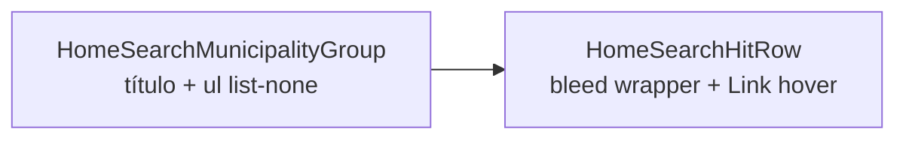

# Polimento visual dos resultados de busca no Início

Status: entregue (2026-07-30)
Atualizado em: 2026-07-30 — as-built: `src/lib/homeSearchUi.ts` (bleed/heading/list); `HomeSearchHitRow` full-bleed `-mx-4 px-4 md:-mx-6 md:px-6` + hover na faixa; todos os `HomeSearch*Group` com `text-xs` sentence-case (sem `uppercase`) e `ul list-none`; unit `homeSearchUi.unit.spec.tsx`; sem migration.
Item do roadmap: [docs/roadmap.md](../roadmap.md) (Trilha B — **B71**; chassis UX-1 / pós-B48)
Impeccable: B — encaixe em `HomeSearchMunicipalityGroup` + `HomeSearchHitRow` (B48 ✓)
Appetite: ~0,25–0,5 dia eng (CSS/markup; sem migration, action ou rota)
Responsável: —

## Design (Impeccable)

Âncoras: `PRODUCT.md` / `DESIGN.md` (register product) · tema `data-theme='campaign'`.

Na implementação (`implement-roadmap-item`): craft compacto → critique → polish (validar Brave PWA mobile + Safari iOS).

Brief compacto:

- **Persona / contexto:** staff no ritual de busca do Início (mobile PWA ou desktop) — quer ler hits sem ruído visual.
- **Job principal:** escanear municípios/TIs e tocar o certo; o grupo “Municípios” é rótulo, não cabeçalho de seção.
- **Estratégia de cor:** Restrained — título `text-muted-foreground` menor; hover `bg-muted` em faixa full-bleed.
- **Edit where you see:** não — só navegação por `Link`.
- **Anti-goals:** card com borda por linha (já rejeitado no B48); título em CAPS tipo dashboard SaaS; bullets herdados do site público.

## Dados → decisão → apresentação

Dados: N/A — lista de navegação; votos 2022 à direita permanecem como no B48 (readout A11 / rollup TI).

## Contexto

**B48 ✓** entregou `HomeSearchMunicipalityGroup` e `HomeSearchHitRow`. Feedback de campo (2026-07-29, PWA mobile Brave):

1. **Bullets** nas linhas de resultado — o `<ul>` não declara `list-none`; o reset global de `ul` em `src/app/(frontend)/styles.css` (`my-6 ml-6 list-disc`) vaza para superfícies da campanha (precedente já citado no E11: fatores em lista precisaram de reset explícito). Safari pode mascarar; Brave mobile não.
2. **Título do grupo** “MUNICÍPIOS” (uppercase + tracking) parece separador forte; pedido: **“Municipios”** (só primeira letra maiúscula), menor, sem linha horizontal, menos espaço até a primeira linha.
3. **Hover/focus** do hit não preenche a largura útil — o `hover:bg-muted/60` fica na caixa do `Link` dentro do padding do scroll (`p-4` no layout `(app)`), não de borda a borda da viewport.

## Objetivos

- Remover marcadores de lista: `list-none m-0 p-0` no `<ul>` (e `list-none` nos `<li>` se necessário); zerar margens herdadas (`my-6 ml-6`, `[&>li]:mt-2`).
- Título do grupo de busca (`resultKind === 'search'` → “Municípios”; suggest → “Sugestões” inalterado): **sentence case** (“Municípios” com acento), `text-[11px]` ou `text-xs` sem `uppercase`/`tracking-wide`, peso normal ou `font-medium` discreto; reduzir `gap` entre título e lista (`gap-0.5` ou equivalente); **sem** `border-b`, `Separator` ou pseudo-elemento de linha.
- Linha de hit: faixa de hover/focus **full-bleed** na área de conteúdo — padrão `-mx-4 px-4 md:-mx-6 md:px-6` no wrapper da linha (espelha `p-4`/`md:p-6` de `campanha/(app)/layout.tsx`) para o fundo ir de borda a borda da tela no mobile; manter alinhamento do texto com o input de busca.
- Regressão visual: desktop Safari + mobile Brave PWA; e2e existente de busca (`campaignHomeSearch` ou equivalente) continua verde.
- Sem migration, collection, server action ou mudança de contrato JSON.

## Decisões travadas

- **Corrigir no componente, não no reset global de `ul`.** O leak do `styles.css` do frontend é conhecido; resetar `ul` no tema campanha é escopo maior (R6). **Rejeitado:** alterar `styles.css` neste slice.
- **Full-bleed só na faixa interativa**, não mover o bloco inteiro de resultados para fora do padding — texto alinhado ao campo de busca. **Rejeitado:** `width: 100vw` sem compensar padding (cria scroll horizontal).
- **“Municipios” = “Municípios”** (grafia correta pt-BR; pedido era capitalização, não remover acento). **Rejeitado:** string sem acento.
- **i18n:** strings visíveis em pt-BR; identificadores de componente em inglês.

## Questões em aberto

- **Cantos arredondados no hover full-bleed?** **Opções:** A sem `rounded` na faixa | B `rounded-none` explícito | C manter `rounded-md` só no desktop. **Recomendação:** **A/B** — faixa reta de borda a borda no mobile; no desktop o bleed já é menor visualmente.

## Abordagem proposta

Componentes:

- **`HomeSearchMunicipalityGroup.tsx`**: classes do `<h2>` e do `<section>`; `ul` com `list-none m-0 p-0`.
- **`HomeSearchHitRow.tsx`**: wrapper externo com margem negativa + padding compensatório; `hover:bg-muted/60` (ou token equivalente) na faixa inteira; `focus-visible` alinhado ao mesmo retângulo.
- **Testes:** unit snapshot de classes (opcional) ou e2e tocando uma linha de resultado; atualizar se assert de título uppercase existir.
- **Migration:** Sem migration.

## Dependências

- Dura: **B48 ✓** (grupo e linha existem). Soft: **B47 ✓** (slot de resultados). Não bloqueia **B49–B55** — outros grupos devem herdar o mesmo `HomeSearchHitRow` quando chegarem.

## Não escopo

- Layout grid/cap de resultados → **B54**. Sugestões empty → **B68 ✓**. Modo focado / animação → **B66**. Espaçamento da strip de ações → **B72**.

## Rabbit holes

- **Reset global de tipografia no tema campanha.** Mitigação: `list-none` local; adiar escopo R6.
- **Bleed diferente por breakpoint sem medir padding do layout.** Mitigação: espelhar exatamente `p-4` / `md:p-6` do `(app)/layout.tsx`.

## Adiado com gatilho

- **Extrair `HomeSearchGroup` shell** — cinco grupos repetem `<section>` + heading + `<ul>`; gatilho: sexto grupo de resultados ou rota dedicada de busca (`>15` sugestões recorrentes no plano B48).

## Referências

- `docs/roadmap.md` (UX-1, B48)
- `src/components/campaign/dashboard/HomeSearchMunicipalityGroup.tsx`
- `src/components/campaign/dashboard/HomeSearchHitRow.tsx`
- `src/app/(frontend)/styles.css` (reset global `ul`)
- `src/app/(campaign)/campanha/(app)/layout.tsx` (padding do scroll)
- `docs/plans/busca-global-resultados-municipios.md` (B48 — anti-goals de card/CAPS)
- AGENTS.md — naming; Feel the action (hover imediato)

Qualidade de decisão: 4/5
