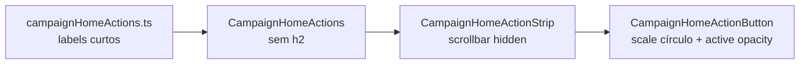

# Polimento visual da strip de ações do Início

Status: entregue (2026-07-29)
Atualizado em: 2026-07-29 — as-built: rótulos curtos no catálogo; sem `h2` em `CampaignHomeActions`; scrollbar oculta na strip; escala no círculo (hover fine / press coarse) + `active:opacity-90`; e2e retarget de heading para `[data-slot="home-actions"]` / `Ações rápidas`.
Item do roadmap: [docs/roadmap.md](../roadmap.md) (Trilha B — **B58**; chassis UX-1)
Impeccable: B — encaixe na strip existente (`CampaignHomeActionButton` / `CampaignHomeActionStrip` / `campaignHomeActions.ts`)
Appetite: ~0,5 dia eng (sem migration, sem action, sem URL)
Responsável: —

## Design (Impeccable)

Âncoras: `PRODUCT.md` / `DESIGN.md` (register product) · tema `data-theme='campaign'`.

Na implementação (`implement-roadmap-item`): craft compacto → critique → polish. `optimize` só se medição mostrar jank na animação.

Brief compacto:

- **Persona / contexto:** Alex (coordenador) ou assessor no ritual diário do Início — quer ver as ações de relance, sem título genérico nem barra de rolagem visível.
- **Job principal:** escolher uma ação em um gesto (ícone + verbo curto), com feedback tátil/visual discreto.
- **Estratégia de cor:** Restrained — hover no círculo `bg-muted`; active com `opacity` leve, sem novo token.
- **Edit where you see:** não — só navegação/atalho; wizards continuam fora.
- **Anti-goals:** hero de métricas no lugar dos botões; animação chamativa (bounce exagerado); remover scroll horizontal no mobile (pan-x deve continuar); renomear `id` `uncovered-municipalities` ou mudar query `sem_assessor` neste slice (só copy).

## Dados → decisão → apresentação

Dados: N/A — superfície de ações, sem KPI/série; o atalho `uncovered-municipalities` continua abrindo a lista filtrada (hoje `?coverage=sem_assessor&sort=votos`).

## Contexto

**B45 ✓** montou o catálogo em `src/lib/campaignHomeActions.ts` e a seção `CampaignHomeActions` com heading **"O que você quer fazer?"** + `CampaignHomeActionStrip` (`overflow-x-auto`, scrollbar fina). Os rótulos staff ainda espelham frases longas do rascunho UX-1 (ex.: "Atualizar votos de um município"), enquanto a mesa já fala em verbos curtos ("Ajustar votos"). Pedido de produto (2026-07-29, lote roadmap): tirar título e linha abaixo; encurtar labels; micro-animação no círculo; esconder scrollbar horizontal.

O rascunho [fluxos-acao-primeiro-inicio.md](fluxos-acao-primeiro-inicio.md) ainda cita o bloco com heading — **este item emenda o layout alvo**: a lista fala por si (`aria-label` da strip), sem `h2` visível.

## Objetivos

- Remover o `h2` "O que você quer fazer?" e o espaçamento associado; a região continua acessível (`aria-label` em `CampaignHomeActionStrip`, já default "Ações rápidas").
- Atualizar rótulos visíveis no catálogo (staff) para verbos curtos alinhados à mesa; atualizar `description` onde o rótulo encurtar muda o sentido do tooltip/Drawer.
- Para `uncovered-municipalities`: rótulo curto **"Ver esquecidos"** (atalho à lista hoje sem assessor; copy à prova de futura lógica "abandonados/esquecidos" sem amarrar ao texto "sem assessor"). Manter `id` estável e href inalterado neste slice.
- Hover (`pointer-fine`) e long-press (`pointer-coarse`, enquanto o dedo está pressionado): escala discreta **só** no círculo + ícone (`transform`, ~1,04–1,06, `transition` curta, respeitar `prefers-reduced-motion: reduce`).
- `:active` (click/tap): `opacity` leve no controle inteiro (círculo, ícone e label).
- Strip: manter `overflow-x-auto` e pan horizontal; **ocultar** a barra de rolagem visual (`scrollbar-width: none` + utilitário WebKit equivalente no projeto, ou classe Tailwind já usada em outro scroll oculto). Não remover `snap-x` nem `[touch-action:pan-x]`.
- Atualizar `tests/e2e/campaignHomeActions.e2e.spec.ts` e specs de botão que assertam labels antigos.
- Sem migration, collection, server action ou mudança de Contrato URL.

## Decisões travadas

- **Sem heading visível na seção de ações.** O strip já tem `aria-label`; duplicar título visível compete com densidade above-the-fold pós-**B56**. **Rejeitado:** `sr-only` com o mesmo texto (mantém ruído de árvore sem ganho visual — só usar se critique WCAG exigir nome explícito da região além do `aria-label` da strip); manter `h2` e só reduzir fonte.
- **Rótulos staff (pt-BR visível):**

  | `id`                       | Novo label          | Notas                  |
  | -------------------------- | ------------------- | ---------------------- |
  | `update-votes`             | Ajustar votos       |                        |
  | `register-signal`          | Registrar sinal     |                        |
  | `change-trend`             | Mudar tendência     | já curto               |
  | `update-leadership`        | Atualizar liderança | já curto               |
  | `register-demand`          | Registrar pedido    | já curto               |
  | `uncovered-municipalities` | Ver esquecidos      | ver Questões em aberto |

  Liderança: encurtar só se couber o mesmo critério ("Cadastrar apoiador" / "Ver meus contatos" já são curtos — opcional "Meus contatos" no mesmo PR se critique pedir paridade).

- **Animação no círculo, não no label.** Label não escala (evita reflow da strip). Long-press reusa o mesmo visual de hover via estado do `useCampaignLongPress` ou classe `group-aria-pressed` — **não** duplicar keyframes. **Rejeitado:** `animate-bounce` infinito do Tailwind; spring físico pesado; animar largura da strip.
- **Scrollbar oculta, scroll preservado.** **Rejeitado:** `overflow-x-hidden` (corta ações em viewports estreitos); fade edges sem scroll (perde affordance em desktop com mouse).

- **i18n e naming** (AGENTS.md): ids em inglês inalterados; strings visíveis em pt-BR em `campaignHomeActions.ts`.

## Questões em aberto

- **Rótulo do atalho `uncovered-municipalities`?** **Opções:** A) "Ver esquecidos" | B) "Territórios esquecidos" | C) "Sem cobertura". **Recomendação:** **A** — cabe em duas linhas no `w-[4.75rem]`, antecipa critério futuro além de `sem_assessor`, não mente hoje (lista ainda é sem assessor; `description` do tooltip/Drawer explica). _(proposto — validar com produto)_

## Abordagem proposta

Componentes:

- **`src/lib/campaignHomeActions.ts`:** atualizar `label` (e `description` onde necessário, ex. atalho esquecidos ainda menciona assessor hoje).
- **`src/components/campaign/dashboard/CampaignHomeActions.tsx`:** remover `h2`, `homeActionsHeadingId` e `aria-labelledby`; renderizar só `CampaignHomeActionStrip` (ou `section` sem labelledby).
- **`src/components/campaign/dashboard/CampaignHomeActionButton.tsx`:** classes no `span` do círculo (`transition-transform`, `group-hover:scale-*`, estado long-press); `active:opacity-*` no `actionControlClassName`.
- **`src/components/campaign/dashboard/CampaignHomeActionStrip.tsx`:** utilitário de scrollbar oculta (grep precedente no repo antes de inventar classe).
- **Testes:** `campaignHomeActions.e2e.spec.ts`, `campaignHomeActionButton.unit.spec.tsx` se assertarem copy.

Sem migration, sem collection, sem server action.

## Dependências

- Dura: **B45 ✓** (catálogo + mount).
- Suave: **B46** (thumb-zone — ordem no layout; pode landar antes ou depois deste polish).
- Suave: **B56** (resumo no topo — menos competição visual sem o `h2`).

## Não escopo

- Wizards das ações inertes — [fluxos-acao-primeiro-inicio.md](fluxos-acao-primeiro-inicio.md).
- Mudar filtro/href de `uncovered-municipalities` para "abandonados" — item futuro de inteligência/E9; só copy preparatória aqui.
- **B46** reposicionamento thumb-zone — [posicao-botoes-acao-inicio-thumb-zone.md](posicao-botoes-acao-inicio-thumb-zone.md).
- Fade edges / indicador de overflow — adiado (ver Adiado).

## Rabbit holes

- **Keyframe bounce compartilhado com outras superfícies.** Se alguém extrair para `styles.css` global: explosão de escopo. **Mitigação:** `scale` + `transition` só no botão do Início.
- **Long-press + scale + Drawer.** Escalar durante long-press não deve disparar layout shift que cancela o gesto. **Mitigação:** `transform` no círculo apenas; testar em `pointer-coarse` no critique.

## Adiado com gatilho

- **Fade nas bordas da strip** quando `scrollWidth > clientWidth`. Revisitar se, após scrollbar oculta, usuários não descobrirem mais ações (sessão observada ou suporte).

## Referências

- `docs/roadmap.md` (UX-1, B58)
- `src/lib/campaignHomeActions.ts` — catálogo
- `src/components/campaign/dashboard/CampaignHomeActions.tsx`
- `src/components/campaign/dashboard/CampaignHomeActionStrip.tsx`
- `src/components/campaign/dashboard/CampaignHomeActionButton.tsx`
- `src/lib/campaignLongPress.ts` — long-press coarse
- `tests/e2e/campaignHomeActions.e2e.spec.ts`
- `docs/plans/catalogo-acoes-inicio-por-persona.md` · `docs/plans/botao-acao-inicio-strip.md`
- `docs/plans/fluxos-acao-primeiro-inicio.md` (emenda de layout)
- AGENTS.md — naming; `PRODUCT.md` princípio Feel the action (feedback no `:active`)
