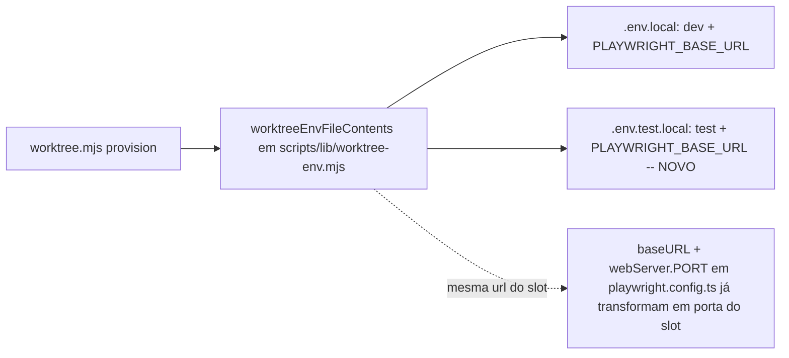

# Impl: Isolar a porta do e2e por worktree (e2e não deve disputar a porta 3000)

Status: aprovado
Atualizado em: 2026-08-09
Issue: #464
Intenção: docs/plans/porta-e2e-isolada-por-worktree.md
Appetite restante: herdado (~0,5 dia; o caminho cabe folgado)

## Leitura da intenção

- **Outcome:** dois `pnpm test:e2e` em worktrees diferentes, no mesmo host, rodam sem `EADDRINUSE` e sem um falar com o servidor do outro; cada run usa banco de teste + porta do slot do próprio worktree (nunca queda em `3000`); o dev server do e2e permanece amarrado ao banco de teste.
- **O que NÃO negociar:** nada de autenticação/rota/DB novo; contratos de URL pública intactos; `playwright.config.ts` fora do escopo (a variável certa já existe e o config já a lê — o que precisa é a variável **chegar** em `.env.test.local`).
- **O que reavaliar:** a hipótese da intenção é que a mudança é “meia linha” no bloco do `.env.test.local`. Confirmei a leitura — `playwright.config.ts:14` carrega `.env.test.local` com `override: true`, `playwright.config.ts:23` deriva `baseURL = PLAYWRIGHT_BASE_URL ?? http://localhost:3000`, e o webServer deriva `PORT` dessa `baseURL` (`playwright.config.ts:24,115`). Logo a meia linha resolve. **Mas** a causa-raiz não é a linha: é que os dois blocos env do provisionamento são mantidos à mão em paralelo (`scripts/worktree.mjs:250-279`) e isso já derivou uma vez — a única linha que faltou está em um lugar e não no outro. Decidi tratar a causa (paridade estrutural) além do sintoma.

## Abordagem recomendada

**Opções consideradas:** A | B | C
**Recomendação:** B — um único builder puro de **ambos** os arquivos env, com as duas URL (`NEXT_PUBLIC_SITE_URL` + `PLAYWRIGHT_BASE_URL`) derivadas do **mesmo** `env.devPort`, + testes de unidade na paridade. Troca a cola de dois blocos manuais irmãos (a exata classe de deriva que a intenção narra) por construção estrutural que torna a deriva impossível, e dá ao gate uma verificação automatizada real — a alternativa não teria **nenhuma** (playwright.config.ts não muda e rodar o provision real precisa de Docker fora do `gate:fast`).
**Rejeitadas:**

- **A — meia linha só** (`PLAYWRIGHT_BASE_URL` no bloco do `.env.test.local` + doc): barato e vale como fix mínimo, mas deixa a estrutura de dois blocos manuais que **causou** o bug; a próxima variável nova cai em um bloco só de novo. Sem nenhum teste cobrindo o fix.
- **C — reescrever/reordenar o fluxo de env do playwright** (templating único, carregar `.env.local` no config, faixa de porta própria para e2e): estoura o aceite e é o rabbit hole que a intenção manda cortar.

### Componentes / mudanças

- **`worktreeEnvFileContents` (novo, `scripts/lib/worktree-env.mjs`)**: função pura que recebe `{ branch, issueLabel, generatedBy, env, devUrl, testUrl, payloadSecret, copiedLines }` e devolve `{ dev: string[], test: string[] }`. Constroi o header compartilhado (marker + branch/slot/purpose) e deriva `url = http://localhost:${env.devPort}` **uma vez**, injetando `NEXT_PUBLIC_SITE_URL` + `PLAYWRIGHT_BASE_URL` nos dois. Morada conforme o padrão documentado em AGENTS.md: “Pure derivation lives in `scripts/lib/worktree-env.mjs` (unit-tested)”.
- **`provision` (`scripts/worktree.mjs`)**: os dois blocos inline (linhas ~250-279) viram uma chamada ao builder puro; `writeFileSync` de `.env.local`/`.env.test.local` com `devLines`/`testLines`. Contratos de conteúdo **idênticos** aos de antes + `PLAYWRIGHT_BASE_URL` no test. `writeFallbackEnv` (sem Docker) intacto — a intenção exclui a porta compartilhada do fallback.
- **Migration:** sem migration.
- **Access / Consent:** N/A.
- **UI:** N/A — Impeccable A.

### Testes

- `tests/unit/worktree.unit.spec.ts`: novo bloco cobrindo (1) arquivo test inclui `PLAYWRIGHT_BASE_URL=http://localhost:<devPort>` e `NEXT_PUBLIC_SITE_URL` no mesmo port; (2) paridade dev×test das duas URL (o teste que falha se o drift voltar); (3) header/marker presente e valores de DB corretos (dev vs test).

## Fases verificáveis

1. **Builder puro + fix** — extrair `worktreeEnvFileContents`, substituir blocos, escrever os testes de unidade.
2. **Gates** — `pnpm gate:fast` (lint, typecheck, test:unit com o novo bloco verde); `pnpm format` se Prettier reclamar; `pnpm exec knip` para ver que nada ficou órfão.
3. **Docs** — `.agents/skills/local-database/SKILL.md:33` (rolagem do `.env.test.local` passa a citar `PLAYWRIGHT_BASE_URL`); entrada curta em `docs/CHANGELOG-AGENTS.md`.

## Rabbit holes / Não escopo (engenharia)

- Reordenar o fluxo de env do playwright / mexer no `playwright.config.ts` (fora do escopo da intenção).
- Isolar Blob/Vercel/tmp entre e2e paralelos (intenção: item próprio se medir conflito).
- Sem-Docker fallback ganhar porta própria (intenção: degrada e fica assim).
- `.env.example` documentando `PLAYWRIGHT_BASE_URL` — o config já tem fallback `3000` autocontido.

## Riscos e mitigação

- **Quebrar o provisionamento em ambientes reais** (ex.: ordem de linhas muda, mas dotenv não depende de ordem) — mitigação: builder reproduz exatamente as linhas de antes (diff 1:1) + testes de paridade; `kill`/`worktreeDatabaseNamesOf` continuam lendo `DATABASE_URL` dos dois arquivos, preservados.
- **`PLAYWRIGHT_BASE_URL` cai no `.env.local` do worktree mas o e2e não lê esse arquivo em lugar nenhum novo** — esperado e inofensivo: `.env.local` é do dev server (que também passa a subir na porta do slot pelo `PORT` já existente); o config lê `.env.test.local`.
- **Gate sem Docker**: o fix é exercitado pela unit test pura; nada depende do container.

## Aceite de engenharia

- [ ] Aceite de produto da intenção ainda coberto (e2e usa porta+banco do slot; sem fallback `3000`; dev server do e2e no banco de teste)
- [ ] Invariantes AGENTS/engineering-standards (derivação mora em `worktree-env.mjs`; sem tocar contratos públicos)
- [ ] Testes de domínio previstos (unit de paridade dos dois env files — o guard do drift)
- [ ] Modelo: a Issue não declara `model-local:` — registrar `deepseek-v4-flash-high` (pareamento canônico de `composer-2.5`) no corpo da Issue ao fechar.
