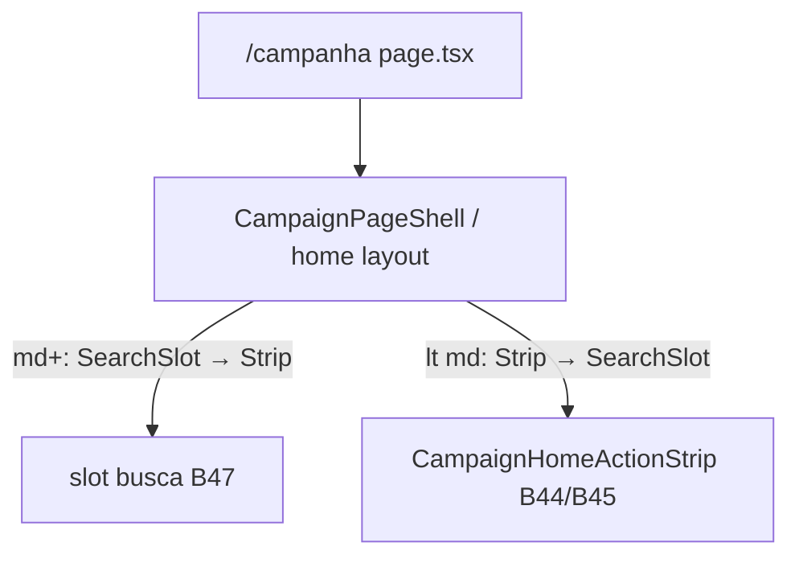

# Posição dos botões de ação do Início (thumb zone)

Status: entregue (2026-07-29)
Atualizado em: 2026-07-29 — as-built: `CampaignHomeLayout` (`min-h-full` + spacer `flex-1` só em mobile; `data-slot="home-actions"` / `home-search`; ordem flex `order-*` — mobile ações→busca, `md+` busca→ações); `/campanha` usa `CampaignPageShell` `min-h-full` + layout; decisão sticky vs coluna = coluna (opção B). Unit `campaignHomeLayout.unit.spec.ts`; e2e B45 intacto. Sem migration.
Item do roadmap: [docs/roadmap.md](../roadmap.md) (Trilha B, item B46 — chassis UX-1)
Impeccable: B — encaixe de layout no Início sob tema `campaign` (strip B44/B45 já montada)
Appetite: ~0,5 dia eng; CSS/layout do shell do Início; sem migration
Responsável: —

## Design (Impeccable)

Âncoras: `PRODUCT.md` (Clarity under pressure; Feel the action; alvos de toque no campo) / `DESIGN.md` · primitivo **B44** + catálogo **B45** · tema `campaign`.

Na implementação: craft compacto → critique → polish.

Brief compacto:

- **Persona / contexto:** CG/assessor no celular (polegar na metade inferior); no notebook a faixa de ações é a primeira coisa acima da dobra.
- **Job principal:** alcançar a strip de ações sem alongar o polegar no mobile; no `md+` manter as ações no topo do conteúdo.
- **Estratégia de cor:** herda B44 (Restrained).
- **Edit where you see:** não — chrome de launcher.
- **Anti-goals:** fixed overlay que tapa a sidebar Sheet; segundo FAB flutuante; “sticky” que empurra o conteúdo sem reserva de espaço; misturar viewport (`md`) com política de pointer (aqui é **viewport**: thumb zone ≠ fine/coarse).

## Dados → decisão → apresentação

Dados: N/A — posicionamento de chrome; sem KPI.

## Contexto

Com **B43** o Início está blank; **B44/B45** colocam a strip de ações. Sem regra de zona, a strip tende a nascer no fluxo normal do `CampaignPageShell` (topo do conteúdo) — bom no desktop, ruim no celular (polegar longe). Pedido de produto (2026-07-29): botões **próximos do limite inferior** no mobile e **próximos do limite superior** em tablet/desktop. A busca global (**B47+**) se ancora nesta composição (abaixo da strip no mobile; acima no `md+`).

## Objetivos

- Layout do Início staff (e leader, se a strip B45 existir) com:
  - **&lt; `md`:** strip de ações ancorada na região inferior do viewport útil (acima da bottom nav, se houver), com safe-area.
  - **`md+`:** strip no topo do conteúdo do Início (abaixo do header/inset usual).
- Reservar espaço para o input de busca (**B47**) na ordem relativa: mobile = ações → busca; `md+` = busca → ações.
- Sem migration / collection / Consent / action.

## Decisões travadas

- **Breakpoint = viewport (`md`), não pointer.** Thumb zone é anatomia de mão + tela pequena; tablet com mouse ainda quer ações no topo. **Rejeitado:** `pointer-coarse` → bottom (um touch laptop colocaria a strip embaixo no desktop widescreen).
- **Âncora acima da bottom nav** no mobile (não cobrir `getCampaignBottomNav` / `CampaignBottomNav` — já usa `pb-[env(safe-area-inset-bottom)]`). **Rejeitado:** `fixed bottom-0` por cima da barra.
- **Sem FAB circular solto** — continua a strip B44. **Rejeitado:** botão único flutuante “Ações”.
- **i18n:** classes/ids em inglês (`homeActionDock`, …); copy intacta do B45.

## Questões em aberto

- **`position: sticky` vs flex column com `mt-auto` no mobile?** **Resolvido (2026-07-29):** opção B — coluna full-height com spacer `flex-1` (`CampaignHomeLayout`); sticky não foi necessário com Início blank.

## Abordagem proposta

Componentes:

- **Layout no Início** (`src/app/(campaign)/campanha/(app)/page.tsx` + wrapper em `components/campaign/dashboard/` se o markup crescer): ordenação responsiva (`flex-col-reverse` / `md:flex-col` ou dois slots CSS `order-*`).
- **Safe-area + offset da bottom nav** — medir altura real em `CampaignBottomNav.tsx` (fixed + safe-area); não hardcodar sem checar o shell.
- **Migration:** Sem migration, sem collection, sem server action.

## Dependências

- Dura: **B45** (strip montada no Início — senão não há o quê ancorar). Soft: **B44** ✓ (primitivo).
- Soft: **B47** consome a ordem relativa (não bloqueia B46).

## Não escopo

- Input de busca e expand → **B47**.
- Resultados / grid → **B48–B54**.
- Wizards das ações → fatias UX-1 seguintes.
- 2ª dobra (mapa/KPI) no Início → adiado do B43.

## Rabbit holes

- **Redesenhar `CampaignPageShell` global.** **Mitigação:** wrapper só do Início.
- **`dvh` / teclado virtual.** **Mitigação:** não fixar altura frágil; preferir fluxo + padding-bottom.

## Adiado com gatilho

- **Reposicionar 2ª dobra sob a busca no `md+`.** Revisitar quando B45+B47 estáveis e CG pedir briefing no mesmo viewport (soft 03/08).

## Referências

- `docs/roadmap.md` (B46) · [botao-acao-inicio-strip.md](botao-acao-inicio-strip.md) · [catalogo-acoes-inicio-por-persona.md](catalogo-acoes-inicio-por-persona.md) · [fluxos-acao-primeiro-inicio.md](fluxos-acao-primeiro-inicio.md)
- `src/app/(campaign)/campanha/(app)/page.tsx` · `CampaignPageShell` · `CampaignBottomNav.tsx` · `nav.ts` (`getCampaignBottomNav`)
- `CampaignHomeActionStrip.tsx` / `CampaignHomeActionButton.tsx` (B44 ✓)
- `PRODUCT.md` / `DESIGN.md`
- AGENTS.md — Feel the action; naming
