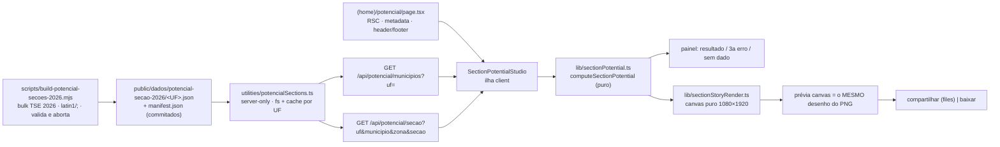

# Impl: S46 — Página pública "story da sua seção" (potencial de Lula)

Status: aprovado
Atualizado em: 2026-10-07
Issue: #1436
Intenção: docs/plans/potencial-secao-story.md
Appetite restante: herdado (~2–3 dias) — tracer bullet na Fase 1; story e gates na Fase 2/3.

## Leitura da intenção

- **Outcome:** visitante sem login informa UF/município/zona/seção e vê o 1º turno e os dois cenários de 2º turno (X₁ imediato, X₂ total) com o ganho em p.p., rotulado como cenário hipotético, e sai com um story 1080×1920 com os mesmos números — em <1 min no celular.
- **O que NÃO negociar:** o recorte é a seção informada (sem ranking, sem % estadual); seção ausente ou sem dado → estado honesto, nunca estimativa; sem PII/login/Consent; um cenário único ("todos os votos disponíveis vão para Lula; Flávio mantém os dele"); rótulo de cenário hipotético e fonte TSE sempre visíveis; template de story fixo.
- **O que reavaliar da intenção:**
  - "Candidatos: Lula, Flávio, Renan, Cury" → o bulk 2026 tem **13 candidaturas** (auditado: 22 Flávio 56.104.503; 13 Lula 53.879.538; 70 Cury 3.448.569; 14 Renan 2.675.887; 55 Caiado 2.605.148; 30 Zema 326.488; + 7 nanicas). A fórmula implementada é `X₁ = comparecimento − Lula − Flávio` (= nulos + brancos + **todos** os terceiros), fiel ao corte aprovado ("todos os votos disponíveis", sem transferência seletiva) e à copy do design ("X₁ = nulos + brancos + votos de terceiros"). Registro para o body do PR: _"o plano enumerava Renan+Cury; a base real tem 13 candidaturas; a fórmula usa todos os terceiros — não seletiva, conforme o corte aprovado"_.
  - "Dono de card/imagem" → reusar adaptadores genéricos **sem editar** `src/lib/cardRender.ts`/`src/components/cards/cardCanvas.ts` (serializa com S43; o dono fica intocado).
  - "Ingestão quando o bulk sair" → bulk **já publicado** (last-modified 2026-10-06; baixado e auditado nesta sessão).
- **Premissas assumidas (`--auto`):** válidos = `QT_VOTOS_NOMINAIS` (legenda/anulados = 0 auditados); exibição pt-BR com 1 casa; ganho com sinal derivado do valor (nunca `+` hardcoded; prova de `ganho ≥ 0` no unit); face do canvas = Arimo (corpo) + Exo 2 (título/valores-herói), ambas já self-hosted; a área do sticker no story é desenhada como área tracejada reservada, **sem** o texto-legenda do mock (sticker é affordance do Instagram, não pixel de PNG); sem link de descoberta no rodapé; URLs TSE — `https://dadosabertos.tse.jus.br/dataset/resultados-2026` (verificada 200) e, no estado de erro, o autoatendimento do título (`https://www.tse.jus.br/servicos-eleitorais/autoatendimento-eleitoral`, a confirmar no navegador na Fase 1; fallback o portal de dados abertos).

## Abordagem recomendada

**Opções consideradas:** A) artefato estático commitado + API de leitura; B) collection Payload com ~500k linhas + migration; C) importar o JSON em `src/lib`; D) fetch TSE em runtime.
**Recomendação:** A — zero schema; dado imutável por deploy; `public/` é copiado no standalone (Dockerfile) e o cwd em dev/test é o repo.
**Rejeitadas:** B (migration/collection fora do escopo, ops pesado para ler 4 números); C (~16–20 MB no grafo tsc/bundle de todo consumidor); D (dependência de CDN externo em request público, sem contrato).

### Decisões de engenharia (caras de reverter)

1. **Formato do shard** (`public/dados/potencial-secao-2026/<UF>.json`)
   Opções: A) por UF, `municipalities: [{ code, name, sections: [zona, secao, aptos, comp, lula, flavio, validos][] }]`; B) mapa `"zona:secao"` → tupla; C) objetos nomeados por seção.
   Recomendação: **A** — menor JSON (~30 B/seção; ~16–20 MB em 27 arquivos, medidos no receipt); ordenado por (zona, seção); nomes de campo só no loader; seções presentes no detalhe mas sem voto de presidente entram com zeros (distingue "sem dado" de "não encontrada"). `manifest.json` com versão, data, totais medidos e `sha256Hex` por arquivo.
   Rejeitadas: B (chave string por seção infla ~40% sem melhorar o lookup binário); C (3–4× o tamanho sem ganho).

2. **Runtime do artefato** (`src/utilities/potencialSections.ts`, server-only)
   Opções: A) `fs.readFile(process.cwd()/public/dados/...)` + cache de módulo por UF + busca binária no array do município; B) `unstable_cache`/`fetch` do asset; C) re-ler a cada request.
   Recomendação: **A** — `loadPotentialUfShard`, `findPotentialSection`, `listPotentialMunicipalities`, `listPotentialUfs`; arquivo/versão ausente → `null` (fail-closed; a página fecha honestamente). **Registrar `potencialSections.ts` no pin** de `tests/unit/codebaseConventions.unit.spec.ts` com o comentário do porquê.
   Rejeitadas: B (cache de framework para dado de disco, sem tag de bust); C (parse de ~5 MB por request).

3. **Contrato da API pública** (`src/app/(frontend)/api/potencial/{municipios,secao}/route.ts`)
   Opções (semântica de ausência): A) 404 para seção/UF ausente e 200 com números crus quando existe (mesmo `validos=0`; "sem dado" é decisão do módulo puro no cliente); B) 200 `{found:false, reason}` para tudo.
   Recomendação: **A** — 403 origem (`isSameOriginRequest`), 400 query inválida (zod strict em `src/lib/schemas/sectionPotentialQuery.ts`), 429 rate-limit (`checkContentEventRateLimit(\`potencial:${clientKey}\`, 120)`— namespace próprio, budget default), 404 não encontrada / UF sem shard, 200`{ ok: true, section: { uf, municipalityCode, municipalityName, zone, section, aptos, comparecimento, lula, flavio, validos } }`; `Cache-Control: public, max-age=86400`; `dynamic = 'force-dynamic'`; sem body (GET).
Rejeitadas: B (empurra estado de produto para o transporte; o cálculo puro já é o dono testável da disponibilidade); `no-store`(dado público imutável);`immutable` (o mesmo caminho pode ser reingerido/redeployado).

4. **Cálculo puro + story** (`src/lib/sectionPotential.ts`, `src/lib/sectionStoryRender.ts`)
   Opções: A) módulos puros (parse/formatação/cálculo + renderer com contexto estrutural próprio, incluindo métodos de stroke para a área tracejada); B) duplicar a conta na UI e no canvas; C) renderizar o story no servidor.
   Recomendação: **A** — a API devolve números crus; o cliente chama `computeSectionPotential` (garante "story == tela"); adaptadores em `src/components/potencial/sectionStoryCanvas.ts` reusam `canvasToPngBlob`/`downloadBlob` de `src/components/cards/cardCanvas.ts` e um `ensureStoryFont` local (pesos 500/600/700 — o `ensureCardFont` só carrega 700).
   Rejeitadas: B (drift entre painel e imagem); C (segundo cano de imagem + acoplamento com S43).

5. **Ganho negativo**
   Recomendação: exibir o sinal derivado do número (nunca "+" hardcoded) e **provar no unit** que `ganho ≥ 0` sob a hipótese aprovada: com `T` = terceiros e `b+n` = brancos+nulos, `pct2i − pct1 = [V·T + (F+T)(b+n)] / (D·V) ≥ 0`; o piso é `+0,0 p.p.`, visível. O formatter suporta "−" caso uma revisão futura mude a fórmula — nunca esconder o valor.
   Rejeitadas: esconder zero ou heurística de "sem ganho" (o aceite quer o número real).

6. **Coordenadas públicas** — `'potencial'` entra em `SHARE_LINK_RESERVED_SLUGS` (`src/lib/shareLink.ts`) + lista literal do `tests/unit/shareLink.unit.spec.ts` (o drift varre `(frontend)` e `(frontend)/(home)` e acha a rota sozinho). Sem migration, sem Consent, sem PII. Sem analytics em v1 (gatilho: pedido de métrica → reusar o beacon existente, sem rota nova).

### Componentes / mudanças

- **`scripts/build-potencial-secoes-2026.mjs`** + npm `build:potencial-secoes`: baixa com `ensureCachedDownload` (`scripts/lib/cli.mjs`) para `data/tse-2026/` (nova linha no `.gitignore`, par de `/data/tse-2022/`); URLs `https://cdn.tse.jus.br/estatistica/sead/odsele/votacao_secao/votacao_secao_2026_BR.zip` e `.../detalhe_votacao_secao/detalhe_votacao_secao_2026.zip`; lê `detalhe_votacao_secao_2026_<UF>.csv` por UF + `votacao_secao_2026_BR.csv` (latin1, `;`, streaming `readline`, parser de linha local no espírito do script de 2022); chave `UF|CD_MUNICIPIO|NR_ZONA|NR_SECAO`, presidente `CD_CARGO=1`, `NR_TURNO=1`; `LULA_VOTAVEL=13`, `FLAVIO_VOTAVEL=22` (validar presença); `X₁ = comp − L − F`, `X₂ = aptos − L − F`, `validos = nominais`; valida os totais nacionais auditados — aptos 158.745.502; comp 125.275.835; nominais 119.306.034; brancos 2.300.798; nulos 3.669.003; `comp = nominais+brancos+nulos`; Σcandidaturas = nominais; 499.248 seções no detalhe (499.206 com voto de presidente); Lula 53.879.538; Flávio 56.104.503 — e **aborta** em divergência (constantes só mudam por PR deliberado); escreve os shards + manifest via `writeRepoFile`; `--only <UF>` para iteração. Não roda em build/deploy.
- **`src/lib/sectionPotential.ts`**: tipos do shard (`POTENTIAL_SHARD_VERSION`, linha de 7 números), `parsePotentialShard`/`indexPotentialShard`/`findPotentialSection` puros, `computeSectionPotential` → `{available:false, reason:'no-data'}` ou `{available:true, pct1, pct2i, pct2t, gainImmediatePp, gainTotalPp, x1, x2}`; invariantes fail-closed (`validos=0`, `L+F>comp`, `comp>aptos` → no-data); formatadores pt-BR (1 casa, delta de valores não arredondados) e `sectionStoryFileName` (`potencial-lula-<uf>-<municipio-slug>-z<zona>-s<secao>.png`).
- **`src/utilities/potencialSections.ts`**: `import 'server-only'`; fs + cache de módulo por UF; parse/índice vêm do lib.
- **Rotas**: `src/app/(frontend)/api/potencial/municipios/route.ts` (lista `{code,name}`) e `.../secao/route.ts` (números crus + identidade); cada uma autocontida na ordem 403→400→429→404→200 (sem abstração prematura para 2 call sites). Adicionar `frontendPotencial` à entrada `src/lib/schemas` do `E2E_AFFECTED_MANIFEST`.
- **Página** `src/app/(frontend)/(home)/potencial/page.tsx`: `generateMetadata` (canonical `absoluteSitePath` + `resolveSiteMetadata` + OG via `resolveOgImage(null)`), `CampaignPageHeader`, `CampaignFooter` com `showJingles/showConteudos/showFotos` (padrão `/jingles`); `listPotentialUfs()` vazio → estado fechado honesto.
- **UI** `src/components/potencial/`: `SectionPotentialStudio.tsx` (fetch + estados carregando 3b / resultado 3c / não encontrada 3a / sem dado), `SectionPotentialForm.tsx` (select UF; `MunicipalityCombobox` com busca ≥3 letras accent-insensitive via `slugify` (`src/lib/slug.ts`), `role=listbox`/teclado; zona/seção 1–4 dígitos, `inputMode=numeric`), `SectionPotentialResult.tsx` (hero do ganho total, três leituras, "Como calculamos" com X₁/X₂, guardrail + fonte), `SectionPotentialStoryPreview.tsx` (canvas real 1080×1920 em `w-full h-auto`, `role=img` + `aria-label` com os números), `sectionStoryCanvas.ts`, `potentialClasses.ts` (foco amarelo + separador escuro; alvos ≥44px; inputs 16px), `sectionPotentialCopy.ts` (copy pt-BR + URLs TSE). Compartilhar: `navigator.canShare({files})`→`navigator.share`; cancelamento (`AbortError`) não baixa; fallback `downloadBlob` — mesmo contrato de `ContentPieceShareSheet`.
- **Fontes** `src/app/(frontend)/fonts.ts`: exportar `campaignTextFont = Arimo(...)` (mesmo `--font-arimo`, sem segunda instância/preload) e `(frontend)/layout.tsx` passa a importar dele; a página propaga `fontFamily` à ilha.
- **`src/lib/sectionStoryRender.ts`**: template fixo (kicker "2º turno · 25/10", título, sub da hipótese, 6 campos, bloco "A conta", legenda X₁/X₂, área tracejada reservada ao sticker sem texto); layout em px derivado das proporções do design (base 1080; o design usa `cqw` — escalar por 1080); truncamento por `measureText` para município longo; sem logo/marca.
- **E2E**: `tests/e2e/frontendPotencial.e2e.spec.ts` + project `frontendPotencial` em `playwright.config.ts` (depende de `frontend` em dev, como `frontendJingles`); entradas no manifest com prefixos reais — `src/app/(frontend)/(home)/potencial`, `src/components/potencial`, `src/lib/sectionPotential`, `src/lib/sectionStoryRender`, `src/utilities/potencialSections`, `public/dados/potencial-secao-2026`, `scripts/build-potencial-secoes-2026.mjs` → `frontendPotencial`. Sem tocar em `E2E_CURATED_SPECS` (sem migration ⇒ não é high-risk).
- **Migration:** **sem migration**. **Access/Consent:** nada (sem auth, sem escrita, sem PII). **UI tier:** C (fluxo novo em rota pública) — portar o artefato DEGRADED classe-a-classe; crítica final do `designer` no fechamento (fail-closed).

### Dados → forma

- Forma: **três leituras lado a lado** (1º turno × 2º imediato × 2º total) + **número-herói** (ganho total em p.p.) + detalhamento auditável recolhível ("Como calculamos" com X₁/X₂) e a mesma estrutura no story. O recorte é sempre a seção; p.p. é a unidade de decisão; município/zona/seção no contexto. Rejeitadas: gráfico de barras (a decisão é "vale um story?"; dois números bastam); slider de cenário (cortado pelo produto); mais casas decimais (ruído).

## Fases verificáveis

1. **Tracer (dados → lib → API → cena 3a/3c)** — script com `--only BA` validado contra os totais → run completo (27 UFs + manifest) + shards commitados; `sectionPotential.ts`, loader e as duas rotas; página com form/resultado/erro/sem-dado (story desabilitado). Unit: Curitiba sintético 91/81/190 → X₁ 13/X₂ 69 → 47,9/56,2/66,4/+8,3/+18,5; bordas (validos=0, L+F>comp) e property do ganho ≥0. Int: Serrinha/BA ZE150 seção 50 real (Lula 174, Flávio 76, b14, n15, X₁ = 39, comp 289, validos 260 → 66,9% → 73,7%; aptos a conferir no artefato) + 400/403/404/429 + header de cache. Reserva do slug + pin do top-level. Verificar no navegador as URLs TSE e a existência da seção no shard.
2. **UI (story)** — fontes (Arimo no owner), `sectionStoryRender` + adaptadores, preview 1080×1920, baixar/compartilhar, estados 3b/3d; port fiel do design (tokens, Exo 2 display + Arimo; mobile 390 empilhado) + a11y (labels, roles, foco, `aria-live` no carregamento). E2E: consulta Serrinha → números na tela; seção inexistente → alerta 3a; canvas `width=1080`/`height=1920`; download com `suggestedFilename` e PNG 1080×1920 conferido com `sharp` (precedente `frontendConteudos`); viewport 390 sem overflow horizontal.
3. **Gates** — `pnpm gate:fast`; `pnpm test:e2e:affected` (frontendPotencial + frontend); `pnpm gate:push` e `pnpm push`; entrada `docs/changelog/2026-10-07-s46-potencial-secao.md`; receipt no PR (tamanho dos shards, totais medidos, URLs TSE verificadas, premissa das 13 candidaturas).

## Rabbit holes / Não escopo (engenharia)

- Deep-link/estado da consulta na URL (`?zona=`) e prefetch — sem pedido de produto; gatilho: pedido de compartilhar a consulta.
- Evento anônimo de download — aceite não pede; gatilho: métrica da campanha (reusar `POST /api/content-events`, nunca rota nova).
- Render do story no servidor (OG image) ou cache de PNG — segundo cano de imagem; gatilho: compartilhar por link em vez de imagem.
- Editor de story / logo / marca — cortados pela intenção (template fixo, sem marca).
- Extrair `parseCsvLine`/`canvasToPngBlob` para módulos compartilhados — só 2 call sites; gatilho: terceiro consumidor.
- Busca por endereço/OCR do título — o link para o autoatendimento do TSE resolve.

## Débitos deferidos (triagem do simplify)

- **F1 — `ensureStoryFont` × `ensureCardFont`:** DRY de 2 call sites; o dono (`cardCanvas`) serializa com S43. Gatilho: S43 mergeada ou 3º font gate de canvas — extrair `ensureCanvasFont(fontFamily, weights)` junto (e antes, sanar o `faces.length > 0` frágil do S16).
- **F4 — manifest e2e só mapeia `src/**`:** `public/dados/\*\*`e o script de ingestão não acordam`frontendPotencial` num PR data-only. Gatilho: PR de re-ingestão do bulk em que se queira e2e no próprio PR (o verify full do deploy cobre antes de prod).
- **F6 — métrica de download do story:** o aceite não pede; gatilho de produto já registrado acima (reusar `POST /api/content-events`, nunca rota nova).

## Riscos e mitigação

- **Revisão do bulk pelo TSE** → validação fail-closed com totais pinados; re-auditar exige PR deliberado (`--only` para inspecionar).
- **Tamanho do artefato no git/imagem** → arrays compactos, sem pretty-print; ~16–20 MB medidos; gzip no transporte; gatilho: se passar de ~25 MB, particionar por zonas.
- **S43 mexe no dono de card** → só importamos adaptadores; zero edição em `src/components/cards/**` e `src/lib/cardRender.ts`.
- **Fonte no canvas** → Arimo/Exo 2 OFL já self-hosted; `document.fonts.load` 500/600/700 antes do draw; fallback Arial no family.
- **`process.cwd()/public` fora do dev** → mesmo contrato do standalone (Dockerfile copia `public/` → `/app/public`); loader falha fechado se ausente.
- **Combobox a11y** → padrão ARIA listbox + teclado; a11y-audit antes do PR.
- **Artefato DEGRADED** → a crítica final do `designer` (tier primário) certifica o port; sem tier primário o fluxo `--auto` para e flipa `blocked` (nunca "segue sem").

## Aceite de engenharia

- [x] Aceite de produto da intenção permanece coberto (3 números + ganho em p.p., rótulo de cenário, fonte TSE, sem cadastro, story 1080×1920 com os mesmos números)
- [x] Invariantes AGENTS/engineering-standards (copy pt-BR/identificadores inglês; sem collection/migration/Consent; nenhuma escrita; `lib` → `utilities` → `components` → `app`)
- [x] Testes de domínio previstos (unit de matemática/parse/formatação/renderer; int das rotas; e2e do fluxo + download; pins de slug/top-level/manifest)

## Self-score (decision-quality)

1. Decisões caras têm rejeitadas? **5/5** — artefato, runtime, API, story e ganho com Opções+Recomendação+Rejeitadas.
2. Cabe no appetite? **5/5** — tracer na Fase 1 (dados→API→cena mínima), uma UI, gates; sem schema/migration.
3. Rabbit holes nomeados? **5/5** — deep-link, analytics, OG server, editor, extrações prematuras, OCR.
4. Depth check? **5/5** — reusa `ensureCachedDownload`/`writeRepoFile`, `slugify`, `canvasToPngBlob`/`downloadBlob`, `isSameOriginRequest` + rate-limit, shells de página/rodapé.
5. Intenção preservada? **5/5** — engenharia não reescreveu o outcome; a única emenda (13 candidaturas) é fiel à hipótese e ao corte aprovados.
