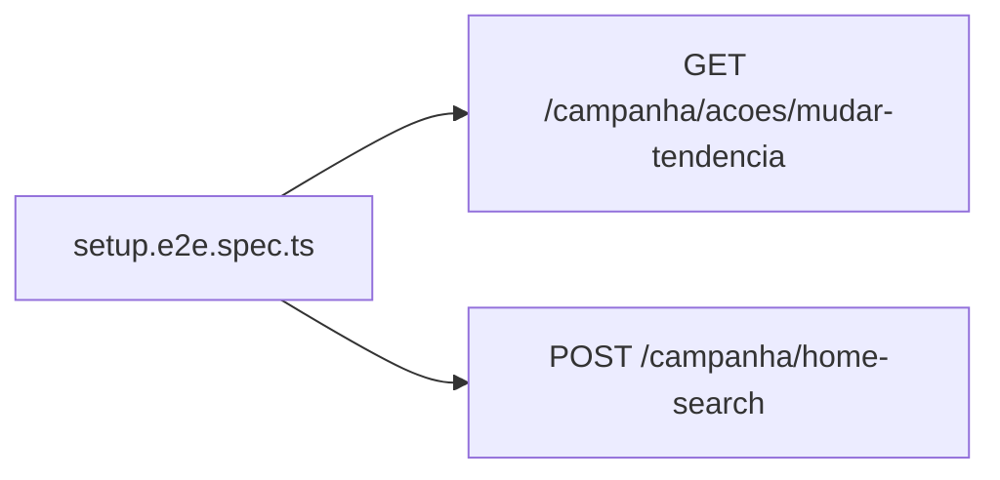

# Impl: Prewarm e2e: adicionar /campanha/home-search (POST) e /campanha/acoes/mudar-tendencia (GET) ao setup spec

Status: aprovado
Atualizado em: 2026-08-11
Issue: #645
Intenção: docs/plans/prewarm-rotas-home-search-mudar-tendencia.md
Appetite restante: ~1 hora eng (herdado)

## Leitura da intenção

- **Outcome:** o `setup.e2e.spec.ts` preaquece as duas rotas que ficaram de fora,
  para o 1º hit em dev não compilar no meio de um journey (B48/B97 flakearam 2/2
  sob load ≥40 na sessão OPS36).
- **O que NÃO negociar:** setup continua em dev-mode-only, sem mudança de
  asserções ou de CI; POST sem auth com `.catch(() => undefined)` — padrão das
  entradas existentes.
- **O que reavaliar:** nada material — as rotas existem e o padrão do setup é
  uniforme.

## Abordagem recomendada

**Opções consideradas:** A — duas linhas nas listas existentes | B — subir um
webServer `waitOn` prewarm
**Recomendação:** A — o setup spec já é o dono do prewarm dev; a intenção diz
"seguindo o padrão das entradas existentes". Custo ~2 linhas, zero risco.
**Rejeitadas:** B — duplica o mecanismo, fora do appetite.

### Componentes / mudanças

- **`tests/e2e/setup.e2e.spec.ts`**: na lista de GETs, adicionar
  `/campanha/acoes/mudar-tendencia` ao lado de `/campanha/acoes/atualizar-votos`
  (mesma família de wizard; GET anônimo → 307 para `/campanha/login`, seguido
  pelo client → `response.ok()` true — mesmo contrato das entradas vizinhas).
  Na lista de POSTs, adicionar `/campanha/home-search` (route handler em
  `src/app/(campaign)/campanha/(app)/home-search/route.ts`; POST anônimo falha,
  `.catch(() => undefined)` absorve — compila o handler, que é o objetivo).
- **Migration:** sem migration.
- **Access / Consent:** sem mudança — as rotas não são tocadas.

## Fases verificáveis

1. **Setup spec** — 2 linhas; gate rápido local.
2. **Gates** — `pnpm gate:fast` (ou lint/tsc); e2e direcionado: rodar o projeto
   `setup` + B48 (`campaignMunicipalities` home-search) e B97
   (`campaignHomeActions` mudar-tendencia) em dev a load ≥40, primeiro hit verde.

## Rabbit holes / Não escopo (engenharia)

- Hardening geral do prewarm em dev é dono da OPS30 (#586) — não reabrir aqui.
- Flakes de render sob carga em geral (B24, B176, demand) — fora.

## Riscos e mitigação

- GET `mudar-tendencia` sem auth poderia não compilar o bundle da página se o
  redirect pular o render: mitigação — o GET segue o redirect (login), mas o
  compile da rota `[slug]` acontece no primeiro match de rota, independente do
  redirect; mesma família que `atualizar-votos` já prewarms com sucesso.
- Medição sob load ≥40 é cara: mitigação — verificação local direcionada
  (workers ≥2, setup primeiro), sem CI novo.

## Aceite de engenharia

- [x] Aceite de produto da intenção ainda coberto
- [x] Invariantes AGENTS/engineering-standards (nenhum código runtime tocado)
- [x] Testes de domínio previstos (unit/int): não se aplica — mudança só em spec e2e
