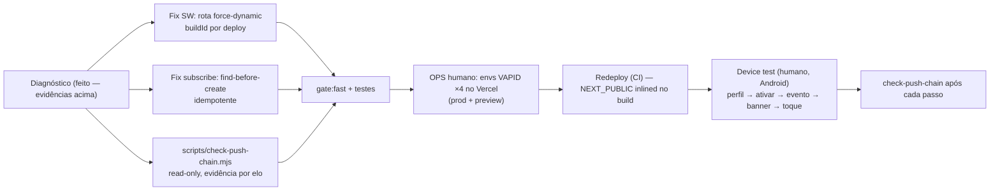

# Impl: D6 — Push no dispositivo funcionando de ponta a ponta (notificações nativas em produção)

Status: aprovado
Atualizado em: 2026-08-09
Issue: #521
Intenção: docs/plans/push-notificacoes-dispositivo-producao.md
Appetite restante: herdado (~1 dia eng + passos humanos)

## Leitura da intenção

- **Outcome:** device real optado recebe banner nativo para cada evento que hoje gera notificação in-app; toque abre a tela certa. Diagnóstico da cadeia fecha com evidência por elo. iOS sem PWA instalado documentado (não é defeito).
- **O que NÃO negociar:** Consent fail-closed (`campanha-notificacoes-push`); push exclusivo da vertical `/campanha`; não reescrever a mecânica D2; WhatsApp fora.
- **O que reavaliar:** a hipótese da intenção era "verificação/config". O diagnóstico encontrou **dois defeitos de código com evidência** (SW buildId `dev` em prod; subscribe não idempotente) além do elo de config quebrado (envs VAPID ausentes).

## Diagnóstico da cadeia (evidência colhida em prod, 2026-08-09)

| Elo                          | Estado        | Evidência                                                                                                                                                                          |
| ---------------------------- | ------------- | ---------------------------------------------------------------------------------------------------------------------------------------------------------------------------------- |
| 1. Envs VAPID (Vercel prod)  | **QUEBRADO**  | `vercel env ls production`: `VAPID_PUBLIC_KEY`, `VAPID_PRIVATE_KEY`, `NEXT_PUBLIC_VAPID_PUBLIC_KEY` **ausentes** (também `REVALIDATE_SECRET` ausente — débito ops, fora do escopo) |
| 2. Consentimento publicado   | OK            | DB prod (read-only): `consent` com `key='campanha-notificacoes-push'`, `updated_at` 2026-07-19 (migration Onda 0)                                                                  |
| 3. Inscrição push por device | 0 rows        | DB prod: `push_subscription` count = 0 — bloqueado pelo elo 1 no cliente (card desabilita "Ativar" quando `vapidPublicKey` é null)                                                 |
| 4. Entrega pela plataforma   | nunca tentada | Elo 1 ausente → `ensureVapidConfigured()` retorna false → `sendCampaignPushForNotification` retorna cedo (web-push nunca chamado)                                                  |
| 5. Banner no OS              | pendente      | passo humano (Android Chrome) após elos 1–4 fechados                                                                                                                               |
| —. Sino in-app               | OK            | DB prod: `notification` = 74 rows (`municipality_update` 69, `activity_attention` 5) — geração de eventos funciona                                                                 |

**Defeitos de código com evidência:**

- **A — SW serve `build dev` em prod.** `curl https://pt.jorgesolla.com.br/campanha/sw.js` → `CACHE_NAME = "campanha-dev"`. Causa: deploys são CLI (`vercel build` + `--prebuilt`; git builds ignorados via `vercel-ignore-build.sh`) e a rota é `force-static` → o buildId é congelado no build, onde `VERCEL_GIT_COMMIT_SHA`/`VERCEL_DEPLOYMENT_ID` não existem. `VERCEL_DEPLOYMENT_ID` é disponível em build **e runtime** (docs Vercel); `force-dynamic` lê runtime → id único por deploy. Impacto: cache do SW não versiona por deploy — caches de navegação antigos (`campanha-dev`) nunca purgam no `activate` e o update check nunca muda de cache name.
- **B — Subscribe não idempotente.** `PushSubscription.endpoint` é UNIQUE e `subscribeCampaignPush` faz `payload.create` direto. Segundo toque em "Ativar neste dispositivo" (device já inscrito → `pushManager.subscribe` devolve a mesma subscription → mesmo endpoint) estoura unique violation → erro falso "Não foi possível ativar", com o device já inscrito. Fluxo real de opt-in quebra no segundo toque.

## Abordagem recomendada

**Opções consideradas (fix buildId):** A) rota `force-dynamic` lendo runtime | B) build-time `execSync('git rev-parse HEAD')` | C) `vercel.json` buildCommand exportando env | D) aceitar `dev`
**Recomendação:** A — mínimo, env garantido em runtime (`VERCEL_DEPLOYMENT_ID`, docs Vercel: build+runtime), mantém local `dev`.
**Rejeitadas:** B porque depende do estado do repo no CI (frágil fora de Vercel builds); C porque adiciona cerimônia de build sem ganho; D porque deixa o defeito de cache versioning em prod.

**Opções (script diagnóstico):** A) CLI read-only em `scripts/` (padrão `db:pull`) | B) página admin `/campanha` | C) endpoint `/api`
**Recomendação:** A — sem superfície de UI/auth nova; serve o device test (antes/depois) e incidentes futuros. O card de perfil já mostra consentimento/VAPID ao usuário.
**Rejeitadas:** B/C porque criam superfície e acesso novo para um ato de operação (rabbit hole: "verificação é entrega de verificação", não produto).

**Opções (subscribe):** A) find-before-create inline na action | B) upsert atualizando consent fields | C) remover UNIQUE do endpoint
**Recomendação:** A — endpoint por usuário é 1:1 na prática do navegador; subscribe existente = device já ativo, retorna sucesso.
**Rejeitadas:** B porque não há o que atualizar (subscribe ativo já é o estado desejado); C porque enfraquece a invariante de unicidade.

### Componentes / mudanças

- **`sw.js/route.ts`** (`src/app/(campaign)/campanha/sw.js/route.ts`): `force-static` → `force-dynamic` + comentário do porquê. Nada muda no body nem nos headers (`no-cache`, `Service-Worker-Allowed`).
- **`subscribeCampaignPush`** (`src/app/(campaign)/campanha/actions/notifications.ts`): antes do `payload.create`, `find` por `(user, endpoint)`; se existir → `{ message: 'Avisos push ativados neste dispositivo.' }` sem criar (idempotente). Zero novas abstrações.
- **`scripts/check-push-chain.mjs`** (novo, `pg` já é dependência direta): verifica os 5 elos read-only:
  1. SW servido: `fetch(site + '/campanha/sw.js')` → `CACHE_NAME` (≠ `campanha-dev` em prod pós-fix);
  2. Envs VAPID presentes no `process.env` (operador fornece via `vercel env pull`, padrão `db:pull`);
  3. Consent `campanha-notificacoes-push` no DB;
  4. Count de `push_subscription` (+ por usuário);
  5. Count + `created_at` mais recente de `notification`.
     Gate: `PROD_DATABASE_URL` obrigatória (mesma leitura read-only do `db:pull`); consultas `SELECT` via `pg` com statement timeout. Verdict por elo + exit code.
- **Migration:** nenhuma (sem mudança de schema).
- **Access / Consent:** nenhuma mudança — fail-closed mantido.
- **UI:** Impeccable A — N/A (sem superfície nova).
- **Ops (gate humano):** gerar par VAPID (`npx web-push generate-vapid-keys`), `vercel env add` ×4 (`VAPID_PUBLIC_KEY`, `VAPID_PRIVATE_KEY`, `VAPID_SUBJECT` — já com default no código mas explícito —, `NEXT_PUBLIC_VAPID_PUBLIC_KEY`) em production **e** preview; redeploy via CI; device test Android (validar também `check-push-chain` pós-env e pós-opt-in).

## Fases verificáveis

1. **Diagnóstico fechado** — evidências acima registradas (feito).
2. **Fixes + ferramenta** — rota SW, subscribe idempotente, `check-push-chain.mjs`, testes unit (rota dinâmica; script coberto por rodada manual em local).
3. **Gates** — `pnpm gate:fast`; entrega com `pnpm push`.
4. **Ops humano** — envs VAPID (Vercel, prod+preview), redeploy, device test, CHANGELOG-AGENTS entry, débitos (REVALIDATE_SECRET ausente em prod).

## Rabbit holes / Não escopo (engenharia)

- Reescrever a cadeia D2 (está correta; só o elo config quebrava).
- Nudge no sino, agrupamento/dedupe, expurgo, rotação de VAPID — itens próprios.
- Estado "ativo neste device" no card de push (polish; gatilho: reclamação de UX no opt-in).
- "Consertar" iOS sem PWA instalado — limitação de plataforma, já comunicada no card.
- Estado "assinante" no admin (PushSubscription já é collection do grupo Campanha).

## Riscos e mitigação

- `force-dynamic` na rota SW: function call por update check de navegação — custo trivial, sem DB/auth; mantém `Cache-Control: no-cache`.
- Envs adicionadas erradas (pares VAPID divergentes): `check-push-chain` elo 2 valida presença; device test valida par completo (falha de assinatura → erro de subscribe visível no card).
- Device test indisponível: iOS com PWA instalado também valida a cadeia (limitação já documentada); senão, o teste fica como passo humano pendente comentado na Issue.
- Deploy pós-merge necessário para `NEXT_PUBLIC_VAPID_PUBLIC_KEY` inline: documentado no passo ops.

## Aceite de engenharia

- [ ] Aceite de produto da intenção ainda coberto (device real recebe banner; evidência por elo)
- [ ] Invariantes AGENTS/engineering-standards (sem schema novo; sem access novo; read-only em prod)
- [ ] Testes: unit da rota SW dinâmica; `check-push-chain` validado contra local e prod (read-only)
