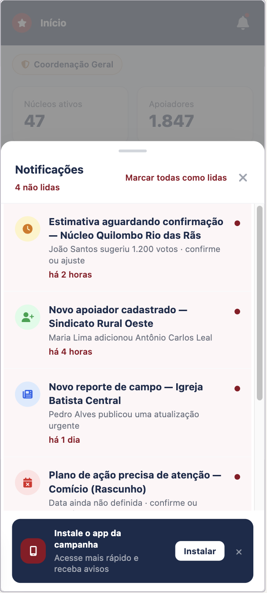
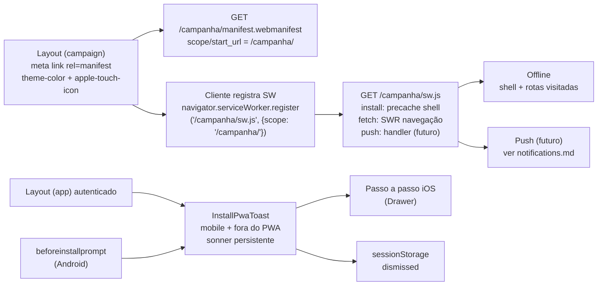

# PWA / offline só em `/campanha`

Status: **implementado** (2026-07-18)
Atualizado em: 2026-07-18
Item do roadmap: [docs/roadmap.md](../roadmap.md) (D1 — Já entregue)
Responsável: —

## Como foi implementado (2026-07-18)

Entregue conforme a abordagem proposta, com as questões em aberto resolvidas assim:

- **Servir SW e manifest:** opção (a) — route handlers em `src/app/(campaign)/campanha/manifest.webmanifest/route.ts` e `src/app/(campaign)/campanha/sw.js/route.ts`; constantes e script do SW gerados em `src/utilities/campaignPwa.ts`.
- **Estratégia de cache:** `network-first` para navegação (com fallback à página `/campanha/offline`) e para GETs same-origin sob `/campanha` — não SWR. Precache mínimo: `/campanha/login`, `/campanha/offline` e os ícones (`public/campaign-icons/`, cache-first). **Nunca cacheia:** requests RSC/Flight (payloads personalizados jamais vão ao Cache Storage) e as páginas de convite `/campanha/convite/*` (no-store por design).
- **Versionamento/atualização:** nome do cache = `campanha-<buildId>` (`VERCEL_GIT_COMMIT_SHA`/`VERCEL_DEPLOYMENT_ID`, `dev` local); `skipWaiting` + `clients.claim` no activate, que também expurga caches de builds antigos. Sem UX de "nova versão" — o deploy troca o cache.
- **Ícones:** PNG 192/512 + maskable 512 + apple-touch em `public/campaign-icons/`; `theme_color #c51414`, `background_color #ffffff`, `display: standalone`, `lang: pt-BR`.
- **Logout invalida cache:** `clearCampaignPwaCaches` (`src/utilities/campaignPwaClient.ts`) roda no cliente antes de `logoutCampaign` (Cache API wipe + postMessage ao SW).
- **Registro:** `RegisterServiceWorker` no root layout `(campaign)`, só em produção, com falha silenciosa.
- **Toast de instalação:** `InstallPwaToast` no layout `(app)` conforme a seção abaixo — sonner persistente, `beforeinstallprompt` no Android, passo a passo iOS em `Drawer`, dispensa em `sessionStorage`.
- **Métricas de adoção:** adiadas.

Handlers `push`/`notificationclick` seguem como placeholder para o D2 ([notifications.md](notifications.md) — push destravado). Testes: `tests/unit/campaignPwa.unit.spec.ts`, `tests/e2e/campaign-pwa.e2e.spec.ts`. O restante do documento é o plano original, mantido como registro.

## Referência visual (UX Pilot)

Design: [`Notificacoes-PWA.png`](../design-refs/latest/Notificacoes-PWA.png) · [`Notificacoes-PWA.html`](../design-refs/latest/Notificacoes-PWA.html) — **compartilhado com [notifications.md](notifications.md)** (a central de notificações pertence àquele plano).

Como usar (parte deste plano — o banner de instalação no rodapé):

- **Adotar o conteúdo:** banner fixo inferior com ícone do app, título "Instale o app da campanha", subtítulo "Acesse mais rápido e receba avisos", botão "Instalar" e X de dispensa — exatamente o `InstallPwaToast` da seção "Toast de instalação" (Android chama `deferredPrompt.prompt()`; iOS abre o passo a passo no Drawer; X grava `sessionStorage`).
- **Ajuste:** o plano implementa isso via `<Toaster>` (sonner) já montado, não como barra fixa custom — usar o design como referência de conteúdo/hierarquia, não de posicionamento exato. Cores do design (navy) viram os tokens claros do tema `campaign`.

## Contexto

A vertical `/campanha` é a ferramenta de campo da campanha: coordenadores e lideranças acessam o app pelo celular, muitas vezes em locais com conexão instável. Transformar `/campanha` em um PWA instalável (com ícone na tela inicial, splash e capacidade offline básica) melhora a experiência de campo e desbloqueia o push web no iOS (que só recebe push com o PWA instalado — ver [plans/notifications.md](./notifications.md)).

A decisão de produto (2026-07-17) é deliberadamente restritiva: **só `/campanha` será instalável**. O site público `(frontend)` e o admin Payload `(payload)` ficam de fora — eles continuam apps web normais. Isso mantém o PWA como uma vertical de campo e evita acoplar o site institucional a um service worker.

## Objetivos

- Tornar `/campanha` instalável (Add to Home Screen) no Android (Chrome) e no iOS (Safari).
- Garantir um shell básico offline: abertura do app e navegação para as rotas já visitadas funcionam sem rede.
- Manter o padrão arquitetural do projeto: auth isolada por cookie `campaign-token`, access control por papel, transações em writes multi-collection, `Consent` por chave estável.
- Servir de fundação para o push web do plano de notificações (o service worker aqui é o mesmo que o push usará).

## Decisões travadas

- **Escopo restrito a `/campanha`.** `scope` e `start_url` apontam para `/campanha/`; o service worker tem `scope: '/campanha/'`. Site público e `/admin` não são instaláveis e não têm SW. (Decisão de produto 2026-07-17; roadmap (Fora de escopo / Próximos).)
- **Um único service worker para a vertical**, compartilhado com o push de notificações — não criar um segundo SW só para push.
- **Auth continua via cookie `campaign-token`** (httpOnly, `path: '/campanha'`). O SW roda same-origin e envia cookies automaticamente nos `fetch`; nenhum token extra é exposto ao SW.
- **Offline é best-effort, não garantido.** O app continua server-renderizado com auth; o SW faz cache de runtime (stale-while-revalidate) das respostas já vistas e um precache mínimo do shell. Não há sincronização em segundo plano de escritas neste ciclo (write-back offline fica fora de escopo).
- **Sem alterar rotas existentes.** O PWA é aditivo: manifest + SW + metadados no layout `(campaign)`. As rotas `/campanha/login`, `/campanha/nucleos`, etc. continuam iguais.
- **i18n e naming** seguem o AGENTS.md: identificadores em inglês, strings visíveis em pt-BR.
- **Toast de recomendação de instalação** aparece sempre que o usuário inicia sessão em mobile e **fora** do PWA; pode ser fechado e só volta na próxima sessão. Detalhes na seção "Toast de instalação" abaixo.

## Questões em aberto

- **Onde servir o SW e o manifest.** Opções:
  - (a) Route handlers Next.js em `src/app/(campaign)/campanha/sw.js/route.ts` e `src/app/(campaign)/campanha/manifest.webmanifest/route.ts` — permite controlar headers (`Content-Type`, `Cache-Control`, `Service-Worker-Allowed`) e manter tudo dentro do route group `(campaign)`. **Recomendação:** esta.
  - (b) Arquivos estáticos em `public/campanha/` — mais simples, mas `public/` é servido na raiz e mistura escopos; exigiria reescrever path ou aceitar SW na raiz com `Service-Worker-Allowed: /campanha`.
- **Estratégia de cache:**
  - Precache do shell: quais rotas mínimas (login, dashboard `/campanha`, lista de núcleos)? O login é público; as demais exigem cookie de sessão — cacheá-las no SW precisa cuidar para não vazar HTML autenticado entre usuários no mesmo dispositivo (na prática, mesmo usuário; ainda assim, invalidar cache no logout).
  - Runtime cache: `stale-while-revalidate` para navegação (HTML) e `network-first` para dados de Server Actions/fetch. Definir limites (entries / tamanho) e expurgo.
  - Invalidação no logout: `logoutCampaign` precisa avisar o SW para limpar caches (postMessage ou `caches.delete` no cliente).
- **Ícones:** quais assets usar (logo `LOGO_SOLLA_BRANCO.svg` existe em `public/`, mas PWA exige PNG 192/512 + maskable). Definir origem dos ícones e `background_color`/`theme_color` coerentes com `data-theme="campaign"`.
- **`display`**: `standalone` (recomendado) vs `minimal-ui`. iOS usa `apple-mobile-web-app-capable` + `apple-mobile-web-app-status-bar-style`.
- **Atualização do SW:** política de `skipWaiting` + `clients.claim` vs aguardar fechamento de abas. Definir UX de "nova versão disponível".
- **Métricas de adoção:** rastrear instalações / sessões PWA (analytics leve, respeitando LGPD) ou adiar.

## Abordagem proposta

Componentes:

- **Route handler do manifest** (`src/app/(campaign)/campanha/manifest.webmanifest/route.ts`): retorna JSON com `name`, `short_name`, `start_url: '/campanha/'`, `scope: '/campanha/'`, `display: 'standalone'`, `theme_color`, `background_color`, `icons` (192/512/maskable), `lang: 'pt-BR'`. `Content-Type: application/manifest+json`, `Cache-Control: no-cache`.
- **Route handler do SW** (`src/app/(campaign)/campanha/sw.js/route.ts`): serve o script JS com `Content-Type: text/javascript` e `Cache-Control: no-cache` (para o navegador sempre checar atualizações). `Service-Worker-Allowed: /campanha` se necessário. Script com handlers `install` (precache do shell), `activate` (limpeza de caches antigos), `fetch` (SWR para navegação same-origin sob `/campanha`), e placeholder `push`/`notificationclick` para o plano de notificações.
- **Registro no cliente**: um pequeno Client Component montado no `src/app/(campaign)/layout.tsx` (root da vertical) chama `navigator.serviceWorker.register('/campanha/sw.js', { scope: '/campanha/' })` em `useEffect`, só em produção (ou com feature flag), com try/catch silencioso.
- **Metadados no layout `(campaign)`**: adicionar `manifest`, `themeColor`, `apple-touch-icon`, `apple-mobile-web-app-capable`, `apple-mobile-web-app-status-bar-style`, `apple-mobile-web-app-title` no `metadata`/`viewport` do `src/app/(campaign)/layout.tsx`. Manter `robots: { index: false, follow: false }` já existente.
- **Logout invalida cache**: `logoutCampaign` (`src/app/(campaign)/campanha/actions/auth.ts`) emite sinal para o SW limpar caches (postMessage ao SW ativo, ou o cliente chama `caches.delete` após redirecionar).
- **Sem collections novas neste plano.** Push subscription e `Notification` ficam no plano de notificações; aqui só a fundação do SW.

## Toast de instalação

Recomendação de instalação do `/campanha` como PWA, exibida no início da sessão em mobile. Reusa o `<Toaster>` (sonner) já montado no layout `(app)` (`src/app/(campaign)/campanha/(app)/layout.tsx`).

**Gatilho (todas as condições, avaliadas no cliente):**

- É mobile: `matchMedia('(pointer: coarse)')` e/ou largura de viewport típica de celular (alinhado às larguras já testadas 360/390 px). Não usar só `navigator.userAgent` (fragil).
- Está **fora** do PWA: `matchMedia('(display-mode: standalone)')` é `false` **e** (iOS) `navigator.standalone !== true`.
- Usuário autenticado: o toast vive no layout `(app)`, então só aparece após o login (sessão iniciada).
- Ainda não foi fechado nesta sessão: flag em `sessionStorage` (chave sugerida `pwa-install-toast-dismissed`) ausente.

**Comportamento:**

- Toast **persistente** (`duration: Infinity` no sonner), com botão de fechar (X) explícito.
- Botão de ação primária depende da plataforma:
  - **Android/Chrome** (capturou `beforeinstallprompt`): botão **"Instalar"** chama `deferredPrompt.prompt()` e, no sucesso, fecha o toast e marca a flag.
  - **iOS/Safari** (sem `beforeinstallprompt`): botão **"Como instalar"** abre um pequeno sheet/drawer com o passo a passo (Compartilhar → Adicionar à Tela de Início).
- Fechar (X) grava `sessionStorage['pwa-install-toast-dismissed'] = '1'` — **não** reaparece na mesma sessão, mas volta na próxima (nova sessão/login), porque `sessionStorage` é esvaziado ao fechar a aba/navegador.
- Se o usuário instalar (passa a `display-mode: standalone`), o toast não aparece mais — a condição "fora do PWA" já falha.

**Componentes:**

- **Client Component `InstallPwaToast`** (em `src/components/campaign/`): registra listener de `beforeinstallprompt` (guarda o `DeferredPrompt`), avalia as condições no mount e dispara `toast.message(...)` do sonner com `action` e `cancel`. Reusa o `<Toaster>` global; não monta um segundo.
- **Montagem**: inserir `<InstallPwaToast />` no `src/app/(campaign)/campanha/(app)/layout.tsx` (shell autenticado), ao lado do `<Toaster position="top-center" />` já existente.
- **Sem server action**: lógica toda no cliente; nenhum dado sensível, sem escrita em collection, sem `Consent` (a instalação é decisão do dispositivo, não tratamento de PII).

**Questões a fechar neste plano:**

- Confirmação de `sessionStorage` (escopo aba/sessão) vs `localStorage` (persistente entre sessões). **Decisão:** `sessionStorage` — atende "só abre novamente na próxima sessão" e evita acúmulo. Se o produto quiser "nunca mais mostrar após fechar", aí troca para `localStorage`.
- Texto do toast e do passo a passo iOS (pt-BR), e se o passo a passo abre um `<Drawer>` (`src/components/ui/Drawer.tsx`) ou um `<Sheet>`.
- Cadência caso o usuário nunca instale: manter uma vez por sessão é o acordado; não fazer re-display dentro da mesma sessão.

## Dependências

- Nenhuma de outro plano — este é pré-requisito do push web em [plans/notifications.md](./notifications.md).
- Assets de ícone PNG (192/512/maskable) a definir.
- Definição de `theme_color`/`background_color` da vertical campaign (hoje o tema vem de `data-theme="campaign"` em `styles.css`).

## Não escopo

- PWA do site público `(frontend)` ou do `/admin` (decisão de produto; roadmap (Fora de escopo / Próximos)).
- Write-back offline de atualizações/estimativas — escritas continuam exigindo rede e transação Payload.
- Push web em si — fica em [plans/notifications.md](./notifications.md); aqui só o placeholder do handler.
- Sincronização em segundo plano (Background Sync API).

## Referências

- `docs/roadmap.md` (Próximos — ver ID do item)
- `docs/plans/notifications.md` — push depende deste plano
- `AGENTS.md` — Campaign auth, naming conventions, transações
- `.cursor/rules/projects/nucleos-eleitorais.mdc`
- `src/app/(campaign)/layout.tsx` — root layout da vertical (onde os metadados entram)
- `src/app/(campaign)/campanha/(app)/layout.tsx` — shell autenticado (monta o `<InstallPwaToast />`)
- `src/components/ui/Toaster.tsx` — sonner já montado; reusar, não duplicar
- `src/components/ui/Drawer.tsx` — passo a passo de instalação no iOS
- `src/utilities/campaignAuth.ts` — cookie `campaign-token`
- `src/app/(campaign)/campanha/actions/auth.ts` — `logoutCampaign` (invalidação de cache)
