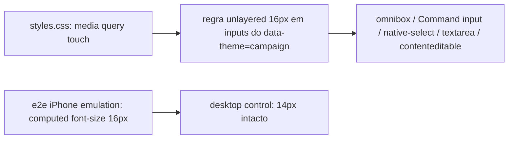

# Impl: PWA iOS: foco na omnibox de filtros aplica auto-zoom que não volta

Status: aprovado
Atualizado em: 2026-08-09
Issue: #501
Intenção: docs/plans/pwa-ios-autozoom-input-foco.md
Appetite restante: herdado (~0,5–1 dia eng) — cabe com folga

## Leitura da intenção

- **Outcome:** nenhum input do PWA `/campanha` (omnibox, login, formulários, wizard) dispara o auto-zoom do Safari iOS ao receber foco; desktop e telas grandes mantêm a aparência atual.
- **O que NÃO negociar:** regra única (gate decidido: "todos de uma vez", inclui `contenteditable`/`select`); nada de `maximum-scale` global; anti-goal "subir para 16px no desktop".
- **O que reavaliar:** a hipótese de "fix campo a campo" — confirmado que é sistêmico: regra CSS única cobre. O ponto de escopo ("onde o trigger do iOS existe") pede decisão de engenharia (abaixo).

## Abordagem recomendada

**Opções consideradas:**

- **A — Regra CSS global no touch (recomendada):** bloco em `src/app/(frontend)/styles.css` (arquivo compartilhado frontend+campanha) dentro de `@media (pointer: coarse) and (hover: none)`, seletor `[data-theme='campaign'] :is(input, select, textarea, [contenteditable='true'])` com `font-size: 1rem`. Um bloco cobre omnibox (B127), Command search (ui `Command.tsx` `data-slot=command-input`), `native-select`, textareas e futuros contenteditable — nenhuma mudança de componente.
- **B — Bump por componente** (`text-base md:text-sm` no omnibox, CommandInput, native-select, …): o padrão que `Input`/`Textarea` já seguem, mas estendido caso a caso.
- **C — Regra global por largura** (`max-width: 767.98px`, espelhando o `md:` do repo).

**Recomendação:** **A** — a intenção mandou regra única (gate 2026-08-09), e ela é a única que cobre o trigger em **todas** as orientações do iPhone: o auto-zoom do Safari existe também em landscape (larguras 844–932px em iPhones modernos), que a opção C perderia. `(pointer: coarse) and (hover: none)` é a expressão CSS canônica de "telefone touch" — o repo já usa variantes pointer (`pointer-fine:`/`pointer-coarse:` em `RelationChipCell`). Desktop/laptop (pointer fine) fica intocado — aceite 3 preservado. Como a regra é **unlayered**, ela vence as utilities `text-sm` em camada (cascata), mesmo com especificidade menor — sem `!important`.

**Rejeitadas:**

- **B** porque é whack-a-mole (rabbit hole nº 1 da intenção): hoje já há 3+ bespoke offenders e o trigger é regra do navegador, não do componente; um `<input>` novo em `text-sm` reintroduz o bug silenciosamente.
- **C** porque perde o iPhone landscape (bug permanece vivo no aparelho do usuário) e cria dois regimes de fonte (16px portrait / 14px landscape) sem ganho.
- **`maximum-scale=1`/viewport fixo** — rejeitado pela própria intenção (degrada acessibilidade; vive no B182 como fallback se for preciso).

### Componentes / mudanças

- **`styles.css`** (`src/app/(frontend)/styles.css`, junto ao bloco `[data-theme='campaign'] :is([data-slot=…])` de bordas): um bloco `@media (pointer: coarse) and (hover: none)` com `[data-theme='campaign'] :is(input, select, textarea, [contenteditable='true']) { font-size: 1rem; }` + comentário curto explicando o limiar de 16px do Safari iOS (precedente de comentários explicativos no arquivo).
- **`Input`/`Textarea`/`InputGroup`** (`src/components/ui/`): **intocados** — já são `text-base md:text-sm`; a regra é no-op para eles no touch (16px) e não vaza para desktop.
- **Migration:** nenhuma. **Access / Consent:** nenhum.
- **UI:** Impeccable A (bug fix, sem redesenho).
- **Verificação:** e2e novo com emulação de device (abaixo).

## Fases verificáveis

1. **Regra CSS** — editar `styles.css`; conferir com o dev server que a omnibox em emulação touch computa 16px e desktop 14px.
2. **E2E** — `tests/e2e/campaignIosInputZoom.e2e.spec.ts`:
   - describe com `test.use({ ...devices['iPhone 13'] })` (390×664, `isMobile`+`hasTouch` → `pointer: coarse`, `hover: none`): fixture `campaign` cria coordinator → login → `/campanha/municipios` → `getByRole('combobox', { name: 'Filtrar municípios' })` → `expect.poll(computed font-size) === '16px'`. Falha hoje (14px), passa com a regra.
   - describe desktop (projeto campaign padrão): mesma omnibox permanece **14px** — pina o aceite "desktop continua como hoje".
3. **Gates** — `pnpm gate:fast`; `pnpm test:e2e` (spec novo + vizinhos de lista para regressão); `pnpm format:check`, `pnpm exec knip`, `pnpm check:cycles`, `pnpm build`. Entrega com `pnpm push`.
4. **CHANGELOG** — entrada curta em `docs/CHANGELOG-AGENTS.md`.

## Rabbit holes / Não escopo (engenharia)

- Inventário exaustivo de inputs (intenção já cortou; a regra cobre todos por definição).
- `maximum-scale` / política de escala global (vive no B182).
- Público site (`(frontend)`): fora do escopo, o seletor exige `data-theme='campaign'`.
- Bump de fonte em **buttons** (Select/Combobox triggers são botões — iOS não zooma botões).
- `RelationChipCell` inline input: é `pointer-fine:block` (oculto no touch) — a regra não o afeta, e não é preciso.

## Riscos e mitigação

- **iPad (touch, ≥768px) passa a 16px** (hoje `md:text-sm` = 14px): o iPadOS não tem o trigger de zoom; é mudança cosmética no tamanho padrão de formulário do iOS. Não afeta desktop. Mitigação documentada no impl plan — aceite "telas maiores" refere-se a desktop, que fica intacto.
- **Inputs com fonte > 16px em touch seriam reduzidos para 1rem:** nenhum no codebase hoje (varredura por `text-lg|xl|2xl` em inputs não achou nada); se um dia houver, a regra é o limite inferior correto (16px é o teto do trigger).
- **E2E mobile depende de emulação Chromium** (`devices['iPhone 13']`), não de Safari real: valida o contrato CSS (pointer/hover) que o Safari iOS avalia; a regra é a padrão da indústria (West-Wind/t3code/BookStack).
- **Layout reflow no touch:** 16px em inputs raros (ex. chips) — os chips da omnibox não são inputs; o campo em si cresce ~2px de altura (min-h fixos absorvem).

## Aceite de engenharia

- [x] Aceite de produto da intenção ainda coberto (regra única; desktop intacto; sem maximum-scale)
- [x] Invariantes AGENTS/engineering-standards (sem migration/access/Consent; copy pt-BR intacta; identificadores em inglês)
- [x] Testes previstos: e2e touch (16px) + e2e desktop (14px) — comportamento pina o aceite
- [x] Depth check: zero módulos novos; um bloco CSS no arquivo dono do theming
